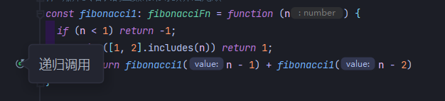

# 主要算法思想

## 递归算法

在定义一个过程或函数时出现调用本过程或本函数的成分，称之为递归。

若调用自身，称之为直接递归。若过程或函数p调用过程或函数q,而q又调用P,称之为间接递归。任何间接递归都可以等价地转换为直接递归。

如果一个递归过程或递归函数中递归调用语句是最后一条执行语句，则称这种递归调用为尾递归。



### 递归特征

> 一般来说，能够用递归解决的问题应该满足以下三个条件：
>
> 1. 需要解决的问题==可以转化为一个或多个子问题==来求解，而这些子问题的求解方法与==原问题完全相同==，只是在数规模上不同。
> 2. 递归调用的==次数必须是有限==的。
> 3. 必须==有结束递归的条件==来终止递归。即有一个分支不调用自身。

```typescript
function fn(x: number){
  if(x==1)return 1
  else return fn(x-1)*x
}
```

> 使用递归的情况分为以下三种：
>
> 1. ==定义==是递归的，如求阶乘
> 2. ==数据结构==是递归的，如链表
> 3. ==求解方法==是递归的，如汉诺塔问题
>
> **递归模型**
>
> 是对递归问题的抽象，展示递归问题的递归结构
>
> 1. 递归出口：
> 2. 递归体：

## 蛮力法

> 顾名思义，就是用穷举的方法来遍历所有可能，思想就是直接遍历所有的可能。

**五大核心算法**

## 分治法

> 

```

```

## 回溯法

> 回溯法（探索与回溯法）是一种选优搜索法，又称为试探法，按选优条件向前搜索，以达到目标。
>
> 当探索到某一步时，发现原先选择并不优或达不到目标，就退回一步重新选择。
>
> 这种走不通就退回再走的技术为回溯法，而满足回溯条件的某个状态的点称为“回溯点”。

```js
function restoreIpAddresses(s) {
    const result = [];
    if (s.length < 4 || s.length > 12) return result;
    
    function backtrack(start = 0, dots = 0, path = '') {
        // Check if the current segment is the last one and if the path is a valid IP
        if (dots === 4 && start === s.length) {
            result.push(path.slice(0, -1)); // Remove the last dot
            return;
        }
        // If there are too many or too few segments left, stop backtracking
        if (dots > 4 || (s.length - start) > (4 - dots) * 3 || (s.length - start) < (4 - dots)) {
            return;
        }
        // Try all possible lengths for the current segment
        for (let len = 1; len <= 3 && start + len <= s.length; ++len) {
            const segment = s.substring(start, start + len);
            // Check if the current segment is a valid IP segment
            if (segment.length > 1 && segment[0] === '0' || len === 3 && +segment > 255) continue;
            backtrack(start + len, dots + 1, path + segment + '.');
        }
    }
    
    backtrack();
    return result;
}

// Example usage:
const input = "25525522135";
const output = restoreIpAddresses(input);
console.log(output); // Output: ["255.255.22.135", "255.255.221.35"]
```

### 分支限界法

> 在遍历求解树上采取广度优先的策略

```

```

## 贪心算法

> 贪心算法，只关心局部最优解，在某些问题中贪心算法甚至能直接找到最优解。
>
> 思想：每步只着眼于眼前小问题而给出其最优解。最终综合起来成为其解决方案。

```typescript
/**
 * 用于解决股票买卖问题的函数，允许用户在给定一系列连续天数的股票价格时，通过多次买卖来实现最大利润。
 * @param prices int整型一维数组 一个数字数组，其中的每个元素表示股票在连续天数内的价格
 * @return int整型
 */
function maxProfitWithMultipleTransactions(prices) {
  // write code here
  let j = 0, maxProfit = 0
  for (let i = 1, n = prices.length; i <= n; i++) {
    if (prices[i - 1] > prices[i] || prices[j] < prices[i - 1]) {
      maxProfit += prices[i - 1] - prices[j];
      j = i;
    }
    if (prices[j] > prices[i - 1]) j = i - 1
  }
  return maxProfit;
}
```

## 动态规划

> 又称记录结果填表法，是种解决多阶段决策问题优化方法，将多阶段问题转化为一系列阶段问题。

我们再回看斐波那契数在这是如何用动态规划解决的：

```typescript
var fib = function (n) {
    let fib = [0, 1]
    for (let i = 2; i <= n; i++)
        fib[i] = fib[i - 1] + fib[i - 2]
    return fib[n]
};
```

> 解决动态规划相关问题的步骤通常如下：
>
> 1. **定义状态：** 确定状态，即*子问题的定义*。状态通常是一个或多个变量的集合，它能够描述问题的实例或者解的部分特征。
> 2. **状态转移方程：** 找出*状态之间的关系*，即如何从一个或多个较小的子问题的解得到另一个子问题的解。这通常称为*状态转移方程*或递归关系。
> 3. **初始化状态：** 确定*边界条件*，这通常对应于*最小的子问题*，它的解可以直接给出。
> 4. **计算顺序：** 确定*计算状态的顺序*，以确保解决一个子问题时，它所依赖的子问题已经被解决。
> 5. **构造最终解：** 利用计算出的状态，构造问题的最终解。

```js
/**
 * @param {number} m
 * @param {number} n
 * @return {number}
 */
var uniquePaths = function (m, n) {
    let dp = new Array(m).fill().map(()=>new Array(n).fill(0))
    for(let i=0; i<m; i++) dp[i][0] = 1 // 边界条件
    for(let j=0; j<n; j++) dp[0][j] = 1 // 边界条件
    for (let i = 1; i < m; i++)
        for (let j = 1; j < n; j++)
            dp[i][j] = dp[i - 1][j] + dp[i][j - 1] // 状态转移方程
    return dp[m-1][n-1] // 问题的最终解
};

/**
 * @param {number[][]} grid
 * @return {number}
 */
var minPathSum = function (grid) {
    let m = grid.length, n = grid[0].length
    let dp = new Array(m).fill().map(_ => new Array(n).fill(0))
    for (let i = 0; i < m; i++) {
        for (let j = 0; j < n; j++) {
            if (i == 0 && j == 0) dp[i][j] = grid[0][0]
            else if (i == 0 && j !== 0)
                dp[i][j] = dp[i][j - 1] + grid[i][j]
            else if (i !== 0 && j == 0)
                dp[i][j] = dp[i - 1][j] + grid[i][j]
            else
                dp[i][j] = Math.min(dp[i - 1][j] + grid[i][j], dp[i][j - 1] + grid[i][j])
        }
    }
    return dp[m - 1][n - 1]
};
```

## 算法技巧

### 双指针

```js
/**
 * 力扣1. 两数之和（双指针解法）

 * @param {number[]} nums
 * @param {number} target
 * @return {number[]}
 */
var twoSum = function (nums, target) {

    let numsLength = nums.length
    let numsCpy = Array.from(nums) // 需要排序，排序要考虑原数组顺序需要记下原id
        .map((val, idx) => ({ val, idx }))
        .sort((a, b) => a.val - b.val)

    let [left, right] = [0, numsLength - 1] // 定义左右指针

    while (left < right) {
        if (numsCpy[left].val + numsCpy[right].val === target) 
            return [numsCpy[left].idx, numsCpy[right].idx]
        else if (numsCpy[left].val + numsCpy[right].val > target) 
            right--
        else if (numsCpy[left].val + numsCpy[right].val < target) 
            left++
    }
    return []
};

/**
 * 力扣27. 移除元素
 
 * @param {number[]} nums
 * @param {number} val
 * @return {number}
 */
var removeElement = function (nums, val) {
    let [left, right] = [0, nums.length]

    while (left < right) {
        while (nums[right-1] === val) right--
        if (nums[left] === val) {
            let temp = nums[left]
            nums[left] = nums[right-1]
            nums[right-1] = temp
        }
        else left++
    }

    nums.length = right

};

/**
  * 熟练后命名可以缩短，且可以直接一个指针遍历用for循环处理，总之要优化得想办法"精简处理流程"。
  * 力扣26. 删除有序数组中的重复项

 * @param {number[]} nums
 * @return {number}
 */
var removeDuplicates = function (nums) {
    let i = 1
    for (let j = 0, l = nums.length; j < l; j++) 
        if (nums[j] !== nums[i-1])  nums[i++] = nums[j] 
    return i
};
```

### 滑动窗口

> 整体思路：
>
> 1. 右侧指针移位
> 2. 判断是否符合
> 3. 左侧指针是否需要移位
> 4. 进入下一次循环

```js
/**
 * 力扣3. 无重复字符的最长子串

 * @param {string} s
 * @return {number}
 */
var lengthOfLongestSubstring = function (s) {
    if (s.length < 2) return s.length
    let l = 0, r = 1, max = 0

    while (r < s.length) {
        let subStr = s.slice(l, r)
        if (subStr.indexOf(s[r]) !== -1) l++ // <string>[index]去取字符串下标更简洁些
        else r++
        max = Math.max(r - l, max)
    }
    return max
};

/**
 * 力扣209. 长度最小的子数组

 * @param {number} target
 * @param {number[]} nums
 * @return {number}
 */
var minSubArrayLen = function (target, nums) {
    let l = 0, sum = 0, minLen = Infinity // Infinity比具体的数(如100001>10^5)要更省性能
    for (let r = 1; r <= nums.length; r++) {
        sum += nums[r - 1]
        if (sum >= target) {
            while (sum - nums[l] >= target)
                sum -= nums[l++] // 注意l++运行位置
            minLen = Math.min(minLen, r - l)
        }
    }
    return minLen === Infinity ? 0 : minLen
};
```

