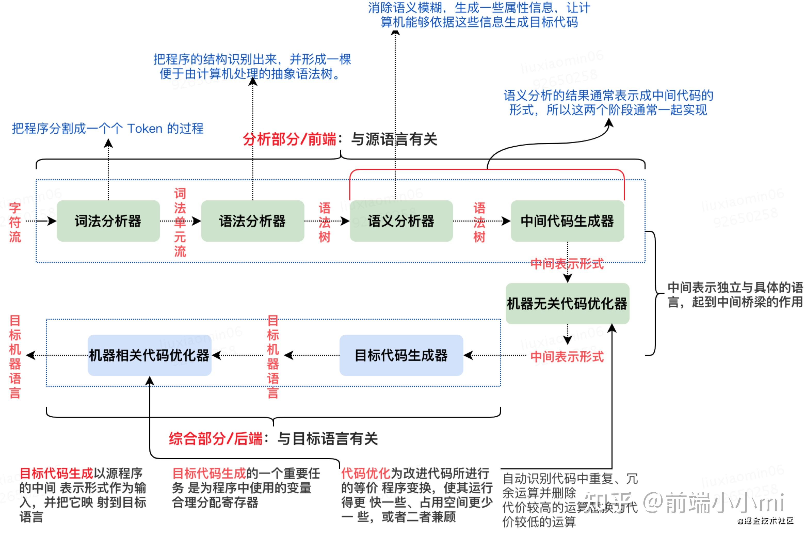

## 从浏览器输入URL后都经历了什么

* 先进行DNS域名解析，先查看本地hosts文件，查看有没有当前域名对应的IP地址，若有直接发起请求，没有的话会在本地域名服务器去查找

* 没找到的话就去根服务器查找最后查找到对应的IP地址后把对应规则保存到本地的hosts文件中。

* 进行http请求，三次握手四次挥手建立断开连接

* 服务器处理，可能返回304也可能返回200

* 客户端自上而下执行代码渲染页面

## 浏览器的渲染原理

- 浏览器渲染过程:HTML解析、CSS解析、构建DOM树和CSSOM树、构建渲染树、布局和重排、重绘、合成

1. 浏览器遇到link标签时,会并行下载CSS文件,与下载HTML的过程是同时进行的。
2. HTML解析时会构建DOM树,CSS文件下载完成后会构建CSSOM树。
3. HTML解析完成后,会停止构建DOM树,开始构建渲染树。这时如果CSS仍未下载完成,会只用默认样式构建渲染树。
4. 当CSS下载完成构建CSSOM后,会与DOM树一起构建Render树,并重新渲染页面,这会触发Reflow。
5. link标签的CSS与style标签的CSS不同,后者需要HTML解析完成才会引用解析执行。
6. 加载CSS的过程是可阻塞渲染的关键路径之一,需要优化。

## Chrome浏览器都有哪些进程？

最新的 Chrome 浏览器包括：

* 1 个浏览器（Browser）主进程、
* 1 个 GPU 进程、
* 1 个网络（NetWork）进程、
* 多个渲染进程和多个插件进程。

## 什么是重排和回流？

> 重排(Reflow)和重绘(Repaint)是其中两个对性能有重大影响的概念:
>
> - **重排**：又称**回流**，当渲染树中的一部分(或全部)因为*元素大小、布局、隐藏*等改变而需要重新构建。遍历渲染树,重新计算元素的几何信息。
> - **重绘**：当渲染树的一些节点*需要更新外观但不影响布局*的情况下,会发生重绘。像改变颜色这样只需要重新绘制节点,不需要改变布局。
>
> ==重排的代价比重绘更高==,因为涉及到重新计算节点的几何信息和位置,可能造成整个页面的重新布局。
>
> 重绘的范围更小,只需要重新绘制节点 APPEARANCE,不改变布局,对性能影响较小。
>
> 但==重绘如果过于频繁也会带来性能问题==。优化方式是将多次重绘合并成一次。
>
> 造成重排、重绘的操作需要避免过多,否则会导致性能下降,页面卡顿。

- 触发重排的条件: 添加/删除DOM节点、样式变更等
- 触发重绘的条件: 样式变更但元素位置未改变
- `display:none`及其子元素不会被渲染
- 渲染优化：CSS不阻塞DOM解析、避免频繁重排、提升重绘效率等

## 盒模型和怪异和模型

- `标准盒模型`，总宽度 = width + border(左右) + padding（左右）+ margin（左右）；高度同理。
- `怪异盒模型（IE盒模型）`，总宽度 = width + margin（左右）；高度同理。

## 编译原理

1. 词法分析(扫描)
2. 语法分析
3. 中间代码生成
4. 代码优化

## 页面渲染步骤

1. 解析 HTML 构建 DOM 树

- **下载HTML文件：** 浏览器从服务器下载HTML文件。
- **构建DOM树：** 浏览器解析HTML文档，将标签转化为DOM（文档对象模型）树中的节点。DOM树是页面内容的层级化表示。

2. 解析 CSS 构建 CSSOM 树

- **处理CSS：** 同时或顺序解析与HTML文档关联的CSS文件和`<style>`标签内的样式。
- **构建CSSOM树：** CSS规则被解析并形成CSSOM（CSS对象模型）树，它与DOM树类似，但是用于表示样式而非内容。

3. 合并 DOM 和 CSSOM 形成渲染树

- **生成渲染树：** 浏览器将DOM树和CSSOM树合并成一个渲染树（Render Tree），渲染树只包含网页渲染所需的节点和样式信息。
- **计算样式：** 在这个过程中，对每个节点应用最终的样式规则。

4. 布局（Layout/Reflow）

- **布局计算：** 浏览器计算渲染树中每个节点的确切位置和大小，这个过程称为布局或回流。
- **视口位置：** 布局过程考虑到视口的大小，确保内容正确地适配屏幕。

5. 绘制（Paint）

- **绘制：** 一旦布局完成，浏览器开始通过遍历渲染树来绘制页面，将每个节点的内容和样式转化为屏幕上的实际像素。

6. 合成（Composite Layers）

- **分层：** 为了优化性能，浏览器可能会将页面分成多个层，并独立处理它们。
- **合成：** 层被合成在一起，形成最终的页面。这个过程是在合成器线程中完成的。

7. JavaScript 执行

- **解析JavaScript：** 浏览器解析并执行HTML文档中的`<script>`标签和外部JavaScript文件。
- **DOM操作：** JavaScript可能会修改DOM和CSSOM，这将触发上述过程的部分或全部重新执行，例如重新布局或重绘。

## 阻塞页面渲染的因素

1. 同步加载的JavaScript

- **阻塞脚本：** 浏览器在遇到`<script>`标签时，会暂停HTML解析来下载并执行JavaScript代码，因为JavaScript可能会修改DOM结构。
- **非异步脚本：** 使用`async`或`defer`属性可以让JavaScript文件异步加载，减少阻塞。

2. CSS 和 JavaScript 的交互

- **CSS阻塞JavaScript：** JavaScript执行依赖于CSSOM，因为JS可能查询或修改页面的样式。如果CSS资源尚未加载和解析完成，JS执行会被阻塞。
- **未媒体查询的CSS：** 浏览器必须等待所有CSS下载和处理完成，以确保JS执行时能获取到正确的样式信息。

3. 外部资源的同步加载

- **未设置异步加载：** 通过`<link>`, `<script>`, ``, `<iframe>`等标签加载的外部资源，如果不是异步加载，可能会阻塞渲染。
- **资源下载延迟：** 网络延迟或服务器响应慢时，资源下载会增加页面加载时间。

4. 大型DOM或过多的DOM操作

- **庞大的DOM树：** 一个非常大和复杂的DOM会增加浏览器构建DOM树的时间。
- **频繁的DOM操作：** 频繁或不必要的DOM操作会引起多次的布局计算和页面重绘，导致性能瓶颈。

5. iframe

- **加载额外的文档：** `iframe`会加载另一个HTML文档，这个过程可能会阻塞父文档的渲染，特别是如果`iframe`没有异步加载的话。

6. Web字体

- **字体下载：** 自定义Web字体需要下载，直到字体文件下载完成前，浏览器可能不会渲染使用这些字体的文本。

7. 重定向

- **HTTP重定向：** 网页地址重定向会增加额外的网络往返延时，直到最终内容开始下载。

8. 阻塞的CSS

- **渲染阻塞CSS：** 在`<head>`中使用的CSS文件会阻塞页面渲染，直到CSSOM构建完毕。
