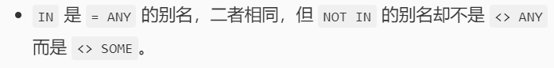

# SQL高级知识

## SQL编程

### 常量与变量

1. 常量

   字符串类型的常量、日期时间类型的常量要用单引号括起来。

```sql
'Chinese Dream','2022-10-01'
```

NULL值

```sql
NULL
```

2. 变量

MySQL中的变量分为两种：系统变量、自定义变量

==系统变量==由系统定义，分为：*全局变量*和*会话变量*。
==自定义变量==由用户自己定义的，分为：*用户变量*和*局部变量*。

* 全局变量

  > 全局变量的值影响整个MySQL服务器。
  > 全局变量的值在MySQL启动时由服务器自动初始化为默认值。

  **作用域**：MySQL服务器的整个生命周期。

  ```sql
  -- 查看全局变量
  show global variables;
  select @@global.auto_increment_increment;
  show global variables like 'auto%';
  修改全局变量
  set global auto_increment_increment = 2;
  set @@global.auto_increment_increment 2;
  ```

  修改配置文件my.ini,重启服务。

  赋值的操作符：`=`或`:=`。 作用域：针对于当前会话（连接）有效，同于会话变量的作用域，应用在任何地方，也就是`begin...end`里面或`begin...end`外边。

  - 声明变量并初始化

  ```sql
  SET @用户变量名 = 值;SET @用户变量名 := 值;
  ```

* 会话变量

  > 在每次建立一个连接时，MySQL服务器将当前所有的全局变量的值复制一份给会话变量。
  
  **作用域**：仅限于当前会话。每个客户端连接中的会话变量是相互独立的。
  
  ```sql
  -- 查看会话变量
  show session variables;
  select @@session.auto_increment_increment;
  show session variables like 'auto%';
  -- 修改会话变量
  set session auto_increment_increment 2;
  set @@session.auto_increment_increment 2;
  ```
  
* 局部变量

  > 一般==用于begin...end语句块==中，作用域仅限于该语句块。
  > beign...end代码块,以及局部变量只能==用在函数、存储过程、游标、触发器中==。

  使用declare关键字进行声明。

  ```sql
  -- 声明局部变量
  declare 变量名数据类型（长度）；
  declare 变量名数据类型（长度）default初始值；
  -- 为局部变量赋值
  set局部变量1=值1，局部变量2=值2，…
  select字段l,字段2，into 局部变量l,局部变量2，.from..where.…
  ```

* 用户变量

### 流程控制语句

流程控制语句要放在存储过程、存储函数、游标、触发器的内部。

1. `if`

   ```sql
   if...then...
   elseif ...then...
   else...
   end if;
   ```

2. `while`

   ```sql
   while...#继续循环条件
   do
   # 循环体
   end while
   ```

3. `repeat`

   ```sql
   repeat
   #循环体
   until ...#终止循环条件
   end repeat
   ```

4. `loop`

   ```sql
   loop
   #循环体
   end loop
   ```

5. `leave`

   > 用于跳出循环，类似于C语言中的`break`;

6. `iterate`

   > 用于退出本次循环，类以于C语言中的`continue`

eg:`1+2+..+100`

```sql
create procedure usp_Sum(n int)
begin
    declare i,sum int;
    set i=0,sum =0;
    while i<n do
        set i=i+1;
        set sum sum +i;
        while i<n do
            set i=i+1;
            set sum sum +i;
        end while;
        select concat('1+2+..+100=',sum);
        end;
    end while;
    select concat('1+2+..+100=',sum);
end;
-调用
call usp_Sum(100);
```

7、`case`两种用法：
(1)

```sql
case case_value
    when 值1 then 语句1
    when 值2 then 语句2
    else...
end case
```

(2)

```sql
case
    when 条件1 then 语句l;
    when 条件2 then 语句2；
    when 条件n then 语句n;
    else....
end case;
    when 条件n then 语句n;
    else...
end case;
```

思考+20
-输入学生的学号和课程号，输出该生该门课的等级(ABCED)

### 函数

> 下面我们要接触是用户自定义函数。

```sql
delimiter //　　#如果函数体只有一条语句, begin和end可以省略, 同时delimiter也可以省略
　　create function 函数名(形参列表) returns 返回类型　　#注意是retruns
　　begin
　　　　函数体　　　　#函数内定义的变量如：set @x = 1; 变量x为全局变量，在函数外面也可以使用
　　　　返回值
　　end
　　//
delimiter ;
```

关于函数体:

1. 函数体由合法的`SQL`语句构成；
2. 函数体可以是简单的`SELECT`或`INSERT`语句；
3. 函数体如果为复合结构则使用`begin...end`语句；
4. 复合结构可以包含声明，循环，控制结构。

```sql
-- 输入：学号
-- 返回值：平均分
set global log_bin_trust_function_creators =true;
create function fn_GetAvgGrade(vSno int) returns int -- 函数的返回值的数据类型是int
begin
    declare vGrade int;
    select avg(Grade)into vGrade from SC where Sno vSno;
    return vGrade;
end;
-- 调用
select fn_GetAvgGrade('2022001');
```

## 视图

> 1、什么是视图？
>
> 视图View是从一个或多个基本表或视图中导出的一个==虚表==。
> 视图中==不存放数据==的；数据是存放在基本表中的。
> 和基本表一样，对视图也可以执行增删改查操作。*对视图的操作，都会转换为对基本表的操作。*这叫**视图消解**。
>
> 2、为什么要使用视图？
>
> (1)可以简化查询操作
> (2)可以提高数据的安全性

```sql
create view 视图名
as SELECT ...;
```

### 创建视图

```sql
#创建多表视图
create view v1
as
    SELECT student.Sno,student.Sname,course.Cname,sc.Grade
    FROM student INNER JOIN sc
	ON student.Sno sc.Sno INNER JOIN course ON sc.Cno course.Cno;

SELECT student.Sno,student.Sname,course.Cname,sc.Grade
FROM student INNER JOIN sc
ON student.Sno sc.Sno INNER JOIN course ON sc.Cno course.Cno;
and Cname='数据库';

SELECT student.Sno,student.Sname,course.Cname,sc.Grade
FROM student INNER JOIN sc
ON student.Sno sc.Sno INNER JOIN course ON sc.Cno course.Cno
and Grade 60;
```

### 视图操作

```sql
-- 查询视图
select from v1;
select*from vl where Cname='数据库'；
select from v1 where Grade 60;

-- 通过视图像基本表中插入数据
insert into v2 values('2021005','小吴','男',18,'CS');
select*from Student;
select*from v2;
insert into v2 values('2021006','小六','男',18,'MA');

-- 修改视图
alter view v2
as
 select*from Student where Sdept='cs'
 with check option;
 --  查询视图和基本表
 select*from v2;
 select*from Student;
 -- 通过视图向基本表中插入数据
insert into v2 values('2021007','小七','男',18,'CS');
insert into v2 values('2021008','小八','男',18,'MA');-- 	会提示错误

-- 	通过视图修改基本表
update Student set Sage=18;
update v2 set Sage=Sage+10;-- 该语句会转化为：
update Student set Sage=Sage+10 where Sdept='cs';

-- 修改视图:并不是所有视图都可以更新
-- 创建一个视图：修改每个学生的学号和平均成绩
create view v3
as
select Sno,avg(Grade) avgGrade from sc 
group by Sno;
-- 查询视图
select * from v3;
-- 修改视图
update v3 set avgGrade=80 where Sno='2022001';
select * from SC;
```

> 问：什么样的视图是可以更新的？什么样的视图是不可以更新的？
>
> 答: 一般的行列子集视图是可以更新的。视图不能更新有以下情况:
>
> 1. 视图的字段来自*字段表达式*或常数
>2. 视图的字段来自*聚集函数*
> 3. 视图的定义中含有*Group By子句*
> 4. 视图的定义中含有*DISTINCT*关键字
> 5. 视图定义中有*嵌套查询*

## 索引

> **什么是索引？**
> 类似于书的目录。索引的创建和维护需要时间的。
>
> **为什么使用索引？**
> 提高数据的查询速度。可索引并非越多越好。

索引的类型：

1. 普通索引和唯一索引
2. 单列索引和组合索引

```sql
create index 索引名 on 表名 (字段名 asc|desc);
show index from 表名;
explain select ...;
```

**如何使用索引？**

1. 方法1：在`create table`语句中指定索引列

   ```sql
   select * from Student;
   -- eg
   create table Books
   (
       bklD char(7),
       bkName varchar(30),
       bkAuthor varchar(30),
       bkPrice int,
       #创建索引
       index(bkName)
   );
   -- 查看Books表的定义
   show create table Books;
   -- 查看索引
   show index from Books;
   ```

2. 方法2：使用`alter table` 语句中创建索引

   ```sql
   create table Books1
   (
       bklD char(7),
       bkName varchar(30),
       bkAuthor varchar(30),
       bkPrice int
   );
   
   -- 查看索引
   show index from Books1;
   alter table Books1 add index idx_bkName(bkName desc);-- 普通索引
   
   -- 删除索引
   drop index idx_bkName on Books1;
   alter table Books1 add unique index idx_bkName(bkName desc);-- 唯一索引
   show index from Books1;
   ```

3. 方法3：使用`create index`语句中创建索引

   ```sql
   create [unique] index 索引名 on 表名(字段1[desc|asc],字段2[desc|asc]...)
   create table Books2
   (
       bklD char(7),
       bkName varchar(30),
       bkAuthor varchar(30),
       bkPrice int
   );
   
   -- 创建索引
   create unique index idx_NameAuthor on Books2(bkName asc,bkAuthor desc);
   -- 查看索引
   show index from Books2;
   ```

## 存储过程

(1)什么是存储过程

> 是一组完成特定功能的SQL语句，经过编译后保存在数据库中的。
> 用户可以通过存储过程名及参数值来调用存储过程。

(2)为什么要使用存储过程？

> 1. 模块化编程；
> 2. 减少网络流量；
> 3. 更快的执行速度；
> 4. 提高数据的安全性

(3)如何使用存储过程？

```sql
create procedure 存储过程名([in out inout]参数l数据类型（长度），…)
begin
    # 过程体；	
end;
#in:输入参数（默认）
#out:输出参数
#inout:输入输出参数
```

-eg:*不带参数的存储过程*

```sql
create procedure usp_t1()
begin
    select from Student where Sdept ='cs';
end;
-- 调用存储过程
call usp_t1();
```

-eg:*带输入参数的存储过程*

```sql
drop procedure if exists usp_t1;
create procedure usp_t1
(
in vSdept char(2), -- 输入参数，in可以省略
in vSsex char(1) -- 输入参数，in可以省略
)
begin
	select from Student where Sdept vSdept and Ssex vSsex;
end;
-- 调用存储过程
call usp_t1('cS','男')；
call usp_t1('SE','女')；
```

eg:*带输入参数和输出参数的存储过程*

```sql
-- 功能：输入学生的学号，从Stuent:表中删除该生，输出该生的姓名。
-- 输入参数：学号
-- 输出参数：姓名
create procedure usp_t2(
    in vSno char(7),-- 输入参数
    out vSname varchar(4)-- 输出参数
)
begin
    select Sname into vSname from Student where Sno vSno;
    delete from Student where Sno vSno;
end;
-- 调用存储过程
-- 通过用户变量@Sname来接收存储过程输出的值。
call usp_t2('2021007',@Sname);
select @Sname;
call usp_t2('2021001',@Sname);
-- 思考：修改过程体中的代码
select from student;
```

### delimiter

> 主要用命令行输入SQL语句时会用到。
>
> 用来修改结束符，以在命令中同时书写多个语句。

```sql
create procedure usp_t2(
    in vSno char(7),-- 输入参数
    out vSname varchar(4)-- 输出参数
)
delimiter $$
begin
    select Sname into vSname from Student where Sno vSno;
    delete from Student where Sno vSno;
end $$
delimiter ;
```

## 事件处理程序

> 保证程序在遇到错误的时候能够继续还行，避免程序异常而停止执行。

```sql
-- eg
create table test
(
    c1 int primary key,
    c2 varchar(10)
)
-- create a stored procedure
create procedure usp_t4()
begin
    set @x =1;
    insert into test values(1,'hello');
    set @x 2;
    insert into test values(1,'world');
    set @x =3;
end;
-- call
call usp_t4();
select @x;
```

-MySQL的错误
mysql>use TeachDB;
Database changed
mysql>delete from tablel;
ERROR 1146(42S02):Table 'teachdb.table1'doesn't exist'
两种方法来表示错误
整数类型的错误代码(mysql error code):如1146
长度为5的字符串类型的错误代码(sqlstate_value),如42S02
mysql>insert into test values(1,'world');
ERROR 1062(23000):Duplicate entry '1'for key 'test.PRIMARY'
整数类型的错误代码(mysql_error_.code)：1062


2、事件
create event
执行定时或周期性的任务；

## 触发器

> **什么是触发器**
>
> 触发器trigger,是由事件触发自动执行的一组完成特定功能的SQL语句。
>
> **存储过程和触发器的区别**
>
> 存储过程中的这一组SQL语句：需要用户调用存储过程才执行。
> 触发器中的这一组SQL语句：由事件触发自动执行。

事件：insert,update,delete

```sql
#3、如何使用触发器
create trigger 触发器名 {before|after}{insert|update|delete} on表名
for each row
begin
	#一组SQL语句；
end;
```


```sql
-- 例：理解 before
drop trigger if exists tri_t1;
delimiter //
create trigger tri_t1 before insert on Student
for each row
begin
	select 'Student表上的触发器执行啦!' into @Msg;
	select count(*) into @Count from Student;	
end //
delimiter ;

-- 测试触发器
insert  into Student values('2017007', '王五', '男', 20, 'cs');
select @Msg, @Count;  
insert  into Student values('2017005', '王五', '男', 20, 'cs');
select @Msg, @Count;

drop trigger if exists tri_t1;
delimiter //
create trigger tri_t1 after delete on Student
for each row
begin
	select 'Student表上的触发器执行啦!' into @Msg;
	select count(*) into @Count from Student;	
end //
delimiter ;

-- 测试触发器
select @Msg, @Count;
set @Msg = null, @Count = 0;
select @Msg, @Count;
delete from Student where Sno = '2017005';
select @Msg, @Count;

drop trigger if exists tri_t1;
delimiter //
create trigger tri_t1 after insert on Student
for each row
begin
	 set @Sno = new.Sno, @Sname = new.Sname, 
	     @Ssex = new.Ssex, @Sage = new.Sage, @Sdept = new.Sdep;
end //
delimiter ;

-- 测试触发器
insert  into Student values('2017005', '王五', '男', 20, 'cs');
select @Sno, @Sname, @Ssex, @Sage, @Sdept;

drop trigger if exists tri_t1;
delimiter //
create trigger tri_t1 before update on Student
for each row
begin
	 set @Sno1 = new.Sno, @Sname1 = new.Sname, 
	     @Ssex1 = new.Ssex, @Sage1 = new.Sage, @Sdept1 = new.Sdep;
	 set @Sno2 = old.Sno, @Sname2 = old.Sname, 
	     @Ssex2 = old.Ssex, @Sage2 = old.Sage, @Sdept2 = old.Sdep;		 
end //
delimiter ;

update Student set Sname = '王六', Ssex = '女', Sage = 18, Sdep = 'EN' where Sno = '2017005';
select @Sno1, @Sname1, @Ssex1, @Sage1, @Sdept1;
select @Sno2, @Sname2, @Ssex2, @Sage2, @Sdept2;

drop trigger if exists tri_t1;
delimiter //
create trigger tri_t1 after update on SC
for each row
begin
	set @Count = @Count + 1;			 
end //
delimiter ;

-- 测试触发器
set @Count = 0;
update SC set Grade = Grade - 1;
select @Count;


drop trigger if exists avgTriggle;
create trigger avgTriggle after insert on sc
for each row
begin
if exists(select * from avgTable where Sno=New.Sno) then 
update avgTable
set avgGrade=(select avg(Grade) from Sc where Sno=New.Sno)
where Sno=New.Sno ;
else 
insert into avgtable values (New.Sno,New.Grade); 
end if;
end

select * from sc;
drop table if exists avgTable;
create table avgTable as
select  Sno ,avg(Grade)  avgGrade from Sc group by Sno ;

CREATE TRIGGER AP AFTER INSERT
ON SC FOR EACH ROW
REPLACE INTO AVG(Sno,avgGrade) SELECT Sno,AVG(Grade) FROM SC GROUP BY Sno;

```


## 游标

> 名称是cursor，与一条select关联。
>
> 游标由select语句得到的查询结果集和指向结果集中特定记录的位置指针组成。
> `select Sno,Sname,Sage from Student;`
> 
> 好处：通过游标可以==逐行地读取==select查询结果集中的记录。

```sql
create procedure usp_cursor()
begin
    declare done int default 0;
    declare vSno char(7);
    declare vSname varchar(20);
    declare vSage int;-- 声明变量
    -- 1.声明游标
    declare curStudent cursor for select sno,sname,sage from student;
    declare continue handler for not found set done=1;
    -- 2.打开游标
    open curStudent;
    label1:loop
    -- 3.使用游标
        fetch next from curStudent into vSno,vSname,vSage;
        if done then
            leave label1;
        end if;
        select concat('学号',vSno,'姓名',vSname,'年龄',vSage);
    end loop;
    -- 4.关闭游标
    close curStudent;
end;
-- 调用
call usp_cursor();
```

## 事务

> 

-- 执行查询语句，查看查询操作是否使用了索引
explain select*from Books2 where bkName='数据库原理及应用';
explain select*from Books2 where bkPrice>50;

思考：什么样的查询操作不会使用索引？

-- 系统会自动在主键列或唯一列上创建索引
show index from Student;



难道<>all是和<>some等价吗？

-- 查询每门课都及格的学生
