# SQL笔记

>  SQL，全称Structured Query Language（结构化查询语言）是非过程化查询语言
>
> 我们是在查询窗口来执行相关SQL命令。在Navicat快捷键`ctrl+q`可以新建一个查询，可以在里面书写SQL代码。要执行代码，可以选中要执行的代码，`ctrl+R`执行。
>
> 也可以在命令行运行。在Navicat用`F6`打开sql命令行，用`shift+F6`在新窗口打开命令行。
>
> 每个SQL语句完需要分号隔开，作为结束标志。

下面就以**字符集和校对规则（排序规则）**来阐述sql的使用方法吧

```sql
-- 1.注释：用双减号一空格标识注释，ctrl+/可以开启关闭一行注释。
字符集：字符的编码；
-- 查看字符集
show character set;
-- 查看校对规则
show collation;
```

执行所选代码，`show character set;`查询结果如下：

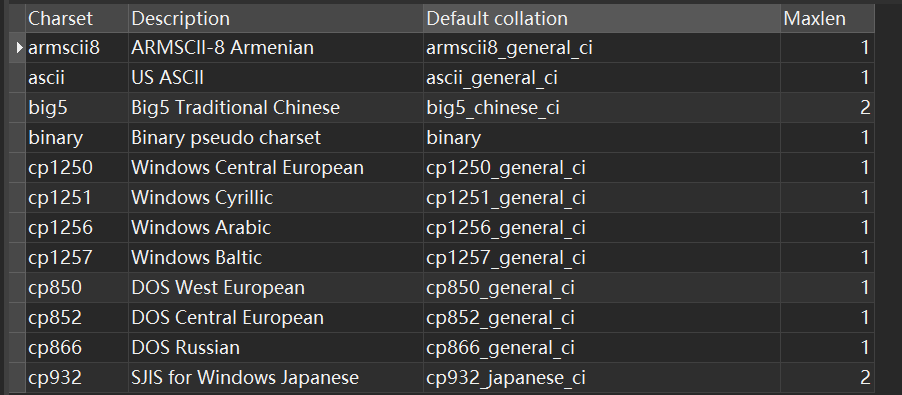

而`show collation;`查询结果如下：

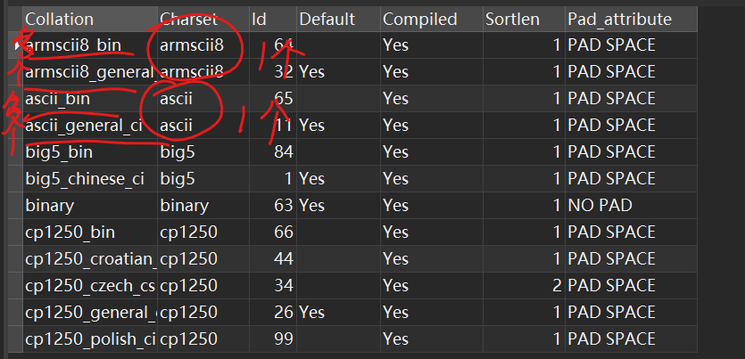

由此可见字符集与校对规则之间是==一对多==的关系。

## 数据库相关

```sql
-- 1.创建数据库
-- create database 数据库名;
create database if not exists testDB;
-- 如果数据库名不合法，数据库名要用反引号括起来。
-- 为规避报错，建议这样做。
create database `123`; -- 不会报错，且会创建成功

-- 2.改动数据库
-- alter database 数据库名 改动项目;
alter database testDB default character set gb2312;

-- 3.选择数据库
use database;
-- 选择后就可以用下面的语句选择它的指定数据表了
-- select * from 数据表：会选择某数据表的全部数据
select * from tables;

-- 4.删除数据库
drop database if exists testDB;

-- 5.查看所有数据库
show databases
-- 6.
-- 格式：show create database 数据库名
show create database testDB
```

## 数据表基础

### 数据类型

**整数类型**：tinyint，int（integer），smallint，mediumint，bigint，

各有各的取值范围。

| 类型      | 字节数 | 有符号（默认）                | 无符号（unsigned） |
| --------- | ------ | ----------------------------- | ------------------ |
| tinyint   | 1      | -128~127（-2^7,2^7-1）        | 0~255              |
| smallint  | 2      | -32 768~32 767                | 0~65 535           |
| mediumint | 3      | -8 388 608, 8 388 607         | 0~16 777 215       |
| int       | 4      | -2 147 483 648, 2 147 483 647 | 0~4 294 967 295    |
| bigint    | 8      | -2^63~2^63-1                  | 0~2^64-1           |

```sql
use TestDB;
create table t1
(
	id tinyint
);
insert into t1 values(-128);
insert into t1 values(127);
insert into t1 values(250);  -- 超出范围的会报错
-- eg: 无符号的tinyint
create table t2
(
	id tinyint unsigned
);
insert into t2 values(255);
insert into t2 values(256);  -- 超出范围的会报错
insert into t2 values(0);
insert into t2 values(-1);  -- 超出范围的会报错
```

**字符串类型**

`char`：定长字符串；`varchar`：不定长字符串

mysql中长度5可以存5个汉字，在其他字符串就只能存一半数量的汉字。

**小数类型**

float，double，decimal

小数格式：`decimal(小数位+整数位，小数位)`

> 不论是定点还是浮点类型，如果用户指定的精度超出精度范围，则会四舍五入进行处理。

| 小数 数据类型       | 有符号（默认）可表示范围           | 无符号（unsigned）可表示范围            |
| ------------------- | ---------------------------------- | --------------------------------------- |
| FLOAT(*size*,*d*)   | -3.402823466E+38～-1.175494351E-38 | 0 和 1.175494351E-38～3.402823466E+38。 |
| DOUBLE(*size*,*d*)  |                                    |                                         |
| DECIMAL(*size*,*d*) |                                    |                                         |

在用户指定的相同精度下，decimal的精度最高。

```sql
create table t4(
    c1 double(21,20),
    c2 float(21,20),
    c3 decimal(21,20）
);

insert into table values()  -- 报错
insert into t4 values
```

**时间日期**

有四种类型：datetime，date，time，year

| 时间日期 数据类型 | 格式                  |
| ----------------- | --------------------- |
| datetime          | YYYY-MM-DD HH:MM:SS   |
| date              | YYYY-MM-DD            |
| time              | HH:MM:SS              |
| year              | 2 位或 4 位格式的年。 |

[now()函数链接](#聚合函数)

```sql
create table t5(
    c1 datetime,
    c2 date,
    c3 year,
    c4 time
)
insert into t5 values(now(),now(),now(),now());
select * from t5;
```

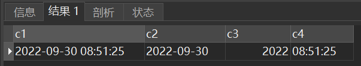

**枚举类型enum**：只能取其一：`字段名 enum("值1","值2","值3",...,"值n")`

**集合类型set**：可以取其中多个：`字段名 set("值1","值2","值3",...,"值n")`

> ENUM 类型相当于单选题，SET 类型相当于多选题。
>
> enum还有多种写法：比如`Ssex enum('男'，'女)default'男';`可以被写成：
>
> `Ssex char(l) check(Ssex='男'or Ssex='女')default'男';`
>`Ssex char(l) check(Ssex in('男'，'女')default'男';`

输入值中间不能加空格：`values("唱,跳,rap,篮球")`

### 数据约束

> 1. 统一格式：`约束条件`
>
>    带名字约束：`CONSTRAINT 外键名 约束条件`
>
> 2. 约束分为==列级约束==和==表级约束==，有的用法无法使用列级约束，参考如下：
>
>    | 约束种类          | 是否能使用表级约束？ | 是否能使用列级约束？ |
>    | ----------------- | -------------------- | -------------------- |
>    | `primary key`     | T                    | T                    |
>    | `foreign key`     | T                    | T                    |
>    | `unique`          | T                    | T                    |
>    | `check`           | T                    | T                    |
>    | `default`         | *F*                  | T                    |
>    | `not null / null` | *F*                  | T                    |

**主键**

关键字：`primary key`

主键，是表中一列或者多列的组合，主键约束遵从*实体完整性*，要求主键列的==数据唯一==，并且==不允许为空==。

即主键能够唯一的标识表中的每一条记录。

> 有两种方式可以添加主键约束： 
>
> 1. 在定义列的同时指定主键，是列级约束，==只可指定一个==主键； 
> 2. 在定义完字段之后再指定主键，是表级约束，==可以指定多个==主键。

```sql
CREATE TABLE t_dept(
    id INT PRIMARY KEY,
    name VARCHAR(22) NOT NULL,
    location VARCHAR(50)
)
```

> 注意！设为主键的都有非空约束和唯一约束。
>
> 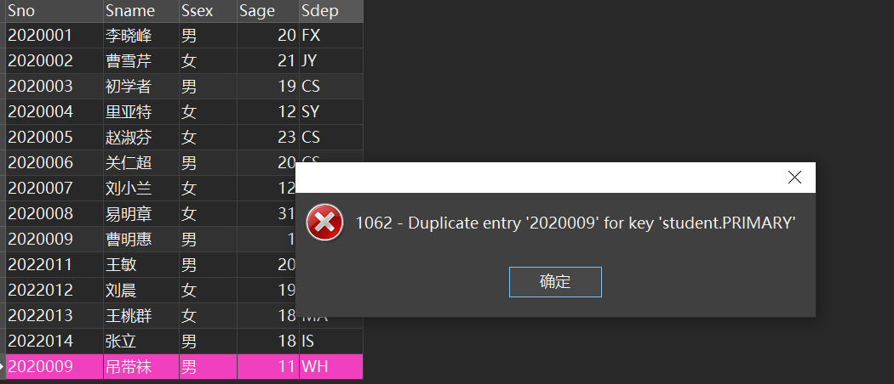

**外键约束**

关键字：`foreign key`。外键遵循参照完整性，其取值：要么取空值，要么取它所参照的主码的值。

> 在以后我们统一将外部关键字叫做==外键==，外键就是==另一张表中的主键==。
>
> 外键的主要作用就是保持数据的一致性，完整性。
>
> 格式：`FOREIGN KEY 字段名 REFERENCES 主表名(主键名)`
>
> 带名字格式：`CONSTRAINT 外键名 FOREIGN KEY 字段名 REFERENCES 主表名(主键名)`

```sql
CREATE TABLE t_dept
(
    deptId INT PRIMARY KEY,
    name VARCHAR(22),
    location VARCHAR(50)
);

CREATE TABLE t_emp
(
    id INT PRIMARY KEY,
    name VARCHAR(22),
    deptId INT,
--    CONSTRAINT fk_emp_dept1 FOREIGN KEY(deptId) REFERENCES t_dept(deptId)
    FOREIGN KEY(deptId) REFERENCES t_dept(deptId)
);
```

**取值唯一**

关键字：unique

唯一约束`（Unique Constraint）`要求该列唯一，允许为空，但是只能有一个空值。唯一约束可以确保一列或者几列不出现重复值。

定义部门表的部门名称唯一，`SQL`语句如下：关键词 `UNIQUE`。

```sql
CREATE TABLE t_dept(
    id INT PRIMARY KEY,
    name VARCHAR(22) UNIQUE,
    location VARCHAR(50)
)
```

**检查约束**

关键字：check

里面可以自定义数据约束，相关约束写法参见[单表查询限制](#限制范围)。

此约束保证用户自定义完整性，也就是反映==实际的语义要求==。

`Grade int check(Grade>=0 and Grade <=100)`
`Grade int check(Grade between 0 and 100)`

```sql
Ssex char(1)check(Ssex='男'or Ssex='女')
Ssex char(1)check(Ssex in('男'，'女')
```

**默认值**

关键字：default

默认约束：即给字段一个默认值。

> - 如果是添加字符串型默认值要使用单引号，如果是整型则不需要加任何符号；
> - 如果要添加的是中文默认值，则需要加上`DEFAULT CHARSET=utf8;`使用英文字符则不需要。

**非空**

关键字：`not null`；被选定的字段不允许有空值。

```sql
CREATE TABLE t_dept(
    id INT PRIMARY KEY,
    name VARCHAR(22) NOT NULL,
    location VARCHAR(50)
)
```

**自增字段**

在数据库应用中，经常有个需求就是，在每次插入新纪录时，系统*自动生成*字段的主键值

关键词：`AUTO_INCREMENT`，默认情况下初始值和增量都为`1`。

注意！自增字段必须是主键约束之一，所以别忘了给自增字段设定`primary key`

可以查看当前自增变量的默认初值和增量`show variables like 'auto incr%';`

```sql
create table t8(
    id int auto_increment primary key,
    name char(3),
    age int
);
-- SQL Server
id int identity(1,2)primary key,
```

### 存储引擎

存储引擎其实是如何存储数据、如何查询数据、更新数据的机制。也称为*表类型*。默认的存储引擎是InnoDB
(1) **InnoDB**：支持事务，支持外键，支持行级锁。

```sql
create table t9
(
id int,
name char(3),
age int
)engine = InnoDB;
```

(2) **MylSAM**：不支持外键，支持表级锁。

```sql
alter table SC engine MylSAM;
create table t10
id int,
name char(3),
age int
)engine = MylSAM;
```

(3) **CSV**：只由逗号分隔数据的存储方式

```sql
create table t11
(
id int not null,
name char(3)not null,
age int not null
)engine=CSV;
```

(4)**Memory**

> 表中的数据存放是内存中的，一旦系统重启，数据就丢失了。

### 聚合函数

聚合函数的特点：

- 每个函数接收一个参数（字段名或者表达式）；
- 默认情况下，组函数忽略列值为`null`的行，不参与计算；
- 不允许出现嵌套 比如`sum(max(xx))`；
- 常与`group by`关键字一起使用。（后面章节会讲到）；
- 一个`SELECT`子句中可出现多个聚集函数。

| 函数名 | 用法                               |                                |
| ------ | ---------------------------------- | ------------------------------ |
| count  | `select count(Sno) from student;`  | 返回字段的值的数量，计重复值。 |
| max    | `select max(Grade) from sc;`       | 返回字段的值的最大值           |
| min    | `select min(Grade) from sc;`       | 返回字段的值的最小值           |
| sum    | `select sum(score) from tb_class;` | 返回字段的值的和               |
| avg    | `select ave(score) from student;`  | 返回字段的值的平均值           |

**count()**

> 使用方法：`count([all | distinct] 字段名)`
>
> 限制参数：默认是all，去重用distinct

```sql
-- 默认计重复值
select count(Ssex) from Student; -- 累计重复值
select count(all Ssex) from Student; -- 与上面等价
-- 取消计重复值
select count(distinct Ssex) from Student; --不累计重复值
-- 统计有多少记录(多少行)：count(*)
select count(*) from Student; -- Student中元组的个数
-- 查询选修了课程的学生人数
select count(distinct Sno) from Sc;
-- 查询选修了2号课程的学生的人数
select count(Sno) from sc where Cno ='2';
```

### 其他函数

#### 字符串相关

| 函数名      | 用法                                          | 释义                                 |
| ----------- | --------------------------------------------- | ------------------------------------ |
| concat()    | `concat("字符串1","字符串2")`                 | 连接一个或多个字符串                 |
| concat_ws() | `concat_ws("连接字符串","字符串1","字符串2")` | 用所给连接字符串连接一个或多个字符串 |
| lower()     | `lower("Welcome to China!")`                  | 将字符串转小写                       |
| upper()     | `upper("Welcome to China!")`                  | 将字符串转大写                       |
| substring() |                                               | 取子字符串                           |

```sql
-- 连接字符串
select concat("hello","world"); # helloworld
select concat_ws("!!!","Holy","Jesus"); # Holy!!!Jesus
# 连接多个字符串 
select concat("hello"," world",","," hello"," sql"); # hello world, hello sql
select concat_ws(",","apple","banana","cherry","mango","watermelon");
# apple,banana,cherry,mango,watermelon
-- 大小写转换
select lower("Welcome to China!") result; # welcome to china!
select upper("Welcome to China!") result; # WELCOME TO CHINA!
-- 取子字符串
```

封装将字符串改写为首字母大写，其余字母小写的函数

```sql
CREATE PROCEDURE fn(inout str VARCHAR(255))
BEGIN
	SELECT SUBSTRING(str,1,1) into @head;
	SELECT SUBSTRING(str,2) into @tail;
	SELECT CONCAT(UPPER(@head),LOWER(@tail)) into str;
END;

SELECT "biBoGraphy" into @test;
CALL fn(@test);
SELECT @test;
```

#### 日期时间相关

| 函数名    | 替代函数       | 释义                     |
| --------- | -------------- | ------------------------ |
| now()     | sysdate()      | 现在系统的*年月日时分秒* |
| curdate() | current_date() | 现在系统的*年月日*       |
| curtime() | current_time() | 现在系统的*时分秒*       |

```sql
select now(); # 等价于 select sysdate()
-- 年-月-日 时:分:秒
select curdate(); # 等价于 select current_date()
-- 年-月-日
select curtime(); # 等价于 select current_time()
-- 时:分:秒

### 从具体日期抽出年月日###
SELECT '2022-2-4' INTO @date;
-- 方法1
SELECT YEAR(@date) year,MONTH(@date) month,DAY(@date) day; #等价于
-- 方法2
SELECT extract(year from @date) year,
		extract(month from @date) month, 
		extract(day from @date) day;
		
### 从具体时间抽出时分秒,同理 ###
SELECT '18:22:34' INTO @date;

SELECT HOUR(@date) hour, MINUTE(@date) minute, SECOND(@date) second; #等价于
SELECT extract(HOUR from @date) hour,
		extract(MINUTE from @date) minute,
        extract(SECOND from @date) second;
```

| 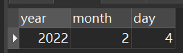 | 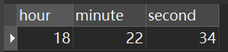 |
| ------------------------------------------------------------ | ------------------------------------------------------------ |

#### 日期时间处理相关

| 函数名          | 用法                                          | 释义                                             |
| --------------- | --------------------------------------------- | ------------------------------------------------ |
| `DATE_ADD()`    | `DATE_ADD(基准日期,INTERVAL 间隔表达式 单位)` | 在基准日期上发生增或减的变化，可代替`DATE_SUB()` |
| `DATE_SUB()`    | `DATE_SUB(基准日期,INTERVAL 间隔表达式 单位)` | 在基准日期上发生减的变化                         |
| `DATEDIFF()`    | `DATEDIFF(日期1,日期2)`                       |                                                  |
| `DATE_FORMAT()` | `DATE_FORMAT(基准日期,格式)`                  | 日期格式化，转换成指定格式。                     |

`format`字符串中常用的说明符如下：

| 格式 | 描述                          |
| ---- | ----------------------------- |
| `%d` | 月的天，数值（`00-31`）       |
| `%H` | 小时 （`00-23`）              |
| `%h` | 小时 （`01-12`）              |
| `%m` | 月，数值（`00-12`）           |
| `%p` | AM 或 PM                      |
| `%s` | 秒（`00-59`）                 |
| `%T` | 时间，`24`-小时（`hh:mm:ss`） |
| `%Y` | 年，`4` 位                    |

> 1
>
> 

```

```

#### 条件判断相关

**if**

`IFNULL()`函数：`IFNULL(a,b)` 如果`a`不为`null`返回`a`，否则返回`b`；

> `IF()`函数：`IF(a,b,c)` 如果`a`为真返回`b`，否则返回`c`；

```sql

```

**case**

> `CASE`：`CASE WHEN a then b end` 判断如果`a`为真返回`b`。

```sql

```

## 数据表操作

### 创建数据表

> 创建数据表的格式如下：
> `CREATE TABLE 表名`
> `(`
>     `字段名,数据类型,`
>     `字段名,数据类型,`
>     `.....`
> `)`

```sql
create table table1(
    c1 int(10),
    c2 varchar(30),
    c3 enum("西校区","东校区","武汉校区"),
    c4 decimal(25,11)
)

-- 还可以根据一个数据表生成另一个数据表
-- 浅拷贝，即只复制数据表的所有字段，不会复制任何元组
create table Student1 like Student;

-- 深拷贝，既复制数据表的所有字段，又会复制所有元组
create table Student2 as select from Student;
```

> tab键缩进

### 查看数据表信息

```sql
-- 查看创建的所有数据表的大致信息
show tables;

-- 表创建好之后可以使用如下语句查看表的基本结构，用来验证是否创建成功是再好不过啦。
describe table_name -- 或者
desc table_name

-- 查看创建数据表的方式（脚本）。
show create table Student;
```

> `DESCRIBE`查表的结构中各个字段的含义分别为：
>
> - `NULL`：表示该列是否能存储 `NULL` 值；
> - `Key`：表示该列是否已编制索引；
> - `PRI`：表示该列是此表主键的一部分；
> - `UNI`：表示该列是 `UNIQUE` 索引的一部分；
> - `MUL`：表示在列中某个给定值允许出现多次；
> - `Default`：表示该列是否有默认值，如果有的话值是多少；
> - `Extra`：表示可以获取的与给定列有关的附加信息。

### 修改数据表

> 格式：`alter table 表名 修改手段`

```sql
-- 修改表名：ALTER TABLE 旧表名 RENAME 新表名; 
ALTER TABLE tab1 RENAME new_tab; 
-- 修改Student表，新增字段Sqq
alter table Student add Sqq varchar(12);
-- 修改字段名qq为Sqq
-- 在此句可以同时修改字段的数据类型，但也只能修改数据类型
-- 不改类型就保证数据类型和原来的一样即可，不可遗漏新名称的数据类型声明。
alter table Student change qq Sqq int(11);  
-- 修改字段Sqq的数据类型
alter table Student modify Sqq varchar(30);  
-- 修改Student表，删除字段Sqq
alter table Student drop Sqq;
-- 修改Student表，为Sage添加check约束
-- 约束格式："约束名 约束类型（目标字段）"
alter table Student add constraint ck_Sage check(Sage >=18);
-- 修改Student表，删除约束ck_Sage
alter table Student drop constraint ck_Sage;
```

### 删除数据表

> 格式：`drop table 表名`

```sql
-- 对于有外键约束的表，先将约束表删除，再把其他表删了。
drop table SC;
drop table Student;
-- 嫌麻烦还可以直接一次性删除多个表
drop table Student,Course,SC;
```

## 数据操作

### 插入数据

```sql
-- 格式：insert into 数据表名 values(值)
-- 向Student:表插入一条记录
insert into Student values('2022007','007','男'，20，'cs');
-- 向SC表插入选课记录
insert into SC values('2022007','1001',100);
insert into SC values('2022007','1002',100);
-- 一次插入多条记录
insert into SC values
('2022007','1003','100'),
("2022007","1004","100");
-- 缺省插入：
insert into SC(Sno,Cno)values('2022003','1002');
```

> 运行代码后，若显示“影响行数”是所加入数据的个数时就说明加入成功了。

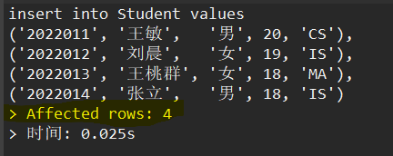

**带子查询**

> 1. 将*查询结果*存到一个已经存在的一个表中：
>
>    ```sql
>    insert into 表名 select ... from ... where ...;
>    ```
>
> 2. 将查询结果存到一个不存在的一个表中：
>
>    ```sql
>    create table avgTable as select ... from ... where ...;
>    ```

```sql
insert into avgTable ;
create table avgTable as
elect Sno学号，avg(Grade)平均成绩
from SC
group by Sno;
select from avgTable;
```

### 修改数据

> 格式：`update 数据表 set 某数据修改方法 where 条件`；
>
> 当数据修改后不满足约束时会被阻止🚫

```sql
-- 数据赋值固定值
update Student set CCname = "?", Cpno = "?", CCrredit = "?" where Cno = "?";
-- 数据自身变化
update Student set Sage Sage-2 where Ssex='女';
```

**带子查询**

> 将查询结果存到一个已经存在的一个表中：
>
> ```sql
> update SC
> set Grade Grade +5
> where Sno in (select Sno from Student where Sdept ='ne').
> ```

```sql
-- 将ne系所有学生的成绩加5分
update SC
set Grade Grade +5
where Sno in (select Sno from Student where Sdept ='ne').
update SC,Student
set Grade Grade-5
where Student.Sno SC.Sno and Sdept ='ne';
```

### 删除数据

> 格式：`delete from 数据表 where 删除条件;`
>
> `truncate`比`delete`执行速度要快，但`truncate`==不记录事务日志==，也==不触发触发器==。
>
> 一般推荐`delete`来清空数据表的所有数据。

```sql
delete from SC where Grade 60;
-- 删除表中的所有数据
-- 方法1
delete from SC;
-- 方法2
truncate table SC;
-- 删除表
drop table SC;
```

## 数据表查询

### 单表查询

#### 总览

```sql
select...from...
where...
group by...
having...
order by...
limit...
```

| 子句     | 作用                                                         |
| -------- | ------------------------------------------------------------ |
| select   | 指定从数起表中查询哪些属性列，属性列之间用迎号隔开           |
| from     | 指定查询的改据源，可以是一个或多个数据表，表之间用逗号隔开   |
| where    | 指定查询溶透条件                                             |
| group by | 将查询结果按照指定的列进行分组                               |
| having   | 对分组后的结果进行端透；                                     |
| order by | 对查询结果按指定的列进行排序。<br />ASC表示升序，DESC表示降序 |
| limit    | 限制查询结果的行数                                           |

```sql
-- 案例
select Name,Salary from tb_emp;
select * from tb_emp where DeptId =301 and salary >3000;
select * from tb_score where class_id in (1) order by score desc; 
select * from tb_class group by class_id;
select * from tb_score order by score desc limit 1,4;
```

#### 基本查询

> 1. SELECT 基本语法规则为： `SELECT 字段名 FROM 表名;` 。
>
> 2. 从表中选择几个字段： `SELECT 字段名1，字段名2，...,字段名n  FROM 表名;` 。
>
> 3. 选择表中所有字段：`SELECT * FROM 表名;` 。
>
> 4. 取别名：`SELECT 字段名1 as 别名1，字段名2 as 别名2，...,字段名n as 别名n FROM 表名;` ；
>
>    或者`SELECT 字段名1 别名1，字段名2 别名2，...,字段名n 别名n FROM 表名;` ，可以不写as。
>
> 5. 用distinct关键字去重：`SELECT distinct 字段名 FROM 表名;` 

```sql
select Name,Salary from tb_emp;

select * from tb_emp;
```

#### 限制范围

> 我们会在where子句里面编写我们的筛选条件。
>
> 1. 用`in`,`not in` 限定在一个或多个可能取值内的数据
>
> 2. 用`between ... and ...`和 `not between ... and ...`限定在某一数值范围内符合条件的数据
>
>    可以等于边界值
>
> 3. 用`and`、`or`、`not`来形成复合的筛选条件。用`>`,`<`,`>=`,`<=`,`=`,`!=`（`<>`）来限制数值或元素范围
>
>    其中重要级：*not > and > or*
>
> 4. 用`is null`，`is not null`筛选某数据项==是否为空值==的元组
>
> 5. 用`any`表示在一个或多个可能取值内的数据的任意一个数据，`=any`与`in`等价，
>
>    用`all`表示在一个或多个可能取值内的数据的所有数据，`!=all`与`not in`等价，

```sql
where Sdept in('cs','ne');
select from Student
where Sdept not in('cs','ne');
-- 在某范围内
--  SELECT 字段名 FROM 表名 WHERE 字段名 BETWEEN n1 AND n2;
select Name,Salary from tb_emp where Salary BETWEEN 3000 and 5000;
-- 无效筛选条件，但能运行，前者相当于还是选全部数据，后者不会筛选任何数据数据
select * from Student where 1=1;
select * from Student where 1!=1;
-- SQL注入常用伎俩
select from users
where userName ='fhdajf'and userPwd = "" or'1'='1';
select from users
where userName ='1'or 1=1 -- 'and userPwd ='fdlfldafladkfd';
-- 判断空值is null,,is not null
select * from Course where Cpno null;
select * from Course where Cpno is null;
select * from Course where Cpno is not null;
```

#### 模糊查询

**通配符**

> 1. `_`：1个任意的字符
> 2. `%`：表示0个或多个任意的字符
>
> 用`like`和`not like`来匹配指定模式

```sql
-- 只匹配'王%'
select * from Student where Sname='王%'；
-- 查询所有姓王的同学
select * from Student where Sname like'王%'；
-- 查询所有不姓王的同学
select * from Student where Sname not like'%';
-- 查询所有姓王且全名只要两个字的同学
select * from Student where Sname like'王_';
-- 查询姓王或刘的同学
select * from Student where Sname like'王%' or Sname like'刘%';
```

**正则表达式**

关于正则表达式的内容，烦请参照[正则表达式速查表](https://regexlearn.com/zh-cn/cheatsheet)，此处不再赘述。

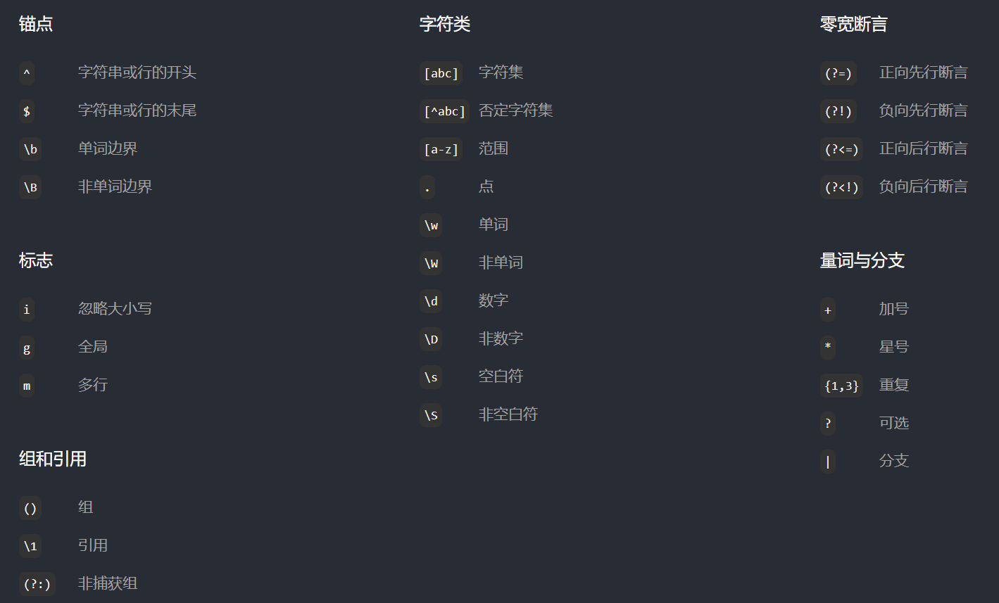

用`regexp "正则表达式匹配模式"`关键字来匹配指定的模式

```sql
-- 查询所有姓王的同学
select * from Student where Sname regexp'^王'；
-- 一查询所有不姓王的同学
select * from Student where Sname regexp'^[^王]';
-- 查询姓王或刘的同学
select * from Student where Sname regexp "^[王刘]";
```

#### 查询结果排序

> 关键字：`order by`
>
> 按照第某列排序：`order by <数字>`
>
> 完整格式：`order by 字段1  asc|desc, 字段2  asc|desc ,..., 字段n asc|desc`
>
> 以先出现的字段排序为主，以之后出现的字段的排序为辅。
>
> 每个指定字段默认是升序，可以指定desc使得排序为降序。
>

```sql
-- 查询选修了1001号课程的学生，查询结果按成绩降序排列
```

#### 查询结果限制

> 关键字：limit
>
> 完整格式：`limit 初值,限制长度`，初值以0开始
>
> 限制查询结果的行数：分页查询
> 

```sql
select * from Course
limit 2,4; -- 从第3条记录开始，取4条记录
select * from Course
limit 0,4; -- 从第1条记录开始，取4条记录
select * from Course
limit 4;-- 从第1条记录开始，取4条记录
```

> 由于限制查询`limit`是后于排序查询`order by`执行
>
> 所以在排序、限制都存在的时候，限制处理的是排序后的记录。
>
> ---
>
> ==例子（头歌）==：使用`LIMIT`关键字查询班级中第`2`名到第`5`名的学生信息，并根据学生成绩进行降序排序。
>
> 原表的情况：乱序，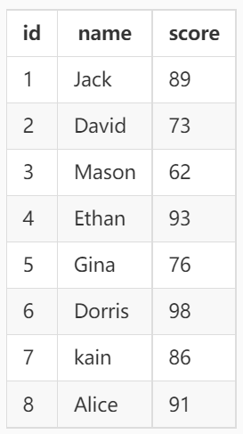；输出要求：按成绩降序，限制选择：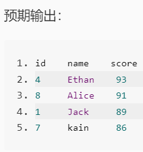，答案如下：
>
> ```sql
> select * from tb_score order by score desc limit 1,4;
> ```

#### 查询分组

> group by字段1,字段2，..

```sql
-- 查询每门课的选课人数
select Cno, count(*)from sC
group by Cno;
-- 查询每个学生的学号及选课门数
select Sno, count(*）选课人数 from scgroup by Sno
-- 查询每个学生的学号及选课门数
select Sno, count(*）选课人数 from scgroup by Sno
having选课人数>2
-- 比较where与having的区别
select Cno, Count(*) from sc
where Grade > 60
group by Cno
having count(*) > 1;
```

**where与having的区别**

> where：是对整个原始表做筛选，会先于`group by`子句被执行
>
> having：是对分组（group by）后的结果做筛选，会后于`group by`子句被执行

### 连接查询

#### 笛卡尔积

> 格式：`select 表1.字段1, 表2.字段2 from 表1, 表2;`
>
> 或者`select 表1.字段1, 表2.字段2 from 表1 cross join 表2;`
>
> 如果表名很长，可以直接为表取别名。
>
> 其格式为：`select 表别名1.字段1, 表别名2.字段2 from 表1 as 表别名1, 表2 as 表别名2;`

```sql
-- 将两个表所有字段拼到一起，所有内容做笛卡尔积。
select Student.* ,SC.* from Student, SC;
```

#### 等值连接

> 由于笛卡尔积的原理，经过笛卡尔积处理后的数据通常不合理。
>
> 等值连接，重点在等值，不能遗漏。一般要用到n个表就需要n-1个等值连接。
>
> 格式：`select Student.*, SC.*from Student, SC where Student.Sno = sc.Sno;`

```sql
-- 查询选修了课程的学生的学号和姓名
select Student.* , SC.* from Student,SC
where Student.Sno = sc.Sno;
-- 查询选修了课程的学生的学号和姓名
select distinct Student.Sno, Snamefrom Student, SC
where Student.Sno = SC.Sno

-- 查询选修了1号课程的学生的学号和姓名
select Student.Sno, Sname
from Student, sc
where Student.Sno = SC.Sno
and Cno = '1';-- 等值连接!等值连接!等值连接!

-- 更复杂的例子
select student.Sno,Sname,Cname,Grade from student,sc,course
where Cname = "数据库"  -- 筛选条件
and student.Sno = sc.Sno and course.Cno = sc.Cno;  -- 等值条件
```

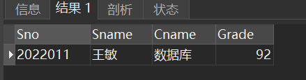

#### 自连接

> 在这条件下，也就是当表和本身做连接时，有必要给同一个表取两个不同的别名。
>
> 格式：`select 别名1.字段1, 别名2.字段2 from 表名 别名1, 表名 别名2 where 别名1.字段1' =  别名2.字段2';`

```sql
-- 查询每门课的间接先修课
select A.Cno,B.Cpno
from Course A,Course B
where A.Cpno = B.Cno;
```

效果如下：

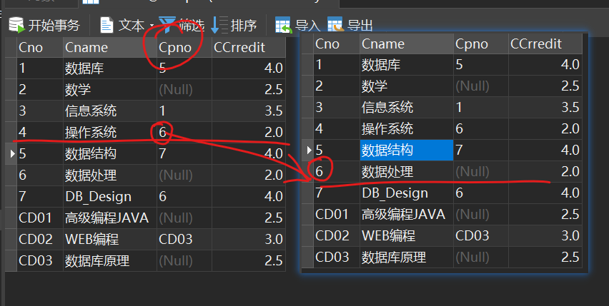

#### 内连接

> 关键字：`inner join`
>
> 格式：`select ..from 表1 inner join 表2 on 条件表达式;`
>
> 执行过程：执行两个表链接，

```sql
select..from表1 inner join表2on条件表达式
```

#### 外连接

> 关键字：`out join`；分类：*左外连接*：`left (out) join`*右外连接*：`right (out) join`
>
> 格式：`select ..from 表1 out join 表2 on 条件表达式;`
>
> 左外连接：在内连接的基础上，还包含表1中所有不符合条件的数据行，并在其中的表2列填写 NULL；
>
> 右外连接：在内连接的基础上，还包含表2中所有不符合条件的数据行，并在其中的表1列填写 NULL。

```sql
select Student.Sno,Sname,Cno,Grade from Student inner join SC
on Student.Sno SC.Sno and Cno ='2'

select Student.Sno,Sname,Cno,Grade from Student left join SC
on Student.Sno SC.Sno and Cno ='2';

select Student.Sno,Sname,Cno,Grade from SC right join Student
on Student.Sno SC.Sno and Cno ='2'
```

### 嵌套查询

> 顾名思义，就是在一个查询结果的基础上再做另一个查询。
>
> 格式是：`select ..from...where ....(select ...from ...where...)`
>
> 子查询返回一个值时就可以用`=`或`in`连接：`... where 字段1 = (子查询)`或`... where 字段1 in (子查询)`
>
> 子查询返回一个值时就只能用`in`连接：`... where 字段1 in (子查询)`

```sql
-- 查询“王敏”同学的选课信息
select from SC
where Sno=(select Sno from Student where Sname='王敏')；
-- 查询选修了2号课程的学生姓名
select Sname from Student
where Sno in (select Sno from SC where Cno ='2');
-- 无关子查询
select Sname from Student
where Sno in('2022001','2022002');
```

> 关键字`any`和`all`在这经常用，用作返回结果的判断（见[限制范围](#限制范围)）

```sql
#1.使用 ALL 关键字进行查询
select position,salary from tb_salary
where salary>all(select salary from tb_salary where position = "Java");
#2.使用 ANY 关键字进行查询
select position,salary from tb_salary
where salary>any(select salary from tb_salary where position = "Java");
#3.使用 IN 关键字进行查询
select position,salary from tb_salary
where salary in (select salary from tb_salary where position = "Java");
```

> `exists`运算符用于判断查询子句是否有记录，如果有一条或多条记录存在返回 True，否则返回 False。
>
> 格式：`select ...from ..where exists (select from ... where...)`

```sql
-- 查询选修了2号课程的学生姓名
-- 相关子查询
select Sname
from Student
where exists(select from SC
where SC.Sno Student.Sno and Cno ='2');
-- 这样写执行结果是错误的
select Sname
from Student
where exists(select from SC where Cno ='2');
-- 查询没有选修2号课程的学生姓名
select Sname
from Student
where not exists(select from SC
where SC.Sno=Student.Sno and Cno ='2');
```

带子查询更新操作

### 集合查询

> 并：union，union all
>
> 交：（SQL server，oracle）： intersect
>
> 补：（SQL server）：except；（oracle ） minus

```sql
select from Student where Sdept ='CS'
union all
select from Student where Sage 18;
```
