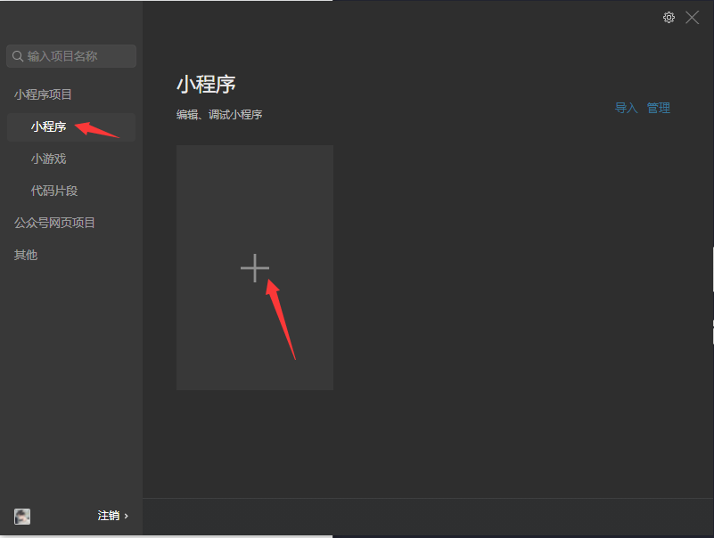
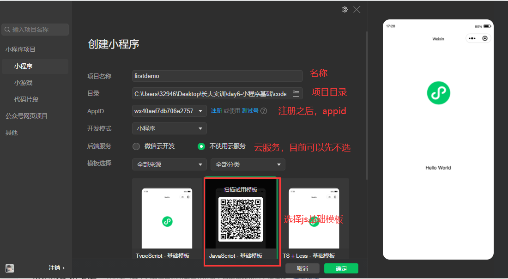
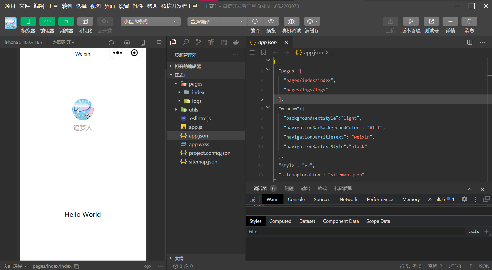
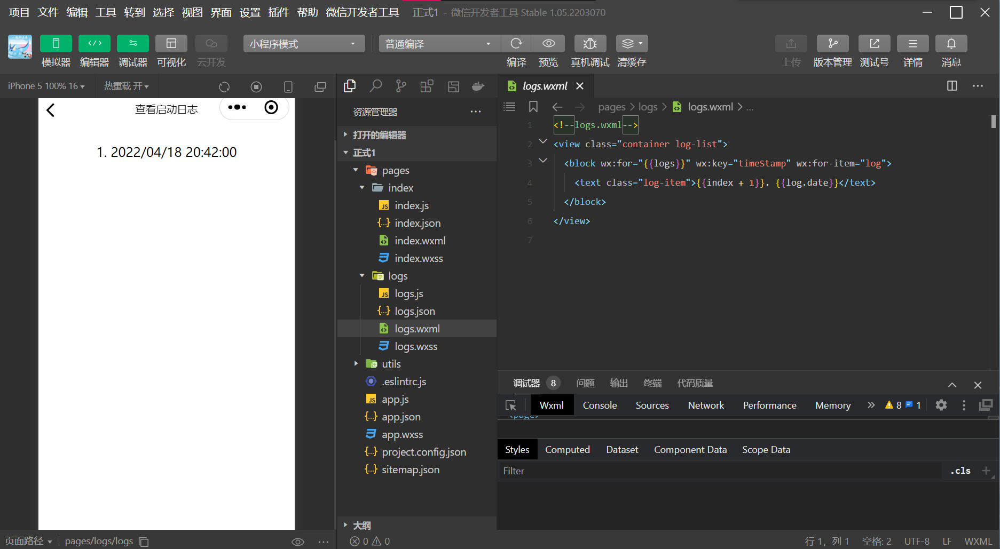
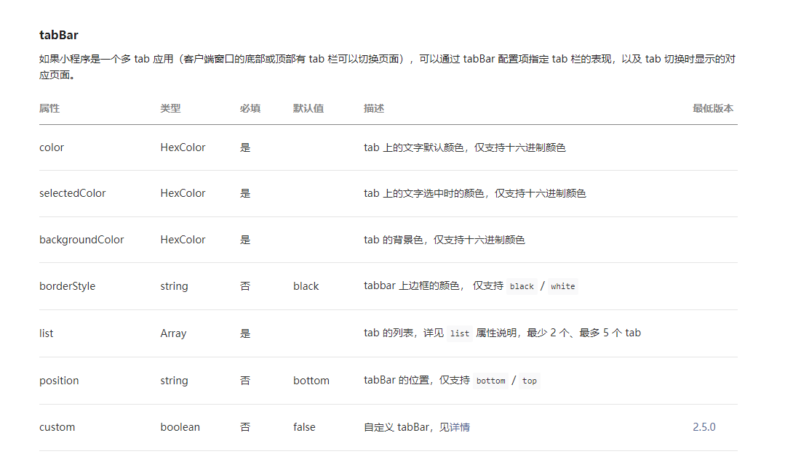
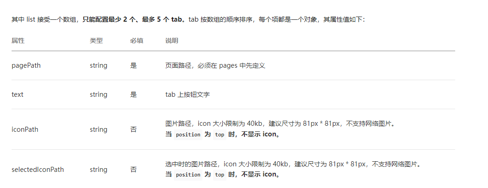
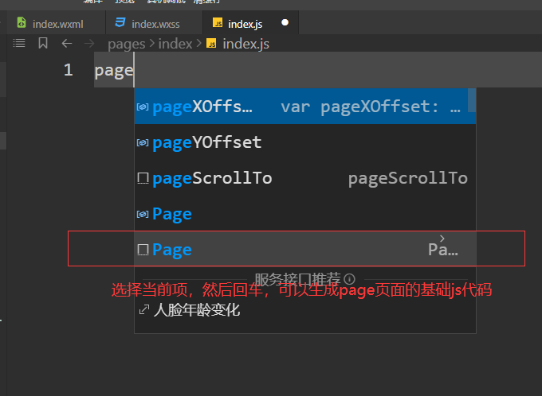

# 微信小程序开发

## 开始

### 注册页面

>https://mp.weixin.qq.com/wxopen/waregister?action=step1
>
>"信息登记"的时候选择"个人账号”

### `appid`

>注册成功之后，登录”微信开放平台”网址：https://mp.weixin.qq.com/
>
>左侧导航栏，`"开发”==>"开发管理”==>"开发设置"==>获取"AppId"`

### 新建项目

> * 打开“微信开发者工具”
> * 微信扫码登录
> * 选择“加号”创建小程序项目
> * 根据配置项填项目信息

|  |  |
| ------------------------------------------------------------ | ------------------------------------------ |

# 基本框架



*点头像会跳转到日志页面↓*



| 比较项目 | 传统前端 | 微信小程序开发 |
| -------- | -------- | -------------- |
| 页面结构 | HTML     | WXML           |
| 样式     | CSS      | WXSS           |
| 脚本     | JS       | JS / TS / WXS  |
| 配置     | 无       | JSON文件       |

## 相关配置

### 全局配置 

> 就是整个小程序的整体配置：小程序全局的配置项app,json
> **pages属性**
>
> 1. 取值是数组，数组中是当前小程序中可以访问的页面路径
> 2. 可以在数组中写入类似'"pages/cat/cart"这种代码，可以在pages目录中快速生成页面所需的4个文件
> 3. 小程序默认访问页面是pages的数组中第一个数组元素匹配的页面
>    window常用属性

`app.json`

```json
{
  //pages包含微信小程序的所有页面路径
  "pages":[
    "pages/index/index",
    "pages/logs/logs"
  ],
  //小程序页面窗口的相关配置
  "window":{
    "backgroundTextStyle":"dark", // 下拉刷新时，指示器颜色
    "navigationBarBackgroundColor":"#ccc", // 标题栏背景色，可以取#十六进制颜色
    "navigationBarTitleText":"小程序学习"，// 标题栏文本
    "navigationBarTextstyle":"white", // 标题栏文本颜色
    "enablePullDownRefresh":true, // 允许面下拉刷渐
    "onReachBottomDistance":50 // 触底动加或的距离值
  },
  "style": "v2",
  "sitemapLocation": "sitemap.json"
}
```

### 页面配置

> 页面的相关信息，在单个页面page的.json文件中，可以将app.json中的window属性下的配置项进行单独设置
>
> 页面中如果设置了对应属性，会将全局中同名属性覆盖

`pages/index/index.json`

```json
//标注页面的相关信息
{
  "navigationBarBackgroundColor": "#ffffff",
  "navigationBarTextStyle": "black",
  "navigationBarTitleText": "Jayther",
  "backgroundColor": "#eeeeee",
  "backgroundTextStyle": "light"
}
```

### 底部菜单栏

| tabbar属性                |
| ------------------------- |
|  |
| tabBar中的list属性        |
|  |

## WXSS

> 支持大多CSS内容，可是只能写CSS，不支持CSS预处理器
>
> 且不支持标签选择器、id选择器、属性选择器
>
> 新增单位`rpx`，支持手机适配

`pages/index/wxss`

```css
/**index.wxss**/
.userinfo {
  display: flex;
  flex-direction: column;
  align-items: center;
  color: #aaa;
}

.userinfo-avatar {
  overflow: hidden;
  width: 128rpx;
  height: 128rpx;
  margin: 20rpx;
  border-radius: 50%;
}

.usermotto {
  margin-top: 200px;
}
```

## WXML

> 不像HTML使用的标签，WXSS有自己的一套标签体系。大多是已经封装好的能力

```html
<!--index.wxml-->
<view class="container">
  <view class="userinfo">
    <block wx:if="{{canIUseOpenData}}">
      <view class="userinfo-avatar" bindtap="bindViewTap">
        <open-data type="userAvatarUrl"></open-data>
      </view>
      <open-data type="userNickName"></open-data>
    </block>
    <block wx:elif="{{!hasUserInfo}}">
      <button wx:if="{{canIUseGetUserProfile}}" bindtap="getUserProfile"> 获取头像昵称 </button>
      <button wx:elif="{{canIUse}}" open-type="getUserInfo" bindgetuserinfo="getUserInfo"> 获取头像昵称 </button>
      <view wx:else> 请使用1.4.4及以上版本基础库 </view>
    </block>
    <block wx:else>
      <image bindtap="bindViewTap" class="userinfo-avatar" src="{{userInfo.avatarUrl}}" mode="cover"></image>
      <text class="userinfo-nickname">{{userInfo.nickName}}</text>
    </block>
  </view>
  <view class="usermotto">
    <text class="user-motto">{{motto}}</text>
  </view>
</view>
```

常见常用的WXML标签如下：

| WXML标签 | 释义     |
| -------- | -------- |
| view     | 盒子容器 |
| text     | 文字内容 |

### 插值语法

```html
<view>{{msg}}</view>
```

```js
data: {
    // msg是接口中返回的数据
    msg:'he turns himself into a pickle.',
},
```

## JS逻辑

| index.js生成基础代码 |  |
| -------------------- | ------------------------------------------------------------ |

```js
Page({
  /*** 页面的初始数据*/
  data: {},

  /*** 生命周期函数--监听页面加载*/
  onLoad: function (options) {},
  /*** 生命周期函数--监听页面初次渲染完成*/
  onReady: function () {},
  /*** 生命周期函数--监听页面显示*/
  onShow: function () {},
  /*** 生命周期函数--监听页面隐藏*/
  onHide: function () {},
  /*** 生命周期函数--监听页面卸载*/
  onUnload: function () {},
  /*** 页面相关事件处理函数--监听用户下拉动作*/
  onPullDownRefresh: function () {},
  /*** 页面上拉触底事件的处理函数*/
  onReachBottom: function () {},
  /*** 用户点击右上角分享*/
  onShareAppMessage: function () {}
})
```

### 点击事件

```html
<!-- 单击事件 -->
<button bindtap="updateMsg">改变age</button>
```

```js
 data: {
   ...
 },
 updateMsg(){
    // 调用this.setData()方法，来改变data中的msg值；msg的值改变之后，在视图中对应的数据都会发生变化
    this.setData({
      // 以对象的形式，作为setData方法的参数
      msg:'Hard work often pays off',
    }) 
 },
 ...
```

