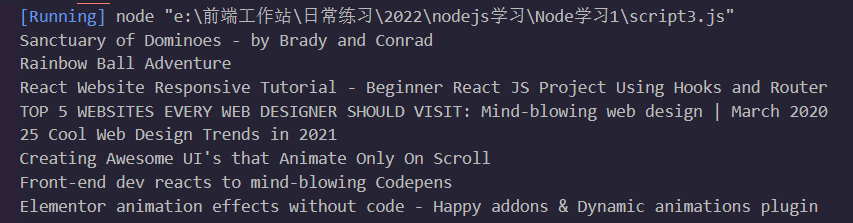
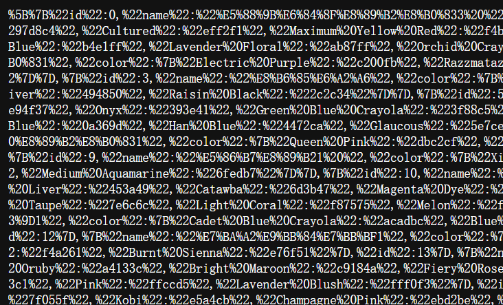

# Node笔记

---

完整教程：http://nqdeng.github.io/7-days-nodejs

## Nodejs引入

> 1. 官网安装
>
> 2. cmd检查node和npm版本：
>
>    `node -v`【`node --version`】
>
>    `npm --version`

## Node实时编程

> 1. cmd敲`node`进入
> 2. `ctrl+d`退出
> 3. `ctrl+c`直接退出cmd

## Node模块机制

> 主要利用commonJS机制，其对模块定义十分简单：引用、定义、标识
>
> 模块化中，文件即模块，且有其作用域。
>
> 有三个关键字：require、exports、module

### require

用`require()`导入模块

```js
//使用方法：require(路径)
require('md.js')
require('./img/test.img')
```

> 在vscode里，可以直接输入`req`来简单引入一个Node模块


### exports

```js
exports.x = 1
exports.fn = () => {console.log('Hi NodeJs!')}
```

### module

**exports属性**

```js
module.exports = {
    x:0,
    fn(){console.log('Hi NodeJs!')}
}
```

### 包

> 由包结构和包描述文件组成
>
> 包结构包含：package.json（必选）、readme.md、main.js等

```json
//package.json常用信息
{
    "name":"itheima-tools",  //包名
    "version":"1.0.0",  //包版本
    "main":"index.js",  //主入口文件
    "description'":"提供了格式化时间、HTMLEscape相关的功能"，//包描述
    "keywords":[ //包的搜索关键字
    "itheima",
    "dateFormat",
    "escape"
    ],
    "license":"ISC" //许可证
}
```

## npm使用

> 安装淘宝镜像：`npm install -g cnpm --registry=https://registry.npm.taobao.org`

| 命令      | 缩写   | 用法              | 释义                                      | 更多用法                                                     |
| --------- | ------ | ----------------- | ----------------------------------------- | ------------------------------------------------------------ |
| --version | -v     | npm --version     | 查看npm版本                               |                                                              |
| -l        |        | npm -l            | 显示全部命令的详细用法                    |                                                              |
| init      |        | npm init          | 创建`package.json`                        |                                                              |
| install   | i      | npm install       | 安装项目依赖                              | npm install foo 安装项目指定依赖                             <br/>npm install foo @version  安装项目某依赖的指定版本 <br/>npm install foo @latest   安装项目某依赖的最新版本 |
| uninstall | rm、un | npm un \<foo>     | 卸载某个依赖                              |                                                              |
| run       |        | npm run \<foo>    | 运行package.json的指定脚本【scripts部分】 |                                                              |
| list      | ls     | npm list          | 列出当前项目安装的所有依赖                | npm list -g 列出当前项目安装的所有依                         |
| update    |        | npm update \<foo> | 升级项目指定依赖                          |                                                              |

> -g 表全局依赖；主要用在安装和卸载指令上
>
> -S 为--save的缩写，表本地依赖
>
> -D 为--save-dev的缩写，表开发时依赖

### npm镜像

|      |      |      |
| ---- | ---- | ---- |
|      |      |      |
|      |      |      |
|      |      |      |


## 文件操作

> 即file-system，在Nodejs中使用fs模块来实现相应功能

```js
const fs = require('fs') //导入
```

### 读取文件

> 具体方法：`fs.readFile(path[,options],callback)`
>
> 如果读取成功，回调函数中`error===null`
>
> 如果读取失败，回调函数中`data===undefined`，error则是对象

| 参数     | 是否必选 | 格式                      | 释义                       |
| -------- | -------- | ------------------------- | -------------------------- |
| path     | 是       | String                    | 文件路径                   |
| options  | 否       | 'utf8'                    | 以什么编码读取文件         |
| callback | 是       | `(error,data)=>{/*...*/}` | 回调函数，以此获取文件信息 |

```js
const fs = require('fs')
//读取文本时不填第二参数'utf-8'是读不出来文本的
fs.readFile('./info.txt','utf-8',(err,data)=>{
  console.log(data);
  if(err){
    console.log(err);
  }
})
```



### 写入文件

> 具体方法：`fs.writeFile(file,data[,options],callback)`
>
> 如果写入成功，回调函数中`error===null`
>
> 如果写入失败，回调函数中error则是对象
>
> 该方法不可创建目录，需要
>
> 如果目标文件原本有文字，则会被新内容完全覆盖

| 参数     | 是否必选 | 格式                 | 释义                       |
| -------- | -------- | -------------------- | -------------------------- |
| file     | 是       | String               | 文件路径                   |
| data     | 是       | String               | 需要写入文件的数据         |
| options  | 否       | 'utf8'               | 以什么编码读取文件         |
| callback | 是       | `(error)=>{/*...*/}` | 回调函数，以此获取文件信息 |

```js
const fs = require('fs')
const data = ['a','b','c','d']
fs.writeFile('./output.txt',data.join('.'),(err)=>{
  //处理格式1：if-else语句块
  if(err) 
      console.log(err);
  else{
      console.log('文件写入成功！'); //不出错时提示成功信息
  }
})
```

### 路径动态拼接

> 主要针对形如`./`、`../`等相对路径拼接的问题，直接拼接Node会报错
>
> 解决方案之一是==直接搞绝对路径==，可移植性差。
>
> 解决方案之二是==使用`__dirname`表示文件当前路径==

```js
const fs = require('fs')
const path = __dirname + '/info.txt'
fs.readFile(path,'utf-8',(err,data)=>{
    //处理格式2：try-catch错误处理
    try{
        console.log(data)
    }catch(err){
        console.log('读取文件错误')
    }
})
```

### __filename

> `__filename`是运行文件的绝对路径

### 创建文件夹

> `fs.mkdir(path, mode, callback)`
>
> path：
>
> callback：回调函数

```js
const fs = require('fs'); 
const path = require('path'); 
   
fs.mkdir(path.join(__dirname, 'test'), (err) => { 
    if (err) { 
        return console.error(err); 
    } 
    console.log('Directory created successfully!'); 
});
```

## 路径操作

> 在Nodejs中用path模块处理路径问题

```js
const path = require('path')
```

### path.join()

> 用于路径拼接，可根据相对路径符控制路径的拼接结果

```js
console.log(path.join('Your/current/position','../','./code')) // 路径为Your/current/code
```


### path.basename()

> `path.basename(path[,ext])`
>
> 可以利用该方法从文件路径中取得当前文件的文件名，并省略特定扩展名
>
> path：必选，路径字符串
>
> ext：扩展名，只有和所填扩展名一样的才会省略扩展名

```js
let path1 = '项目大集结/大创项目-网易云音乐/node_modules/@ampproject/remapping/dist/remapping.mjs'
console.log(path.basename(path1,'.mjs'));
console.log(path.basename(path1,'.jpg'));
```


### path.extname()

> `path.extname(path)`
>
> 可以利用该方法从文件路径中取得当前文件的文件扩展名

```js
let path1 = '项目大集结/大创项目-网易云音乐/node_modules/@ampproject/remapping/dist/remapping.mjs'
console.log(path.extname(path1)); //.mjs
```

## 网络操作

> 在Nodejs中用http模块处理网络相关问题
>
> 可以通过`http.createServer()`方法将电脑转变为服务器

```js
const http = require('http');
```

### 制作http服务器

> 1. 引入http模块`const http = require('http');`
> 2. 创建http服务器实例：`const server = http.createServer()`
> 3. 用on方法为服务器绑定请求事件（request）
> 4. 用listen方法启动服务器

```js
const http = require('http');
const server = http.createServer()

server.on('request',(req,res)=>{
  console.log('requesting');
})

server.listen(6339,()=>{
  console.log('server running!');
  console.log('site is localhost:6339');
})
```

### 请求和响应处理

> 对于请求函数，格式如下：
>
> `(req:请求对象,res:响应对象)=>{}`
>
> 请求对象的相关参数有：url,methods等
>
> 请求对象的相关函数res.end()接响应参数（除了字符串其他的不行）

### 中文乱码问题

`request.js`

```js
const http = require('http')
const server = http.createServer()

//直接引入json文件(会转变为对象Object)
const wholeData = require('./db.json')

server.on('request',(req,res)=>{
  //通过判断url提供不同内容
  if(req.url==='/colors'){
    console.log('palette color data visiting');
    res.end(JSON.stringify(wholeData.colors))
    // res.end(encodeURI(JSON.stringify(wholeData.colors)))
  }
  else if(req.url==='/ui-theme'){
    console.log('theme color data visiting');
    res.end(JSON.stringify(wholeData['ui-theme']))
  }
  else {
      res.end("Sorry, source not found!")
  }
})

server.listen(3000,()=>{
  console.log("server running at http://localhost:3000")
})

```

> 理论上可以以此直接做个可以正常工作的服务器的，而如果有中文则会变成乱码。此时有两种方法：
>
> 1. 使用`encodeURI`直接转义
> 2. 设置响应头部：`res.setHeader('Content-type', 'text/html;charset=utf-8')`

| 中文乱码                                        | encodeURI                                                    | 头部处理                                        |
| ----------------------------------------------- | ------------------------------------------------------------ | ----------------------------------------------- |
|  |  |  |


