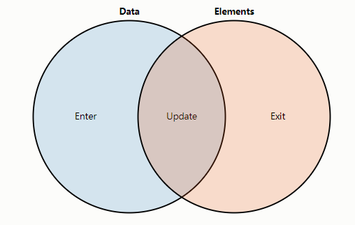

# D3.js


> D3.js不会给我们提供现成的图表，而是给我们提供制作图表的基本工具。所以有很强大的灵活性。
>
> 代价是方法和功能超多，而且就连普通的图表都需要几十行的代码来实现。
>
> 所以D3.js更适合用于高度自定义化的图表的设计。我们在这只记录我们最需要的。

## 开始使用

**基本信息**

> 最近版本：7
>
> 需要：SVG基础，D3用此来绘制图表
>
> 可参考教程：https://www.d3indepth.com/
>
> 可参考仓库：https://github.com/wantnocode/Learn-D3

**安装**

> CDN：[d3js.org/d3.v7.js](https://d3js.org/d3.v7.js)
>
> 压缩库CDN：https://d3js.org/d3.v7.min.js
>
> npm: `npm i d3 -S`
>
> **d3类型(不安装的话，你写代码没类型提示补全，会不太方便)。**：`npm i @types/d3 -D`
>
> ```js
> /** @type {import('d3').BaseType} */
> import * as d3 from 'd3'
> ```

**集成于Vue当中**

`index.js`

```js
import * as d3 from "d3";

const app = createApp(App)
app.config.globalProperties.$d3 = d3
```

`组件当中`

```vue
<script setup>
// import * as d3 from "d3";
import {getCurrentInstance} from "vue";
const {proxy} = getCurrentInstance()

console.log(proxy.$d3)
</script>
```

`只引入必需元素`

```js
import {axisTop, axisLeft, format} from 'd3'
import store from "module/store/index"
import useFieldPatternStore from "module/store/fieldPattern/graph-thickness";

const diagramStore = useFieldPatternStore(store)

export function useAxis(xScale, yScale) {
  /** x轴 */
  const xAxis = axisTop(xScale).ticks(10).tickSize(6).tickFormat(format("d")) // * 主刻度的轴
  const xMinorAxis = axisTop(xScale).ticks(100).tickSize(3).tickFormat('') // * 副刻度的轴

  /** y轴 */
  const yAxis = axisLeft(yScale).ticks(5).tickSize(6).tickFormat(format("d")) // * 主刻度的轴
  const yMinorAxis = axisLeft(yScale).ticks(50).tickSize(3).tickFormat('') // * 副刻度的轴

  return {xAxis, xMinorAxis, yAxis, yMinorAxis}
}
```

## DOM操作

| 方法        | 参数                                    | 用途                                |
| ----------- | --------------------------------------- | ----------------------------------- |
| `select`    | CSS选择器/DOM元素                       | 用选择器选择*第一个匹配的*元素      |
| `selectAll` | CSS选择器                               | 用选择器选择所有匹配的元素          |
| `append`    | 被添加的元素/*返回DOM元素的函数*        | 向添加元素                          |
| `attr`      | 元素属性名，属性值/*返回属性值的函数*   | 向元素添加属性                      |
| `style`     | CSS样式名，CSS样式值/*返回样式值的函数* | 向元素添加CSS样式                   |
| `text`      | 文本内容/*返回文本内容的函数*           | 修改innerHtml（里面显示的文本内容） |
| `create`    | 标签名/*返回DOM元素的函数*              | 创建指定的元素                      |
| `size`      | /                                       | 返回当前选择对象的节点个数          |
| `empty`     | /                                       | 返回当前选择对象是否为空            |

> 1. 你会注意到有可以传进函数的选项，请参考[针对'attr'传参](#针对`attr`传参)部分来了解d3如何通过这些函数传递数据的
>
> 2. d3的select，selectAll，create返回的并不是DOM元素本身。
>
>    需要分别通过调用`.node()`，`.nodes()`方法来返回DOM节点和DOM节点数组。
>
> 3. 在使用`d3.create()`==创建svg元素==的时候，==请记得加上前缀`svg:`==来代表它是*svg*的元素，不然会被当成自定义元素！比如：`create(svg:g)`是创建svg的分组，`create(g)`仅仅只是自定义元素`g`

```js
d3.create("svg:g") // an SVG G element
d3.create("g") // an HTML G (unknown) element
```

**选择元素的属性**

```js
const bodySelection = d3.select("body");

const svgSelection = bodySelection.append("svg")
  .attr("width", 50)
  .attr("height", 50);

const circleSelection = svgSelection.append("circle")
  .attr("cx", 25)
  .attr("cy", 25)
  .attr("r", 25)
  .style("fill", "purple");
```

## 数据绑定

### 传参函数`data()`

> 格式：`data(dataArray)`，其中`dataArray`是数据数组`Array<>`，如：
>
> ```js
> [{name:'Sebastian',value:384},{name:'Ciel',value:32},{name:'Cai Yun',value:16)]
> ```
>
> 默认的绑定按照双方的索引顺序，数据的更新只需要重新绑定另一个`dataArray`即可
>
> *原理：每个图元数据会存储在对应的DOM元素的`__data__`属性下。*


### 数据的三个阶段



```js
d3.select("body").selectAll("p") // 创建虚拟的标签模板
    .data(theData) // 绑定数据
    .enter() // 填入选择集
    .append("p") // 加入p元素，此时加入的还是空元素，需要改一下内容
```

> D3.js 通过数据操作符（Data Operator）返回三个虚拟选择集（virtual selections），而不是像其他方法那样只返回一个。
>
> 它们分别是：enter、update 和 exit。对应数据处理涉及到的三个阶段：填入(enter)，更新(update)，退出(exit)
>
> 它们在不同的场景下使用，以便更有效地处理数据绑定和可视化元素的增删改。
>
> 解释可以看：[Thinking with Joins (ocks.org)](https://bost.ocks.org/mike/join/)； 备用链接：[Thinking with Joins (archive.org)](http://web.archive.org/web/20201109031013/https://bost.ocks.org/mike/join/)

#### Enter 选择集

用于处理在数据集中存在，但 DOM 中尚不存在的数据。

当将新数据绑定到已有元素时，enter 选择集将为这些新数据创建占位符。

在 enter 选择集中，你可以指定如何创建新元素（例如，添加 SVG 元素或其他元素），并设置其初始属性和样式。

使用场景包括：为新数据添加新的可视化元素、为新数据设置初始属性等。

```js
d3.select("svg")
    .selectAll("circle") // 选择所有元素返回空DOM数组对象
    .data(newData) // 传进数组数据
    .enter() // 使用 enter 选择集
    .append("circle") // 向里面加入元素
    .attr("r", 5) // 修改元素属性
    .attr("fill", "blue");
```

#### Update 选择集

 用于处理已经绑定到数据的现有元素。

当新的数据集与已有元素结合时，update 选择集将包含这些现有元素。

在 update 选择集中，你可以根据新数据对元素的属性和样式进行更新。

使用场景包括：根据新数据更新可视化元素的位置、根据新数据改变元素的颜色等。

```js
d3.select("svg")
    .selectAll("circle")
    .data(newData) // 直接更新数据
    .attr("cx", d => d.x) // 修改元素属性
    .attr("cy", d => d.y)
    .attr("fill", d => d.color);
```

#### Exit 选择集

用于处理在数据集中已不存在，但仍然存在于 DOM 中的元素。

当将新数据绑定到已有元素时，如果数据集中的元素数量减少，那么 exit 选择集将包含这些多余的元素。

在 exit 选择集中，你可以指定如何删除这些元素（例如，通过过渡动画来移除元素）。

使用场景包括：删除不再需要的可视化元素、为删除的元素添加过渡动画等。

```js
d3.select("svg")
    .selectAll("circle")
    .data(newData) //更新数据
    .exit() //多余，没用的数据
    .remove(); //会被移除DOM
```

### 针对`attr`传参

> `selection.attr('attrbuteName','value')`
>
> * 支持直接通过值来设置属性
> * 支持通过函数来设置属性，格式如下：
>
> `selection.attr('attrbuteName',(d,i)=>{...})`
>
> * d为绑定给图元的数据（即将到来）
> * i为图元的索引，是一个整数，如`d3.selectAll(rect')`中的第几个矩形

```js
const theData = [10, 20, 30];

onMounted(() => { /** 以后一律省略onMounted **/
    var p = d3.select("body").selectAll("p") // 选择
        .data(theData) // 绑定数据
        .enter() // 填入选择集
        .append("p") // 加入p元素
        .text((msg,idx) => `index: ${idx} ;message: ${msg}`); // 使用传进去的数据来返回处理后的值
})
```

### `join()`绑定数据方法

> 是在*v5版本*当中新出的绑定数据的方法，可以代替上面提到的进入更新退出的繁琐方法。
>
> 有两种传参形式。使用方法如下。三个过程函数还是以之前的方法用即可。

```js
// 方法1：只传进字符串作为要添加的元素
WellNodePosition.selectAll("circle")
    .data(fakeWellData)
	.join("circle") // 完成数据绑定并用数据生成指定元素
    .attr('cx', d.x)
    .attr('cy', d.y)
    .attr('r', 10)
    .attr('fill', d.wellType ? 'red' : 'white')

// 方法2：传进三个数据处理函数作为过程参数
WellNodePosition.selectAll("g")
    .data(fakeWellData)
    .join(enter => enter.append(d => wellNodeFn(d)))

// * 等价于：
WellNodePosition.selectAll("g")
    .data(fakeWellData)
    .join(enter => enter.append(d => wellNodeFn(d)), update => update, exit => exit.remove())
```

> 可通过调用`each()`函数来直接自定义分配数据的流程。
>
> `each()`的传参函数的参数是数据`d`，索引号`i`，遍历本体`n`，而普通函数的`this`指向才是遍历的单个元素。

```js
WellNodePosition.selectAll("g")
    .data(fakeWellData)
	.join('g')
	.each(wellNodeFn) // 看成 d => wellNodeFn(d)

/***** 用个普通函数可以用内置的this代表当前的被遍历的元素：*****/
WellNodePosition.selectAll("g")
    .data(fakeWellData)
	.join('g')
	.each(function(){ doSomethingWithEntity(this) }) // 无别的同类写法
```

## 建立映射（比例尺）

> 作用：对于体量再大的数据，也有办法来在一个限定大小的图表空间表示。办法就是将数据范围给映射到视图范围即可
>
> 映射给出两个方法，分别定义数据范围domain和视图范围range。
>
> 查看所有的映射请参考：[d3-scale | D3 by Observable (d3js.org)](https://d3js.org/d3-scale)

```js
// 定义方法1
d3.scaleUtc()
  .domain([new Date("2023-07-01"), new Date("2024-07-05")])
  .range([marginLeft, width - marginRight]);

// 定义方法2
d3.scaleLinear([0, 100], [height - marginBottom, marginTop])
```

**基本映射**

| 映射类型，参数为domain和range | 释义                                                         | 备注           |
| ----------------------------- | ------------------------------------------------------------ | -------------- |
| `scaleLinear()`               | 线性比例尺，适用于数值型数据，将连续的输入域映射到连续的输出范围 | 可支持负值     |
| `scaleIdentity(range)`        | `scaleLinear()`的特例，它定义域与值域映射相等                | 只用传入范围   |
| `scaleTime()`，`scaleUtc()`   | 时间比例尺，用于将时间在一定范围内进行映射到连续的输出范围   | 只可以传入时间 |

**大范围映射**：用于超大范围的映射


| 映射类型，参数为domain和range | 释义                                                      | 备注                                |
| ----------------------------- | --------------------------------------------------------- | ----------------------------------- |
| `scaleLog()`                  | 将输入域用对数型的映射关系映射到连续的输出范围，          | 默认基底为2，定义域*不能*包含0      |
| `scalePow()`                  | 将输入域用指数型的映射关系映射到连续的输出范围，          | 一开始必须通过`.exponent()`设定指数 |
| *`scaleSymlog()`              | 将输入域用与y轴对称的对数型的映射关系映射到连续的输出范围 | 参数为1，定义域*能*包含0            |

**输入是离散的**：将一组离散的输入值映射到一组连续的输出值

| 映射类型，参数为domain和range | 释义                                                         |
| ----------------------------- | ------------------------------------------------------------ |
| `scalePoint()`                | 点状比例尺，将每个输入值映射到输出值中的一个点，而不是一个区间。 |
| `scaleBand()`                 | 分段比例尺，将每个输入值映射到输出值中的一个区间。*适用于条状图*。 |
| `scaleOrdinal()`              | 将不连续的输入域映射到不连续的输出范围，适用于非数值型数据   |

**输出是离散的**：输出范围必须是离散值

| 映射类型，参数为domain和range | 释义                                                         |
| ----------------------------- | ------------------------------------------------------------ |
| `scaleThreshold()`            | 将连续的输入域映射到离散的输出范围，根据输入值的阈值确定输出值 |
| `scaleQuantize()`             | 定义域的范围会根据离散型值域中可取值的数量划分为等距的片段   |
| `scaleQuantile()`             | 将输入的数据作为总体（一堆通过采样获取的离散值），这样就可以接受在该总体范围中的任意值输入（即定义域是连续型），可以计算出它在总体中的分位数，然后基于分位数再找出在值域中一些列离散值中的那个对应值。 |

## 坐标轴


> 将坐标轴的各个轴成分视为svg部件加入到SVG容器当中。一般分为两个步骤来进行坐标轴绘制：
>
> 1. *创建坐标轴对象*，在坐标轴对象来设置像刻度个数，刻度大小，刻度边距，刻度渲染格式等属性
> 2. 新建或者选择某个要作为坐标轴的`<g></g>`元素*并应用坐标轴对象*以进行渲染，并在渲染完的基础上重新选择并[修改坐标轴外观](#外观属性)。

| 坐标轴类型     | 释义       |
| -------------- | ---------- |
| `axisTop()`    | 水平坐标轴 |
| `axisBottom()` | 水平坐标轴 |
| `axisLeft()`   | 垂直坐标轴 |
| `axisRight()`  | 垂直坐标轴 |

```js
// 新建比例尺以设置坐标轴范围
const xScale = scaleLinear([0,100], [30, 200-30]) // x比例尺

// 创建坐标轴对象并设置刻度属性
const xAxis = axisTop(xScale).ticks(10).tickSize(6).tickFormat(format("d")) // * 主刻度的轴
const xMinorAxis = axisTop(xScale).ticks(100).tickSize(3).tickFormat(()=>'') // * 副刻度的轴

// 选择svg的部件并应用坐标轴对象以生成坐标轴图例
const xAxisInt = svg.select("g.axis_x")
	.attr("transform", `translate(${100},${100})`).call(xAxis)
const xMinorAxisInt = svg.select("g.axis_xm")
	.attr("transform", `translate(${100},${100})`).call(xMinorAxis)
```

> 属性更改后，请再次调用`坐标轴图元对象.call(修改后的坐标轴)`来完成坐标轴数据或者参数更改。
>
> 可以通过设置transition的方式来更改更平滑地更改数据。

### 刻度属性

在*坐标轴对象*当中设置。

| 参数              | 释义                         | 默认值 | 备注                                   |
| ----------------- | ---------------------------- | ------ | -------------------------------------- |
| `ticks()`         | 坐标轴刻度的个数，和格式化符 | 10     | 刻度个数只可为*1,2,5的倍数*及*10次幂*  |
| `tickSize()`      | 每个坐标刻度的大小           | 6      | 和下面两个属性不能同时设置             |
| `tickSizeInner()` | 标尺内部的刻度线长短         | 6      | 和上面tickSize不能同时设置，会优先展示 |
| `tickSizeOuter()` | 标尺外部的刻度线长短         | 6      | 和上面tickSize不能同时设置，会优先展示 |
| `tickPadding()`   | 标号到刻度的距离             | 3      | /                                      |
| `tickFormat()`    | 刻度数据的格式化             | null   | 见下面刻度格式化部分                   |

```js
// 设置坐标轴范围
const xScale = d3.scaleLinear().domain([-10, 10]).range([0, 500]);
const yScale = d3.scaleLinear().domain([-10, 10]).range([200, 0]);

// 在画布左上角放置坐标轴
const gX = svg.append("g")
    .attr("transform", "translate(50,50)")
    .call(d3.axisBottom(xScale).tickSize(10).tickPadding(10).tickFormat(d3.format('.1f')));

const gY = svg.append("g")
    .attr("transform", "translate(50,50)")
    .call(d3.axisLeft(yScale).ticks(5).tickSizeInner(12).tickSizeOuter(4));
```


**刻度格式化**

> 可以给D3提供的[格式化函数](#D3格式符)来作为参数，也可以自己编写传入坐标数值并返回处理后的数值的函数。
>
> 有一个经验是通过一定的规则来返回正常数值还是`null`。返回`null`或者`''`则不会渲染。

```js
const xAxis1 = axisBottom(xScale).ticks(50).tickSize(3)
	.tickFormat( d=>null ) // * 不渲染坐标数值, 效果等同于.tickFormat(‘’), 但能通过类型识别

const xAxis2 = axisBottom(xScale).ticks(50).tickSize(6)
	.tickFormat( (d,i)=>i%10===0?d:null ) // * 每隔10个刻度线才显示一次坐标数值
```

### 外观属性

> 通过call函数传进去的g正是坐标轴对象本身。
>
> 通过对坐标轴的svg部件的解析，可以分析出下面的内容：
>
> 1. 整个`g`便是坐标轴实例，已有可调属性包括`fill`,`font-size`,`font-family`,`text-anchor`,
>
> 2. 有专门绘制主轴的`path.domain`，已有可调属性包括`stroke`
>
> 3. 有刻度线对象`g.tick`，内含刻度线`line`和刻度标记`text`，已有可调属性包括`opacity`
>
>    刻度线`line`已有可调属性包括`stroke`、`y2`控制刻度线长度，
>
>    刻度标记`text`已有可调属性包括`fill`，`y`控制标记的位置。


**坐标轴位置**

> 默认在原点（0，0）渲染，通过在`.attr("transform",translate(x坐标,y坐标))`设置渲染位置。
>
> 一般图表渲染可参照下图的数据（查看[Margin Convention / D3 | Observable (observablehq.com)](https://observablehq.com/@d3/margin-convention?collection=@d3/d3-axis)）。


```js
// 设置坐标轴范围
const xAxis = d3.scaleLinear().domain([-50, 50]).range([marginLeft, width - marginRight]);

// 创建坐标轴
const gx = svg.append('g')
    .attr("transform",`translate(0,${marginTop + 50})`)
    .call(d3.axisTop(xAxis))
```

**取消显示主轴线**


```js
xAxisInt.call(xAxis)
    .call(g => g.select(".domain").remove()) // * 关键代码
```

**副刻度**


> 方法1：在同一个位置再做一个刻度分度更细的坐标轴。可以在基础上*只保留副刻度坐标轴的刻度*

```js
// 坐标轴
const xAxis = d3.axisBottom(xScale).ticks(10);
// 添加小刻度
const xMinorAxis = d3.axisBottom(xScale) // * 用同一个标尺
    .ticks(50) // * 与主尺度呈5倍关系
    .tickSize(3) // * 比主刻度小一点
    .tickFormat(""); // * 取消显示值

// 添加x轴
const xAxisInt = svg.append("g").attr("transform", "translate(50, 350)")
    .call(xAxis)
const xMinorAxisInt = svg.append("g")
    .attr("transform", "translate(50, 350)") // * 与主坐标轴在同一位置
    .call(xMinorAxis);
```

> 方法2：只用一个坐标轴，活用刻度渲染格式函数`.tickFormat()`以及坐标轴批量编辑的方法来完成此复杂方法
>
> 注意：若是竖着的坐标轴，需要把下面的属性字段里面的`y`改为`x`，（怎么改？）并修改符号。

```js
const xAxis = axisBottom(xScale).ticks(50).tickSize(6)
    .tickFormat((d,i)=>i%5===0?d:null) // * 主刻度的轴

xAxisInt.call(xAxis)
    .call(g => g.selectAll("g.tick line")
        .attr("y2", (_, i) => i % 5 === 0 ? 12 : 6) // 根据刻度的编号修改每个刻度线的长度
    )
    .call(g => g.selectAll("g.tick text").attr("y", 12)) // 统一修改每个文本的渲染位置（只考虑纵坐标）
```

**绘制网格**

> 你可以将网格线画在刻度线里面，也可以在做一个坐标轴再改造成网格线。

```js
export const yNetGrid = axisLeft(yScale)
    .ticks(50)
    .tickSize(-(width-left-right)) // 宽度/高度要与图标网格的宽度/高度相同，有必要的话需要加负号
    .tickFormat('') // * 网格
```


**其他个数的刻度**

> 你可以将网格线画在刻度线里面，也可以在做一个坐标轴再改造成网格线。

```js
export const yNetGrid = axisLeft(yScale)
    .ticks(50)
    .tickSize(-(width-left-right)) // 宽度/高度要与图标网格的宽度/高度相同，有必要的话需要加负号
    .tickFormat('') // * 网格
```


**D3格式符**

> D3中的数字格式化与坐标轴的格式化：d3.format(specifier),specifier遵循下述规则
> `[[fill]align][sign][symbol][o][width][,][.precision][-]type]`
>
> 典型的formater,`.`后的数字表示精度：
>
> * `d3.format(.2f)(666.666)`：小数点后保留两位，666.67
> * `d3.format('.2r')(2467)`：只保留两位有效数字2500
> * `d3.format('.3s')(2366.666)`：只保留三位有效数字且加以后缀2.37k
> * `d3.tickFormat(d3.format())`：根据formater来设置坐标轴上的数字格式
> * 时间的格式化：`d3.timeFormat(…)`如`d3.timeFormat(('%b-%d')`

## D3形状和曲线

D3.js有一组用于生成SVG形状指令的辅助类函数，包括线性路径数据生成器，以使创建形状更容易。

### 路径生成器line

> 给定一些点的数据，`d3.line()`可以通过这些点来绘制出连接这些点的路径的数据。其相关配置项可见下表：

```js
const valueLineGen = d3.line()
  .x(([x, _]) => xScale(x))
  .y(([_, y]) => yScale(y))

mainDisplay.select("path.graph-line")
  .attr('d', valueLineGen(rawData))
```

| 选项    | 配置释义                                                     |
| ------- | ------------------------------------------------------------ |
| x       | 规定点的横坐标数据怎么转换                                   |
| y       | 规定点的纵坐标数据怎么转换                                   |
| curve   | 连接的曲线的类型                                             |
| defined | 当数据中存在异常(缺失字段问题) 可以通过defined表示已定义跳过<br />传入一个函数，true如果数据定义明确，则返回该函数。如果函数返回false，线生成器将跳过它 |

> `d3.line()`的曲线类型有很多，可以实现包括平滑曲线、折线等等类型的线。
>
> 全部类型的曲线参照：[D3 Curve Explorer (d3indepth.com)](https://www.d3indepth.com/examples-merged/shapes/curve-explorer/)
>
> 需要实现像*函数*般的曲线需要考虑函数曲线的*单调性*（curveMonotoneX，curveMonotoneY）。

```js
const valueLineGen = d3.line()
  .defined(d => d !== null)
  .curve(d3.curveCardinal)
  .x(([x, _]) => xScale(x))
  .y(([_, y]) => yScale(y))

mainDisplay.select("path.graph-line")
  .attr('d', valueLineGen(rawData))
```


### 符号symbol

> 适合用来生成曲线图上面的点，该功能给指定的点位置上生成相应的点。用于散点图，曲线图等等图当中。
>
> 符号始终以⟨0,0⟩为中心；使用变换属性`transform`将符号移动到不同的位置。

```js
const symbolGenerator = d3.symbol()
  .type(d3.symbolCircle) // 指定符号类型
  .size(80); // 指定大小，默认64

mainDisplay.select("g.graph-symbol")
  .selectAll("path")
  .data(pathData) // 按照输入的点的数据
  .join("path")
  .attr('transform', ([x, y]) => `translate(${[xScale(x), yScale(y)]})`)
  .attr('d', symbolGenerator())
```

**自定义symbol**：多参照源码

```js
const symbolInvertedTriangle = {
  draw(context, size) {
    const y = -Math.sqrt(size / (Math.sqrt(3) * 3));
    context.moveTo(0, -y * 2);
    context.lineTo(-Math.sqrt(3) * y, y);
    context.lineTo(Math.sqrt(3) * y, y);
    context.closePath();
  }
};
```

## 交互行为

### zoom缩放和平移

> 使用`d3.zoom()`创建svg缩放行为，然后需要施加在能够缩放的部分上，*不能直接应用于整个svg*！
>
> d3的zoom功能支持缩放方法有滚轮、双击、触碰事件，拖动功能支持鼠标事件
>
> ```js
> d3.on("",null)
> ```

```js
const PanWindow = svg.append("g") // * 用来缩放的视口

/******** 缩放主要代码 ********/
svg.call(d3.zoom().on('zoom', (e) => { // * 创建用来缩放的实例
    svg.select('g').attr('transform', e.transform); // * 对用来缩放的窗口进行缩放
}));
```

> 通过`scaleExtent()`来调控放大倍数。通过`translateExtent()`来调控移动平移范围。

```js
const zoom = d3.zoom()
    .scaleExtent([1, 3]) // 最小一倍，最大三倍
    .translateExtent([[0, 0], [800, 600]]) // 限制在800*600的范围内拖动
    .on('zoom', (e) => { // * 创建用来缩放的实例
      svg.select('g').attr('transform', e.transform); // * 对用来缩放的窗口进行缩放
    })
```

**重置坐标轴**

> 在zoom当中变换过程中，坐标轴需要按照zoom的变化来的话需要通过`transform.rescaleX()`、`transform.rescaleY()`进行重置坐标轴缩放的操作：

```js
const zoom = d3.zoom()
    .on('zoom', ({transform}) => { // * 创建用来缩放的实例
      svg.select('g.zoom-container').attr('transform', transform); // * 对用来缩放的窗口进行缩放
      /** 重置坐标轴缩放 */
      xAxis.scale(transform.rescaleX(xScale))
      yAxis.scale(transform.rescaleY(yScale))
      renderCoordinateSystem(xAxis, yAxis)
    })
svg.call(zoom);
```

> 在zoom响应函数之外，当坐标轴需要重置时，需要通过`d3.zoomTransform(node)`函数获取当前元素的缩放状态。
>
> `d3.zoomTransform(node)`需要传进DOM元素。
>
> `d3.zoomTransform(node)`会先在该元素寻找`_zoom`属性，再在其父节点来找。找不到则返回`zoomIdentity`

```js
/** 需要下列代码以此实时追踪坐标轴更新 */
watchEffect(() => {
    /** 更改比例尺 */
    xScale.range([MarginLeft.value, layoutWidth.value - MarginRight.value])
    yScale.range([layoutHeight.value - MarginTop.value, MarginBottom.value])
    /** 应用经过缩放处理的比例尺 */
    const currentZoom = d3.zoomTransform(svg.node());
    xAxis.scale(currentZoom.rescaleX(xScale))
    yAxis.scale(currentZoom.rescaleY(yScale))
    /** 渲染一次坐标系 */
    renderCoordinateSystem(xAxis, yAxis)
    renderGraphLines(xScale, yScale)
})
```

### drag拖动

```js
// 使用方法如下
dragItem.call(d3.drag()
  .on('drag', function (event) {
      dragItem.attr("transform", `translate(${event.x},${event.y})`)
}))
```

> 在此做了个拖动的一个小封装，能够保证*鼠标拖动物件移动*的功能自然。

```js
// 对于单个形状
const greatDragCircle = d3.drag()
    .on('start', function (event) {
      event.subject.fx = event.x - dragCircle2.attr('cx')
      event.subject.fy = event.y - dragCircle2.attr('cy')
    })
    .on('drag', function (event, d) {
      dragCircle2.attr("cx", event.x - event.subject.fx)
      dragCircle2.attr("cy", event.y - event.subject.fy)
    })
dragCircle2.call(greatDragCircle)

// 对于一个svg组
const greatDragGroup = d3.drag()
  .subject(targetElem)
  .on("start", function (event) {
    let [offsetX, offsetY] = targetElem.attr('transform')
      .match(/translate\(([^,]*),([^)]*)\)/).slice(1).map(parseFloat);
    event.subject.fx = event.x - offsetX
    event.subject.fy = event.y - offsetY
  })
  .on('drag', function (event, d) {
    const offsetX = event.x - event.subject.fx
    const offsetY = event.y - event.subject.fy
    targetElem.attr("transform", `translate(${offsetX},${offsetY})`)
  })
targetElem.call(greatDragGroup)
```

### brush拖动选择

> d3提供的专门处理二维空间点集选择的工具

```js
const brush = d3.brush()
    .on("start brush end", brushed);

function brushed({selection}) {
    let value = [];
    if (selection) {
      const [[x0, y0], [x1, y1]] = selection;
      value = dot
        .attr("stroke-width", 1) // 所有点的样式
        .filter(d => x0 <= xScale(d.x) // 选择在选择区域的所有点
                    && xScale(d.x) < x1 
                    && y0 <= yScale(d.y) 
                    && yScale(d.y) < y1
               )
        .attr("stroke-width", 3) // 被框选的点的样式
        .data();
    } else {
      dot.style("stroke-width", 1); // 未框选所有点的样式
    }
    svg.property("value", value).dispatch("input");
}

mainDisplay.call(brush)
```

## 插值器

当我们使用D3.js创建可视化图表时，经常需要在不同的数据值之间进行平滑的过渡。这就是插值器（Interpolate）的作用。插值器可以帮助我们根据起始值和目标值之间的差异，生成中间的过渡值。

换句话说，插值器可以帮助我们在两个不同的数值之间创建平滑的过渡。它会根据你指定的起始值和目标值，生成一个函数，这个函数会在一个时间范围内（通常是从0到1）返回插值的中间值。

### 颜色映射

在D3中可以通过以下两种主要方式实现颜色映射:

**连续映射**

`scaleSequential`：用于将连续的输入值映射到连续的输出值。

可以很容易把一个连续的数值映射到颜色上,自动生成流畅的颜色变化。也可以生成连续变化的位置、大小等视觉编码。

只要数据是连续的,用`scaleSequential`映射到视觉通道上,就能很直观表达数据的变化。

```js
this._color = d3.scaleSequential(valueRange, d3.interpolateRainbow)
```

**离散映射**

这是离散的分段颜色 scale,适用于分类数据。

```js
const colorScale = d3.scaleOrdinal()
  .domain(['a','b','c'])
  .range(['red','green','blue'])

colorScale(category); // 返回颜色
```

另外还可以使用`scaleThreshold`,定义分段的阈值实现分段映射。

## D3导入数据

> 可导入数据如下：
>
> * XMLHttpRequest 请求
> * a text file 文本文件
> * a JSON blob JSON数据
> * an HTML document fragment HTML片段  
> * an XML document fragment XML片段
> * a comma-separated values (CSV) file CSV文件
> * a tab-separated values (TSV) file TSV文件
