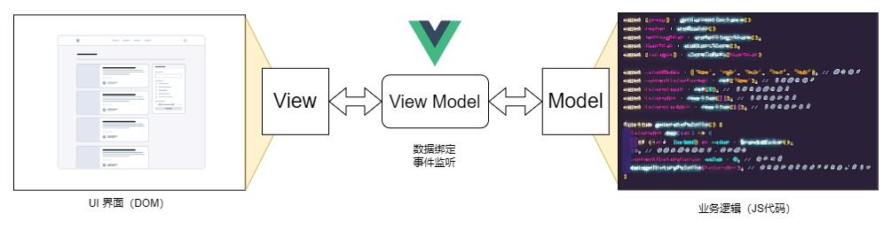
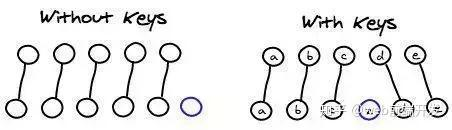
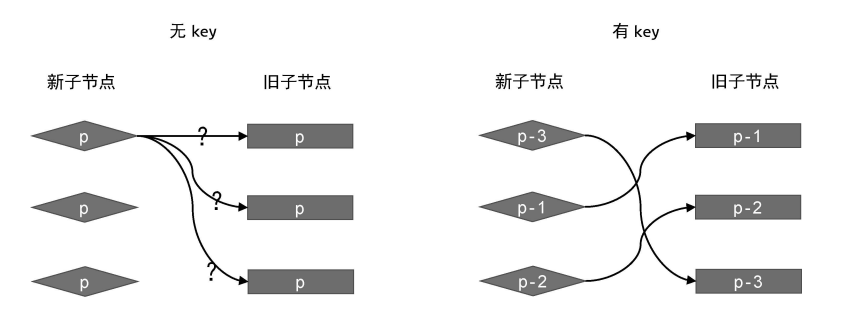

# Vue原理篇

## MVVM



| 主要元素     | 代表                                       |
| ------------ | ------------------------------------------ |
| Model 层     | 数据模型，定义数据修改和操作的业务逻辑     |
| View 层      | UI 组件，它负责将数据模型转化成UI 展现出来 |
| ViewModel 层 | 同步View 和 Model的对象                    |

在MVVM架构下，View 和 Model 之间并没有直接的联系

ViewModel 通过双向数据绑定把 View 层和 Model 层连接了起来

Model 和 ViewModel 之间的交互是双向的， 因此View 数据的变化会同步到Model中，而Model 数据的变化也会立即反应到View 上。

## 双向绑定

Vue2 和 Vue3 在数据双向绑定的实现原理上存在一些区别。

**Vue2 的实现原理:**

Vue2 主要使用了 Object.defineProperty 这个方法来实现数据双向绑定。具体步骤如下:

1. 通过 Object.defineProperty 为数据对象的属性添加 getter 和 setter。
2. 每个组件实例都对应一个 Watcher 实例,它会在组件渲染的过程中把相关数据的订阅信息记录为依赖。
3. 当数据变化时,触发 setter 逻辑,会通知目标更新。

Vue2 使用的是遍历数据对象的所有属性,通过 Object.defineProperty 来实现对数据的监听。但是这种方式有以下缺点:

1. 无法监听新增/删除属性(需要使用 Vue.set/Vue.delete)。
2. 无法监听数组的变化(需要重写数组方法)。
3. 需要遍历对象的每个属性,如果属性很多,会影响性能。

**Vue3 的实现原理:**

Vue3 改用 ES6 的 Proxy 对象来实现数据双向绑定,优化了性能。具体步骤如下:

1. Vue3 内部通过 new Proxy(data, handlers) 方式监听数据对象。
2. 当数据发生变化时,会执行 handlers 中的代理函数。
3. 组件会重新渲染,更新视图。

相比 Vue2,Vue3 使用 Proxy 的优势如下:

1. 可以监听数组、对象的变化,包括新增、删除等操作,无需特殊处理。
2. 可以监听动态添加的属性。
3. 只会代理对象本身的属性,而不会代理对象继承的属性,性能更好。
4. 仅在 getter 中去收集依赖,而不需要像 Vue2 那样显式遍历所有属性。

## key的作用

在 Vue.js 中，`key` 是一个特殊的属性，通常与 `v-for` 一起使用，其作用下：

### 在v-for的作用：

1. **唯一标识**：`key` 提供了每个节点的唯一标识，使 Vue 能够追踪每个节点的身份，从而重用和重新排序现有元素。

   你可以将 `key` 理解为每个渲染元素的唯一 ID。

   

2. **DOM 元素重用, 避免渲染问题**：当数据发生变化时，Vue 将尝试尽可能高效地更新渲染的元素。

   通过使用 `key`，Vue 可以侦测到节点列表的具体更改，从而重用和重新排列现有元素，而不是删除所有 DOM 元素后重新创建。

   这可以极大地提高渲染性能，特别是在大量数据和高频更新时。

   此知识点是和虚拟节点挂钩的，还烦请[参照和虚拟节点相关的知识]()。

   

> 在不使用 `key` 的情况下，如果数据项的顺序被改变，Vue 可能不会正确渲染新的顺序，因为它尝试尽可能高效地复用现有元素。
>
> 使用 `key` 可以帮助 Vue 确切知道哪些元素已经改变、添加或删除，从而准确地更新 UI。

### 强制重新渲染组件：

除了在 `v-for` 中使用外，`key` 还被用于以下场景：

1. **动态组件**：当使用 `<component :is="someComponent">` 动态切换不同组件时，使用 `key` 可以使 Vue 删除旧组件的实例并创建新组件的新实例，而不是尝试复用旧实例。这确保了组件生命周期钩子的正确触发和数据状态的重置。

   ```vue
   <component :is="currentView" :key="currentViewKey"></component>
   ```

   在这个例子中，`currentViewKey` 改变时，Vue 会销毁旧的组件实例并重新创建一个新的实例。

2. **在同一个位置渲染不同内容**：有时候你可能需要在相同的位置根据不同的状态渲染不同的内容。使用 `key` 可以帮助 Vue 知道何时应该重新创建内容而不是复用旧内容。

   ```vue
   <template v-if="loginType === 'username'">
     <label>Username</label>
     <input placeholder="Enter your username" key="username-input">
   </template>
   <template v-else>
     <label>Email</label>
     <input placeholder="Enter your email address" key="email-input">
   </template>
   ```

   在这个例子中，不同的 `key` 值确保当 `loginType` 改变时，Vue 会创建正确类型的 `<input>` 元素，而不是错误地复用和保留前一个状态的 DOM 元素。

> 在 Vue 中，`key` 属性是管理动态列表和动态组件的重要工具，它确保了应用的性能优化和正确的 UI 表现。
>
> 正确使用 `key` 可以避免许多常见的渲染问题，特别是在涉及到复杂动态变化的 UI 中。

## Vue2原理

### 响应式

```js
let obj = {}
Object.defineProperty(obj,"a",{
    configurable:true,
    get:function(){
        return obj.a
    },
    set:function(val){
        obj.a = val
    }
})
```

### 响应式局限性

> Vue2无法直接响应下面两种情况
>
> 1. 对象：对对象直接添加，更新，删除属性
>
>    ```js
>    obj.newProp = 1
>    obj.existedProp = "Hello there"
>    delete obj.oldProp
>    ```
>
> 2. 数组：直接通过下标修改数组
>
>    ```js
>    arr[3] = 3
>    ```

## Vue3原理

### Proxy

```js
//数据源
const data = {
  text: 'Hi Vue3!'
}
```

对于Proxy部分就写如下内容

```js
var obj = new Proxy(data, {
  get: function (target, key, receiver) {
    console.log(`getting ${key}!`);
    return Reflect.get(target, key, receiver);
  },
  set: function (target, key, value, receiver) {
    console.log(`setting ${key}!`);
    return Reflect.set(target, key, value, receiver);
  }
});
```

调用时如下

```js
//要点：要过obj这道门关才奏效！下面设值操作也是如此。
obj.count = 1; // setting count!
++obj.count; // getting count! setting count! 2
```

## 虚拟节点

虚拟节点通常是由虚拟 DOM 技术使用的概念，指的是用 JavaScript 对象来表示真实 DOM 元素的结构和属性。

这些 JavaScript 对象构成了虚拟 DOM 树，它提供了一个高效的方式来描述 DOM 结构。虚拟节点是这棵树中的每一个节点。

### 优势

相比于直接操作实际的 DOM，使用虚拟节点和虚拟 DOM 进行渲染具有以下优势：

1. 性能提升：
   - **批量更新与最小化 DOM 操作**：直接操作 DOM 是非常昂贵的操作，因为它涉及到浏览器的多个计算和重绘过程。
   - 虚拟 DOM 允许我们在内存中进行所有的计算，通过比较新旧虚拟 DOM 树的差异（diffing 算法），只更新实际改变了的 DOM 元素。
   - 这种批量更新和最小化的 DOM 操作大大提高了应用的性能。
2. 跨平台：
   - **可在非浏览器环境使用**：由于虚拟 DOM 是普通的 JavaScript 对象，它可以在服务器、移动端等非浏览器环境下使用。
   - 这为服务器端渲染（SSR）、静态站点生成（SSG）以及移动应用（如使用 React Native）提供了可能。
3. 简化编程模型：
   - **声明式 UI**：开发者只需关心数据状态和如何描述 UI 应该如何显示，而不需要关心具体的实现细节（如何操作 DOM）。
   - 这使得代码更容易理解和维护。
   - **组件化结构**：虚拟 DOM 自然地支持组件化开发，每个组件可以维护自己的状态和虚拟 DOM，这样就更容易构建大型应用。
4. 错误处理和调试：
   - **更好的错误处理和调试**：操作纯 JavaScript 对象比操作真实 DOM 提供了更好的错误检测和调试工具。
   - 开发者可以更容易地追踪变化和状态。

## Diff算法

虚拟 DOM 的 diffing 算法是一种高效的算法，用于比较两棵虚拟 DOM 树（一棵代表当前的界面状态，另一棵代表新的界面状态）并找出它们之间的差异。

这些差异随后用于最小化实际 DOM 的更新次数，从而提高了应用的性能和用户体验。

通过智能地处理节点的增删改查，这种方法能够在复杂的应用中提供稳定快速的界面更新。

1. 树的比较

虚拟 DOM 树的比较通常从根节点开始，逐层向下进行：

a. 节点类型的比较

- **不同类型的节点**：如果新旧节点的类型不同（例如，一个是 `<div>` 节点，另一个是 `<span>` 节点），则算法会直接替换旧节点及其所有子节点。
- **相同类型的节点**：如果节点类型相同，但属性不同（例如，类名或样式改变了），则只更新有差异的属性。

b. 列表子节点的特殊处理

对于子节点列表，处理起来更为复杂。一般采用以下策略：

- **键值（Key）的作用**：在处理列表时，每个节点最好有一个唯一的键值（key）。这样，算法可以通过键值快速比较哪些元素是新添加的，哪些被移除了，哪些只是移动了位置。
- **没有键值**：如果没有键值，算法将逐个比较旧列表和新列表的节点，这可能导致较高的性能成本。

2. 组件状态的比较

对于组件化的虚拟 DOM，如 React 或 Vue：

- **组件身份的比较**：如果组件类型相同，会比较其内部状态和属性（props）的变化，来决定是否需要更新。
- **组件类型不同**：如果新旧节点代表不同类型的组件，则旧组件将被卸载，新组件被创建和挂载。

3. 执行更新

一旦确定了所有必要的更改：

- **创建节点**：对于新出现的节点，创建新的 DOM 元素并插入到适当位置。
- **更新节点**：对于已存在但发生变化的节点，修改其相应的属性或子节点。
- **删除节点**：移除不再存在的节点。

> 为了优化性能，现代前端框架实现的 diffing 算法通常包含许多优化策略：
>
> 如批处理更新、异步更新（如 React 的 Concurrent Mode）、优先级处理等，以确保界面的流畅性和响应性。