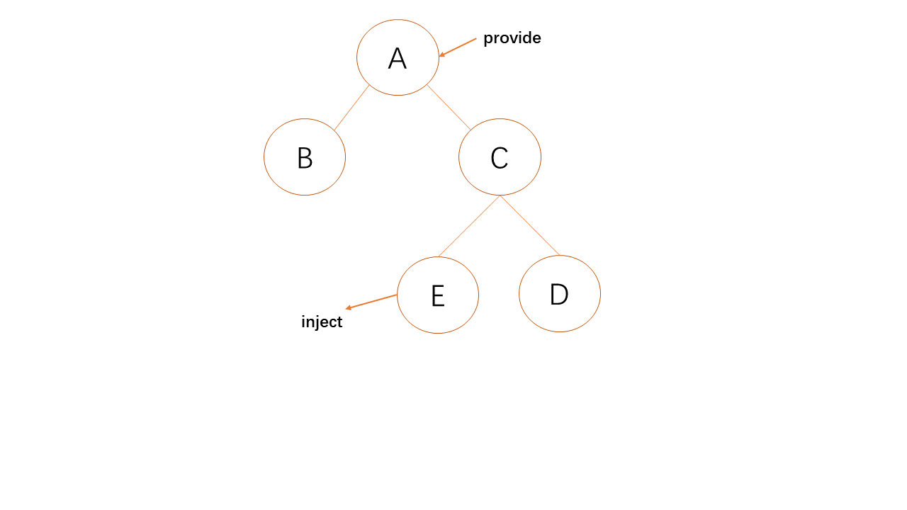
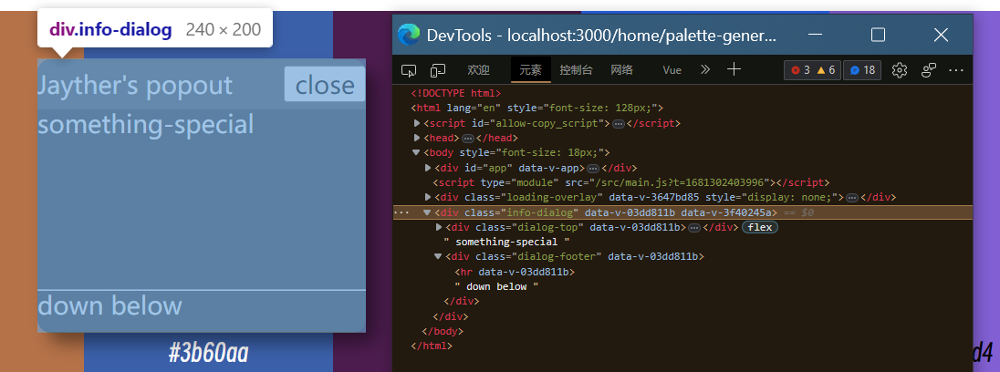
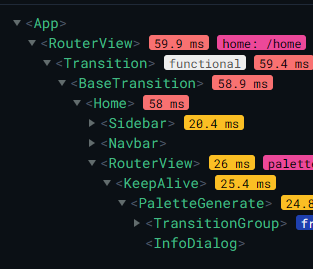
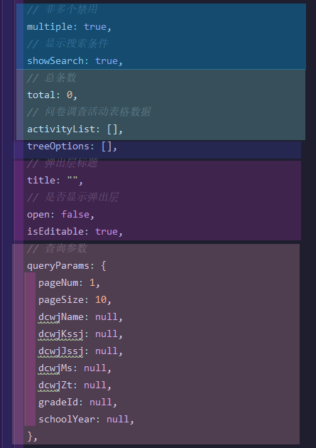
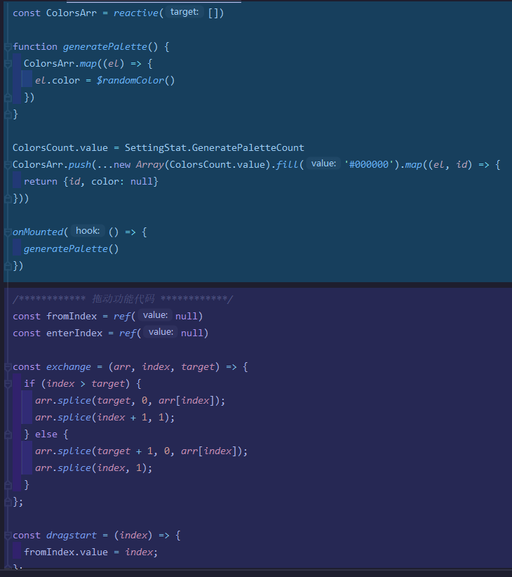
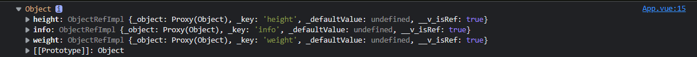
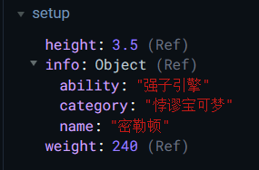
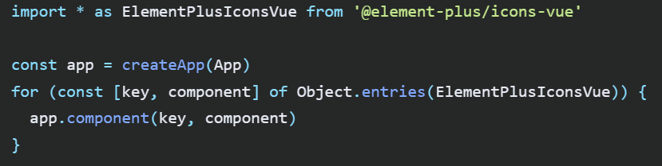

# Vue3笔记

---

## 新变化

> 1. 创建Vue实例要用`Vue.createApp()`方法
> 2. 挂载最好用后跟的`mount()`方法，`el`选项不要再搞了
> 3. 所有的data选项必须为函数
> 4. 可以用setup()方法处理主要逻辑

```js
const App = {
    data(){
        return{
            msg:'Hi Vue3!'
        }
    },
    //...
}
Vue.createApp(App).mount('#app')
```

又可以写成：

```js
import {ref} from 'vue';
Vue.createApp({
    setup(){
        const msg = ref("Ready to EMBRACE Vue3!")
        return {msg}
    },
    //...
}).mount('#app')
```

## setup执行的时机

在`beforeCreate()`之前执行一次，this是undefined。

> **setup的参数**
>
> props:值为对象，包含*组件外部传递过来，且组件内部声明接收*了的属性。
>
> context:上下文对象，包含下面三个参数
>
> 1. `attrs`:值为对象，包含*组件外部传递过来，但没有在`props`配置中声明*的属性，相当于`this.$attrs`。
> 2. `slots`:收到的插槽内容，相当于`this.$slots`。
> 3. `emit`:分发自定义事件的函数，相当于`this.$emit`。

```vue
<script>
    export default{
        props: ['foo'],
        setup(props,context){
            console.log(props.foo) // 组件属性
            
            console.log(context.attrs) // 组件剩余属性
            console.log(context.slot) // 组件插入内容
            context.emit('update:foo',props.foo++) // 组件发射事件
            
            return {}
        }
    }
</script>
```

## Vue3生命周期

>  在 Vue 3 中也可以使用 Vue 3外围的回调函数
>
>  如果在 Vue 3 中混合使用 Vue3 setup 和Vue3 外围 的回调函数时，我们会发现 Vue 3.x 的生命周期会优先于 Vue3 外围 的执行，比如说：`onMounted()` 先于 `mounted()` 执行。

| Vue3                  | Vue3 setup *(同级情况下优先)* | 释义                                                         |
| --------------------- | ----------------------------- | ------------------------------------------------------------ |
| `beforecreate()`      | `setup()`                     | 创建前                                                       |
| `created()`           | `setup()`                     | 创建后                                                       |
| `beforeMount()`       | `onBeforeMount()`             | 载入，挂载前                                                 |
| `mounted()`           | `onMounted()`                 | 载入，挂载后                                                 |
| `beforeUpdate()`      | `onBeforeUpdate()`            | 更新前                                                       |
| `updated()`           | `onUpdated()`                 | 更新后                                                       |
| **`beforeUnmount()`** | `onBeforeUnmount()`           | 卸载前                                                       |
| **`unmounted()`**     | `onUnmounted()`               | 卸载后                                                       |
| `activated()`         | `onActivated()`               | keep-alive加载后                                             |
| `deactivated()`       | `onDeactivated()`             | keep-alive卸载后                                             |
|                       | **`onRenderTracked()`**       | `debug` 钩子函数，用于状态跟踪，适用于跟踪所有已经发生变化的变量 |
|                       | **`onRenderTriggered()`**     | `debug` 钩子函数，用于状态触发，适用于只观察已经变化的变量，重新渲染的时候触发 |

>   **`onRenderTracked()`**和**`onRenderTriggered()`**这两个事件都带有一个**DebuggerEvent**，它使我们能够知道是什么导致了Vue实例中的重新渲染。

```vue
<script>
import {onRenderTracked,onRenderTriggered} from "vue"
export default{
    setup(){
        /* setup的内容最先执行，相当于组件创建的整个过程：beforecreate() + created()*/
        const p = ref(null) 
        
        onRenderTracked((event)=>{
            console.log("状态跟踪钩子函数")
            console.log(event);
        })
                        
        onRenderTriggered((event)=>{
            console.log("状态跟踪钩子函数")
            console.log(event);
        })             
   }
}
</script>
```

## 全局函数

> 没了Vue2的prototype添加全局变量法
>
> 在Vue3需要通过来自Vue.createApp()的变量的`.config.globalProperties`里面去创建全局属性和方法。
>
> 定义好就可以直接在组件的template使用了（template无需导入，直接使用方法）。

```js
import App from "./App.vue"
import { useDict } from '@/utils/dict';

export const app = Vue.createApp(App)
/**********全局方法挂载**********/
app.config.globalProperties.$useDict = useDict;

app.mount('#app')
```

> 在组件的`script`里要使用`getCurrentInstance()`来获取应用实例

```vue
<script setup>
import {getCurrentInstance} from "vue"
const { proxy } = getCurrentInstance()

console.log(proxy.$useDict)
</script>
```

## provide, inject

>  `provide()` ， `inject()` 方法常用于高阶组件。它们可以用于*嵌套较深的*组件之间的数据传递，并且这两个函数只能在 `setup()` 函数中使用。
>
>  数据传递只能自上而下，不可自下而上。
>
>  只能在组件初始化时进行



`Parent.vue`

```vue
<script setup>
import { provide } from 'vue';
import Child from './Child.vue';
    
provide('message', 'Hello from Parent');
</script>

<template> 
  <div>
    <p>Parent Component</p>
    <Child />
  </div>
</template>
```

`Child.vue`

```vue
<script setup>
import { inject } from 'vue';
import Grandchild from './Grandchild.vue';

const message = inject('message');
</script>

<template>
  <div>
    <p>Child Component</p>
    <Grandchild />
  </div>
</template>
```

`Grandchild.vue`

```vue
<script setup>
import { inject } from 'vue';
const message = inject('message');
</script>

<template>
  <div>
    <p>Grandchild Component</p>
    <p>{{ message }}</p>
  </div>
</template>
```

> `provide()`函数可以用于在父组件中提供数据或方法，然后在子组件中使用`inject()`函数来注入这些数据或方法。这种方式可以避免使用props来传递数据，使得组件之间的通信更加简单和灵活。
>
> `inject()`函数用于在子组件中注入父组件提供的数据或方法。它接收一个参数作为注入的key，该key对应于`provide()`函数中提供的key。
>
> `provide()`和`inject()`函数通常用于跨组件的通信，例如在全局状态管理或插件中使用。由于这种方式没有显式的props传递，因此可以避免prop drilling和组件层级过深的问题。

## 自定义Hooks

> 更多Hooks官网：https://vueuse.org/
>
> 和Vue2的混入功能一样，用来抽离公共代码的，建议用`use<Hooks名>`的命名格式

`使用`

```vue
<script>
import useColorsControl from "./hooks/ColorsCenter.js"
export default{
    setup(){
		const color1 = useColorsControl("#CACAFF");
        color1.changeToRgb()
   }
}
</script>
```

`ColorsCenter.js`

```js
// 自定义hook案例
import {ref} from "vue"
// 需要返回一个函数
export default function (color) {
  const value = ref(color)
  const changeToRgb = () => {
      // ...
  }
  // ...
  return {value, changeToRgb, ...}
}
```

## 插件

> 不同点：

```js
import TopMessageBox from './TopMessageBox.vue'
import { createVNode,render } from 'vue'

export default{
  install(app){
    const VNode = createVNode(TopMessageBox)
    render(VNode,document.body)
    console.log(app,VNode,VNode.component);
    // app.config.globalProperties
  }
}
```

## 组件代码式渲染

> 对于组件来说，组件内容除了模板渲染之外，还有提供函数式渲染的功能，
>
> 其在组件的render选项，提供一个固定的渲染函数参数。

在Vue2中该写法如下：

```js
const MyComponent= {
    props: {
        Data: {
            type: Object,
            default() {
                return {}
            }
        }
    },
    render(h) {
        return h("div","I'm the component.")
    }
}
```

在Vue3中该写法如下：

```vue
<script setup>
import { h } from 'vue'

const vnode = h(
  'div', // type
  { id: 'foo', class: 'bar' }, // props
  [  /* children */  ]
)
</script>
```

## 渲染函数

> `h()` 函数的使用方式非常的灵活，会返回Vnode对象，其他操作方式和JSX大同小异。

```js
// 除了类型必填以外，其他的参数都是可选的
h('div')
h('div', { id: 'foo' })

// attribute 和 property 都能在 prop 中书写
// Vue 会自动将它们分配到正确的位置
h('div', { class: 'bar', innerHTML: 'goodbye vue2' })

// props modifiers such as .prop and .attr can be added
// with '.' and `^' prefixes respectively
h('div', { '.name': 'some-name', '^width': '100' })

// 类与样式可以像在模板中一样
// 用数组或对象的形式书写
h('div', { class: [foo, { bar }], style: { color: 'red' } })

// 事件监听器应以 onXxx 的形式书写
h('div', { onClick: () => {} })

// children 可以是一个字符串
h('div', { id: 'foo' }, 'hello')

// 没有 props 时可以省略不写
h('div', 'hello')
// 孩子使用渲染函数h()时要裹在数组里面
h('div', [h('span', 'hello')])

// children 数组可以同时包含 vnodes 与字符串
h('div', ['hello', h('span', 'hello')])
```

有了JS支持的渲染函数的力量，我们可以轻而易举地实现像==树形分级列表==等模板难做到的功能

```js
const SentenceTreeListNode = {
    props: {
        TreeData: {
            type: Object,
        }
    },
    render(h) {
        function renderTreeData(treeData) {
            if (Array.isArray(treeData.content)) 
                return h('details', [
                    h('summary', treeData.title),
                    treeData.content.map(el => renderTreeData(el))
                ])
            else //终止递归
                return h('div', {
                    class: {"sentences-list-item": true},
                }, treeData.content)
        }
        return renderTreeData(this.TreeData)
    }
}
```

### 组件渲染

## 作用域插槽

## 新功能

## Teleport组件

| 对话框效果                                                   | 组件层级                                                     |
| ------------------------------------------------------------ | ------------------------------------------------------------ |
|  |  |

> `<Teleport>` 是一个内置组件，可以将其内容搞到另一个位置。
>
> 可以传送的地方有： CSS 选择器字符串选定元素， DOM 元素对象
>
> 写在里面的内容的样式不会因为被传送而失效。

```vue
<teleport to="#some-id" />
<teleport to=".some-class" />
<teleport to="[data-teleport]" />
```

比如对话框组件：

```vue
<button @click="open = true">Open Modal</button>

<Teleport to="body">
  <div v-if="open" class="modal">
    <p>Hello from the modal!</p>
    <button @click="open = false">Close</button>
  </div>
</Teleport>
```

## 异步组件和Suspense组件

> `defineAsyncComponent`：引入异步组件，一般父组件要等待子组件渲染完成后才会展示，使用异步引入子组件则父组件不再等待

```vue
const index = defineAsyncComponent(() => import('@/views/index.vue'));
```

> `suspense`：使异步引入加载的组件未渲染完成前，使用此标签*可自定义填补空缺*，可用于提示加载中或展示骨架屏，组件加载完成后即刻消失
>
> PS：当使用了异步加载组件后，`setup`支持`async`
>
> 注：切勿在路由组件中使用异步引入

```vue
<script>
import { defineAsyncComponent } from 'vue';
const index = defineAsyncComponent(() => import('@/views/index.vue'));
export default {
  name: 'App',
  components: { index },
  setup() {
    return {};
  },
};
</script>

<template>
  <div class="App">
    <suspense>
      <template #default>
        <index />
      </template>
      <!-- 当组件还未加载完成，将会使用下面插槽内的样式 -->
      <template #fallback>
        <p>加载中...</p>
      </template>
    </suspense>
  </div>
</template>
```

## 组合式API

| setup之前：代码区域混杂，容易迷失其中                    | setup之后：代码区域泾渭分明，逻辑解耦清晰易懂                |
| -------------------------------------------------------- | ------------------------------------------------------------ |
|  |  |

> `script setup`作为另一种组件的单文件组件写法，它完全简化了程序设计
>
> 新写法的script旁要写setup；用ref作为绑定变量的功能函数
>
> 相对于在vue选项中写setup选项，在script setup里面写的变量不用返回出去
>
> ---
>
> 注意：
>
> 在此将提供包括JS编码和TS编码的两种编码方案。
>
> TS编码方案会用**==TS写法==**特定标记出来。

```vue
<script setup>
import {ref} from 'vue' // 导入
// 绑定变量，不绑定不会改变值
const msg = ref("你干嘛~~哈哈~~哎呦……你好烦~")
// 声明方法
function greeting(){
    console.log("你好世界！")
}
</script>

<template> <!--支持多重根元素-->
  <p>蔡徐坤：{{msg}} </p>
  <button @click="greeting"></button>
</template>
```

## 单文件css新特性

### v-bind()

> 通过在css布置该函数可以使用在Vue里规定的数据变量
>
> 详情请参照：https://blog.csdn.net/weixin_52235488/article/details/126290046

```scss
/* 修改已完成的进度条的颜色 */
progress::-webkit-progress-value {
    background-color: v-bind(barColor); //单一变量的布置：直接变量名
    border-radius: 5px;
    transition: all .5s;
}

/* 修改进度条的文本颜色 */
progress::-webkit-progress-bar {
    color: #fff;
    background-color: v-bind('props.backColor');  //属性变量的布置：要引号括起来
    text-shadow: 0 1px 0 #000;
}
```

### slotted()

> 在有插槽且限制样式仅限于组件的情况下，想定制插槽插的内容的样式，就直接在组件里直接写样式了，可是却没生效！该怎么办呢？
>
> 此时Vue3提供了`:slotted()`伪类来在组件里定制插槽内容的样式。

```vue
<template>
  <div>
    <slot name="header"></slot>
    <div class="content">
      <slot></slot>
    </div>
    <slot name="footer"></slot>
  </div>
</template>

<style scoped>
::slotted(h1) {
  color: red;
}

.content {
  background-color: lightgray;
  padding: 10px;
}
</style>
```

## 常用指令

> 和往常一样使用，v-for和v-if指令可以共存但会报错（v-if优先级比v-for高，渲染性能更好的同时获取不了v-for的变量）可以这样解决：
>
> ```vue
> <template v-for="todo in todos">
> <li v-if="!todo.isComplete">
>  {{ todo.name }}
> </li>
> </template>
> ```

```vue
<script setup>
    import {ref} from "vue";
    //蓝桥杯vue教例
    const num = ref(12)
    const ok = ref(true)
    const name = ref("实验楼")
    const colNum = ref("24")
</script>

<template>
<!-- 运算符 -->
<p>num + 24 = {{num + 24}}</p>
<!-- 三元表达式 -->
<p>Are you ok? {{ok ? 'I am ok !':'no'}}</p>
<!-- 对象方法直接调用 -->
<p>名字倒过来写：{{name.split('').reverse().join('')}}</p>
<!-- 属性值运算操作 -->
<p v-bind:class="'col'+colNum">syl</p>
</template>
```

## ref相关

> 一般定义的数据不具有响应性：`const lsModeList = ['登录', '注册']`
>
> `ref()`作为响应函数，套在对应变量值上就会有响应性。加`ref()`后要*读写其值*需要访问变量的==value属性==。
>
> `ref()`主管基本数据类型的响应式，对于引用类型的数据类型会借助`reactive()`来实现响应式

```vue
<script setup>
import {ref} from 'vue'

let jayther= ref("Hi there, I'm Jayther.");

function changeName() {
  //错误写法：jayther = 'abc'
  //此写法不会动态改动数据值
  jayther.value = 'abc'
  console.log(jayther);
}
</script>

<template>
  
  <button @click="changeName">Vaporeon</button>
  <p>{{jayther}}</p>
</template>
```

> **==TS写法==**
>
> 一般类型可以自行判断。在TS编码当中有需要可以引入`Ref`作为Typescript的接口类型，直接作为变量的类型。
>
> 格式为：`变量名:Ref<变量类型> = ref(变量值)`

```vue
<script setup lang="ts">
import {ref,Ref} from 'vue'

let jayther:Ref<string|undefined> = ref("Hi there, I'm Jayther.");

function changeName() {
  jayther.value = 'abc'
  console.log(jayther);
}
</script>
```

### shallowRef

> `shallowRef()`对于对象来说只处理==数据本身==的响应式，不会处理==其内容==的响应式
>
> 一般的值还好（和`ref()`无异）。如果向它传对象，则其*属性的变动*是不会侦测到的。

```vue
<script setup lang="ts">
import {ref,Ref,shallowRef} from 'vue'
let jayther= shallowRef({a:1,b:2});

function changeName() {
  //下面语句不会响应
  jayther.value.c=10
  console.log(jayther);
}

</script>
```

将上述函数改成下面就可以响应了

```js
function changeName() {
  jayther.value = {c:3,d:4}
  //jayther.value.c=10
  console.log(jayther);
}
```

### triggerRef

> `triggerRef()`强制触发依赖于一个[浅层 ref](https://cn.vuejs.org/api/reactivity-advanced.html#shallowref) 的副作用，这通常在对浅引用的内部值进行深度变更后使用。

```vue
<script setup>
const shallow = shallowRef({
  greet: 'Hello, world'
})

// 触发该副作用第一次应该会打印 "Hello, world"
watchEffect(() => {
  console.log(shallow.value.greet)
})

// 这次变更不应触发副作用，因为这个 ref 是浅层的
shallow.value.greet = 'Hello, universe'

// 打印 "Hello, universe"
triggerRef(shallow)
</script>
```

### customRef

> 可以通过此接口自定义一个ref，即响应式数据处理方式逻辑。
>
> 参数是个来处理逻辑的函数。需要返回包含get和set的函数的对象
>
> 该参数函数还有track和trigger两个内供参数，用来帮助实现响应式的功能
>
> 下面则是实现最简单的自定义响应式的案例

```js
function myRef(value){
    return customRef((track,trigger)=>{
        return{
            get(){
                console.log(`有人从myRef这个容器中读取数据了，我把${value}给他了`)
                track()//通知Vue追踪valuel的变化（提前和get商量一下，让他认为这个value是有用的）
                return value
            },
            set(newValue){
                console.log(`有人把myRef:这个容器中数据改为了：${newValue}`)
                value = newvalue
                trigger()//通知Vue去重新解析模板
            }}
        }
    }
}
```

> 基于此可以实现一个像延迟响应式的自定义响应式。

```vue
<script setup>
import {customRef} from Vue;
function delayedRef(value,delay){
    let timeout;
    return customRef((track,trigger)=>{
        return{
            get(){
                console.log(`有人从myRef这个容器中读取数据了，我把${value}给他了`)
                track()//通知Vue追踪valuel的变化（提前和get商量一下，让他认为这个value是有用的）
                return value
            },
            set(newValue){
                console.log(`有人把myRef:这个容器中数据改为了：${newValue}`)
                clearTimeout(timeout)
                timeout = setTimeout(()=>{
                    value = newvalue
                    trigger()//通知Vue去重新解析模板
                },delay)
            }}
      }}
}

const theVal = delayedRef("My Ref is working!", 500)
</script>
```

## reactive相关

> `Reactive()`是针对*引用类型*等引用类型元素的响应式方案，可用于对象，数组，Set，Map等等。

```vue
<script setup>
import {reactive} from 'vue'
let Wormqueen = reactive({
    info:{
        name:'虫群女王',
        faction:'厄普西隆军',
        role:["反装甲","突袭","攻城"],
        price:'$2000',
    },
    hitPoints:350,
    speed:4,
    sightRadius:6
});
</script>
```

> 针对数组，数组直接赋值：`arr = [6,1,7]`不能引起响应式
>
> 除了链式调用外，可以像往常一样使用数组的方法。

```vue
<script setup>
import {reactive} from 'vue'

const ColorsArr = reactive([]);
ColorsArr.push(...Array.from({length: ColorsCount.value}, (_, id) => ({id, color: null})));
</script>
```

### toRef

> 用于将不是响应式的数据转成响应式的，常用于取对象的某个属性另起一个响应式的变量
>
> 关键是`toRef`的内容修改了是*会影响到原来的对象*的，别的操作则不会

```vue
<script setup>
import {reactive,toRef,isRef} from 'vue'
let Koraidon = reactive({
    info:{
        name:'故勒顿',
        category:'悖谬宝可梦',
        ability:'绯红脉动'
    },
    height:2.5,
    weight:303.3,
});
//非响应式数据    
let notReactiveData = koraidon.info.name;
//响应式数据
let reactiveData = toRef(koraidon,"name");

function DetectRef(x) {
  console.log(isRef(x));
}

DetectRef(notReactiveData);//false
DetectRef(reactiveData);//true
</script>
```

### toRefs

> `toRefs`可以处理对象的所有属性的`toRef`转换，结果是返回一个包含ref了所有属性的一个对象
>
> 如果不是在script setup里面处理则要在返回值对象中用`...`解开来

| 显示的toRef结果                                              | toRef解包后的结果                                            |
| ------------------------------------------------------------ | ------------------------------------------------------------ |
|  |  |

```vue
<script>
import {reactive,toRefs} from 'vue'
export default{
    setup(){
        let Miraidon = reactive({
            info:{
                name:'密勒顿',
                category:'悖谬宝可梦',
                ability:'强子引擎'
            },
            height:3.5,
            weight:240.0,
        });
        //响应式数据
        return {
            ...toRefs(Miraidon)
        }
    }
}
</script>
```

### readonly

> 声明为只读对象，修改内容会报错

### shallowReactive

> `shallowReactive()`函数与`reactive()`函数类似
>
> 但它只将对象的顶级属性转换为响应式，而不是递归将嵌套属性转换为响应式。
>
> 这可以提高性能并减少不必要的响应式更新。

```vue
<script setup>
import { shallowReactive } from 'vue';
const user = shallowReactive({
  name: 'Morty',
  age: 14
});

const incrementAge = () => {
  user.age++;
};
</script>
<template>
  <div>
    <p>{{ user.name }}</p><p>{{ user.age }}</p>
    <button @click="incrementAge">Increment Age</button>
  </div>
</template>
```

## is相关

### isRef, isReactive

> `isRef()`：数据是否有响应性是可以用`isRef()`函数判断的
>
> `isReactive()`：要判断值是否为 `reactive()` 创建出来的对象，我们可以使用 `isReative()` 函数。
>
> 参数直接填变量名

```vue
<script setup>
import {ref,isRef} from 'vue'
//响应式数据
let jayther = ref("Hi there, I'm Jayther.");
//非响应式数据    
let mayor = "Hi there, Mayor Goodway here."

function DetectRef(x) {
  console.log(isRef(x));
}

DetectRef(jayther); // true
DetectRef(mayor);   // false
</script>
```

### isReadonly, isProxy

> `isReadonly()`：数据是否是*只读代理*是可以用`isRef()`函数判断的
>
> `isProxy()`：要判断是否为 `reactive()` 或者`readonly()`创建出来的代理，我们可以使用 `isProxy()` 函数。

## toRaw

> 这个 API 可以使一个 proxy 只读对象或者 `reactive` 对象还原为普通对象，它可用于临时读取，而不会引起代理访问/跟踪开销或写入而不会触发更改。
>
> 官网也贴心的给出了提醒：不建议持有对原始对象的持久性引用，需要我们谨慎使用这个 API。

```js
const foo = {};
// 创建一个响应式对象
const reactiveFoo = reactive(foo);

console.log(toRaw(reactiveFoo) === foo); // true
```

## markRaw

> `markRaw()` 方法标记一个对象，使其永远不会被转换为代理（Proxy），而是返回对象本身。

```js
const msg = markRaw({
    value: 'markraw',
});
// 作为参照
const op = reactive({
    value: 'reactive',
});

const setmsg = () => {
    console.log('markRaw ' + isReactive(reactive(msg))); // false
    console.log('reactive ' + isReactive(op)); // true
    msg.value = '';
    console.log(msg); // 一个普通对象
    console.log(op); // 一个经过 Proxy 加工的响应式对象
};
```

**计算属性**

## computed

> 可以通过引入`computed`函数来实现计算属性。
>
> 和ref一样，想要在JS取其值，需要以`<computed变量>.value`方式使用。

```vue
<script setup>
import {computed, ref} from "vue";
const present = computed(()=>Date.now())
</script>

<template>
  <main>
    <!-- 计算属性 -->
    <p>现在的时间戳是：{{present}}</p>
  </main>
</template>
```

> 对于计算属性的高级使用 setter 和 getter，通过计算属性来改变依赖数据的值时不能直接赋值，而是也要赋值到computed的==value属性==上。

```vue
<script setup>
import {computed, ref} from "vue";
//变量
const firstName = ref("王")
const lastName = ref("花花")
//按钮响应函数
function changeName(){
  fullName.value = "李花花";
}
//计算属性
const fullName = computed({
  get: () => firstName.value + lastName.value,
  set: (newName) => {
    firstName.value = newName.slice(0,1)
    lastName.value = newName.slice(1)
  }
})
</script>

<template>
  <main>
    <!-- 计算属性 -->
    <p>firstName:{{firstName}}</p>
    <p>lastName:{{lastName}}</p>
    <p>全名是:{{fullName}}</p>
    <button @click="changeName">改姓</button>
  </main>
</template>
```

**侦测属性**

## watch

> 我们需要监听数据的变化，Vue 提供了一种更通用的方式来观察和响应 Vue 实例上的数据变动，侦听属性。在实例 `watch` 选项中确定监听项。相当于执行副作用。
>
> *计算属性和侦听属性两者在很多场景都是共同，都可以实现同样的需求。*？

```vue
<script setup>
import {ref, watch} from "vue";
//变量
const msg = ref('hello')
//按钮响应函数
function handleClick(val) {
  msg.value = val;
}
// 侦听msg变化
watch(msg,(val,oldVal)=>{
  alert("新值" + val + "----" + "旧值" + oldVal);
})
</script>

<template>
  <main>
    <!-- 侦听属性 -->
    <p>{{msg}}</p>
    <button @click="handleClick('hello syl')">改变msg</button>
  </main>
</template>
```

> 对象的属性不可直接监视，需要提供个返回函数，监听props自定义属性也是一样

```vue
<script setup>
import {reactive, watch} from "vue";
//变量
const obj = reactive({name:'Rick',age:70})
//按钮响应函数
function handleClick(val) {
  obj.name = val;
}
// 侦听obj变化
watch(() => obj.item, (val, oldValue) => {
  alert("新值" + val + "----" + "旧值" + oldVal);//操作
})
</script>
```

## watchEffect

> `watchEffect()`函数的作用是创建一个自动运行的副作用函数，该函数会自动侦听其内部引用的响应式数据的变化，并在这些数据发生变化时自动运行。这使得我们可以轻松地创建响应式的副作用函数，而无需手动定义依赖项列表。
>
> `watchEffect()`函数通常用于处理响应式数据的副作用，例如更新UI、发送网络请求等。由于该函数不需要显式地指定依赖项列表，因此它比`watch()`和`computed()`函数更灵活，但也更难以优化。

```vue
<script setup>
import { ref, watchEffect } from 'vue';

const firstName = ref('Beth');
const lastName = ref('Sanchez');
const fullName = ref('Jerry Smith');
const greeting = ref('This is Jerry Smith'); // 展示的不会是这句！

watchEffect(() => { // 它管的可是里面的全部可响应变量
  fullName.value = `${firstName.value} ${lastName.value}`;
  greeting.value = `Hello, ${fullName.value}!`;
});
</script>
<template>
  <div>
    <p>{{ fullName }}</p> <!-- 由于watchEffect会先执行一次，它会先展示“Hello, Beth Sanchez!” -->
    <p>{{ greeting }}</p>
    <input v-model="firstName" placeholder="First Name" />
    <input v-model="lastName" placeholder="Last Name" />
  </div>
</template>
```

### 高级参数

> 除了基本用法外，`watchEffect` 还有一些高级参数可以使用：
>
> 1. `flush`：指定回调函数在何时执行。默认情况下，回调函数会在同步任务队列中被调用。
>
>    如果将 `flush` 设置为 `"pre"`，则回调函数会在 DOM 更新之前被调用，这可以避免由于异步更新导致的闪屏问题。
>
> 2. `onTrack`：每当响应式数据被追踪时调用的函数。
>
> 3. `onTrigger`：每当响应式数据被触发时调用的函数，例如当数据被修改时。

```js
import { reactive, watchEffect } from 'vue'

const state = reactive({
  count: 0
})

watchEffect(
  () => {
    console.log(state.count)
  },
  {
    flush: 'pre',
    onTrack: () => {
      console.log('state.count is being tracked')
    },
    onTrigger: () => {
      console.log('state.count is triggered')
    }
  }
)
```

### 停止监听

## 组件写法

### 注册和使用

> 全局组件需要在主js文件来进行注册。

```js
const app = createApp(App)
app.component("组件名",组件变量)

const comps = [A,B,C,D,E,F,G] //组件变量数组

for (const name of comps) { //批量全局注册组件
  app.component(name, name)
}
```



> 局部组件要引入则直接引入即可，无需注册

```vue
<script setup>
import WelcomeHeading from "./childComps/WelcomeHeading.vue"
import WelcomeOptions from "./childComps/WelcomeOptions.vue"
import WelcomeCreditBoard from "./childComps/WelcomeCreditBoard"
</script>
```

### 父子组件通信

#### 自定义属性

> 在setup内用`defineProps`宏声明组件自定义属性，无需导入。

`父组件`

```vue
<template>
    <title-component post-title="syl1"></title-component>
    <title-component post-title="syl2"></title-component>
    <title-component post-title="syl3"></title-component>
</template>
```

`title-component`

```vue
<script setup>
    defineProps(["postTitle"])
</script>
<template><p>{{postTitle}}</p></template>
```

> 可以给宏命名，并用该名使用它
>
> 里面也可以接对象，用法同理

```vue
<script setup>
    const props = defineProps({
        title:String,
        id:Number,
        content:String
    })
    function report(){
        console.log(props.postTitle)
    }
</script>
<template>
    <div>
        <p>id:{{id}}</p>
        <p>title:{{title}}</p>
        <p>content:{{content}}</p>
    </div>
</template>
```

> **==TS写法==**
>
> 两种方法不能同时使用。
>
> 1. 以原来的写法来标明类型：
> 2. 以泛型参数来定义 `props` 来标明类型，无法指定默认值，见下列代码：
>
> 第二个方法需要使用`withDefaults()`括起来来给`props`赋予默认值，赋予默认值的方法和原来方法一样（引用型要用函数返回）。
>
> 格式是： `withDefaults(defineProps<props类型>(), props默认值)`

```vue
<script setup lang="ts">
import { ref } from 'vue'

defineProps<{ msg: string }>()

const count = ref(0)
</script>
```

`带上默认值`

```vue
<script setup lang="ts">
//利用接口声明类型
interface Props {
    name: string;
    age: number;
}
const props = withDefaults(
    defineProps<Props>(),
    {
      name: "迪莫",
      age: 12,
    }
);
</script>
```

#### 自定义事件

> 在setup内用`defineEmits`宏声明组件自定义属性，无需导入。

`title-component`

```vue
<script setup>
    defineEmits(["send-msg"])
</script>
<template>
   <button v-on:click="$emit('send-msg','我是子组件请求与你通信')">Click me</button>
</template>
```

`父组件`

```vue
<script setup>
    function getMsg(msg) {
        alert(msg);// 弹出子组件传递的信息
    }
</script>
<template>
    <child-component v-on:send-msg="getMsg"></child-component>
</template>
```

> 同理也可以给宏命名，并用该名使用它，不过在template里面除了新命名还是可以用`$emit()`方法
>
> 使用方法就是：`新名字('自定义事件名'，参数)`

```vue
<script setup>
    const ourEmit = defineEmits(["send-msg"])
</script>
<template>
   <button v-on:click="ourEmit('send-msg','我是子组件请求与你通信')">Click me</button>
</template>
```

> **==TS写法==**
>
> `emit` 函数的类型标注也可以通过
>
> 1. 运行时声明
> 2. 类型声明，即下面代码演示的

```vue
<script setup lang="ts">
interface Emits {
    (e:'send-msg', msg: string): void
}
const emit= defineEmits<Emits>()
</script>
```

#### 双向绑定

> Vue3弃用了`.sync`修饰符，转为`v-model`作为双向值绑定的解决方案
>
> Vue3的组件v-model的等价写法如下
>
> ```vue
> <CustomInput
> :modelValue="searchText"
> @update:modelValue="newValue => searchText = newValue"
> />
> ```
>
> 值的改动都围绕`modelValue`进行的

```vue
<script setup>
    defineProps(['modelValue'])
    const emits = defineEmits(['update:modelValue'])

    function closeContent(){
        emits('update:containerShow',false)
    }
</script>

<template>  <!-- 这里不能直接v-model! -->
	<input :value="modelValue" @change="$emit('update:modelValue', $event.target.value)">
</template>
```

> 自定义属性值名若不是`modelValue`则要在组件引用将新属性名作为修饰词使用，格式为*kebab-case*

`父组件`

```vue
<script setup>
import {ref} from "vue";
const creditShow = ref(false)
</script>

<template>
    <child-component v-model:container-show="creditShow"></child-component>
</template>
```

`title-component`

```vue
<script setup>
    const props = defineProps({
        containerShow: {
            type: Boolean,
            default: false
        }
    })
          //注意：自定义事件名务必是update:自定义属性名
    const emits = defineEmits(['update:containerShow'])
</script>
<template>
	<button v-on:click="$emit('send-msg','我是子组件请求与你通信')">Click me</button>
</template>
```

#### provide和inject

> 1

```js

```

### ref获取元素

#### 获取DOM元素

> 为了通过组合式 API 获得该模板引用，我们需要声明一个与目标元素ref属性值同名的 ref。
>
> 格式：`const <目标元素的ref属性值> = ref(null);`使用原生DOM对象要用`<ref模板变量>.value`

```vue
<script setup>
import {ref} from 'vue'
/************ 模板引用 ************/
const p = ref(null);

onMounted(() => {
    // 初始渲染后，DOM 元素将被分配给 ref，而p.value 才是原生 DOM 对象
    console.log(p.value);
});
</script>

<template>
	<p ref="p">获取DOM</p>
</template>
```

#### 获取组件内容

> 可以直接获取选项式组件的内容，没法获取组合式组件的内容。
>
> 后者需要用defineExpose来规定要暴露的变量和函数。

### 获取透传数据

> 在`script setup`用来自官方库的自定义钩子`useAttrs()`和`useSlots()`以实现获取所有透传属性和插槽值。

```vue
<script setup>
import {useAttrs,useSlots} from 'vue'
/************ 模板引用 ************/
const attr = useAttrs();
const slotVal = useSlots()
</script>
```

# 项目转换 Vue3+TypeScript

将 Vue3 项目转换为 Vue3+TypeScript 的项目，需要遵循以下步骤：

1. 安装 TypeScript：
   在项目根目录下运行以下命令，安装 TypeScript 及相关依赖：

   ```
   npm install --save-dev typescript @types/node
   ```

2. 添加 tsconfig.json 文件：
   在项目根目录下创建一个名为 tsconfig.json 的文件，并添加以下配置：

   ```json
   {
     "compilerOptions": {
       "target": "esnext",
       "module": "esnext",
       "strict": true,
       "moduleResolution": "node",
       "esModuleInterop": true,
       "allowSyntheticDefaultImports": true,
       "sourceMap": true,
       "baseUrl": ".",
       "paths": {
         "@/*": ["src/*"]
       },
       "resolveJsonModule": true,
       "lib": ["esnext", "dom"]
     },
     "include": ["src/**/*.ts", "src/**/*.tsx", "src/**/*.vue"],
     "exclude": ["node_modules"]
   }
   ```

3. 修改 Vue 文件：
   将所有 Vue 文件的 script 标签中的 `lang="js"` 改为 `lang="ts"`，以支持 TypeScript。

4. 更新 main.js 为 main.ts：
   将项目入口文件 main.js 重命名为 main.ts，并在其中更新导入和创建 Vue 实例的语句，以使用 TypeScript 语法。

5. 安装 Vue3 的 TypeScript 插件：

   ```
   npm install --save-dev vue-tsc
   ```

   这将安装 Vue3 的 TypeScript 插件，用于检查和生成 Vue 项目的类型声明。

6. 添加 Vue 的类型声明文件：
   在 src 文件夹下创建一个名为 shims-vue.d.ts 的文件，添加以下内容：

   ```typescript
   declare module "*.vue" {
     import { defineComponent } from "vue";
     const component: ReturnType<typeof defineComponent>;
     export default component;
   }
   ```

7. 更新 package.json 文件：
   在 package.json 文件中，更新 "scripts" 部分以使用 TypeScript 和 vue-tsc：

   ```json
   "scripts": {
     "serve": "vue-cli-service serve",
     "build": "vue-cli-service build",
     "lint": "vue-cli-service lint",
     "type-check": "vue-tsc --noEmit"
   }
   ```

8. 使用 TypeScript 重构其他 JavaScript 代码：
   如果项目中还有其他 JavaScript 代码，可以根据需要逐个将其转换为 TypeScript（将 .js 文件重命名为 .ts 文件，并按需添加类型注解等）。

9. 检查类型：
   在项目根目录下运行以下命令，检查 TypeScript 类型：

   ```
   npm run type-check
   ```

完成以上步骤后，你的 Vue3 项目将成功转换为 Vue3+TypeScript 项目。接下来，你可以在项目中使用 TypeScript 语法和类型检查功能，提高代码质量和可维护性。