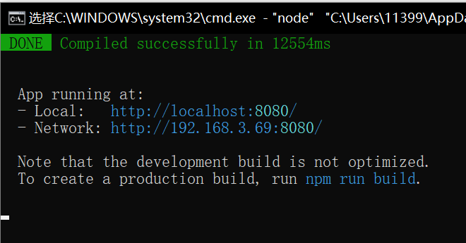
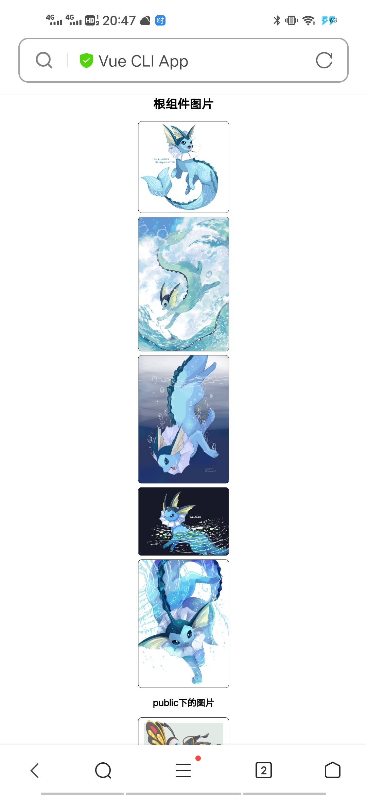

# Vue项目

## 目录划分

> 项目第一步是做好项目目录划分


## CSS相关

> 1. normalize.css，工具CSS文件，可以初始化项目样式
> 2. base.css，可以进行底层样式的设置，可参考下面代码

```css
@import url('./normalize.css');

*,
*::before,
*::after {
    margin: 0;
    padding: 0;
    box-sizing: border-box;
}


:root {
    --color-text: #666;
    --color-high-text: #ff5777;
}

body{
    user-select: none;
    font-family: serif;
}
```

## Vue CLI

> 安装Vue：`npm i vue@2`
>
> 安装CLI：`npm i @vue/cli`
>
> `npm i -g @vue/cli-service-global`
>
> 查看版本：`vue -V`【`vue --version`】
>
> UI控制：`vue ui`

vue项目主打包文件(入口文件)`main.js`内容

```js
import Vue from 'vue' //<-引入vue
import App from './App.vue'//<-根页面文件

Vue.config.productionTip = false

new Vue({
    render: h => h(App)//<-直接渲染
}).$mount('#app')//<-这的$mount和最初的el属性效果差不多
```

## 运行一个项目

> 1. 没安装依赖的先安装：`npm i`
>
> 2. 保证vue-cli-service安装好后
>
>    针对项目目录用：`npm run serve`
>
>    针对vue单文件或main.js文件使用`vue serve`
>
> 3. 终止项目运行：`ctrl+c`
>
> 4. 打包文件用 `npm run serve`/`vue serve`
>
>    ps:配置文件要配置好！

## 图片路径问题

> 1. 在根组件和子组件中，用*相对路径*导到图片
>
> 2. 写在对象中的图片路径引用要用**require**(在Nodejs当中)
>
>    在Vite里面只能用**import**
>
> 3. 完整的vue项目img src里面相对路径要前面跟`~`

```vue
<template>
  <section>
    <!--  assets下的图片  -->
    
    <!--  public下的图片  -->
    
    <!--  外部变量引入的路径  -->
      <!-- 导入时要require -->
    
  </section>
</template>

<script>
export default {
  //...
  data(){
    return {
      abc:"./assets/xxx.png",
      arr:[{
          img:require("./assets/xxx.png")
      }]
    }
  }
}
</script>
```

## Vue.prototype

> 写在里头，其他有vue实例的地方也可以用了。
>
> 主要可以写在main.js里面，或写在工具库里面

```js
///////解决vite里头不能用require的诟病/////////
import Vue from "vue";

/***** vite中用 new URL(相对路径, import.meta.url).href 的写法指定项目资源路径 *****/
Vue.prototype.require = function (path){
    return new URL(`../${path}`, import.meta.url).href
}
//使用：
export default {
    data() {
        return {
            stockImage: [ // 我们就直接可以以相对于src的位置来寻找文件了！爽歪歪！
                {imgSrc: this.require("./assets/img/stock/sample (1).gif")},
            ],
        }
    },
}
```

> **`import.meta`**
>
> ES11（ES2020）中新增，是一个给JavaScript模块暴露特定上下文的元数据属性的对象。
>
> ```js
> (path) => new URL(path, import.meta.url).href  // import.meta包含了此模块的信息，比如说该模块的URL
> ```
>

## 配置问题

> 用vue.config.js解决

```js
module.exports = {
  //相关配置
}
```

### 打包后当地访问

```js
module.exports = {
  publicPath:'./'
}
```

### 路径别名

> 和别名插件搭配使得书写路径更方便

```js
{//基础写法
    configureWebpack:{
        resolve:{
            alias:{
                'src':"@",
                'components':"@/components",
                'pages':"@/pages"
            }
        }
    }
    //Webpack4的链式写法,爽！
    chainWebpack:(config)=>{
        config.resolve.alias
            .set("@$",resolve("src"))
            .set("components",resolve("src/components"))
    }
}
```

## 手机访问项目

|  |  |
| ------------------------------------------------------------ | ------------------------------------------------------------ |

> 1. 连接在同一个网络(如wifi)下
>
> 2. 按照上图Network的地址在手机上浏览
>
>    附：查看地址要在cmd打ipconfig/all再找ipv4地址
