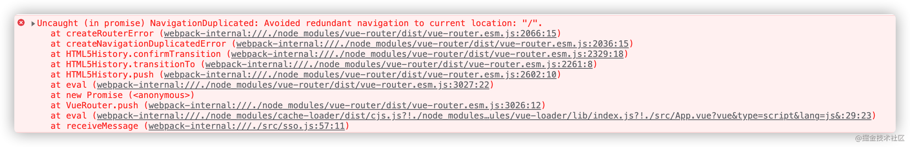

# Vue Router

## hash模式和history模式

**hash模式：** hash模式是开发中默认的模式，它的URL带着一个#，例如：[http://www.abc.com/#/vue](https://gw-c.nowcoder.com/api/sparta/jump/link?link=http://www.abc.com/#/vue)，它的hash值就是#/vue。

**特点**：hash值会出现在URL里面，但是不会出现在HTTP请求中，对后端完全没有影响。

所以改变hash值，不会重新加载页面。这种模式的浏览器支持度很好，低版本的IE浏览器也支持这种模式。

hash路由被称为是前端路由，已经成为SPA（单页面应用）的标配。

**原理：** hash模式的主要原理就是**onhashchange()事件**：

```javascript
window.onhashchange = function(event){
    console.log(event.oldURL, event.newURL);
    let hash = location.hash.slice(1);
}
```

> 使用onhashchange()事件的好处就是，*在页面的hash值发生变化时，无需向后端发起请求*，window就可以监听事件的改变，并按规则加载相应的代码。除此之外，hash值变化对应的URL都会被浏览器记录下来，这样浏览器就能实现页面的前进和后退。虽然是没有请求后端服务器，但是页面的hash值和对应的URL关联起来了。
>

**history模式：** history模式的URL中没有#

它使用的是传统的路由分发模式，即用户在输入一个URL时，服务器会接收这个请求，并解析这个URL，然后做出相应的逻辑处理。

**特点：** 当使用history模式时，URL就像这样：[http://abc.com/user/id](https://gw-c.nowcoder.com/api/sparta/jump/link?link=http://abc.com/user/id)。相比hash模式更加好看。但是，history模式需要后台配置支持。如果后台没有正确配置，访问时会返回404。

**API：** history api可以分为两大部分，切换历史状态和修改历史状态：

- **修改历史状态**：包括了 HTML5 History Interface 中新增的 pushState() 和 replaceState() 方法，这两个方法应用于浏览器的历史记录栈，提供了对历史记录进行修改的功能。只是当他们进行修改时，虽然修改了url，但浏览器不会立即向后端发送请求。如果要做到改变url但又不刷新页面的效果，就需要前端用上这两个API。
- **切换历史状态：** 包括forward()、back()、go()三个方法，对应浏览器的前进，后退，跳转操作。

> 虽然history模式丢弃了丑陋的#。但是，它也有自己的缺点，就是在*刷新页面的时候，如果没有相应的路由或资源，就会刷出404来*。
>

如果想要切换到history模式，就要进行以下配置（后端也要进行配置）：

```javascript
const router = new VueRouter({
  mode: 'history',
  routes: [...]
})
```

> **两种模式对比**
>
> 调用 history.pushState() 相比于直接修改 hash，存在以下优势:
>
> - pushState() 设置的新 URL 可以是与当前 URL 同源的任意 URL；而 hash 只可修改 # 后面的部分，因此只能设置与当前 URL 同文档的 URL；
> - pushState() 设置的新 URL 可以与当前 URL 一模一样，这样也会把记录添加到栈中；而 hash 设置的新值必须与原来不一样才会触发动作将记录添加到栈中；
> - pushState() 通过 stateObject 参数可以添加任意类型的数据到记录中；而 hash 只可添加短字符串；
> - pushState() 可额外设置 title 属性供后续使用。
> - hash模式下，仅hash符号之前的url会被包含在请求中，后端如果没有做到对路由的全覆盖，也不会返回404错误；history模式下，前端的url必须和实际向后端发起请求的url一致，如果没有对用的路由处理，将返回404错误。
>

hash模式和history模式都有各自的优势和缺陷，还是要根据实际情况选择性的使用。

## 使用

> `npm i vue-router`
>
> `import router from './router'`

### 相关配置

`router/index.js`

```js
import Vue from 'vue'
import VueRouter from 'vue-router'
import Home from '../views/Home.vue' //立即加载

Vue.use(VueRouter)  //通过调用Vue.use使用插件

const routes = [  //定义路由及其路径
  {
    path: '/',  //路径
    name: 'Home',  //命名组件名
    component: Home  //对应页面组件
  },
  {
    path: '/about',
    name: 'About',
    component: () => import(/* webpackChunkName: "about" */ '../views/About.vue')
      //懒加载；在webpackChunkName:魔法注释后填上组件名，会让打包后组件也有自己的名字
  }
]
//创建 router 实例，然后传相关配置
const router = new VueRouter({
  routes
})

export default router  //导出配置

```

在vue3当中是下面这样的：

`index.js`

```js
import { createRouter, createWebHistory } from 'vue-router'
import HomeView from '../views/HomeView.vue'

const router = createRouter({
  history: createWebHistory(import.meta.env.BASE_URL),
  routes: [
    {
      path: '/',
      name: 'home',
      component: HomeView
    },
    {
      path: '/about',
      name: 'about',
      component: () => import('../views/AboutView.vue')
    }
  ]
})

export default router
```

### 路由配置

路由配置对象书写格式如下：

```js
{
    path: '/welcome',  // 路径
    component: Welcome,  // 对应页面组件
    name: 'Welcome',  // 路由命名（可选）
    props: true, // 路由props传值属性（可选）
    meta: {
        title: "欢迎莅临色彩一站通！"
    }, // 接收路由对象的额外信息（可选）
    beforeEnter: (to, from, next) => {
        // ...
    } // 路由独享守卫
},
```

### vue-router配置

| 属性              | 释义                                                       | 备注                                |
| ----------------- | ---------------------------------------------------------- | ----------------------------------- |
| `mode`            | 路径的显示模式                                             | 可选项：`hash`;`history`;`abstract` |
| `linkActiveClass` | 点击链接活跃时的类名(router-link-exact-active)，是精准匹配 | 填想填的类名                        |
| `activeClass`     | 不严格匹配(router-link-active)                             | 填想填的类名                        |

### 重要路由组件

`app.vue`

```vue
<template>
  <div id="app">
    <div id="nav">
      <!--路由链接-->
      <router-link to="/">Home</router-link> |
      <router-link to="/about">About</router-link>
    </div>
      <!--路由视图-->
    <router-view/>
  </div>
</template>
```

> 1. `<router-link></router-link>`
>
>    路由链接；跳转到对应页面组件。可加属性如下：
>
>    | 属性      | 使用格式   | 释义                          |
>    | --------- | ---------- | ----------------------------- |
>    | `to`      | `to="/"`   | 跳转到哪个路径                |
>    | `tag`     | `tag="li"` | 以什么标签形式出现            |
>    | `replace` | `布尔属性` | 是不是替换url模式（不可刷新） |
>
> 2. `<router-view></router-view>`
>
>    路由视图，展示页面组件的窗口。

## 特殊路由

| 特殊路径  | 匹配对象                                                     |
| --------- | ------------------------------------------------------------ |
| `*`       | 匹配所有路径                                                 |
| `/user-*` | 匹配以 `/user-` 开头的任意路径，如`/reader*`可以匹配`/reader3420` |

## 动态路由

路径的动态部分要在前面加''`:`''。通过`this.$route.params`获取参数值。亦可参照[参数传递内容](#params, query)。示例如下：

| 模式                          | 匹配路径            | $route.params                          |
| ----------------------------- | ------------------- | -------------------------------------- |
| /user/:username               | /user/evan          | `{ username: 'evan' }`                 |
| /user/:username/post/:post_id | /user/evan/post/123 | `{ username: 'evan', post_id: '123' }` |

## 嵌套路由

> 用children属性处理子路由。children选项对应[路由配置](#路由配置)数组，里面可以接着放路由配置对象
>
> 路径以`/`开始表示根路径，反之为子路由路径（相对路径）。
>
> 如`'/home'`的*子路由*`'luna'`相当于`'/home/luna'`，子路由`''`相当于`'/home'`

```js
{
    path: '/home',
    name: 'Home',
    component: Home,
    children:[ //路由嵌套
        {
            path:"/home",  //一作""
            redirect:"/home/luna"  //一作"luna"
        },
        {
            path:"/home/luna",
            name:"Luna",
            component: () => import("../views/Luna")
        },
    ]//...
}
```

> 记得要在对应父页面组件里加上对应router-view和router-link哦！

`home.vue`

```vue
<template>
    <section> <!--另一种导航方式：命名路由导航，通过有name属性的对象-->
        <router-link :to="{name:Luna}"></router-link>
        <router-link :to="{name:WangKeAi}"></router-link>
        <router-link :to="{name:Wubai}"></router-link>
        <router-view></router-view>
    </section>
</template>
```

## 重定向和路由别名

> 在路由配置对象里面可以规定跳转的哪个路由。
>
> 路由别名是路由的另一个到达方法。跳转别名内容会直接跳到该路由本身上，但名字会保持

重定向也是通过 `routes` 配置来完成，也可以配置路径对象：

```js
{ 
    path: '/home',
    redirect: '/home/main' 
}
```

重定向也可以是一个方法，动态返回重定向目标：

```js
{ 
    path: '/a', 
    redirect: to => {
      // 方法接收 目标路由 作为参数
      // return 重定向的 字符串路径/路径对象
    }
}
```

## 参数传递

网址格式：`protocol://hostname[:port]/path/[:params][?query]#fragment`

### params, query

> `params`便是动态路由的参数。如格式是`www.pokemon.com/pokedex/:pokemon`的下面网站的`params`值是`absol`
>
> `query`便是路由的传参参数。如下面网站的`query`是`form=mega_absol`
>
> `fullPath`则是网址全文。
>
> 它们都作为$router的属性存在。它们可能会分别在网址中显示。

| 参数       | 访问方式               | `www.pokemon.com/pokedex/absol?form=mega-absol` |
| ---------- | ---------------------- | ----------------------------------------------- |
| `params`   | `this.$route.params`   | `{pokemon:'absol'}`                             |
| `query`    | `this.$route.query`    | `{form:'mega-absol'}`                           |
| `fullPath` | `this.$route.fullPath` | `www.pokemon.com/pokedex/absol?form=mega-absol` |

### props

> 路由props传值属性，会把*动态路由的值*和*其他附加内容*传递给对应页面文件的props属性内。以实现与路径解耦。
>
> 以此可以不依赖路径`$route`传值，可组件需要准备好`props`属性来接收这些数据
>
> 分为三种情况用：

1. `props: true`：

   `this.$route.params`的内容会传递到组件的`props`上来，可在组件上通过`props`直接使用

`router/index.js`

```js
{
     path:"/dog/:called",
     component:()=>import("../views/Dogs.vue"),
     name:"dog",
     props:true
}
```

`app.vue`

```vue
<template>
  <div id="app">
    <div id="nav">
      <router-link tag="button" :to="{name:'home'}">home</router-link>
      <!--params对象后面要根逗号！-->
      <router-link 
        tag="button" 
        :to="{
               name:'dog',
               params:{called:'Luna', dog_name:'露娜', img:require('./assets/露娜2.jpg')},
             }"
      >Luna</router-link>  <!--...-->
      </div>
    <router-view></router-view>
  </div>
</template>
```

`Dogs.vue`

```vue
<template>
  <section>
    <p>这是{{dog_name}}的页面</p>
    
  </section>
</template>

<script>
export default {
  name: "dog",
  props: ["called","img","dog_name"],
};
</script>
```

2. `props为对象`：

   对象里面的东西都会传给组件props里

```js
{
     path:"/dog/:called",
     component:()=>import(/*webpackChunkName:"doggies"*/"../views/Dogs.vue"),
     name:"dog",
     props:{  //里面的东西是【固定】的
         called:"布丁",
         img:require('./assets/露娜2.jpg')
     }
}
```

3. `props为函数`：

   以$route作为参数，返回的对象的键值对都会传到组件的props里

```js
{
     path:"/dog/:called",
     component:()=>import(/*webpackChunkName:"doggies"*/"../views/Dogs.vue"),
     name:"dog",
     props(route){
         return {
             bvid:route.query.bvid
             id:route.params.id
         }
     }
}
```

### meta

> 是路由的元信息。可以存储title等路由对象的额外信息（补充内容）
>
> 访问方式：`this.$route.meta`

## 代码路由

| 代码                     | 等价声明                          | 释义                |
| ------------------------ | --------------------------------- | ------------------- |
| `$router.push('xxx')`    | `<router-link to="/xxx">`         | 跳转到xxx           |
| `$router.replace("xxx")` | `<router-link to="/xxx" replace>` | 跳转到xxx，不可后退 |
| `$router.go(n)`          | `window.history.go(n)`            | /                   |

> 路由工作原理就是栈的进入弹出
>
> 前两个方法除了具体路径还可以填入路径对象，可参照[路径对象相关内容](#路由对象)，对比如下
>
> | 代码                                       | 等价声明                                         |
> | ------------------------------------------ | ------------------------------------------------ |
> | `$router.push({path:'xxx'})`               | `<router-link to="/xxx">`                        |
> | `$router.push({name:'xxx'})`               | `<router-link :to="{name:'xxx'}">`               |
> | `$router.push({path:'xxx',params:{...},})` | `<router-link :to="{path:'xxx',params:{...},}">` |
> | `$router.push({path:'xxx',query:{...},})`  | `<router-link :to="{path:'xxx',query:{...},}">`  |

### 路径对象

书写格式如下：

```js
{
    path: 'xxx',
    name: 'xxx',
    params: {...},
    query: {...},
}
```

### 忽略重复点击路由链接报错

*重复代码跳转路由*，即重复点击路由链接会报这个撇脚的错



为屏蔽这个错误，需要为`src/router/index.js`内，在`Vue.use(VueRouter)`后面加上下列代码，即在引入路由后重写路由方法

```js
import Vue from "vue";
import VueRouter from "vue-router";
Vue.use(VueRouter);

/***************** 增加代码 ******************/
const originalPush = VueRouter.prototype.push
VueRouter.prototype.push = function push(location) {
  return originalPush.call(this, location).catch(err => err)
}
const originalReplace = VueRouter.prototype.replace
VueRouter.prototype.replace = function replace(location) {
  return originalReplace.call(this, location).catch(err => err)
}
```

**面试点**

## 路由守卫

### 主要阶段守卫

> 除组件内守卫外，一般写在`router/index.js`里面，监听路由跳转过程，在跳转的各个阶段做出相应
>
> 路由跳转大致分为三个阶段，分别对应下面三个主要的路由守卫：
>
> 1. 导航被触发
> 2. 导航触发（未跳转）后且路由、组件解析完毕
> 3. 导航跳转后

**to , from参数属性**

| API      | 描述                                                         |
| -------- | ------------------------------------------------------------ |
| fullPath | 全路径，包含参数的路径<br />如fullPath是`/home?name=dragon`，query是`name=dragon`，params是`/home/dragon` |
| hash     | 设置滚动锚点                                                 |
| name     | 路由命名name                                                 |
| params   | params参数，`/home/dragon`                                   |
| path     | *不包含query但包含params*的路径，如/home                     |
| query    | query参数，`name=dragon`                                     |

**全局前置守卫**

> `router.beforeEach((to,from,next)=>{/*...*/})`
>
> to是从哪个==路径==跳转，from是要跳转到哪个==路径==去，两个都是路径
>
> next在其内必须执行至少一次：`next()`，也要控制next函数的调用方式。

```js
router.beforeEach((to,from,next)=>{
    next()
})
```

`next()`: 调用方式如下:

1. `next()`: 进行管道中的下一个钩子。

   如果全部钩子执行完了，则导航的状态就是 confirmed (确认的)。

2. `next(false)`: 取消当前的导航。

   如果浏览器的 URL 改变了(可能是用户手动或者浏览器后退按钮)，那么 URL 地址会重置到 from 路由对应的地址。

3. `next('一个/路由地址')`: 通过一个路由地址*跳转到一个不同的地址*，就像你调用 router.push() 一样

   你可以设置诸如 replace: true 或 name: 'home' 之类的配置。当前的导航被中断，然后进行一个新的导航，就和 from 一样。

4. `next(error)`: 如果传入 `next` 的参数是一个 `Error` 实例，则导航会被终止且该错误会被传递给 [`router.onError()`](https://v3.router.vuejs.org/zh/api/#router-onerror) 注册过的回调。

**全局解析守卫**

> `router.beforeResolve((to,from,next)=>{/*...*/})`

**全局后置钩子**

> `router.afterEach((to,from)=>{/*...*/})`

### 路由独享守卫

> 写在某一个[路由配置对象](#路由配置)内，监视跳转到对应路径的事件
>
> `beforeEnter: (to, from, next) => {/*...*/}`
>
> 与全局守卫触发条件一样，但不会因`url`路由参数改变而触发
>
> 点击被写入独享守卫的路由就会触发，用于点击指定的路由导航触发

```js
{
    path: '/my-puppies',//路径
    component: Home,//对应页面组件
    beforeEnter: (to, from, next) => {
        // ...
    }
},
```

### 组件内守卫

> 写在某一页面组件内，监听与该组件相关的跳转操作
>
> 主要用三个方法，对应访问或离开组件的三个状态，具体内容如下：
>
> | 守卫函数                            | 什么时候调用                        | 能否访问实例的this     |
> | ----------------------------------- | ----------------------------------- | ---------------------- |
> | `beforeRouteEnter(to, from, next)`  | 在渲染该组件的对应路由被 confirm 前 | 否(组件实例还没被创建) |
> | `beforeRouteUpdate(to, from, next)` | 在当前路由改变，但是该组件被复用时  | 是                     |
> | `beforeRouteLeave(to, from, next)`  | 导航离开该组件的对应路由时          | 是                     |

```vue
<!--...-->
<script>
export default{  //...
    beforeRouteEnter(to, from, next) {
    // ...
        next()//必加，否则组件不会渲染
  },
    beforeRouteUpdate(to, from, next) {
    // ...
  },
    beforeRouteLeave(to, from, next) {
    // ...
        next()//必加，否则路由不跳转
  }
}
</script>
```

### 案例

> 通过路由守卫修改网页标题

```js
router.beforeEach(function (to,from,next){
  if(to.meta?.title){
    document.title = to.meta.title
  } else {
    document.title="色彩一站通" //没有就默认
  }
    next()
})
```

## 滚动行为

> 是加在vueRouter对象上的，专管路由跳转的滚动行为。
>
> `scrollBehavior(to,from,savedPosition){}`
>
> savedPosition：若有，则返回提交上次所在位置

实例1：浏览器的原生实现相同效果——

```js
const router = new VueRouter({
  routes,
  scrollBehavior(to,from,savedPosition){
      if (savedPosition) return savedPosition
      else return {x:0,y:0}
  }  
})
```

实例2：锚点问题

`router/index.js`

```js
scrollBehavior(to,from,savedPosition){
      if (to.hash) return {
          selector:to.hash,//绑定锚点
          behavior:"smooth",//平滑移动
          offset:{y:10}//偏移量
      }
      else return {x:0,y:0}
  }  
```

`某页面.vue`

```vue
<template>
    <nav><!--要用router-link而不是a！-->
        <router-link to="#spot1"></router-link>
        <router-link to="#spot2"></router-link>
        <router-link to="#spot3"></router-link>
    </nav>
    <h4 id="spot1">章节1</h4><p>some content</p>
    <h4 id="spot2">章节2</h4><p>some more content</p>
    <h4 id="spot3">章节3</h4><p>more content</p>
</template>
```

## keep-alive

> 是给动态组件包裹的标签，保留组件状态，并激活该组件的两个对应钩子：`activated`和`deactivated`
>
> 只能包裹一个组件。在vue-router是要包起router-view组件

`app.vue`

```vue
<keep-alive>
    <router-view></router-view>
</keep-alive>

<script>
  export default{
      data(){
          return {
              path:"/home/news"//存储先进入时的路径
          }
      },
      activated(){
          if(this.$route.path!=this.path)
              this.$router.push(this.path)
      },
      beforeRouteUpdate(){
          this.path = this.$route.path
      }
  }
</script>
```

除此之外，还可以选择哪些页面或组件不要缓存，方法如下（都填路由命名name或组件名）

1. 用`include`属性，选择*只有哪些页面或组件缓存*
2. 用`exclude`属性，选择*只有哪些页面或组件不要缓存*
3. 用`max`属性指定最多缓存页面或组件数量。
