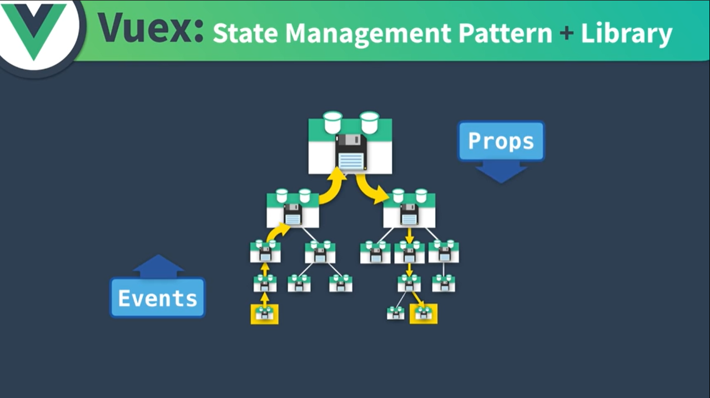
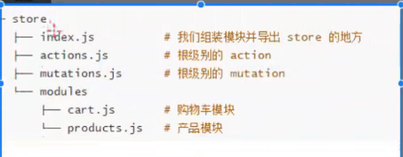

# Vuex

> 使用场景：有些内容需要==多个组件共享==，而这些组件一般有以下特征：
>
> 1. 它们的关系==并不强（相互独立，无嵌套关系）==，有可能是并列的。
>
> 2. 它们有关系，不过关系==嵌套较深==，如*爷子关系*及以上
>
> 而且被共享内容都需要做到==响应式==，多个组件展示统一数据，一个组件改了数据其他组件的数据展示也跟着改变

| 无vuex：组件传递特不方便                 | 有vuex：多组件共享一步到位，即时响应     |
| ---------------------------------------- | ---------------------------------------- |
|  |  |

> 单页面状态管理：action改变state，state影响view，view提供action；较简单
>
> 多页面的的管理：较复杂，需要额外工具

## 初识配置

`store/index.js`

```js
import Vue from 'vue'
import Vuex from 'vuex' //引入Vuex

Vue.use(Vuex) //安装Vuex插件

export default new Vuex.Store({ //以下是vuex的五大要素
  state: {/**将要共享的数据传到这里来**/},
  getters:{/**涉及处理加工state的操作写在这**/},
  mutations: {/**涉及改变state的操作写在这**/},
  actions: {/**涉及改变state的异步操作写在这**/},
  modules: {/**对store的分块写在这**/}
})
```

`main.js`

```js
import store from './store'//引入状态存储

new Vue({
  store, //使用状态存储，组件用$store访问
  render: h => h(App)
}).$mount('#app')
```

`一个简易的vuex管理`

```js
export default new Vuex.Store({
  state: { 
      count:0
  },
  mutations: { 
      increase(state){ //要带上state形参！
          return state.count++
      }
  },
})
```

> `store/index.js`使用store数据：**`store.state.xxx`**
>
> *由于需要追踪状态变化，官方不推荐直接改动store.state内部的值，而是交给下行方法*
>
> `store/index.js`触发状态改变：`store.commit()`方法，参数为函数名字符串
>
> store.state的数据要事先安排好。要之后添加属性的话要么用`Vue.set()`、`Vue.delete()`，要么对state整个替换

```js
methods:{
    fn(){
        this.$store.commit("increase")
        console.log(this.$store.state.count)
    }
}
```

## getters

> getters可以对state的参数进行加工处理，不会改动原先state的本身状态（值），只读。
>
> getter也可以返回函数，实现getter传参（动态getter）。
>
> 定义时要带上state形参！

```js
export default new Vuex.Store({
  state: { 
      pokemon:[
          {lv:55,name:"sylveon",nick:"小蝶",type:"fairy"}, //...
      ]
  },
  getters: { 
      above_lv_53(state){ //静态getter
          return state.pokemon.filter(el=>el.lv>=53)
      },
      find_pm(state){ //动态getter
          return function(nick0){
              return state.pokemon.find(pm=>pm.nick===nick0)
          }}  
      /*find_pm:(state)=>(nick0)=>state.pokemon.find(pm=>pm.nick===nick0)*/
  },
})
```

> getters的方法也可以加入getters作为第二个参数来==调用其他getters函数==

```js
getters: { 
      above_lv_53(state){ //要带上state形参！
          return state.pokemon.filter(el=>el.lv>=53)
      },  
      find_pm_above_53:(state, getters)=>
          (nick0)=>getters.above_lv_53.find(pm=>pm.nick===nick0))
  },
```

**使用方法**

```js
methods: {
    procedure(){
        this.$store.getters.xxx //普通getter使用
        this.$store.getters.find_pm("水布丁") // 函数getter要调用内部函数
    }
}
```

## mutations

> `mutations`是用来处理状态数据改动的，==不适合放页面逻辑==。尽量把它们设置得简单，轻巧。
>
> 主要装载==同步==状态改变操作，不是同步的devtools不会追踪（记录）
>
> 里面一个方法的名叫*事件名称*，函数体就是其*回调函数*
>
> ---
>
> 可以传递额外参数，即载荷`payload`。
>
> `mutations`的函数就只能有两个参数，简单点就直接一个变量作为形参即可。

```js
export default new Vuex.Store({
    state: {
        count: 0
    },
    mutations: {
        increment(state) { // increment是事件名，下面就是回调函数
            state.count += 1
        },
        incrementBy(state, n) { // incrementBy是事件名，下面就是回调函数
            state.count += n
        },// 使用时直接$store.commit("incrementBy",{amount:10})即可
    }
})
```

> 一般来说`payload`应该是个对象。这是在应对有多个传入参数时用。为方便可以像下面第二个案例一样解构

`store/index.js`

```js
mutations: {
    incr(state,payload){
        state.count += payload.amount
    },
    incrBy(state,{amount,type}){ 
        state.count+=amount
        /**
          *  这会把事件名渲染给state.type。
          *  就会覆盖原来的type属性的属性值
          *  要用下面的对象提交方法建议不要在这动用payload.type
          */
        state.type=type 
    }
}
```

> `$store.commit()`也可以提交对象，这对象携带type属性对应事件名称，会==将对象的所有内容提交为payload==。
>
> 在这种情况下，对象的其他属性不得与type重名。actions的dispatch过程提交对象也类似。

`app.vue`

```js
computed:{
    ...mapState([
        "count",
        "type"
    ])
},
methods:{
    incr(){
        if(this.bar!="")
            this.$store.commit({
                type:"incrBy", //用type来表识是什么事件名
                amount:+this.bar
            }) // 执行会发送整个对象作为payload参数
        else this.$store.commit({
            type:"incr",
        })
    },
}
```

## actions

> 它不能直接改变状态，只能提交mutation
>
> 虽说如此，actions可以一次性提交多次或多个mutations，==适合体现页面逻辑==
>
> 要激发它，只需要`$store.dispatch("xxx")`即可

```js
export default new Vuex.Store({
  state: {
    count: 0
  },
  mutations: {
    increment(state) {
      state.count ++
    }
  },
  actions:{
    /*  increment(ctx){ //传参ctx
          ctx.commit("increment")
      }*/
        increment({commit},payload){
            commit("increment")
        }
  }
})
```

> 可以处理异步操作，也就可以包含任何异步操作。操作如下：

```js
actions:{
    /*************** promise写法 ****************/
        increment({commit}){ // 返回一个Promise对象
            return new Promise((res,rej)=>{
                setTimeout(()=>{
                    commit("increment")
                    res()
                },2000)
            })
        },
   /*************** async写法 ****************/
        async decrement({commit}){
            await setTimeout(()=>{commit("increment")},4000)
        }
  }
```

使用时可以*通过then加后续操作*了

```js
methods:{
    procedure(){
        this.$store.dispatch('increment')
            .then(()=>{console.log("succeed!")})
    }
}
```

## 命名映射mappers

### mapState

> 我们也可以通过组件的computed属性来返回state的内容，以便我们方便地引用，可是光函数的写法就要写一会。mapState方法直接解决了这一难题。这会==使得引用更为方便==。
>
> *首先需要从vuex引用*：`import {mapState} from "vuex"`

**用法1：数组法** 

当目标==计算属性名与全局作用域的state的对应内容名相同==时直接用此方法映射

对于*未说明作用域的模块*的state似乎无能为力

```js
computed:mapState([
    'count', 
    'userInfo',
    'userAvatar'
])
```

对于*说明作用域的模块*的state访问如下：

```js
computed:mapState('module1',[
    'count', 
    'userInfo',
    'userAvatar'
])
```

**用法2：对象法**

> 可以灵活分配别名，键名即别名。
>
> 映射有两种情况：
>
> 1. 函数、箭头函数：以`state`为参数，返回原始值或经加工处理的值
> 2. 字符串：上面的返回原值的简写，值为在`state`内的对应属性名

```js
computed:mapState({
    user:state => state.userInfo,
    count:'count', //下面形式的简写,即state => state.count
    avatar:'userAvatar' //起别名
})
```

> 问：如何混合使用计算属性原有值和mapState？
>
> 答：包裹在计算属性对象里并用`...`展开

```js
computed:{
    isEven(){return this.val%2==0}, //...
    ...mapState({
        count:'count', 
        userbirth(state){
            return new Date().getYear - state.age
        }
    })
}
```

### mapMutations

> 跟之前的mapState一样，它也可以简化methods的对应方法的表示。
>
> 首先也要引入：`import {mapMutations} from "vuex"`，大多功能也与mapState相似
>
> ---
>
> mapGetters、mapActions也类似：
>
> 引用mapGetters :`import {mapGetters} from "vuex"`
>
> 引用mapActions :`import {mapActions} from "vuex"`

```js
methods:{
    my_method1(){},
    my_method2(){},
    ...mapMutations([
        "increment",
        "decrement"
    ])
}
```

## modules

> 为了更好细分store结构，引入了modules，其内还可以再写state、mutations、actions、getters或者子模块……

```js
const module1 = {
    state:{
        count:1
    },
    getters:{},
    mutations:{},
    actions: {},
    modules: {}
}
const store = new Vuex.store({
    state:{},
    getters:{},
    mutations:{},
    actions: {},
    modules: {
        module1,
        /***** 可以这样直接手写模块 *****/
        module2:{
            state:{},
            getters:{},
            mutations:{},
            actions: {}
        }
    })
```

### 模块的State

> 模块一般访问的是本身的state和context.state。
>
> 根节点的state、getters要用rootState、rootGetters作为第三、四参数
>
> 使用时要注意是：`$store.state.module1.count`，即模块是分散到state去了

```js
const mdA={
    state:{
        num:0
    },
}

/******* 使用 *******/
store.state.mdA.num  // 0
```

### 模块的操作

> 模块内部的getters, mutations 和 actions是注册在*全局命名空间*的，可以直接通过名称来

```js
const mdA = {
    // ...
    getters:{
        msg(state){
            //...
        }
    },
    mutations:{  //模块本身的state
        generate(state,{min,max}){
            //...
        }
    },
    actions:{
        genRandom({commit},{max,sgn}){
            //...
        }
    }
}
```

`app.vue`

```js
methods:{
    procedure(){
        this.$store.getters.msg
        this.$store.commit("generate",{50,1})
        this.$store.dispatch("genRandom",{10,-1})
    }
}
```

### 作用域模块

**总览**

> 模块作用域的出现是解决Vuex模块的getters, mutations, actions因为方法重名而导致*一呼百应*的问题
>
> 可以通过在模块对象开启属性`namespaced:true`来建立作用域，那么访问时就要标识好：`"模块名/方法名"`。
>
> 如：`"mdA/genRandom"`。

```js
const mdA={
    namespaced:true,
    state:{
        num:0
    }, // ...
    actions:{
        genRandom(){
            // ...
        }
    }
}
```

**模块使用**

> 一级嵌套如下：
>
> 1. getters: `store.getters['模块名/getter名']`
> 2. mutations: `commit('模块名/方法名')`
> 3. actions: `dispatch('模块名/方法名')`
>
> 二级嵌套是要把路径标清楚：`'模块1/模块2/函数名'`

**访问全局作用域内容**

> 希望使用全局 state 和 getter，`rootState` 和 `rootGetters` 会作为第三和第四参数传入 getter，也会通过 `context` 对象的属性传入 action。

```js
const mdA = {
    // ...
    getters:{
         //第一个参数是来自模块本身的state
        msg(state,getters,rootState,rootGetters){
            console.log(rootState) //rootState是来自全局作用域的state
            console.log(rootGetters) //rootGetters是来自全局作用域的getters
            return `num is ${state.num}`
        }
    },
    mutations:{  //模块本身的state
        generate(state,{min,max}){
            state.num=Math.floor(Math.random()*(max-min))+min
        }
    },
    actions:{
        genRandom({commit},{max,sgn}){
            if(sgn>0){
                commit("generate",{min:0,max:max})
            }else{
                commit("generate",{min:-max,max:0})
            }
        }
    }
}
```

### 文件结构

> `index.js`是入口文件，装载`state`，其他的如图示抽离



