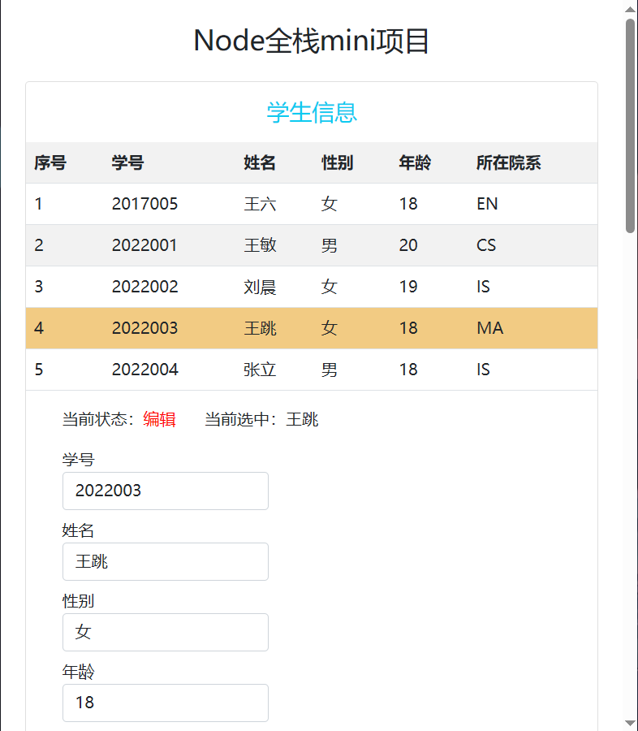
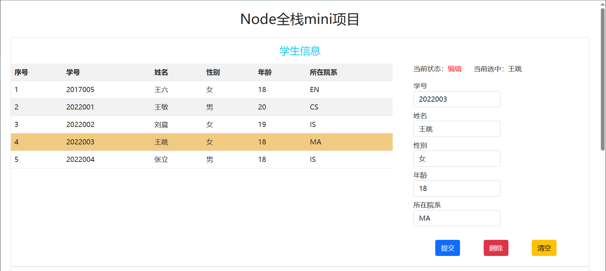

# Bootstrap笔记

对于构建响应式、移动设备优先的网站，Bootstrap 是个十分方便的CSS框架。

> v4 文档： https://v4.bootcss.com/docs/getting-started/introduction/
>
> v5 文档： https://v5.bootcss.com/docs/getting-started/introduction/

## Bootstrap容器响应式

Bootstrap提供一个 container 的容器，实现栅格系统（https://v5.bootcss.com/docs/layout/containers/）

默认情况下，container 是一个响应式的容器，在不同尺寸屏幕下会动态设置不同的宽度

| 设置的容器的类 |超小屏<576px       | 小屏≥576px | 中屏≥768px | 大屏≥992px | 超大屏≥1200px | 双超大屏≥1400px |
| :----------------- | :--------- | :--------- | :--------- | :------------ | :-------------- | ------ |
| `.container`       | 100%       | 540px      | 720px      | 960px         | 1140px          | 1320px |
| `.container-sm`    | 100%       | 540px      | 720px      | 960px         | 1140px          | 1320px |
| `.container-md`    | 100%       | 100%       | 720px      | 960px         | 1140px          | 1320px |
| `.container-lg`    | 100%       | 100%       | 100%       | 960px         | 1140px          | 1320px |
| `.container-xl`    | 100%       | 100%       | 100%       | 100%          | 1140px          | 1320px |
| `.container-xxl`   | 100%       | 100%       | 100%       | 100%          | 100%            | 1320px |
| `.container-fluid` | 100%       | 100%       | 100%       | 100%          | 100%            | 100%   |

用例：

```html
<div class="app container-fluid">
    <h2 class="col-md-12 text-center mt-4 mb-4">Node全栈mini项目</h2>
    <main class="container-fluid">
      <div class="content card">
        <h4 class="col-md-12 text-center mt-3 mb-3 text-info">学生信息</h4>
      </div>
      <div class="content card">
        <h4 class="col-md-12 text-center mt-3 mb-3 text-info">课程信息</h4>
      </div>
      <div class="content card">
        <h4 class="col-md-12 text-center mt-3 mb-3 text-info">学生选课信息</h4>
      </div>
    </main>
</div>
<script src="https://path/to/bootstrap"></script>
```

| 窄屏                                                         | 宽屏                                                         |
| ------------------------------------------------------------ | ------------------------------------------------------------ |
|  |  |

