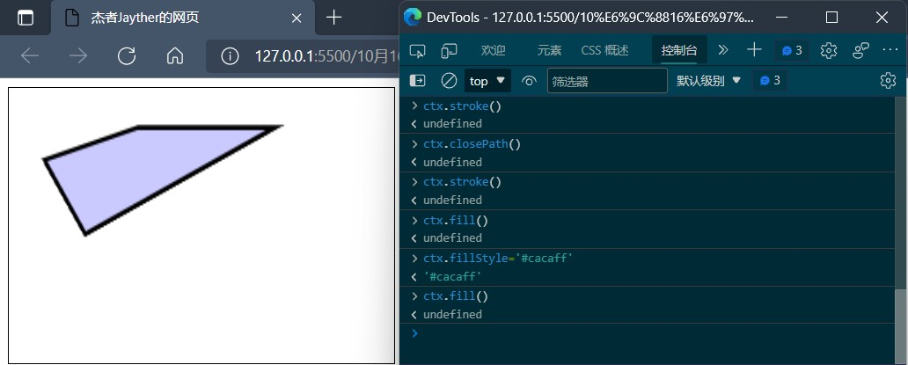
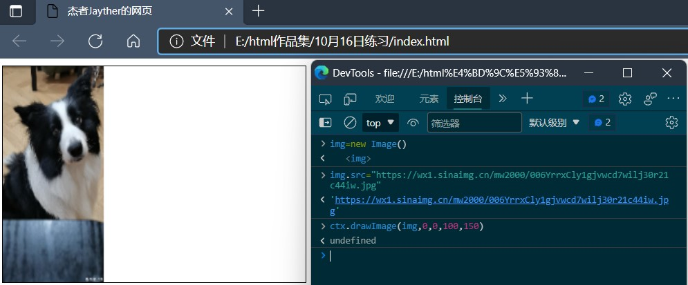
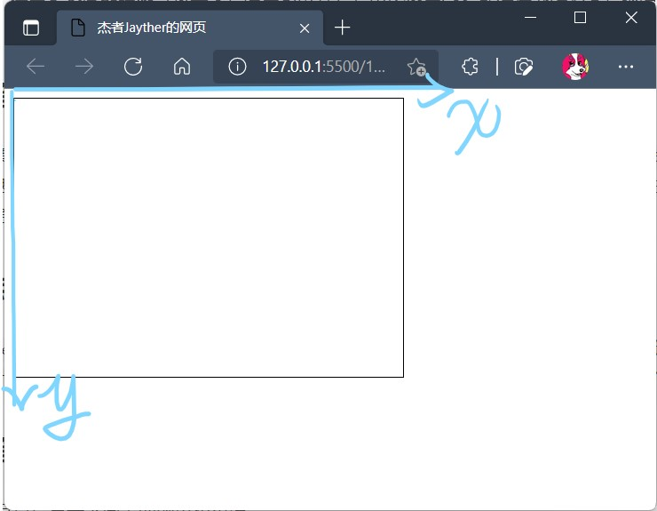
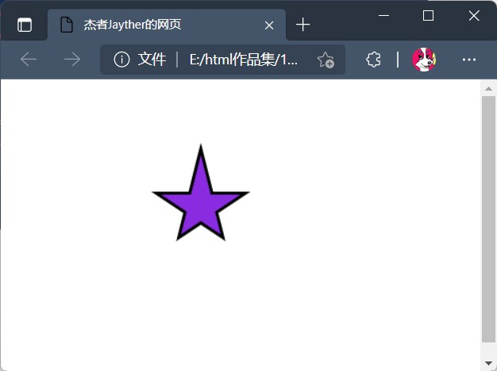
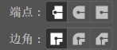
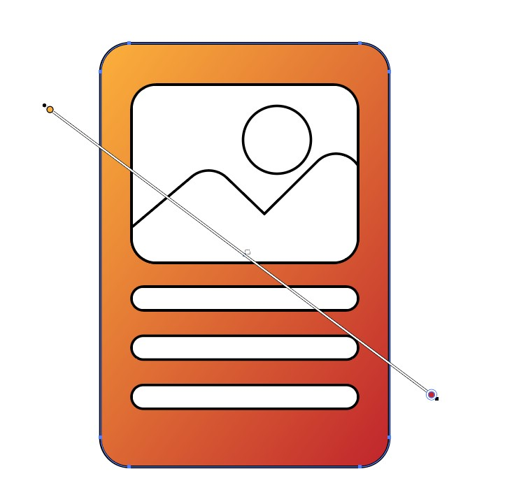
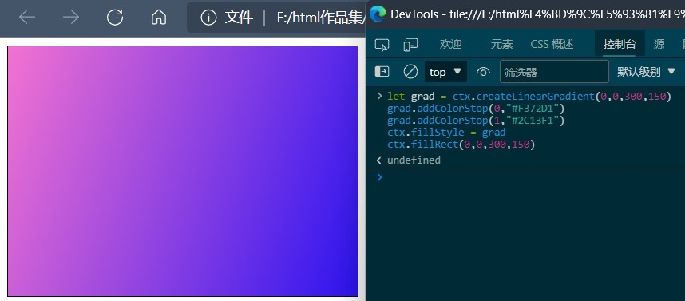

# Html5Canvas笔记

可参考教程：[Introduction · CANVAS——Draw on the Web](https://airingursb.gitbooks.io/canvas/content/)

## 初步接触

### 创建画布及样式初始化

```html
<head>
    <style>
        /*画布样式*/
        canvas#hb1{
            width:350px;
            height:250px;
            border:1px solid black;
        }
    </style>
</head>
<body>
    <!--画布本尊-->
    <canvas id="hb1">
    你浏览器太垃圾了，快去换个新的！
    <!--不支持canvas时会显示的文字-->
    </canvas>    
</body>
```

### JS操作画布

```js
//1.获取画布元素(不必局限于id选择器)
let canvas1 = document.getElementById("hb1")
//或者：canvas = document.querySelector("canvas")
//2.调整宽高,原先样式表对此的规则会保留。
canvas1.width=800
canvas.height=600
//3.获取画笔(二维)
//若想vscode只提示canvas方面的提示，可以加上下面注释：
/*  @type {HTMLCanvasElement} */
let ctx = canvas1.getContext("2d")
```

## 学习Canvas的最佳实践

用控制台实时绘图，所敲即所得。



> **实践要领**:有三样方法可以直接看到效果：
>
> `ctx.stroke()`可以绘制出线条
>
> `ctx.fill()`可以填充颜色
>
> `ctx.drawImage()`可以画出指定图片



## 绘制东西

画布是以左上角为原点，水平向右为x轴，竖直向下为y轴。

我们画图会采取点的坐标的方式。



### 画笔操作

参数不填单位！默认单位是px！坐标数值大于画布宽高会超出画布。

| 操作                 | 类型   | 释义                     |
| -------------------- | ------ | ------------------------ |
| `moveTo(x,y)`        | -      | 将画笔移到指定坐标       |
| `lineTo(x,y)`        | -      | 从上个点向目标点画直线   |
| `lineWidth`          | Number | 线条宽度                 |
| `strokeStyle="颜色"` | 颜色   | 线条样式                 |
| `fillStyle="颜色"`   | 颜色   | 填充样式                 |
| `beginPath()`        | -      | 从新绘制                 |
| `closePath()`        | -      | 闭合线条，适用于画多边形 |
| `stroke()`           | -      | 确认绘制线条             |

> - 颜色格式，无论是老的，如颜色名称、`#000000`、`rgb(0,0,0)`、`rgba(0,0,0,1)`、`hsl(0,0,0)`、`hsla(0,0,0,1)`，还是新的格式，如`#000000ff`、`rgb(0 0 0/1)`都可以用，没问题的！
>
> - 由于Canvas是基于状态的绘制，每执行一次上面谈到的三个执行函数，会沿用之前的设置！所以每当你要新画一个东西的时候，需要用`beginPath()`来洗掉原先设置参数，而之前画出来的图形会被保留。

实例：画五角星，效果见下图：

```js
let cvs = document.querySelector("canvas")
cvs.width=200
cvs.height=200
let ctx = cvs.getContext("2d")
//路径绘制
ctx.beginPath()
ctx.moveTo(60,20)
ctx.lineTo(40,100); ctx.lineTo(100,60)
ctx.lineTo(20,60); ctx.lineTo(80,100)
ctx.closePath()
//样式设置
ctx.lineWidth=6
ctx.strokeStyle="#000"
ctx.fillStyle="blueviolet"
//执行操作
ctx.stroke()
ctx.fill()
```



### 图形绘制

角度单位是弧度，不是度数！

默认为顺时针绘制，即最后参数默认为false，true代表逆时针绘制。

| 操作                              | 释义                                          |
| --------------------------------- | --------------------------------------------- |
| rect(始x,始y,宽,高)               | 设定上创建左上顶点坐标(x,y)，的宽高矩形的路径 |
| strokeRect(始x,始y,宽,高)         | 直接绘制上述矩形的描边                        |
| fillRect(始x,始y,宽,高)           | 直接绘制上述矩形的填充                        |
| clearRect(x, y, 宽, 高)           | 直接清除所给定矩形区域                        |
| arc(x,y,r,起始角,终止角,顺逆时针) | 设定以(x,y)为圆心，r为半径的圆弧线段的路径    |
|                                   |                                               |

### 线条属性扩展

除了`lineWidth`和`strokeStyle`外，线条属性还有两个：



`lineCap`**端点属性**：定义线条端点样式，有三种：

1. butt：无端点(默认)；

2. round：圆型端点，端点为以线宽为直径的半圆；

3. square：方形端点，端点为以线宽为长，半线宽为宽的矩形；


### 渐变



绘制线性渐变的操作如下：

1. 用两组点的坐标**规定渐变线**：`createLinearGradient(始x,始y,终x,终y)`
2. 给渐变添加关键色(颜色断点)，至少加两个(0的和1的)：`addColorStop(百分比,颜色)`
3. 应用渐变：`ctx.strokeStyle = grad`或`ctx.fillStyle = grad`

```js
let grad = ctx.createLinearGradient(0,0,300,150)
grad.addColorStop(0,"#F372D1")
grad.addColorStop(1,"#2C13F1")
ctx.fillStyle = grad
ctx.fillRect(0,0,300,150)
```



## 保存和恢复画布状态

| 操作      | 释义 |
| --------- | ---- |
| save()    | 保存 |
| restore() | 恢复 |

注意：`save()`操作可执行多次，而`restore()`操作的执行次数要与`save()`操作的相等。


