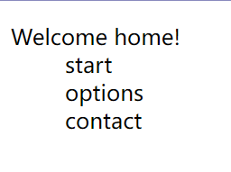
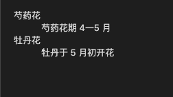
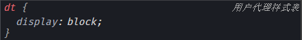
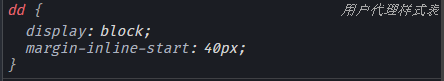
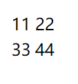
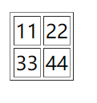
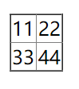

# HTML基础

## 常用行内标签

**a**：全称anchor(锚点)，其创建的链接可以跳转到其他页面

除了可以跳转到其他页面，还可以用于创建 email 链接、电话链接等。

```html
<a href="mailto:邮箱地址"></a>
<a href="tel:电话号码"></a>
```

当一个页面内容特别多时，可以通过给页面建立书签的方式，对同一页面里的内容进行链接。例子如下：

其中`name` 中定义的书签名称与 `href` 中 # 号后面的书签名称相同。

```html
<!-- 建立一个书签 -->
<a name="书签名称">文字</a>
<!-- 建立另一个书签 -->
<p id="书签名称">文字</a>
<!-- 链接到该书签的超链接 -->
<a href="#书签名称">链接点</a>
```

在 `a` 标签中还有个 `target` 属性可以用来规定打开链接文档的位置：

```html
<a target="_blank|_self|_top|_parent"></a>
```

| 属性值    | 描述                           |
| --------- | ------------------------------ |
| `_blank`  | 在*新窗口*中打开被链接文档。   |
| `_self`   | 在相同的框架中打开被链接文档。 |
| `_top`    | 在整个窗口中打开被链接文档。   |
| `_parent` | 在父框架集中打开被链接文档。   |

**span**:   `span` 标签是用来组合文档中行内元素的

## 常用块级标签

**div**

> div是英文DIVision的缩写，意为“分割、区域"。
>
> `<div>`标记简单而言就是一个区块容器标记，没有特定的含义，它主要是用于实现页面布局操作，可以将网页分割为独立的、不同的部分，以实现网页的规划和布局。
>
> 在HTML页面中，它以`<div>`心开头，并以`<div>`结尾，在`<div>`与`<div>`之间可以容纳段落、标题、图像等各种网页元素，也就是说大多数HTML标记都可以嵌套在`<div>`标记中，并且`<div>`还可以嵌套多层`<div>`。

### 标题标签

h7、h8 标签中的内容显示在一行，其字体大小是默认的文本字体大小。

## 列表

### 有序列表`ol`

有序列表就是使用项目符号来标识项目，比如日常我们需要步骤化的操作，可以使用有序列表来表示。

其基本用法为：

```html
<ol>
  <li>项目一</li>
  <li>项目二</li>
  <li>项目三</li>
</ol>
```

我们可以使用 `type` 属性来改变排序符号，取值如下所示：

| 属性值 | 说明                       |
| ------ | -------------------------- |
| A      | 用大写字母作为排序符号     |
| a      | 用小写字母作为排序符号     |
| I      | 用大写罗马字符作为排序符号 |
| i      | 用小写罗马字符作为排序符号 |
| 1      | 用数字作为排序符号         |

我们可以通过 `start` 属性，来自定义起始排序符号。`start` 属性必须要配合 `type` 属性来使用。例如：

```html
<!--从第 4 个大写罗马数字开始排序-->
<ol type="I" start="4">
  <li>项目一</li>
  <li>项目二</li>
  <li>项目三</li>
</ol>
```

### 无序列表`ul`

在 HTML 文档中，所谓无序列表，是指以实心圆 ●（默认）、空心圆 ○、实心方块 ■ 开头的，没有顺序的列表项目。

我们使用 `type` 属性可以修改列表开头的符号，其取值如下：

| 属性值 | 说明       |
| ------ | ---------- |
| disc   | 实心圆 ●   |
| circle | 空心圆 ○   |
| square | 实心方块 ■ |

### 定义列表`dl`

> 自定义列表跟前两种列表有些区别，用 `dl` 标签表示自定义列表，其中的 `dt` 是代表列表项，而 `dd` 是列表项的描述。比如：我们需要对列表项的内容进行解释的时候，就可以使用自定义列表了。
>
> 在开发过程中，一般使用这个组合标签来实现图文混编的功能，也可以写网页页脚部分的布局

```html
 <dl>
    <dt>Welcome home!</dt>
    <dd>start</dd>
    <dd>options</dd>
    <dd>contact</dd>
  </dl>
```



默认样式如下：





## 表格

一个简单的表格由表格行`tr`，表格单元格`td`构成

```html
<table border="1">
    <tr>
        <td>11</td>
        <td>22</td>
    </tr>			
    <tr>
        <td>33</td>
        <td>44</td>
    </tr>
</table>
```

> **`emmet`封装**
>
> `table[border="1"]>(tr*2>td*2)`
>
> `table>tbody>th*4+(tr>td*4)`

### 表格边框

> 表格加上表格可以通过属性border加，也可以CSS高度化自定义边框
>
> - border-collapse: collapse；会合并表格边框
>- cellspacing属性可以调整边框间隙

| 不加border                                                   | 加border                                                     | border-collapse: collapse；                                  |
| ------------------------------------------------------------ | ------------------------------------------------------------ | ------------------------------------------------------------ |
|  |  |  |

控制表格单元长度

> 表格单元一般是自适应的，换句话说就是表格单元长度是随着内容的变多而变长。
>
> 可以通过 `table-layout: fixed;`来不给td分配适配长度auto。
>
> 如果是`table-layout: auto;`（默认），即使指定了表格单元格的宽度，表格仍然会因为自适应内容自动撑开

## 表单

在HTML中，`<form>`标记用于定义表单域，即创建一个表单，其基本语法如下所示

```html
<form action="url地址" method="提交方式" name="表单名称"><!--各种表单控件--></form>
```

比如：

```html
<form action="https://www.baidu.com/s" method="get"></form>
```

> method,属性用于设置表单数据的提交方式，其取值为GET或POST,
>
> 其中==GET==为默认值，这种方式提交的数据将显示在浏览器的地址栏中，保密性差且有数据量限制，
>
> 而使用==POST==提交方式不但保密性好，还可以提交大量的数据，所以开发中通常使用POST方式提交表单。

HTML5 中 `input` 标签新增了一个 `form` 属性，通过该属性可以将表单元素绑定到指定的 `form` 标签上，这样就可以灵活进行布局，同时一个表单元素可以从属于多个表单，这就让表单和表单元素的组合变得更加灵活。

```html
<body>
    <form id="myForm1" action="#" method="GET"></form>
    <form id="myForm2" action="#" method="POST"></form>
    提交到 myForm1：<input type="text" form="myForm1" name="myForm1" />
    <input type="submit" value="提交" form="myForm1" />
    提交到 myForm2：<input type="text" form="myForm2" name="myForm2" />
    <input type="submit" value="提交" form="myForm2" />
</body>
```

## 输入框

input  输入 的意思  。 `<input />`标签为单标签结构，默认显示为一个输入文字的长方框即单行文本框。

```html
<input type="属性值" />
```

**`type` 属性 （类型、种类）**: 这个属性通过改变值，可以决定了你属于那种`input`表单。

| 属性值     | 释义                                                |
| ---------- | --------------------------------------------------- |
| `text`     | 普通文本表单                                        |
| `password` | 密码表单                                            |
| `radio`    | 单选框表单                                          |
| `checkbox` | 复选框表单                                          |
| `color`    | 选择颜色的表单                                      |
| `image`    | 带图像的*表单提交*按钮，显示的图像由 `src` 属性规定 |
| `file`     | 提交文件的表单                                      |
| `reset`    | 表单重置按钮，可以把表单中已填写的信息给清除掉。    |
| `submit`   | 表单提交 按钮                                       |
| `hidden`   | 隐藏表单                                            |

**`value`属性 （值）**：默认的文本值。 有些表单想刚打开页面就默认显示几个文字，就可以通过这个`value` 来设置。

```html
用户名:<input type="text"  name="username" value="请输入用户名"> 
```

**`name`属性（名字）**：表单的名字， 这样，后台可以通过这个name属性找到这个表单。

  页面中的表单很多，`name`主要作用就是用于区别不同的表单，必须要写。

```html
用户名:<input type="text"  name=“username” />  
```

尤其是：`radio` 或者 `checkbox`  如果是一组，则必须给他们命名相同的名字 `name` 

```html
<input type="radio" name="sex"  />男
<input type="radio" name="sex" />女
```

**`checked`属性**： 表示默认选中状态。  较常见于单选按钮和复选按钮。

```html
<p>性别:</pp>
<!-- 默认选中: 男 -->
<input type="radio" name="sex" value="男" checked="checked" />男
<input type="radio" name="sex" value="女" />女 
```

### 文本域

```html
<textarea >
  文本内容
</textarea>
```

- 通过`textarea`控件可以轻松地创建多行文本输入框.
- cols="每行中的字符数"    rows="显示的行数"  

它的CSS resize属性可以控制文本域是否可以调整大小。下面样式会阻止文本域调整大小


```css
textarea{
  resize:none;
}
```

### 新表单属性

当某个文本框需要获得光标焦点时，可以使用 `autofocus` 属性来实现。

`autocomplete` 属性是用来规定表单是否应该启用自动完成功能。

`placeholder` 属性规定可描述输入字段预期值的提示信息，也就是说设置了该属性，它会提示用户设置的输入值。

### 新表单标签

| 标签                      | 释义                           |
| ------------------------- | ------------------------------ |
| `<input type="email" />`  | 用于邮件地址的输入             |
| `<input type="url" />`    | 专门用来输入网址的。           |
| `<input type="number"/>`  | 用于数字的输入                 |
| `<input type="range" />`  | 用于包含一定范围内数值的输入   |
| `<input type="date" />`   | 选取年、月、日                 |
| `<input type="search" />` | 提供用于输入搜索关键字的文本框 |
| `<input type="color" />`  | 专门用于设置颜色的文本框       |

`number` 类型表单有以下属性。

| 属性  | 描述                                                |
| ----- | --------------------------------------------------- |
| max   | 输入框允许的最大值。                                |
| min   | 输入框允许的最小值。                                |
| step  | 合法的数字间隔，例如 step=2，则合法为：2、4、6、8。 |
| value | 默认值。                                            |

### datalist

> `<datalist>` 元素是 HTML5 引入的，它为 `<input>` 元素提供了一个包含预定义选项的数据列表。
>
> 当 `<input>` 元素与 `<datalist>` 配合使用时，它能提供一个带有自动补全功能的下拉列表。
> 用户可以从下拉列表中选择一个选项，或者输入与列表中某个选项匹配的文本。

```html
<label for="browser">Choose your browser from the list:</label>
<input type="text" id="browser" name="browser" list="browsers">
<datalist id="browsers">
  <option value="Edge">
  <option value="Firefox">
  <option value="Chrome">
  <option value="Opera">
  <option value="Safari">
</datalist>
```

## label

是 HTML 中的一个元素，它通过关联文本和表单控件，使得可访问性增强，也使得用户体验提升。

它与表单通过 `<label>` 的`for` 属性和表单的 `id` 属性的值关联起来。

这样当用户点击`label`内部的文本时，浏览器会自动将焦点移至相应的表单元素。

```html
<p>1.What kind of personality do you think you have</p>
<input type="radio" name="quest2.1" id="2a"><label for="2a">extroverted</label><br>
<input type="radio" name="quest2.1" id="2b"><label for="2b">introverted</label><br>
<input type="radio" name="quest2.2" id="2c"><label for="2c">optimistic</label><br>
<input type="radio" name="quest2.2" id="2d"><label for="2d">pessimistic</label>
```

## 下拉列表

**目的：**如果有多个选项让用户选择，为了节约空间，我们可以使用select下拉列表控件。


**语法：**

```html
<select>
  <option>选项1</option>
  <option>选项2</option>
  <option>选项3</option>
  ...
</select>
```

`select` 有两个常用属性，如下所示：

| 属性     | 描述                       |
| -------- | -------------------------- |
| multiple | 设置下拉列表可以选择多项。 |
| size     | 设置下拉列表选择几个表项。 |

`option` 有两个常用属性，如下所示：

| 属性     | 描述                 |
| -------- | -------------------- |
| selected | 设置是否被选中。     |
| value    | 设置列表项的默认值。 |

> 1. select  选择，挑选，筛选    option  选项
>
> 2. 下拉表单需要 select 和  option 搭配使用
>
> 3. <select&gt;  中至少包含一对 option
>
> 4. name 属性要写到  select 列表上   value 属性要写到option上面
>
> 5. 在option 中定义`selected =" selected "`或就是`selected`时，当前项即为默认选中项。
>

## 多媒体标签

### 图片

准确来讲，`img` 标签并不会在页面中真正插入图像，而只是提供一个链接地址，通过链接来显示出图像。

所以，`img` 标签创建的是被引用图像的占位空间。语法如下：

```html

```

该语法中`src`属性用于指定图像文件的路径和文件名，他是`img`标签的必需属性。

修改宽度和高度，可以使用width 宽度  和  height  高度（可不指定px，对应的就是px）

~~~html

~~~

`align` 属性能用来规定如何根据周围的文本来排列图像的位置，其属性值如下所示：

| 属性值 | 说明     |
| ------ | -------- |
| top    | 顶部对齐 |
| bottom | 底部对齐 |
| middle | 居中对齐 |
| left   | 居左对齐 |
| right  | 居右对齐 |

在 `img` 标签中，还可以使用 `title` 属性给元素增加额外的提示信息。是当你把鼠标移到元素上会显示出现一段提示文本。

### 视频

在 HTML 中，提供了 `video` 标签向文档中嵌入媒体播放器。

语法格式如下所示：

```html
<video controls>
  <source src="URL" />
</video>
```

我们在 `video` 标签中加入 `poster` 属性即可给视频添加封面。使用格式如下：

```html
<video poster="URL"></video>
```

属性值 URL 是封面图的地址。

### 音频

HTML5使用 `audio` 标签来播放声音文件或者音频流，该标签支持 Ogg、MP3、WAV 等音频格式。

使用相当简单，如下图所示，并且可以通过附加属性可以更友好控制音频的播放，如：

- `controls` 是 `controls="controls"` 简写形式，用于提供播放、暂停和音量控件。

~~~html
<audio controls="controls"  src="bgsound.mp3" >
</audio>
~~~

`audio` 标签还有以下属性可用：

- `autoplay` 属性：音频自动播放。
- `loop` 属性：音频自动重复播放。
- `preload` 属性：用来缓冲 `audio` 标签的大文件，它有三个属性值 none（不缓冲）、auto（缓冲音频文件）、metadata （缓冲文件的元数据）。

**source 标签**

`audio` 标签还可以通过子标签 `source` 来进行多数据源的设置。

其使用格式如下：

```html
<audio>
  <source src="URL" />
</audio>
```

一个 `audio` 标签可以包含多个 `source` 标签，当播放器无法识别当前格式的播放源时会调用下一个 `source` 播放源进行播放。

`source` 标签是用来指定多个文件，给不同的浏览器提供可支持的编码格式。

