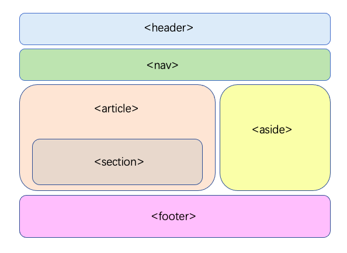

# HTML语义化

HTML语义化是指使用恰当的HTML标签来包裹内容，以传达出它们真实的意义和结构。

语义化标签直接告诉浏览器和开发者它们的内容是什么，不仅仅是无语义的`div`或`span`标签。

例如，`<article>`、`<footer>`、`<header>`、`<nav>`和`<section>`等标签都具有明确的语义，表明了它们所承载内容的性质。

## 语义化的意义

> 对于开发者
>
> - **提高可读性：** 语义化标签使得HTML代码更容易阅读和理解。其他开发者可以通过标签快速理解各个部分的作用和内容。
> - **便于维护：** 结构清晰的代码更容易维护和更新。
> - **促进团队协作：** 语义化标签为团队中的开发者提供了一个共同的理解基础。
>
> 对于用户
>
> - **无障碍访问：** 语义化标签对于屏幕阅读器和辅助技术是友好的，这使得残障人士可以更好地访问和导航网站内容。
> - **改善用户体验：** 例如，恰当的标签和文档结构可以帮助用户在阅读文章时更好地理解内容的层次和组织结构。
>
> 对于搜索引擎
>
> - **SEO（搜索引擎优化）：** 搜索引擎利用标签的语义来理解网页内容，这有助于提高页面的搜索排名。
> - **更好的内容理解：** 语义化标签帮助搜索引擎抓取者更准确地解析和索引网页信息，从而提供更相关的搜索结果。

## 语义标签



| 标签    | 释义     |
| ------- | -------- |
| header  | 头部     |
| footer  | 页脚     |
| main    | 主要区域 |
| section | 某区域   |
| article | 文章区   |
| aside   | 侧边栏   |

## meta标签

参考：[文档级元数据](https://developer.mozilla.org/zh-CN/docs/Web/HTML/Element/meta)。

`<meta>` : 网页head区的辅助性标签，它的作用是经过配置一些参数用以描述页面属性。

SEO中的元标签主要涉及`描述（description）`和`关键词（keywords）`

`meta`标签的`属性`有：`name`、`charset`和`http- equiv`。

1. **name**：声明文档级别（*document-level*）的元数据，应用于整个页面。

   `meta`标签的`name`属性语法格式是： `<meta name="参数"content="具体的参数值">`

| name的取值    | 代表含义                 | 举例                                                         |
| ------------- | ------------------------ | ------------------------------------------------------------ |
| `keywords`    | 关键词                   | `<meta name="keywords" content="Vue.js,前端面试题,Kotlin,Python" />` |
| `description` | 网站内容描述             | `<meta name="description" content="A general guide on the use of meta tags in html pages" />` |
| `author`      | 作者的名字               | `<meta name="author" content="Lee,0123456789@qq.com" />`     |
| `generator`   | 网站的采用的什么软件制作 | `<meta name="generator" content="Squarespace">`              |
| `theme-color` | 页面显示设计的建议颜色   | `<meta name="theme-color" content="#cacaff">`                |

2. **charset**：使用 `charset` 属性来规定字符编码，在解析文档时，会告诉浏览器我们使用的编码形式。

```html
<!-- 规定字符编码 -->
<meta charset="utf-8" />  
```

3. **http-equiv**：全称*http-equivalent*，相当于http的文件头作用，它可以向浏览器传回一些有用的信息，以帮助正确和精确地显示网页内容。

   `meta`标签的`http-equiv`属性语法格式是： `<meta http-equiv="参数"content="参数变量值">；`

   | `http-equiv`的取值 | 代表                               | 举例                                                         |
   | ------------------ | ---------------------------------- | ------------------------------------------------------------ |
   | X-UA-Compatible    | 定义浏览器的渲染方式               | `<meta http-equiv="X-UA-Compatible" content="IE=edge,chrome=1">` |
   | refresh            | 定义文档自动刷新的时间间隔（慎用） | `<meta http-equiv="refresh" content="2;URL=http://www.baidu.com">` |
   | set-cookie         | 设置cookie和过期日期               | `<meta http-equiv="Set-Cookie"content="cookie value=xxx;expires=Friday,12-Jan-200118:18:18GMT；path=/">` |

### 例子：viewport视口

> 在Web开发中，视口是用户在网页上可以看到的区域。有两种类型的视口：
>
> 1. **布局视口（Layout Viewport）**:  这通常比移动设备的屏幕宽度要宽，因此网站不需要为了适应屏幕而缩小内容。
>    布局视口的大小可以使用CSS来控制。
> 2. **视觉视口（Visual Viewport）**:  这是用户实际看到的屏幕区域。
>    当用户缩放时，视觉视口的大小会改变，但布局视口的大小通常保持不变。
>
> `<meta name="viewport">`标签允许Web开发人员控制视口的大小和比例，这是响应式设计的关键部分，确保网页在不同设备上都能正确显示。

```html
<meta name="viewport"content="width=device-width, initial-scale=1.0">
<!-- 以设备宽度作为理想视口，默认缩放比例为1 -->
<meta name="viewport" content="width=device-width, user-scalable=1, initial-scale=no, maximum-scale=1.0, minimum-scale=1.0">
<!-- 设置视口宽度为设备宽度，禁止用户缩放页面，且定义页面的初始、最大和最小缩放比例均为1 -->
```

| 属性               | 释义                                            |
| ------------------ | ----------------------------------------------- |
| width=device-width | 视口宽度为设备宽度                              |
| user-scalable      | no/0：不允许用户缩放页面<br>1：允许用户缩放页面 |
| initial-scale=1.0  | 初始页面缩放倍数                                |
| maximum-scale=1.0  | 最大缩放倍数                                    |
| minimum-scale=1.0  | 最小缩放倍数                                    |

## 网页SEO

SEO（Search Engine Optimization，搜索引擎优化）是一系列策略和技巧，旨在提高网站或网页在搜索引擎中的排名。

SEO的核心目的是增加网站的可见性，吸引更多的自然（非付费）流量，从而提高网站的品牌影响力和潜在的商业转化率。

## SEO优化

1. **写好title标签**: 相当于网站的名片，他会直接显示在搜索结果中。一个好的标题势必可以为网站带来流量，从而提升网站排名。

2. **配置好meta标签**: meta标签是网页head区的辅助性标签，它的作用是经过配置一些参数用以描述页面属性。*目前几乎所有搜索引擎都使用网上机器人自动查找meta值来给网页分类*。

3. **做好HTML语义化**: 这不仅便于开发者阅读，还有利于浏览器爬虫的解析，对SEO优化很有帮助。

4. **配置好内链和外链**：内链和外链都能提升网站排名，在搜索引擎优化领域，还有*内链为王、外链为皇*的说法。

   > **内链**：从自己网站的一个页面指向另外一个页面。通过内链让网站内部形成网状结构，让蜘蛛的广度和深度达到最大化。
   > **外链**：在别的网站导入自己网站的链接。通过外链提升网站权重，提高网站流量。

5. **高质量内容**：提供价值丰富、独特和高质量的内容。确保内容对用户有用并且易于阅读。定期更新网站内容，保持其新鲜度和相关性。
6. **确保页面性能**：从2010年起，[谷歌将网页加载速度快慢作为影响排名重要因素。](https://link.juejin.cn/?target=https%3A%2F%2Fwww.xingbell.com%2Fdb%2Fnews-n42.html)
7. **sitemap站点地图**：Sitemap是一个文件，它可以通知搜索引擎该网站有哪些可供抓取的网页。它就相当于一个*给搜索引擎导航的文件*。
8. **网址规范化（Canonical URL）**：为了解决网站由于网站URL链接不一样但网页内容是一样而造成搜索引擎重复收录的问题。其解决方式就是利用`rel="canonical"标签`。例子如下：

```html
<link rel="canonical" href="https://www.hevesh5.com">
```

9. **使用HTTPS**：谷歌曾发公告表示，使用安全加密协议（HTTPS），是搜索引擎排名的一项参考因素。所以，在域名相同情况下，HTTPS站点比HTTP站点，能获得更好的排名。
10. **使用SSR服务端渲染**（ Server-Side Rendering）：通过服务端渲染，即客户端向服务器发出请求，然后运行时动态生成 html 内容并返回给客户端，客户端可以获取到完整的页面内容。

> SPA应用不利于SEO，因为这些spa应用内容是有JS动态更新的，蜘蛛无法爬取网页内容。
>
> 对于SPA应用来说，也可以使用*预渲染prerender-spa-plugin。*
