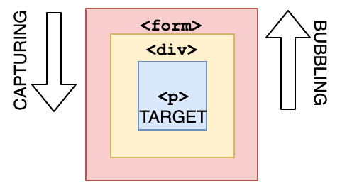

# JS进阶

## 变量定义

> 变量提升：在非严格模式下出现的JS运行情况：`var`声明、`function`声明会先执行；

```js
alert(a)  // function a(){console.log(2)}
a()  // 2
var a = 1
function a(){  
    console.log(2)
}
alert(a) // 1
a=3
a()  // 报错：a不是函数
```

> 变量死锁：在`let`或`const`声明前不能用该变量。意味着*let和const不会变量提升*。
>
> `const`的特性：对于引用变量指向不变，作为函数参数的时候不会新创建值相同变量，可以以此特性避免部分闭包

```js
/* ======= 蓝桥杯模拟题：收快递啦, 我的题解 ======= */
function findRegion(regions, regionName) {
  // TODO: 在这里写入具体的实现逻辑
  // 需要从树状结构的行政信息中，遍历找到目标区域的行政信息，如输入：成都市，返回 [四川省，成都市]
  // 如果所输入的位置信息不存在，则返回 null
  const fullAddr = [], foundFlag = { value: false } 
  //函数只会改动const的对象内容，而不会在函数调用时新建拷贝
  function traverseNodes(regionArr, addrArr, foundFlag) {
    for (const region of regionArr) { //循环遍历每个元素
      if (region.name === regionName) {
        foundFlag.value = true
      }
      if (!foundFlag.value && region.children.length !== 0) { //有孩子节点
        traverseNodes(region.children, addrArr, foundFlag)
      }
      if (foundFlag.value) {
        addrArr.unshift(region.name)
        break;
      }
    }
  }
  traverseNodes(regions, fullAddr, foundFlag)
  return fullAddr.length === 0 ? null : fullAddr
}
```

## 对象进阶

### 原型对象

**原型**

JS是个*基于原型的语言*。凡是JS的对象都存在其原型。

原型也是个对象，它包含其模板属性和方法，提供对象的类的功能。

原型相当于一个公共区域，所有一个类的实例都可以访问到该区域。

**原型链**

原型对象也可能拥有原象，并从中继承方法和属性。这就构建出了==对象原型链==。

原型链的尽头是`Object.prototype`，你可以称它为**基本对象**。

它包含所有JS对象的应有的属性和方法，如`toString()`、`hasOwnProperty()`等。它就再没有原型对象了(`null`).

**显式原型**

显式原型是构造函数的原型，只有构造函数才会有。

显式原型的构造函数是本身。


**隐式原型**

对于构造函数，它们都有一个隐含属性指向其原象。其实例可通过下面列出的方法来访问：

1. `__proto__`属性（存在兼容性问题）
2. `Object.getPrototypeOf()`


> 对象/函数/构造函数实例、对象/函数/构造函数原型、(隐式)原型链关系如下：
>
> 对于Foo可以指代任何有隐形原型的对象和可转变为相应对象的基本数据类型
>
> 如`String`、`Boolean`、`Bigint`等等。`Number`（如`14.__proto__`会报错）、`undefined`、`null`除外。


> 原型链记忆要领：*三显式原型中，俩三进一出，一个一进一出。*
>
> `Object.__proto__ === Function.__proto__ === Foo.__proto__`
>
> `obj.__proto__ === Function.__proto__.__proto__ === foo.__proto__.__proto__`
>
> 三构造函数：*显式原型的构造函数是本身*
>
> `Object.prototype.constructor === Object`
>
> `Function.prototype.constructor === Function`
>
> `Foo.prototype.constructor === Foo`

**对象属性访问**

访问对象的属性会依次在对象本身、对象原型、对象原型的原型……直到尽头寻找。

而一找到就调用，没找到就回undefined（对象返回null）。

| 寻找属性方法         | 例子                            | 释义                 |
| -------------------- | ------------------------------- | -------------------- |
| `in`关键词           | `age in student`                | 在本身和原型链中寻找 |
| `hasOwnProperty`方法 | `student.hasOwnProperty("age")` | 只在对象本身找       |

**`instanceof`**

> `a instanceof B`看B的显式原型(`B.prototype`)在不在a的(隐式)原型链上

**构造函数+原型对象创建对象**：此方法更是适用于对象创建。其语法糖是[ES6的类语法](#类)

一般把同一类型的对象的共有属性和方法都写在其原型对象当中。特有的属性和方法才再放到构造函数当中。

```js
function Pokemon(name,lvl,...type){ //构造函数
    this.name = name
    this.lvl = lvl
    this.type = type
}
// 为prototype添加属性或方法
Pokemon.prototype.trainer = 'Jayther'
Pokemon.prototype.lastMove = "struggle"
Pokemon.prototype.learnMoves = function(){/*...*/}

const Sylveon = new Pokemon('小蝶',65,'fairy')
Sylveon.trainer <!-- 'Jayther'
```

### Object.defineProperty()  

语法：`Object.defineProperty(obj, 键值, 值参数);`  

给对象添加或者修改指定属性，还可以控制是否可读。

| 配置属性       | 释义                                                         |
| -------------- | ------------------------------------------------------------ |
| `value`        | 修改属性值，没有则新增                                       |
| `writable`     | 是否可以修改，默认为 false ，即不允许修改，独一无二，但只有对象名。属性不能修改，使用 `Object.defineProperty()` 依旧可以修改 |
| `enumerable`   | 是否被枚举，也就是这个==无法被遍历出来==，但却能被调用，默认为 false，所以新增一个属性需要改为 true 才能遍历 |
| `configurable` | 是否可以被删除或者修改特性，也就是修改 writable、enumerable、configurable，但 value 依旧可以修改，默认为 false |

```js
const obj = {id:7, name:'蔡徐坤', motto:"你干嘛~~哈哈~~哎呦", practiceTime:2.5}

Object.defineProperty(obj, 'id', {
  writable: false,
});
Object.defineProperty(obj, 'name', {
  configurable: false,
});
obj.id = 2; //此时无法修改
delete obj.uname; //此时无法被删除
console.log(obj);

Object.defineProperty(obj, 'motto', {
  //enumerable: false //无法修改，将报错
});
Object.defineProperty(obj, 'practiceTime', {
  //如果是以这种方式新增属性，想要让它能够修改这三个特性且具备普通属性拥有的特性，则需要全部改成true
  value: 20,
  enumerable: true,
  writable: true,
  configurable: true,
});
```

## 继承模式

在ES6的类的继承功能出现前，如何实现实例代码的复用呢？

**原型链继承**：

```js
function Father(){ 
    this.money = 100; 
    this.reputation = 'so-so'; 
}
function Son(age){ 
    this.money = 10; // 同名属性
    this.age = age; 
}
Son.prototype = new Father() // 儿子的原型指向父亲实例，原来的儿子的原型会被废弃回收

let sonny1 = new Son(15), sonny2 = new Son(20)
sonny1.money <!-- 10 // 同名属性会覆盖父类的
/****** 儿子属性可定制 ******/
sonny1.age !== sonny2.age <!-- true
/****** 原型链内容共享,无法定制 ******/
sonny1.reputation === sonny2.reputation<!-- true
sonny2.reputation = 'shit'
sonny1.reputation <!-- 'shit'
```


**构造函数继承**：在子类型构造函数的内部调用父类型构造函数，解决无法在子类向父类传递参数的问题。

```js
// FirePokemon是上面Pokemon构造函数的子类
function FirePokemon(name,lvl){
    Pokemon.call(this, name, lvl, 'fire') //将属性绑定到自身上
}

const Arcanine = new Pokemon('小天狼星',65)
Arcanine.type <!-- ['fire']
Arcanine.trainer <!-- 'Jayther'
```

**上面两个方法的综合**：结合两个继承方法的优点，是常用的继承方式。会调用两次父类构造函数。

```js
function Father(){
    this.a = 100;
    this.c = 100;
}
function Son(b){
    Father.call(this,a,c) // 将属性绑定到自身上，是用于自身属性
    this.a = 10;
    this.b = b;
}
Son.prototype = new Father() // 替换原型，是链接父类为原型
Son.prototype.constructor = Son // 将构造函数的原型的构造函数指向自身，是补丁之策
let sonny = new Son(50)
```

Es6方法：<a href="#类的继承">类的继承</a>

## 函数进阶

### this关键字

解析器调用函数向其传递的一个隐藏参数，指向一个对象。可称为函数执行的上下文对象。

> 1. 在全局上下文中，包括全局函数的this，都指向==全局==对象
> 2. 在对象上下文中，this指向该对象
> 3. 在箭头函数中，this只会指向来自从自己的作用域链的上一层。箭头函数不会创建自己的 `this`

### call(), apply(), bind()

此三种方法可作为函数的调用方式之一。三者本质都差不多。都是将指定方法给别的对象当其临时方法使用。

而第一个参数正式目标对象。不过bind方法是返回一个函数，要手动执行。

下列是单独使用三个方法的实例。

```js
const report = function(){
    console.log(`伙伴：${this.name}; 等级：${this.lvl}; 属性：${this.type};`);
}

const pm = function(name,lvl,type){
    this.name=name; this.lvl=lvl; this.type=type;
}

let LB = new pm('吕布',100,"火",8821,6497);
let SBD = new pm('水布丁',51,"水",1866,3259);
let SDB = new pm('闪电布',62,"电",3285,3742);

report.call(LB);
report.apply(SBD);
report.bind(SDB)();
```

## 类

类是构造函数的语法糖，类的引入让实例对象的构造更加清晰直观。

```js
class atkCard{  //typeof atkCard ==='function'返回true
    type='attack' //类共有属性
    upcount=0   
    constructor(name,hp,atk,range){  //装载每个实例的特异属性
        this.name=name
        this.hp=hp
        this.atk=atk
        this.range=range
    }
    upgrade(){  //方法
        this.atk+=20
        this.hp+=10
        this.upcount++
    }   //属性、方法间别管逗号了！
}
let luna = new atkCard('luna',200,150,30)
luna.upgrade()
```

该实例对象经以上代码处理后如下：


### 静态方法

在类中指定属性或方法前加static关键字，会使得该属性或方法限制在类对象中而不被实例所继承（类专属属性/方法）。

```js
class student{
    //...
    static grade = "2020届大二"
    static school_info(school_name){
        console.log(`这届是来自${school_name}的${student.grade}的大学生们！`)
    //...    
    }
}
student.school_info('三峡大学') //这届是来自三峡大学的2020届大二的大学生们！
```

### 私有属性/方法

```js
class message{// 某提案可以使得私有属性/方法成为可能，格式为“#属性/方法名”
    #id=142857142
    #info = () => `这是id为${this.#id}的学生！`
    //...
    showId(){
        console.log(#info)
        return this.#id
    }//...     // 私有属性/方法只可在类中被访问。外部访问该属性/方法会报错。
}
let message = new message()
message.showId()  // 返回：142857142，控制台显示：'这是id为142857142的学生！'
message.#id // SyntaxError: Private field '#id' must be declared in an enclosing class
message.#info() // SyntaxError: Private field '#id' must be declared in an enclosing class
```

### 类的继承

基类可以通过extends关键字来生成子类，继承格式如下：

```js
class student{  // 基类
    school='都亭初级中学'
    static graders_range = [7,8,9]
    constructor(stu_name,stu_age,stu_gender){
        this.stu_name = stu_name
        this.stu_age = stu_age
        this.stu_gender = stu_gender
    }
}
class dep_900_stu extends student{}    
// 光什么都不做会形成一个与基类除静态信息外一模一样的派生类
class dep_906_stu extends student{
    grade='九年级'
    clas="六班"
    constructor(stu_name,stu_age,stu_gender,stu_num){
        super(stu_name,stu_age,stu_gender) // 必须要先写super以创造派生类的this
        this.hteacher="周老师"
        this.stu_id=`2014090${stu_num}`
    }
}
let unknown = new dep_900_stu(), 
    Zhang_zhihao = new dep_906_stu("张志豪",15,"男",32)
```

上面创造的两个实例具体信息如下：


可见不手动继承静态属性/方法就不会到子类中去。那继承该属性/方法的手段如下：

```js
class dep_906_stu extends student{
    static gradeInfo = super.graders_range[2]  
    // static与super共存，引用super的静态属性/方法
    //...
}
```


**类继承的原型链**

```js
class A {}
class B extends A {}
const a = new A()
const b = new B()
```

根据示例中的类定义,可以分析出:

- `A` 是父类,`B` 通过 `extends` 继承了 `A`；`a` 是 `A` 的实例,`b` 是 `B` 的实例
- `a.__proto__` 指向 `A.prototype`,因为实例的 `__proto__` 属性会指向对应的构造函数的 `prototype`
- `b.__proto__` 也指向 `A.prototype`,因为在*继承时,子类的原型对象会指向父类的原型对象*
- `B.__proto__` 是 `B` 的原型属性,默认为 `B.prototype`,所以 `B.__proto__` 也指向 `B.prototype`
- `B.prototype.__proto__` 指向对象的原型,所以是 `Object.prototype`
- `b.__proto__.__proto__` 通过原型链,最终指向 `Object.prototype`

```js
a.__proto__ === A.prototype 
b.__proto__ === B.prototype === A.prototype
B.__proto__ === B.prototype
B.prototype.__proto__ === Object.prototype
b.__proto__.__proto__ === Object.prototype
```

这解释了原型链和继承之间的关系,子类通过原型链连接父类,可以继承父类的属性和方法。

### `new.target`

> 判断构造函数的调用方式。检测是否使用了new 运算符调用了函数或构造函数。
>
> 在常规函数调用中，`new.target` 返回 `undefined`。如果使用 `new` 运算符调用函数，则 `new.target` 返回对该函数的引用。

**限制必须用new实例化**

```js
function Person(name) {
    if (!new.target) {
        throw "must use new operator with Person";
    }
    this.name = name;
}
```

> 在类构造函数中，`new.target` 指的是由 new 运算符直接调用的构造函数。如果构造函数在父类中并且是从子类的构造函数委托的，则为 true：

**不可实例化类**

```js
class Person {
  constructor() {
    // 如果实例化对象使用的是 Person 类，则抛出错误
    if (new.target === Person) {
      throw new Error("Person 类不能被实例化。");
    }
  }
}
```

**子类实例化**

```js
class Person {
    constructor(name) {
        this.name = name;
        console.log(new.target.name);
    }
}

class Employee extends Person {
    constructor(name, title) {
        super(name);
        this.title = title;
    }
}

let john = new Person('John Doe'); // Person
let lily = new Employee('Lily Bush', 'Programmer'); // Employee
```

## 闭包

> 更多内容：[Closures - JavaScript](https://developer.mozilla.org/en-US/docs/Web/JavaScript/Closures)
>
> [函数 - JavaScript 教程 #闭包](https://wangdoc.com/javascript/types/function.html#闭包)

闭包，简单来说，是位于函数内部的一个函数，这个函数可以用来*访问外部函数的变量和传进来的实参*。

进一步，是内部函数包含的引用外部函数变量的部分（对象）。

```js
function a(t){
    let i =10
    function b(){
        console.log(i,t)
    }   //内部函数可以取到外部函数的变量、参数
    b()
}
a(100) //10 100
```


> 我们知道，外部是不能访问函数内部的变量的，但可以通过函数闭包返回来获取其中的变量。
>
> 可以说，闭包是连接函数内外的桥梁。

```js
function a(){
    let i =10
    function b(){console.log(i)}
    return b
    //可简写成：return function(){console.log(i)}
}
c=a()
c()   //10
```

==应用1： 制作静态变量==

> 为防止内存泄漏，需要适时回收闭包变量：`闭包变量 = null`

```js
function static(){
    let a = 1
    return function(){
        return a++
    }
}
let c = static(); 
c(); c(); c(); 
c = null  <!-- c = null时闭包会被回收
// 依次输出1、2、3
```

==应用2： 封装私有变量==

```js
function priv(){
    var a = 100 <!-- a是闭包的私有变量
    function add(num){
        return a + num
    }
    var minus = (num) => a - num
    return { add : add, minus : minus }
}
let xkl = priv()
xkl.add(120)   //220
xkl.minus(60)  //40
```

==应用3：定义模块==

*方法1：常规闭包*

```js
function process(markArr){
    let guake
    function sum(){
        return markArr.reduce((sum,mark)=>sum+mark)
    }
    const average = () => sum() / markArr.length
    function fail(){
        guake = markArr.filter(mark=>mark<60).length
        switch(guake){
            case 0 : return "干得好，没挂科";
            case markArr.length : return "RNMD,全TM都挂了！";
            default : return `马也，你挂了${guake}门科`;
        }
    }
    return {sum:sum,ave:average,fail:fail}
}
let YiMing = process([20,42,53,0,9])
```

*方法2：匿名闭包(较常用)*

```js
let YiMing=(function process(){
    let guake,markArr=[20,42,53,0,9]
    function sum(){
        return markArr.reduce((sum,mark)=>sum+mark)
    }
    function average(){
        return sum()/markArr.length
    }
    function fail(){
        guake = markArr.filter(mark=>mark<60).length
        switch(guake){
            case 0:return "干得好，没挂科";break;
            case markArr.length:return "RNMD,全TM都挂了！";break; 
            default:return `马也，你挂了${guake}门科`;break;
        }
    }
    return {sum:sum,ave:average,fail:fail}
})()
```

## DOM部分

> DOM是一种API，用来为编程语言（常用的JS）与HTML等文档进行交互。DOM为编程语言（JS）提供了操作HTML页面的诸多相关手段：
>
> * 事件绑定及响应（包括事件委托）
> * 对多个元素遍历处理操作
> * 元素样式修改
> * 元素的添加删除

### 基本概念

**DOM**：文档对象模型，修改网页元素的窗口。

DOM 属性如下表所示：

| 属性              | 描 述                          |
| ----------------- | ------------------------------ |
| document.title    | 获取文档的 title 元素。        |
| document.body     | 获取文档的 body 元素。         |
| document.URL      | 获取文档的 URL。               |
| document.forms    | 获取文档的 form 元素。         |
| document.images   | 获取文档的 img 元素。          |
| document.links    | 获取文档的 a 元素。            |
| document.cookie   | 获取文档的 cookie。            |
| document.referrer | 返回来用户当前浏览页面的 URL。 |

**节点**：网页的每一部分元素，分类如下：

| 节点种类            | 释义           |
| ------------------- | -------------- |
| Document(文档节点)  | 整个网页       |
| Element(元素节点)   | 网页标签       |
| Attribute(属性节点) | 标签属性       |
| Text(文本节点)      | 网页的文本内容 |

**节点属性**


### 基本事件

**鼠标事件**

| 事件名(带on) | 释义                         |
| ------------ | ---------------------------- |
| onclick      | 鼠标单击                     |
| ondbclick    | 鼠标双击                     |
| onmousedown  | 鼠标左键按下                 |
| onmouseup    | 鼠标左键被放开               |
| onmouseover  | 鼠标移到元素内（考虑冒泡）   |
| onmouseout   | 鼠标移到元素外（考虑冒泡）   |
| onmouseenter | 鼠标移到元素内（不考虑冒泡） |
| onmouseleave | 鼠标移到元素外（不考虑冒泡） |

**键盘事件**

| 事件名(带on) | 释义           |
| ------------ | -------------- |
| onkeydown    | 键盘按键按下   |
| onkeyup      | 键盘按键放开   |
| onkeypress   | 键盘按键被按动 |

> 可以用其事件对象的键值码进行键盘事件监听操作，可惜已被废弃
>
> [键盘按键的键码值(全) - 空城机 - 博客园 (cnblogs.com)](https://www.cnblogs.com/951201193-wzc/p/10294926.html)

**页面事件**

| 事件名(带on) | 释义                 |
| ------------ | -------------------- |
| onblur       | 页面失去焦点         |
| onload       | 当页面载入时         |
| onunload     | 当退出（卸载）页面时 |

**表单事件**

| 事件名(带on) | 释义                     |
| ------------ | ------------------------ |
| oninput      | 当用户输入时             |
| onfocus      | 表单元素获得焦点的时     |
| onblur       |                          |
| onchange     | 失去焦点，适用于下拉菜单 |
| onreset      | 点击重置按钮的时         |
| onsubmit     | 点击提交按钮的时         |

**剪贴板事件**

| 事件名(带on)  | 释义 |
| ------------- | ---- |
| onbeforecopy  |      |
| onbeforecut   |      |
| onbeforepaste |      |
| oncopy        |      |
| oncut         |      |
| onpaste       |      |
| onselectstart |      |
| onselect      |      |

**其他事件**

| 事件名(带on)    | 释义               |
| --------------- | ------------------ |
| onmousewheel    |                    |
| animationstart  | 当某动画开始的时候 |
| animationend    | 当某动画结束的时候 |
| transitionstart |                    |
| transitionend   |                    |

基本操作属性

**HTML文本属性**

| 属性      | 释义                           |
| --------- | ------------------------------ |
| innerHTML | 元素内含的HTML文本             |
| innerText | 元素内含的文本（不含HTML标签） |
| outerHTML | 整个目标节点的HTML文本         |
| outerText | 整个目标节点的文本             |

**常用属性和方法**

| 属性                               | 释义                            |
| ---------------------------------- | ------------------------------- |
| `特定属性`                         | 返回指定属性值                  |
| <a href="#css类操作">className</a> | 包含元素所有类名的字符串        |
| <a href="#css类操作">classList</a> | 包含元素所有类名的对象          |
| `id`                               | id值                            |
| `tagName`                          | 标签名                          |
| `matches("某css选择器")`           | 据能不能被css选择器选择返回真假 |
| `getAttribute()`                   | 获取元素指定属性                |
| `toggleAttribute()`                | 对指定布尔属性切换真假值        |
| `setAttribute()`                   | 给元素指定属性赋值              |
| `removeAttribute()`                | 移除某个属性                    |

### 获取元素

| 方法                       | 释义                           |
| -------------------------- | ------------------------------ |
| `getElementById()`         | 获取某id属性的元素             |
| `getElementsByTagName()`   | 获取某标签名的所有元素         |
| `getElementsByClassName()` | 获取某class属性的所有元素      |
| `getElementsByName()`      | 获取某name属性的所有元素       |
| `querySelector()`          | 获取一个某特定选择器描述的元素 |
| `querySelectorAll()`       | 获取所有某特定选择器描述的元素 |

### 事件绑定

**前件**

```js
//<div id="demo"></div>
var item = document.getElementById("demo")
```

#### 用事件响应函数

```js
item.onclick = function(){
    alert('Hi there!')
}
```

#### 用事件监听器

`addEventListener`函数可为某元素绑定多个事件。

被命名后可用`removeEventListener`解除事件绑定(移除事件监听器)

```js
//格式：addEventListener("不带on的事件名",回调函数)
item.addEventListener("click",function(){
    alert('Hi there!')
})
//以下为变量命名事件监听器及removeEventListener用法。
var evl = item.addEventListener("click",function(){
    alert('Hi there!')
})
if(/*指定条件*/){
    removeEventListener(evl)
}
```

### 常用禁用操作逻辑

**禁用右键菜单**

```js
document.addEventListener("contextmenu", (e) => {
    e.preventDefault();
    //替代功能代码
});
```

**禁用文本选择**

```js
document.addEventListener("selectstart", function (e) {
    e.preventDefault();
    //替代功能代码
});
```

### 元素/节点列表遍历手段

**前件**

```js
/*<ul>
*    <li>1</li>
*    <li>2</li>
*    <li>3</li>
*</ul>
*/
let lis = document.querySelectorAll("ul li")
```

1. **for循环**

```js
for(var i = 0; i < lis.length; i++){
    lis[i].onclick=function(){
        console.log(this.innerHTML)
    }
}
```

2. **`forEach()`函数**

```js
lis.forEach(function(elem){
    elem.onclick=function(){
        console.log(this.innerHTML)
}})
//箭头函数写法
lis.forEach((elem)=>{
    elem.onclick=function(){
        console.log(this.innerHTML)
}})
```

> 对于元素数组`querySelectorAll()`获取的`Nodelist`是有遍历方法的，
>
> 如果元素数组`content`是`HTMLCollection`，则要把它进行转换处理才可以遍历：
>
> `[...content]`或`Array.from(content)`

### 多个元素样式切换

> 遇到要*多个元素的其中一个激活样式，其他的是默认样式*时
>
> 实现思想是被选中的是激活的，而其全部的兄妹节点是默认样式，可用jQuery表示如下：
>
> ```js
> $("item").addClass("active").siblings().removeClass("active")
> ```

**for循环**

```js
const items = document.querySelectorAll('.item');
for(let i=0;i<items.length;i++)
    item.classList.remove('active')
(item is chosen).classList.add('active')
```

也可以并入其中：

```js
const items = document.querySelectorAll('.item');
for(let i=0;i<items.length;i++){
    if (item is chosen) .classList.add('active')
    else item.classList.remove('active')
}
```

**数组链式方法**

```js
const items = document.querySelectorAll('.item');
items.forEach(item => {
    (item is chosen)
        ? item.classList.add('active')
        : item.classList.remove('active')
});
```

### 事件对象

事件对象是内含关于触发事件的相关信息的一个对象，在事件被触发时作为默认参数传入事件绑定函数中。比如鼠标事件会储存鼠标坐标、是否点击等信息。

```js
/*
*<div class="screen">
*<p id="info1"></p>
*/
let screen = document.querySelector(".screen")
let wz1 = document.getElementById("info1")
screen.onmousemove = function(e){    //此处形参即为事件对象，可以提取其相关信息。
    let X = e.clientX-screen.offsetLeft,     //获取相对X坐标固定写法
        Y = e.clientY-screen.offsetTop;      //获取相对Y坐标固定写法
    wz1.innerHTML = `鼠标位置：x=${X}px , y=${Y}px`  
}    
```

> 事件对象的兼容性写法：`e = e || window.event`

下面是事件对象的共有属性和方法：

| 属性               | 释义                     |
| ------------------ | ------------------------ |
| `target`           | 触发事件的元素本身       |
| `currentTarget`    | 事件绑定的元素本身       |
| `type`             | 不带on的事件名           |
| `preventDefault()` | 阻止指定元素默认行为发生 |

详解事件对象：[Event - Web API 接口参考 | MDN (mozilla.org)](https://developer.mozilla.org/zh-CN/docs/Web/API/Event)

### DOM坐标

#### 鼠标坐标系列及宽高

| 坐标           | 释义                          |
| -------------- | ----------------------------- |
| `clientX`      | 相对于当前窗口的水平坐标      |
| `clientY`      | 相对于当前窗口的垂直坐标      |
| `pageX`        | 在整个网页内的水平坐标        |
| `pageY`        | 在整个网页内的垂直坐标        |
| `screenX`      | 相对用户计算机屏幕的水平坐标  |
| `screenY`      | 相对用户计算机屏幕的垂直坐标  |
| `clientWidth`  | 元素的padding-box宽度，无单位 |
| `clientHeight` | 元素的padding-box高度，无单位 |

#### offset坐标

用offset(位移)系列获取元素尺寸

(无单位，无论样式是设置在属性中还是标签中都可以获取)

| 项目           | 释义                           |
| -------------- | ------------------------------ |
| `offsetLeft`   | 该元素的left值                 |
| `offsetTop`    | 该元素的top值                  |
| `offsetWidth`  | 该元素的border-box宽度值       |
| `offsetHeight` | 该元素的border-box高度值       |
| `offsetParent` | 有定位的父元素，若无就返回body |

#### `getBoundClientRect()`

`getBoundClientRect()`是每个DOM元素都会有的方法，调用它会弹出一个DOM矩形对象


它可以很方便的展示指定元素在浏览器的坐标，大小，距离等内容，下面展示其==所有属性的图解==


| 属性          | 描述                             |
| ------------- | -------------------------------- |
| `width`       | 元素的宽度                       |
| `height`      | 元素的高度                       |
| `x`或者`left` | 元素*左侧*距离浏览器*左侧*的距离 |
| `y `或者`top` | 元素*顶部*距离浏览器*顶部*的距离 |
| `right`       | 元素*右侧*距离浏览器*左侧*的距离 |
| `bottom`      | 元素*底部*距离浏览器*顶部*的距离 |

```js
//1.获取鼠标在盒子内的坐标
let X = e.clientX - e.target.getBoundingClientRect().x;
let Y = e.clientY - e.target.getBoundingClientRect().y;

//2.获取元素距离可视区距离
let Y = document.documentElement.clientHeight - el.getBoundingClientRect().y

//3.获取父元素内子元素滚动到父盒子可视区的距离
let Y = el.getBoundingClientRect().top -
document.documentElement.clientHeight +
document.documentElement.clientHeight -
this.parent.getBoundingClientRect().bottom
```

### 节点导航


| 项目                   | 释义                             |
| ---------------------- | -------------------------------- |
| childNodes             | 其包括文本节点、空白的所有子节点 |
| children               | 其所有子**元素**                 |
| firstChild             | 其第一个子节点                   |
| firstElementChild      | 其第一个标签元素                 |
| lastChild              | 其最后一个子节点                 |
| lastElementChild       | 其最后个标签元素                 |
| parentNode             | 其父节点                         |
| previousSibling        | 其上一个兄弟节点                 |
| previousElementSibling | 其上一个兄弟元素节点             |
| nextSibling            | 其下一个兄弟节点                 |
| nextElementSibling     | 其下一个兄弟元素节点             |

### 事件传递过程

#### 事件冒泡

当子元素某一事件被触发，其父元素的相同事件也会被触发，这就是事件由低向高处的传导，即事件冒泡。

默认情况下，事件处理程序在冒泡阶段执行（除非将 `useCapture` 设置为 `true`）。它从嵌套最深的元素向外传播。

```html
<body>
    <div class="a">
        <div class="b">
            <div class="c"></div>     <!--冒泡顺序：c -> b-> a -->
        </div>
    </div>
</body>
<script>
    let a = document.querySelector(".a")
    let b = document.querySelector(".b")
    let c = document.querySelector(".c")
    function main(e1,e2){
        console.log(`触发地点：${e1.target.className}, 当前地点：${e2}`)
    }
    a.onclick=function(e1){e2=this.className;main(e1,e2)}
    b.onclick=function(e1){e2=this.className;main(e1,e2)}
    c.onclick=function(e1){e2=this.className;main(e1,e2)}
</script>
```

依次点击c、b、a框后结果如下：


需要取消事件冒泡，可以用`e.cancelBubble=true`或`e.stopPropagation()`来取消冒泡

取消效果与该语句在响应函数内的位置无关。

```js
a.onclick=function(e1){e2=this.className;main(e1,e2)}
b.onclick=function(e1){e2=this.className;main(e1,e2);e1.stopPropagation();}
c.onclick=function(e1){e2=this.className;main(e1,e2);e1.stopPropagation();}
```

再次依次点击c、b、a框后，结果如下：


另一种是为每个元素判断`event.target == event.currentTarget`，较麻烦。

#### 事件的委派

最佳方法：使用父元素统一管理事件冒泡，通过判断触发事件的元素来控制冒泡行为。

```js
a.onclick=function(e){
    switch(e.target.className){
        case "a":main(e,"a");break;
        case "b":main(e,"b");break;
        case "c":main(e,"c");break;
    }
}      //效果同上。
```

> 这便叫**事件的委派**，可以说是将事件委派给父元素。它是一种利用事件冒泡机制的技术，可以将事件处理程序添加到父级元素上，而不是每个子元素上。当事件发生在子元素上时,会一直冒泡到父级元素,由父级元素上的事件处理程序来处理事件。
>
> **好处:**
>
> 1. **减少内存占用**：如果直接给每个子元素绑定事件处理程序，会占用更多的内存。而事件委托只需要给父级元素绑定一次事件处理程序，内存占用更少。
>
> 2. **无需对新添加的元素重新绑定事件**
>
>    如果是给每个子元素绑定事件，那么当新添加子元素时,还需要重新绑定事件处理程序。而使用事件委托,只需在父级元素上绑定一次即可,对新添加的子元素也会生效。
>
> 3. **更好的事件管理**
>
>    通过事件委托,我们可以在父级元素上统一管理所有子元素的事件处理程序,更加集中和方便,也更便于事件处理程序的复用。
>
> 注意：当父元素委托事件时，触发事件时this是指向父元素的。

下面是另一个例子：

```html
<body><!--HTML结构-->                                        
    <main>
        <button>点击创建链接</button>
        <ul id="list">
            <li>
                <p>menu</p>
            </li>
            <li><a href="javascript:;" class="link">link1</a></li>
            <li><a href="javascript:;" class="link">link2</a></li>
            <li><a href="javascript:;" class="link like" >link3</a></li>
            <li><a href="javascript:;" class="like">link4</a></li>
        </ul>
    </main>
</body>
<script>
    let list = document.getElementById("list")
    let btn =document.querySelector("button")

    list.onclick=function(e){  // 父元素单击响应函数
        if(e.target.classList.contains("link")){ // 触发事件条件，判断当前点击元素。即使是新添加的元素也能做到事件响应。
            alert(e.target.innerHTML)
        }
    }
    btn.onclick=function(){ // 向ul添加一超链接
        let li = document.createElement("li")
        let btn = document.createElement("a")
        btn.href="javascript:;"
        btn.innerHTML="new link"
        btn.classList.add("link") // 由于新增是带link类的元素，也能做到事件响应。
        li.appendChild(btn)
        list.appendChild(li)
    }
</script>
```

效果如下：


#### 事件的整个传递过程

> 捕获->触发事件元素响应->冒泡

触发事件元素（target）是触发事件的最深嵌套的元素。

在捕获阶段中，事件从祖先元素向下传播到目标元素。当事件达到目标元素后，冒泡才开始。



```js
el.addEventListener('click',fn,true)
//括号内末尾添加true，则为捕获
el.addEventListener('click',fn,false)
//括号内末尾添加false，则为冒泡
```

### 修改样式

#### 获取样式

所以关于style的都是嵌入式样式表，不影响其他的两种样式表

| 方法                                  | 释义                                 |
| ------------------------------------- | ------------------------------------ |
| `元素.currentStyle.样式名`            | 读取当前元素正在显示的样式           |
| `getComputedStyle("元素").样式名`     | 读取当前元素显示的样式的计算值       |
| `元素.style.getPropertyValue("属性")` | 获取样式值，适合给样式值赋予一个变量 |


> `getComputedStyle`方法的第二个参数是传伪元素，可填null或不填。

#### 行内样式修改

这种操作方法只会控制行内样式。

```js
//赋值格式：元素.style.属性 = 值
//属性用驼峰写法，而值要式字符串(用引号括上)。具体见下图
let scr = document.querySelector(".a")
scr.style.left = scr.offsetLeft -50 +'px';

//删除样式格式：元素.style.属性 = ""
scr.style.left ='';

//另一种方法：元素.style.setProperty('属性', '新值')，可用于css变量等难赋值的属性
scr.style.setProperty('--blue', 'lightblue')

//省事方式：style的cssText属性，可同时修改多个声明并覆盖原有的所有声明；是要采取CSS的写法！
scr.style.cssText=
    'width: 300px;height: 450px;background-color: rgb(148, 148, 148);'

//删除所有样式格式：元素.style.cssText = ""
```


#### CSS类操作

`className`是包含元素所有类名的字符串。可通过修改它达到操作类的目的。

```js
scr.className.includes(类名)  //看是否包含指定类名，等价于/\b类名\b/.test(scr.className)

scr.className = "一或多个类名"  //修改包含的类名
scr.className += "一或多个类名"  //添加指定类名
```

此外还可以通过`classList`对象来添加/删除样式。以下为其方法

| 方法         | 释义                                                         |
| ------------ | ------------------------------------------------------------ |
| `toggle()`   | `toggle`表示切换。对指定类名进行开关式的控制，即“有则删，无则加” |
| `add()`      | 添加指定类名                                                 |
| `remove()`   | 删除指定类名                                                 |
| `contains()` | 判断某类名是否存在，可代替在`className`中用正则表达式搜索。  |

参考：[How to add, remove and toggle CSS classes in JavaScript ](https://attacomsian.com/blog/javascript-add-remove-toggle-css-classes)

### 动态地改动HTML内容

| 方法                               | 释义                                                      |
| ---------------------------------- | --------------------------------------------------------- |
| `createElement()`                  | 创建新的HTML元素                                          |
| `ele.contains(元素)`               | 判断某元素**是否含有指定子元素**(代替看`innerHTML`含不含) |
| `ele.appendChild()`                | 将指定元素作为子元素添加到ele元素中，默认加在最后         |
| `ele.removeChild()`                | 将ele的指定子元素删除                                     |
| `ele.replaceChild(新元素, 旧元素)` | 将ele的指定元素替代成新元素                               |
| `ele.remove()`                     | 删除ele元素                                               |
| `ele.replaceWith(新元素)`          | 用新元素替代指定元素                                      |
| `insertBefore(要加的, 目标元素)`   | 在目标元素前加要加的元素                                  |
| `insertAfter(要加的, 目标元素)`    | 在目标元素后加要加的元素                                  |
| `cloneNode()`                      | 创建节点的拷贝，传参`true`会*深度拷贝*，拷贝出子节点。    |

**insertAdjacent系列**

| 方法                                        |                            |
| ------------------------------------------- | -------------------------- |
| insertAdjacentHTML(插入位置,字符串HTML文本) | 在指定位置附近插入HTML文字 |
| insertAdjacentElement(插入位置, 字符串元素) | 在指定位置附近插入元素对象 |
| insertAdjacentText(插入位置,字符串文字)     | 在指定位置附近插入文字     |

> insert系列的第一个参数，即插入位置有四个参数：
>
> `beforebegin`：外部的前面；`afterbegin`：内部的前面；
>
> `beforeend`：内部的后面；`afterend`：外部的后面；

## BOM部分

> BOM也是一种API，用来为编程语言（常用的JS）与浏览器的相关功能进行交互。BOM也为编程语言（JS）提供了操作浏览器相关功能的诸多相关手段：
>
> * 事件绑定及响应（包括事件委托）
> * 对多个元素遍历处理操作
> * 元素样式修改
> * 元素的添加删除

### 弹出框

| 弹出框    | 描 述                              |
| --------- | ---------------------------------- |
| alert()   | 显示一个警告框。                   |
| prompt()  | 显示可提示用户输入的对话框。       |
| confirm() | 显示一个有确认和取消按钮的对话框。 |

### window方法

| 方法      | 描 述                    |
| --------- | ------------------------ |
| `open()`  | 打开一个新的浏览器窗口。 |
| `close()` | 关闭浏览器。             |
| `print()` | 打印当前窗口内容。       |

### Navigator

`userAgent`：浏览器的标识，无法修改，可以读取以获得浏览器的相关信息。

### History

此对象用来操作浏览器向前或向后翻页。

| 属性/方法   | 释义                                                         |
| ----------- | ------------------------------------------------------------ |
| `length`    | 当前访问页面的数量                                           |
| `go(x)`     | 向前跳转到指定页面，x为正数向前跳转x下，负数为后退x下，0为不跳转 |
| `back()`    | 回退到上个页面，与浏览器的后退功能相同                       |
| `forward()` | 向前跳转到下个页面，与浏览器的前进功能相同                   |

### Location

Location对象装载了关于当前页面的URL的相关信息。

> Location对象用途：
>
> 1.获取URL及URL的相关信息。
>
> 2.处理现有页面的URL，进行页面跳转、页面重载等

此对象的属性如下：

| 属性       | 释义                                                     |
| ---------- | -------------------------------------------------------- |
| `href`     | 返回当前URL。`location.href = "某链接"`会修改URL，可后退 |
| `host`     | 服务器名及其端口                                         |
| `hostname` | 服务器名                                                 |
| `protocol` | URL的协议                                                |
| `port`     | URL的端口                                                |
| `search`   | URL的查询字串                                            |
| `hash`     | URL的锚（片段识别器）                                    |

此对象的方法如下：


| 方法         | 释义                                      |
| ------------ | ----------------------------------------- |
| `assign()`   | 载入新URL，可后退                         |
| `replace()`  | 跳转到指定URL，不可后退，因为没有历史记录 |
| `reload()`   | 重载页面                                  |
| `toString()` | 输出URL字符串，与`location.href`结果一样  |

## cookie与本地存储

cookie值存在客户端。通常，浏览器的cookie功能是启用状态。JS通过`document.cookie`来读取cookie。

JS不能通过`document.cookie=""`来清除cookie，但可以通过cookie*设置失效时间*达到客服端删除cookie的作用;

详情点这：[HTML Web Storage API](https://attacomsian.com/blog/web-storage-api-local-storage-session-storage)

> 又可称DOM存储，是HTML5新提出的数据存储方式，可以将数据存储在用户浏览器中。
>
> **localStorage 与 cookie 的区别**：
>
> - 存储空间：`localStorage` 解决了早期使用 `cookie` 存储遇到的==存储空间不足==的问题( 每条 `cookie` 的存储空间为 4k )；
>
>   `localStorage` 一般浏览器支持的是 5M 大小，具体存储大小根据浏览器的不同会有所不同。
>
> - 安全性能：并且相较于 `cookie` 而言，`localStorage` 中的信息==不会被传输到服务器。==
>
> - 使用操作：Web Storage提供类似Map的方便的键值对API
>
> - 存储时间：cookie可以设置过期时间，`localStorage`在默认情况下可以永久储存。

存储数据有两种方式：临时和永久。

* 临时存储：使用`sessionStorage`对象，浏览器关闭后丢失

* 永久存储：使用`localStorage`对象，除非手动删除，否则数据不会丢失

共有方法：两种对象共享下列方法。

| 方法              | 释义                                     |
| ----------------- | ---------------------------------------- |
| `setItem(键, 值)` | 存取一个键值对                           |
| `getItem(键)`     | 提取数据，若没有则会返回`null`           |
| `key(index)`      | 返回存储库的第几个键的值，`index`从0开始 |
| `removeItem(键)`  | 移除某一数据                             |
| `clear()`         | 清除所有数据                             |

> 不要把键值对看复杂了。像变量定义（`let x = 5`）也是键值对的格式。其中x是键名，5是键值，是一个映射关系。
>
> 存东西时，把变量名作为键名，变量值作为键值传进去即可。

```js
//作品案例
user_input.onkeyup = function () {
    suggestion.style.display = "block"
    sessionStorage.setItem("temp", user_input.value) //以temp暂存变量暂存用户的值
    str = ""
    //...
}

suggestion.onmouseover = function (e) {
    if (e.target.classList.contains("choice")) {
        user_input.value = e.target.innerText
    } else {
        user_input.value = sessionStorage.getItem("temp")//提取暂存变量
    }
}
```

> 打开浏览器开发人员调试工具，“Application” 面板下，
>
> 左侧菜单项 Storage → localStorage。即可看到localStorage保存的数据
>
> 左侧菜单项Storage → sessionStorage。即可看到sessionStorage保存的数据

如下所示：


## Web Workers API

Web Workers专门解决JS的多线程问题。是HTML5提供的一种在网页后台运行脚本的技术。

它允许在主线程之外创建独立的工作线程从而实现多线程并发执行。

优势:

1. 提高性能: 将耗时的任务放在工作线程中执行,可以避免阻塞主线程,提高页面的响应性和用户体验。
2. 并发执行: 多个工作线程可以同时执行,充分利用多核CPU的优势,提高任务处理效率。
3. 降低复杂度: 将复杂的任务拆分到不同的工作线程中,可以简化主线程的逻辑,提高代码的可维护性。

劣势:

1. 通信开销: 主线程和工作线程之间通过消息传递进行通信,对于频繁的数据交互,可能会引入一定的通信开销。
2. 调试困难: 工作线程中的错误不会直接反映在主线程中,调试和错误定位可能会比较困难。
3. 浏览器支持: 虽然现代浏览器普遍支持Web Workers,但对于一些旧版浏览器,可能存在兼容性问题。

| 内容            | 类型 | 释义                                                         |
| --------------- | ---- | ------------------------------------------------------------ |
| `onmessage`     | 事件 | 当接收到(另一个线程的)信息时；其事件对象的data属性(`e.data`)是信息内容。 |
| `postMessage()` | 方法 | 向另一个线程发送信息                                         |
| `terminate()`   | 方法 | 中止Web Workers线程的执行                                    |

下面是运用此api的实例：

```js
let wkr = new Worker("./path/to/work.js")
let i = 1
wkr.postMessage(i) //发送消息
wkr.onmessage = function(e){ //接收消息后怎么操作
    document.write(e.data)
}
```

`work.js`

```js
function fn(){//...} 
var onmessage = function(e){  //子线程接收消息后怎么操作
    let res = fn(e.data)
    postMessage(res)   //向主线程回复信息
}
```

## Symbol

Symbol的出现是为了解决命名冲突的，是第七个JS数据类型。每个Symbol代表着独一无二的值。Symbol无法与别的数据类型做计算、交互。

```js
let jayther = Symbol()  //创建Symbol无需new关键字
console.log(typeof jayther)   //Symbol

let obj = new Object()
obj.jayther = "That's me"
obj[jayther] = "I am the midnight."
//或者：let obj = {jayther:"That's me",[jayther]:"I am the midnight."}

console.log(obj.jayther,",",obj[jayther])
//That's me , I am the midnight.
```

> Symbol在防止命名冲突和创建唯一值上有重要作用,但需要注意其局限性,根据使用场景选择是否需要转换为字符串。
>
> 1. 作为对象的唯一属性键：由于Symbol值是唯一的,所以可以避免不同的代码为对象添加相同名称的属性。
> 2. 定义类的私有属性/方法：Symbol可以用来定义类的私有属性或方法, Prevent名称冲突。
> 3. 消除魔术字符串：可以用Symbol代替硬编码的字符串,提高代码可读性。
> 4. 创建唯一的常量值：Symbol可以用来定义常量,确保值的唯一性。
> 5. 作为Map的键名：Symbol非常适合用作Map的数据结构的键名。
>
> 但是要注意以下场景中Symbol的局限:
>
> - JSON序列化/反序列化时丢失：
> - 结构化克隆算法中无法传输：如`window.postMessage()`方法传输中出现的问题。
> - 遍历对象属性时无法获取
> - 调试时难以识别

## ES6模块

**解决实践该知识点遇到的障碍**

```js
//模块文件mod.JS  (练习结合输出)
let Angel = "安宙", XiaoKongLing = "小空灵", XiaoDie = "小蝶";
export {Angel,XiaoKongLing,XiaoDie}
```

> 在HTML引用中加上属性`type="module"`，并用Live Server预览效果。

```html
<!--HTML展示文件-->
<script type="module">  //练习导入变量重命名
import {Angel as a,XiaoKongLing as xkl,XiaoDie as xd} from "./mod.JS"
console.log(a,xkl,xd)  //"安宙 小空灵 小蝶"
</script>
```

### export命令

`export`可以让你要用的*变量/函数/类*暴露于外界，作为其他模板的接口。

```js
//分别输出
export let Angel = "安宙"
export let XiaoKongLing = "小空灵"
export let XiaoDie = "小蝶"

//结合输出
export {Angel,XiaoKongLing,XiaoDie}

//输出变量重命名
export {Angel as a,XiaoKongLing as xkl,XiaoDie as xd}

//export default法：默认只输出单个值(对象、函数、类等)。
export default function TruthTable(){}
export default {Angel,XiaoKongLing,XiaoDie} 

//重输出：只负责转发接口，用不到该接口的值。
export myMod from "./myMod1.JS"
//重输出并重命名
export {getList as detailedInfo} from "../ActivityResult/request.JS"
```

`export default`

> 经默认输出，都默认导入默认输出的部分。
>
> 注意：该类型导出无法通过`import * from xxx`方法进行使用。

```js
//例1变式
import obj from "../script.JS" //直接引入对象
console.log(obj); 
```


### import命令

```js
// 选择导入
import {Angel,XiaoKongLing,XiaoDie} from "./mod.JS"

// 导入变量重命名
import {Angel as a,XiaoKongLing as xkl,XiaoDie as xd} from "./mod.JS"

// 全部导入简写：
import * as obj from "./mod.JS" //使用其内容时定位到其属性
```

| 导入编辑器                                                   | 输出                                                         |
| ------------------------------------------------------------ | ------------------------------------------------------------ |
|  |  |

## 生成器函数

> 返回迭代器的特殊函数，要使用`function * 函数名{}`格式以及要`yield`至少一次
>
> 用该函数生成一个实例后，会是一个迭代器，可以直接用于遍历或者转换。

```js
function* quips(name) {
    yield "hello " + name + "!";
    yield "i hope you are enjoying the blog posts";
    if (name.startsWith("J")) {
        yield "it's cool how your name starts with J, " + name + '!';
    }
    yield "see you later!";
}

for(let quote of quips('Jayther')){
    console.log(quote)
}
```

> 用于可按照某种算法推算的大型有序序列，避免直接创建列表所需要的大量内存空间
>
> 用该函数生成迭代器用`next()`方法来访问下一个值的情况`{value:当前值, done:遍历是否完成}`

```vue
<script setup>
function* range(start,stop,step=1) {
  for (let i = start; i < stop; i+=step) yield i;
}

const gen = range(1,10)
const handleNext = () => { alert(gen.next().value) }
</script>

<template>
  <button @click="handleNext">continue</button>
</template>
```

> 可以通过`yield *`来`yield`另一个*生成器*或者*可遍历元素*的所有值。
>
> 相当于：`for (let v of g) yield v`

```js
function* a() {
    const arr = [0, 1, 2]
    yield* arr; //将迭代委托给arr
    yield 3; //上一个迭代完成后继续执行迭代
}
<!-- 等同于 -->
function* a() {
    const arr = [0, 1, 2, 3]
    for (let i = 0; i < arr.length; i++) {
        yield arr[i];	
    }
}
```

### 遍历功能构建

> 遍历器是所有可遍历元素的共同平台。可遍历元素都有`[Symbol.iterator]()`属性
>
> 要构建自己的遍历器或者自己的可遍历元素可以手动给元素追加`[Symbol.iterator]()`方法 和`.next()`方法。
>
> 也可以配合生成器函数，例如让对象可以通过`for of`遍历键和值

```js
Object.prototype[Symbol.iterator] = function* () {
  yield* Object.entries(this);
};

const zsy = {
  name: "周书宇",
  age: 21,
  pinyin: "zhoushuyv",
};

for (const [k, y] of zsy) {
  console.log(k, y);
}
//  相当于：
//  for (const [k, y] of Object.entries(zsy)) {
//    console.log(k, y);
//  }

/*
    name 周书宇
    age 21
    pinyin zhoushuyv
*/
```

例：给Number类型加上遍历功能（将0~n-1的数字遍历出来）。

```js
Number.prototype[Symbol.iterator] = function(){
    let index = 0, target = this;
    return {
        next(){
            return (index < target)
        		?{value: index++, done: false}
        		:{value: undefined, done: true}
        }
    }
}

[...3] // [0,1,2]
```

