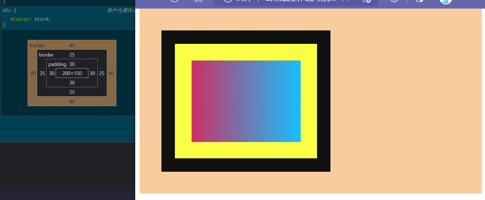
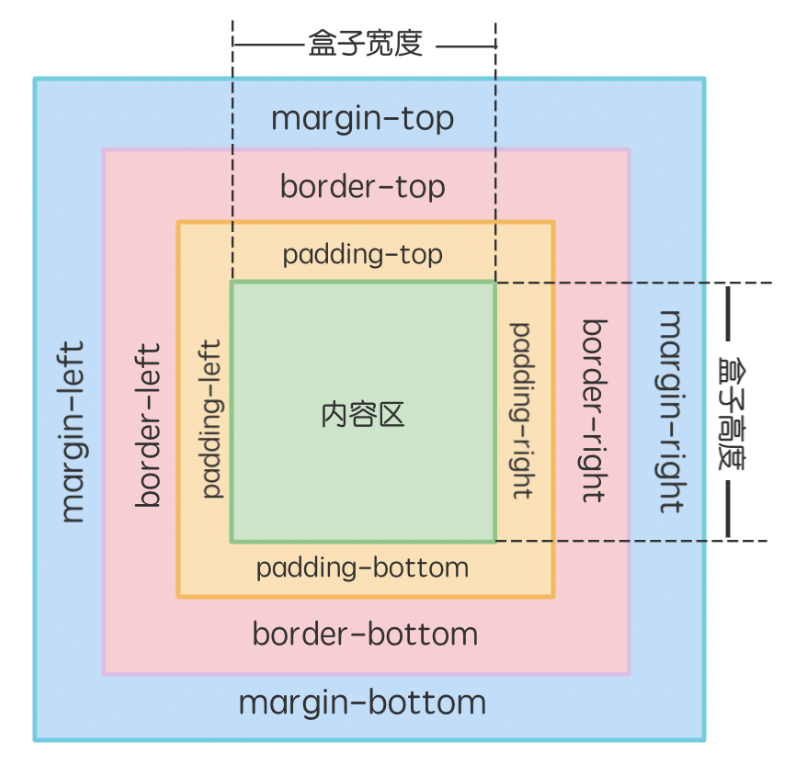
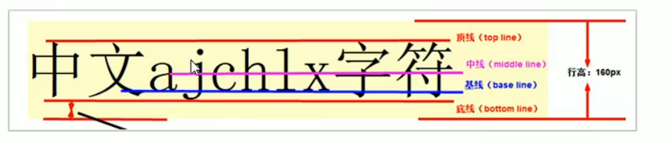

# CSS基础笔记


> 第一，简化网页的代码，提高访问速度：外部的CSS文件会被浏览器保存在缓存里，加快下载显示的速度，也减少了需要上传的代码数量。
>
> 第二，便于维护
>
> 1. 便于修改网站样式：只要修改CSS文件，就可改变整个网站的风格特色。避免一个个网页的修改，大大减少重复劳动的工作量；
>
> 2. 可以重用样式
>
>    第三，页面内容和显示样式分离

## 三个CSS位置

> 1. 行内引入: 使用标签的style属性来引入样式，样式作为style属性的值
> 2. 内联: 在head标签中定义style标签，在标签中使用选择器给匹配到的标签添加样式
> 3. 外链: 在顶目目录中建CSS文件夹，在CSS文件夹中建.CSS类型的文件，可以在CSS文件中创建样式，通过选择器给匹配到的标签添加样式, 需要在html标签中链接需要的CSS文件

```html
<head>
  <!---->
  <style>/*内部样式表*/</style>
  <link rel="stylesheet" href="style.css"><!--外部样式表-->
</head>
<body>
    <div style=""><!--内联样式表-->
        <p></p>
    </div>
</body>
```

**注释**：只能使用`/*注释内容*/`格式

```css
/*我是一段注释!*/
```

## 结构

```css
/*
选择器{
    属性:属性值;
}
*/
body {
    display: flex;
    justify-content: center;
    align-items: center;
    height: 100vh;
    background-color: rgb(206, 72, 72);
}
```

## 常见问题

> 问：为何我的所有CSS未生效？
>
> 答：1. 你可能HTML文档没有写<!DOCTYPE HTML>
>
> 2. 你可能HTML文档没有链接CSS文件

## 选择器种类

### 基础选择器

| 选择器写法 | 释义                     | 权重 |
| ---------- | ------------------------ | ---- |
| div        | 标签选择器(直接选择标签) | 1    |
| .class     | 类选择器                 | 10   |
| #id        | id选择器                 | 100  |
| *          | 通配符选择器             | 0    |

### 进阶选择器

| 选择器写法     | 释义                               | 权重                                                         |
| -------------- | ---------------------------------- | ------------------------------------------------------------ |
| `div p`        | 后代选择器                         | 1+1=2                                                        |
| `div.a > p`    | 子代选择器                         | 10+1=11                                                      |
| `div.a, div.b` | 并集选择器                         | 10+10=20                                                     |
| `div#a + p`    | 邻近兄弟选择器，修饰符号后面的元素 | 100+1=101                                                    |
| `div#a ~ p#b`  | 兄弟选择器                         | 100+100=200                                                  |
| `img[alt]`     | 属性选择器，选择有指定属性的选择器 | 本身10，总体11 |

> 属性选择器拓展：
>
> `img[alt="demo"]`:匹配有指定的属性名和对应属性值的元素
>
> `img[alt^="demo"]`:匹配有指定的属性名和指定值==为开头==的对应属性值的元素
>
> `img[alt*="demo"]`:匹配有指定的属性名和==包含指定值==的对应属性值的元素
>
> `img[alt$="demo"]`:匹配有指定的属性名和指定值==为结尾==的对应属性值的元素
>
> `img[alt~="demo"]`:匹配有指定的属性名和包含指定值==且有空格==的对应属性值的元素

### 链接伪类选择器

> 所谓伪类选择器，是充当类的，指定元素设置一些特殊状态，本身权重都为10
>
> **链接伪类选择器的优先级**：L->V->H->A。可以记作**LoVe HAte**（爱恨）

| 选择器写法 | 释义                  | 权重                                                         |
| ---------- | --------------------- | ------------------------------------------------------------ |
| a:hover    | 悬浮在锚a时的样式     | 伪元素本身10，合起来11 |
| a:visited  | 锚a被访问时的样式     | 本身10                                                       |
| a:active   | 点击悬浮在锚a时的样式 | 本身10                                                       |
| a:link     | 锚a时的默认样式       | 本身10                                                       |

### UI伪类选择器

| 选择器      | 描述                                                         |
| ----------- | ------------------------------------------------------------ |
| :focus      | 给获取焦点的元素设置样式。 |
| :selection  | 给页面中被选中的文本内容设置样式。                           |
| :checked    | 给被选中的单选框或者复选框设置样式。                         |
| :enabled    | 给可用的表单设置样式。                                       |
| :disabled   | 给不可用的表单设置样式。                                     |
| :read-only  | 给只读表单设置样式。                                         |
| :read-write | 给可读写的表单元素设置样式。                                 |
| :valid      | 验证有效。                                                   |
| :invalid    | 验证无效。                                                   |

当你想要定位*多个相同元素中的某个*时，你可能会需要以下伪类：

| 伪类              | 选择器写法示例                                               | 释义                                 |
| ----------------- | ------------------------------------------------------------ | ------------------------------------ |
| `:nth-child(n)`   | `section:nth-child(5)`指代section的第*5*个孩子元素<br />`div:nth-child(2n+1)`或者`div:nth-child(odd)`指代div中的顺序序号为奇数的元素<br />`div:nth-child(2n)`或者`div:nth-child(even)`指代div中顺序序号为偶数的元素 | 匹配第括号里面个子元素               |
| `:nth-of-type(n)` | `section article:nth-of-type(5)`指代section内的article当中的第五个<br />其余使用方法同上 | 匹配众多与指定元素同类的第括号里面个 |
| `:first-child`    | `aside:first-child`会匹配aside中第一个子元素                 | 匹配第一个子元素                     |
| `:last-child`     | `aside:last-child`会匹配aside中最后一个子元素                | 匹配最后一个子元素                   |
| `:only-child`     | `aside:only-child`会匹配aside中唯一一个子元素                | 匹配唯一一个子元素                   |
| `:first-of-type`  | `ul li:first-of-type`会匹配ul中第一个li                      | 匹配众多与指定元素同类的第一个       |
| `:last-of-type`   | `ul li:last-of-type`会匹配ul中最后一个li                     | 匹配众多与指定元素同类的最后一个     |
| `:only-of-type`   | `article p:only-of-type`会匹配article中唯一的段落p           | 匹配众多与指定元素同类的唯一一个     |

### 权重（优先级）

> 1. 后面的样式会覆盖前面相同的样式
>
> 2. 内部样式表的样式会覆盖外部样式表的相同样式
>
>    
>
> 3. 各基本选择器的样式的权重如下，复合选择器时下述选择器的权重之和
>
>    - !important：10000
>
>    - 内联样式：1000
>
>    - id选择器：100
>
>    - 类选择器、伪类选择器：10
>
>    - 元素选择器、伪元素：1
>
>    - 通配符选择器：0

## 颜色

> 颜色的基本显示格式：
>
> 1. RGB（A）格式
> 2. HEX十六进制格式
> 3. HSL(A)格式
> 4. HWB格式
>
> 不支持（HSB(A)）格式

现在颜色的写法在CSS有统一格式，情况如下

| 颜色格式        | CSS写法          | 示例                                      | 备注                      |
| --------------- | ---------------- | ----------------------------------------- | ------------------------- |
| RGB(A)格式      | `rgb(r,g,b)`     | rgb(236,8,104)                            |                           |
|                 | `rgba(r,g,b,a)`  | rgba(236,8,104,0.5)，rgba(104,81,238,60%) | alpha值可以是小数或百分数 |
|                 | `rgb(r g b)`     | rgb(236 8 104)                            | 新式写法                  |
|                 | `rgb(r g b / a)` | rgb(236 8 104 / 0.5)，                    | 新式写法                  |
| HEX十六进制格式 | `#rrggbb`        | #C200FB，#d8d8f6                          | 不区分字母大小写          |
|                 | `#rrggbbaa`      | #0000，#CACAFF7A，#FFFFFFFF               | 新式写法，可以包括alpha值 |
| HSL(A)格式      | `hsl(h,s,l)`     | hsl(335,93%,48%)，hsl(68,0.6,0.8)         |                           |
|                 | `hsla(h,s,l,a)`  | hsl(335,93%,48%,90%)，hsl(68,0.6,0.8,0.1) |                           |

此外还可以写颜色关键字来上色，相关信息略


## 文字字体相关

### 文字排版相关

| 属 性           | 可 取 值                                                     | 描 述                              |
| --------------- | ------------------------------------------------------------ | ---------------------------------- |
| color           | color                                                        | 文字的颜色                         |
| line-height     | normal、number、length、%                                    | 行高                               |
| text-indent     | length、%                                                    | 文本缩进，`2em`:缩进两格           |
| text-align      | left、right、center、justify、start、end                     | 对齐方式                           |
| letter-spacing  | normal、length                                               | 字符间距                           |
| text-decoration | line、color、style、thickness                                | 文本修饰                           |
| text-transform  | `none`, `uppercase`: 转为大写 <br />`lowercase`: 转为小写<br />`capitalize`: 首字母大写。<br />`full-width` | 文字转换                           |
| white-space     | normal、pre、nowrap、pre-wrap、pre-line、break-spaces        | 规定如何处理空白                   |
| line-break      | auto、loose、normal、strict、anywhere、unset                 | 处理如何断开带有标点符号的文本的行 |

### 字体相关属性

| 属 性       | 可 取 值                                                     | 描 述              |
| ----------- | ------------------------------------------------------------ | ------------------ |
| font        | font-style、font-variant、font-weight、font-size（或 line-height）、font-family | 设置所有的字体属性 |
| font-family | 字体名称、inherit                                            | 字体类型           |
| font-size   | xx-small、x-small、small、medium（默认）、large、x-large、xx-large smaller、larger length、%、inherit | 字体大小           |
| font-weight | normal（默认）、bold、bolder、lighter、inherit 100、200…900（400=normal，700=bold） | 字体粗细           |
| font-style  | normal、italic、oblique、inherit                             | 字体风格           |

`text-decoration` 属性用于设置文本的装饰线，例如给文本加下划线、中划线、波浪线等。可取值具体说明如下：

- `text-decoration-line` 设置线的位置，可取值包含：`underline`（下划线）、`overline`（上划线）、`line-through`（中划线）。

- `text-decoration-color` 设置线的颜色。

- `text-decoration-style` 设置线的样式，可取值包含：`wavy`（波浪线）、`solid`（实线）、`dashed`（虚线）。

- `text-decoration-thickness` 设置线的粗细。

`css代码`

```css
/**** html: p.item${太阳只穿一件朴素的光衣，白云却披了灿烂的裙裾。}*5 *****/
.item1 {
    text-decoration: underline lime; /*下划线直线*/
}
.item2 {
    text-decoration: wavy overline lime; /*上划线波浪线*/
}
.item3 {
    text-decoration: line-through lime; /*中划线*/
}
.item4 {
    text-decoration: none; /*无样式*/
}
.item5 {
    text-decoration: dashed underline overline lime 5px; /*圆点上划线和下划线*/
}
```


### 声明新字体

> `@font-face`

```css
p.some-font{
    /* share-tech-mono-regular - latin */
    @font-face {
        font-family: 'Share Tech Mono';
        font-style: normal;
        font-weight: 400;
        src: url('../fonts/the-font.eot'); /* IE9 Compat Modes */
        src: local(''),
            url('../fonts/the-font.eot?#iefix') format('embedded-opentype'), /* IE6-IE8 */
            url('../fonts/the-font.woff2') format('woff2'), /* Super Modern Browsers */
            url('../fonts/the-font.woff') format('woff'), /* Modern Browsers */
            url('../fonts/the-font.ttf') format('truetype'), /* Safari, Android, iOS */
            url('../fonts/the-font.svg#ShareTechMono') format('svg'); /* Legacy iOS */
    }
}
```

## 背景相关

### 总览

背景样式属性用于定义 HTML 元素的背景色、背景图片，同时还可以进行背景定位、背景图片重复、背景图片固定。

| 属性                | 释义                   |
| ------------------- | ---------------------- |
| background-color    | 设置背景色             |
| background-image    | 把图像插入背景         |
| background-size     | 给背景图设置大小       |
| background-position | 改变图像在背景中的位置 |
| background-repeat   | 设置背景图像是否平铺   |

### 背景重复

> 我们规定应该从父元素继承 `background-repeat` 属性的设置。

 `background-repeat` 属性的一些可取值以及每个可取值的含义如下

| 可 取 值  | 描 述                                        |
| --------- | -------------------------------------------- |
| repeat    | 背景图像将在垂直方向和水平方向重复（默认值） |
| repeat-x  | 背景图像将在水平方向重复                     |
| repeat-y  | 背景图像将在垂直方向重复                     |
| no-repeat | 背景图像将仅显示一次                         |

### 背景大小

`background-size` 属性可以用来控制背景图像的显示大小。语法如下：

```css
background-size: length|percentage|cover|contain;
```

| 值         | 描述                                                         |
| ---------- | ------------------------------------------------------------ |
| length     | 设置背景图片高度和宽度。第一个值设置宽度，第二个值设置高度。如果只给出一个值，第二个是设置为 **auto**（自动）。 |
| percentage | 将计算相对于背景定位区域的百分比。第一个值设置宽度，第二个值设置高度。如果只给出一个值，第二个是设置为"auto（自动）" 。 |
| cover      | 此时会保持图像的纵横比并将图像缩放成将完全覆盖背景定位区域的最小大小。 |
| contain    | 此时会保持图像的纵横比并将图像缩放成将适合背景定位区域的最大大小。 |

### 多个背景

background-image 属性的属性值可以包含多个图片的地址。语法如下：

```css
/*图片地址*/
background-image: url(), url(), ..., url();
```

可以使用 background-position 属性设置图片显示的位置。语法如下：

```css
/*图片显示的位置*/
background-position: position1, position2, ..., positionN;
```

我们可以添加 background-repeat 属性设置图片是否重复显示在页面上。语法如下：

```css
/*图片是否重复*/
background-repeat: repeat1, repeat2, ..., repeatN;
```

> background属性简写 属性值顺序：
>
> background-color，background-image，background-repeat，background-attachment，background-position,background-size。

## 盒模型

### 总体概览

> 盒子模型是CSS的基石，指定标签如何显示；页面上的每个元素都被当成一个矩形盒子，占据一定的页面空间，
>
> 块级元素都遵从盒模型，且由盒模型的四个组成成分来组成整个元素的显示。这四个部分分别是：
>
> 1. 外边距`margin`
> 2. 边框`border`
> 3. 内边距`padding`
> 4. 内容`content`(长宽分别用`width`,`height`控制)



| 区域   | 功能                                                         |
| ------ | ------------------------------------------------------------ |
| 内容   | 内容区在模型的中心包含了盒子内的信息也就是 HTML 元素。这些元素可以是文本、图片等。 |
| 内边距 | 内边距是内容区和边框之间的空间，可以被看作是内容区的背景区域。 |
| 边框   | 边框用于标识盒子的边界，介于内边距和外边距之间。             |
| 外边距 | 外边距位于边框外部，是边框与周围之间的空间。                 |

> 1. 内容(Content)):盒子里面所装的内容，
> 2. 内边距（填充，padding):内容到边界之间的距离；
> 3. 边框(border):盒子本身；
> 4. 外边距（空白边，margin):与其他盒子之间的距离；
>
> 默认情况下，盒子边框是无，背景色是透明的，所以，看不到盒子

### 各成分介绍



> 发生嵌套时，若未设父元素的边框和填充，父元素的上下margin会和子元素的上下margin发生叠加。
>
> 若父元素的边框或填充不为0，不存在叠加的问题
>
> 只有标准文档流中 块元素的垂直外边距才会发生外边距合并。行内框、浮动框或绝对定位之间的外边距不会合并。
>

| 间隔：40px                                                   | 间隔：10px                                                   |
| ------------------------------------------------------------ | ------------------------------------------------------------ |
|  |  |

关于盒模型，注意一下几点：

1、边框border默认值为0，即无宽度（不代表不显示），而padding和margin都无法看到，只能看到它们对元素的影响；

2、margin可以设负值，而padding不可以；

3、行内元素如a ,span,img,input等,高度宽度设置无效的，其宽度就是自身文字或者图片的宽度；定义上下外边距不影响行高。

4、大部分html元素的margin,padding默认值为0，但有少数元素的浏览器默认值不为0，例如:body,p,ul,li,form标记等，有必要先设置为0；

margin 属性是用来设置元素的外边距的。

其使用格式如下（顺时针记法）：

```css
margin: 上边距 右边距 下边距 左边距;
```

从上面的内容，我们可以看出 margin 属性是个复合属性，我们可以分开设置上下左右的边距，写法如下：

```css
/*上边距*/
margin-top: 属性值;
/*左边距*/
margin-left: 属性值;
/*右边距*/
margin-right: 属性值;
/*下边距*/
margin-bottom: 属性值;
```

`padding` 属性是一个复合属性，代表我们盒子模型中的填充，也就是内容区域外部的空白区域。

其使用格式如下所示：

```css
padding: 上右下左;

padding-top: 顶部填充值;
padding-left: 左边填充值;
padding-right: 右边填充值;
padding-bottom: 底部填充值;
```

`border` 属性用于设置元素的边框属性，其用法如下所示：

```css
border: border-width border-style border-color;
```

属性值说明如下：

- `border-width`：是边框宽度，宽度一般用数值即可。
- `border-style`：是边框线的样式，一般有 solid（实线）、dotted（圆点）、dashed（虚线）、double（双横线）。
- `border-color`：是边框线的颜色。

border、border-width、border-style、border-color 都是复合属性，我们也可以单独设置某条边框的样式。

例如，border-color 可以写成：

```css
border-top-color: 上边框颜色;
border-right-color: 右边框颜色;
border-bottom-color: 下边框颜色;
border-left-color: 左边框颜色;
```

在 CSS3 中，使用 `border-radius` 属性来设置圆角边框。

`border-radius` 属性的值表示圆角的直径，可以设置四个值，其值的顺序为：左上角，右上角，右下角，左下角。

其语法格式为：

```css
border-radius: 取值;
border-radius: 140px 20px 30px 40px;
```

我们也可以分开设置四个角的属性值，语法如下所示：

```css
border-top-left-radius: 取值;
border-top-right-radius: 取值;
border-bottom-right-radius: 取值;
border-bottom-left-radius: 取值;
```


## 显示相关

`display` 属性可以用来设置元素在页面上的排列方式，也可用来隐藏元素。

| 显示属性内容             | 释义                      |
| ------------------------ | ------------------------- |
| `display: none;`         | 不显示内容，不占用DOM空间 |
| `display: block;`        | 以块状元素显示            |
| `display: inline;`       | 以行内元素显示            |
| `display: inline-block;` | 以行内块元素显示          |
| `display: flex;`         | 以flex元素显示            |
| `display: grid;`         | 以grid元素显示            |

**`display: none;`与`visibility: hidden;`的区别**

> 1. `display: none;`不会占用空间，会脱离文档流，而`visibility: hidden;`或`opacity:0;`会占用空间，只是视觉不可见
>
> 2. `opacity:0;`仍然会接收`click`事件，而`visibility: hidden;`不会接受`click`事件

### 元素种类

*以下图源tailwind.css文档*

**块级元素**

> 特点：
>
> 1. 比较霸道，自己独占一行。
> 2. 高度，宽度、外边距以及内边距都可以控制。
> 3. 宽度默认是容器（父级宽度）的100%。
> 4. 是一个容器及盒子，里面可以放行内或者块级元素。
>
> 常见块级元素：
>
> div、p、h1~h6、ul、ol、dl、li、dd、hr、blockquote、address、menu、pre，
>
> HTML5新增的header、section、aside、footer等


> 注意：专门存放文字的元素是不能再放块级元素的，原本包含块级元素的该元素在渲染时会直接被拦腰截断。
>
> 1. `<h1>-<h6>`标题标签里面也不能嵌套块级元素,只能嵌套文本级元素。
> 2. `<a>`链接标签里面不能嵌套交互性的标签,如`<a>`、`<button>`等,但可以嵌套一些文本标签。
> 3. `<li>`列表项里面不能直接嵌套`<li>`,只能嵌套在`<ul>/<ol>`里面。
>
> | 对象                                                         | 渲染后                                                       |
> | ------------------------------------------------------------ | ------------------------------------------------------------ |
> |  |  |

**行内元素**

> 特点：
>
> 1. 相邻行内元素在一行上，一行可以显示多个。
> 2. 高、宽直接设置是无效的。
> 3. 默认宽度就是它本身内容的宽度。
> 4. 行内元素只能容纳文本或其他行内元素。
> 5. css动画不能应用在行内元素上
>
> 常见行内元素：
>
>    a，img，span，b（粗体），i（斜体）,em（强调）,sub(下标)，sup（上标）,label等。


**行内块元素**

> 特点：
>
> 1. 和相邻行内元素（行内块）在一行上，但是他们之间会有空白缝隙。一行可以显示多个（行内元素特点）。
> 2. 默认宽度就是它本身内容的宽度（行内元素特点）。
> 3. 高度，行高、外边距以及内边距都可以控制（块级元素特点）。
>
> 常见行内块元素：button，input，textarea，select，img，video等


### vertical-align

`vertical-align`属性：用于设置一个元素的垂直对齐方式，但是它只针对于行内元素或者行内块元素有效。

经常用于设置图片或者表单（行内块元素）和文字垂直对齐。


语法：`vertical-align: baseline | top | middle | bottom;`

| 值       | 描述                                     |
| -------- | ---------------------------------------- |
| baseline | ==默认==。元素放置在父元素的基线上。     |
| top      | 把元素的顶端与行中最高元素的顶端对齐     |
| middle   | 把此元素放置在父元素的中部。             |
| bottom   | 把元素的顶端与行中最低的元素的顶端对齐。 |



## 定位相关

### 文档流

就是文档的默认布局方式：元素按照其在HTL中的先后位置至上而下布局，行内元素水平排列，直到当行被占满然后换行，块级元素则会被渲染为完整的一个新行。所有元素==默认==都是普通流定位

### 定位种类和属性

使用以下定位都可以用`top`，`bottom`，`left`，`right`来进行元素位置改变。

**相对定位**

> `position: relative`
>
> 相对于自己初始位置定位
>
> 定位后仍然在标准流，空间不释放，影响兄弟元素

**绝对定位**

> `position: absolute`
>
> 1. 位置相对于最近已定位的祖先元素。如果没有最近已定位的祖先元素相对于body
> 2. 定位后脱离标准流，空间释放，不影响兄弟元素

#### 子绝父相

> 由于位置相对于最近已定位的祖先元素，而相对定位可以确立一个元素的定位。
>
> 我们要某元素A绝对定位后是相对于另外一个元素B，则我们为父元素添加相对元素即可

```css
div.father{
    position:relative;
}

div.son{
    position:absolute;
    left:50%;
    top:50%;
}
```

**固定定位**

> 1. 位置相对可视页面，即使视野移动元素也不会移动
> 2. 定位后脱离标准流，空间释放，不影响兄弟元素

**粘性定位**

### 浮动

> `float:left;`元素向左边浮动
>
> `float:right;`元素向右边浮动
>
> `float:none;`元素不浮动（默认）
>
> 元素首先按照普通流的位置出现，然后根据浮动的方向尽可能的向左边或右边偏移

**浮动应用**

1. 图片文字环绕

```html
<section>
    
    
    <p>
        曲曲折折的荷塘上面，弥望的是田田的叶子。叶子出水很高，像亭亭的舞女的裙。层层的叶子中间，零星地点缀着些白花，有袅娜地开着的，有羞涩地打着朵儿的；正如一粒粒的明珠，又如碧天里的星星，又如刚出浴的美人。微风过处，送来缕缕清香，仿佛远处高楼上渺茫的歌声似的。这时候叶子与花也有一丝的颤动，像闪电般，霎时传过荷塘的那边去了。叶子本是肩并肩密密地挨着，这便宛然有了一道凝碧的波痕。叶子底下是脉脉的流水，遮住了，不能见一些颜色；而叶子却更见风致了。
    </p>
</section>
<style>
    section {
        border: 1px solid green;
        width: 400px;
        float: left;
    }
    img {
        width: 120px;
        height: 120px;
    }
    img:first-child {
        float: left;
    }
    img:last-child {
        float: right;
    }
</style>
```


2. 多列文章展示

   

**清除浮动**

> 为了解决浮动的”一浮都浮“的弊病，特别有clear属性清除浮动
>
> `clear:left;`清除左边浮动
>
> `clear:right;`清除右边浮动
>
> `clear:both;`清除两边浮动

### z-index

> 在元素定位不为static时使用该属性规定层级。不带单位

## 处理溢出

### 内容溢出

> 我们用overflow属性控制当容器内容超出容器部分时的行为。
>
> 以此来控制溢出来的部分是否显示

| 属性值  | 释义                       |
| ------- | -------------------------- |
| auto    | 据需展示滚动条             |
| scroll  | 不管需不需要都会展示滚动条 |
| hidden  | 隐藏溢出，不显示滚动条     |
| visible | 不管溢不溢出都显示溢出元素 |

> 尽管有兼容性问题，但是可以使用`overflow-x`和`overflow-y`来分别控制两个垂直方向上的元素溢出问题
>
> 用法与`overflow`相同

### 文字溢出

`text-overflow` 属性可以设置超长文本省略显示，其语法如下所示：

```css
text-overflow: clip|ellipsis;
```

其属性值的含义如下所示：

| 属性值     | 描述                             |
| ---------- | -------------------------------- |
| `clip`     | 修剪文本。                       |
| `ellipsis` | 显示省略符号来代表被修剪的文本。 |

## 列表相关

| 属 性               | 可 取 值                                               | 描 述                          |
| ------------------- | ------------------------------------------------------ | ------------------------------ |
| list-style          | list-style-type、list-style-position、list-style-image | 在一个声明中设置所有的列表属性 |
| list-style-image    | URL、none                                              | 设置图像为列表项标志           |
| list-style-position | inside、outside、inherit                               | 设置列表中列表项标志的位置     |
| list-style-type     | disc（默认）、circle、square、decimal 等               | 设置列表项标志的类型           |

