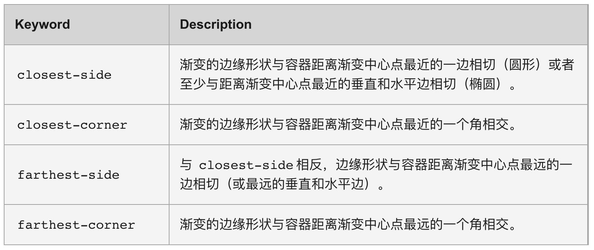

# CSS进阶知识


## CSS新伪类选择器

1. `:is()`：将里面的所有元素类似分解因式似的压缩到一起，可以看成是并集运算符的简写法

参考：[:is | CSS-Tricks - CSS-Tricks](https://css-tricks.com/almanac/selectors/i/is/)

```css
:is(div,section) p{}
/*等同于*/
div p,section p{}
/*同理*/
div:is(.a,.b,.c){}
/*等同于*/
div.a,div.b,div.c{}
```

2. `:where()`：与`:is()`类似，但其权重永远为0

3. `:not()`：淘汰不是括号里面的元素，其余元素得到样式

4. `:has`伪类选择器

> `:has` 伪类选择器是 CSS3 中引入的一种选择器，用于选择包含指定元素的父元素。它的语法为 `:has(selector)`，其中 `selector` 是一个用于匹配的选择器表达式。
>
> has 伪类选择器之所以受欢迎，是因为它提供了一种选择包含特定子元素的父元素的能力，这在以前的 CSS 版本中是不容易实现的。
>
> `:has`里面不接受`::before`，`::after`;但接收伪类。

```css
div:has(.highlight) {  
  background-color: lightgray;  
}
```

## BFC

> 全称Block formatting context（块格式化上下文），BFC属于标准流，作为一个*布局独立*的块元素
>
> 触发条件：
>
> 1. 根元素(\<html>)
>
> 2. 浮动元素（元素的float不是none)
>
> 3. 绝对定位元素（元素的position为absolute或fixed)
>
> 4. display为`inline-block`、`table-cell`、`table-caption`、`table`、`table-row`、`table-row-group`、`table-header-group`、`table-footer-group`、`inline-table`、`flow-root`、`flex`或`inline-flex`、`grid`或`inline-grid`
>
> 5. overflow值不为visible，clip的块元素
>
> 6. contain值为layout、content或paint的元素
>
> 7. 多列容器（元素的column-count或column-width不为auto,包括column-count为1）

BFC作用：

1. 阻止 [外边距重叠](https://developer.mozilla.org/zh-CN/docs/Web/CSS/CSS_Box_Model/Mastering_margin_collapsing)
2. 包含内部浮动，排除外部浮动

## 文字阴影

某些时候我们想让字体看起来更立体，更具艺术性，让人眼前一亮，可以给文字使用文本阴影属性。

在 CSS3 中，我们使用 `text-shadow` 属性来给文本内容添加阴影的效果。

文本阴影的语法格式如下：

```css
text-shadow: x-offset y-offset blur color;
```

- `x-offset` 是沿 x 轴方向的偏移距离，允许负值，必须参数。

- `y-offset` 是沿 y 轴方向的偏移距离，允许负值，必须参数。

- `blur` 是阴影的模糊程度，可选参数。

- `color` 是阴影的颜色，可选参数。

## 文字描边

> 文字描边用`-webkit-text-stroke`实现。不过不能设置内或外描边。
>
> 格式：`-webkit-text-stroke:宽度 颜色`  


> 也可以用`text-shadow`进行模拟。可以效果绝佳地模拟出1px外描边

```css
h1 {
  color: white;
  text-shadow:
   -1px -1px 0 #000,  
    1px -1px 0 #000,
    -1px 1px 0 #000,
     1px 1px 0 #000;
}
```


## 渐变

### 线性渐变

> **`linear-gradient()`** 函数用于创建一个表示两种或多种颜色线性渐变的图片。
>
> `background: linear-gradient(direction, color-stop1, color-stop2, ...);`

语法格式为：

```css
background-image: linear-gradient(side-or-corner|angle, linear-color-stop);
```

参数说明如下：

**side-or-corner|angle**：指定渐变的方向

　　方向值：描述渐变线的起始位置，常用的是to top，to bottom，to left，to right，to right top等等

　　角度值：用角度值来指定渐变的方向。单位为`deg`，常用的是`0deg`、`180deg`等等

| *0deg不是按我们数学的角度向右定义的，默认方向是向上的，是从方向北开始的，所以北才是0deg，* |  |
| ------------------------------------------------------------ | ------------------------------------------------------------ |

**color-stop**

　　color：使用关键字red、rgba等颜色值（透明度也可以设置）

　　stop：是这个颜色块终止位置，换句话说就是这块颜色占的区域，可用百分比表示。

　　*ps：颜色值至少两个，可以有多个*


`background-image: linear-gradient(180deg, #ae8c60, rgba(255, 255, 255, 0.00));`

**重复性线性渐变**

重复性线性渐变是用重复的线性渐变组成的 `<image>`，它与线性渐变的区别在于，它会在所有方向上重复渐变来覆盖整个元素。其语法格式为：

```css
background-image: repeating-linear-gradient(side-or-corner|angle, color-stop);
```

参数说明如下：

- `side-or-corner` 是描述渐变线的起始位置，它包含 to 和两个关键词：第一个指出水平位置 left or right，第二个指出垂直位置 top or bottom。
- `angle` 是用角度值来指定渐变的方向。
- `color-stop` 是由一个 `<color>` 组成，并且跟随一个可选的终点位置。

```css
.item1 {
    background-image: repeating-linear-gradient(
        45deg, #8843f8 0%, #ef2f88 5%, #f47340 10%, #f9d371 15%
    );
}

.item2 {
    background-image: repeating-linear-gradient(
        to left top, #8843f8 0%, #ef2f88 5%, #f47340 10%, #f9d371 15%
    );
}
```


### 径向渐变

径向渐变是由元素中间定义的渐变。

其语法格式为：

```css
background-image: radial-gradient(shape, color-stop);
```

参数说明如下：

- `shape` 设置渐变的形状，其取值有 `circle`（圆形） 和 `ellipse`（椭圆）。
- `color-stop` 设置某个确定位置的颜色值。

**重复性径向渐变**

是用重复性的径向渐变组成的图像。它与径向渐变的区别在于，它会从原点开始重复径向渐变来覆盖整个元素。

其语法格式为：

```css
background: repeating-radial-gradient(extent-keyword, color-stop);
```

参数说明如下：


- `extent-keyword` 是描述边缘轮廓的具体位置，关键字常量如下所示：

  

- `color-stop` 是某个确定位置的固定颜色值。

```css
.gradient1 {
    background: repeating-radial-gradient(
        closest-corner, #8843f8 0%, #ef2f88 5%, #f47340 10%, #f9d371 15%
    );
}
.gradient2 {
    background: repeating-radial-gradient(
        farthest-side, #8843f8, #ef2f88, #f47340, #f9d371
    );
}
```


## 

## Flex弹性盒子

> flex是一种一维的布局模型。适用于调整子元素的空间布局。
>
> 优势：操作方便，布局简便，十分适用于移动端

### 布局原理

**主轴和副轴** ：flex布局的最基本的概念，我们使用 flexbox 的所有属性都跟这两根轴线有关。主轴由 `flex-direction` 定义，默认为x轴（如下第一个图），副轴垂直于它。flexbox的子元素沿着主轴分布。

**flex-direction** ：定义主轴的方向。可填四个值：`row` 、`row-reverse`、`column`、`column-reverse`。效果如下四图。


### flex父级调整属性

总览：

**flex-wrap** ：控制子元素是否换行。可以设置换行（`wrap`），也可以设置默认的不换行（`nowrap`），还可以设置逆向换行（`wrap-reverse`）

**flex-flow**： flex-direction和flex-wrap的属性简写，用此属性可以一次性设置flex元素的子元素流向。

如`flex-flow: wrap column;`、`flex-flow: row-reverse nowrap;`

**justify-content** ：控制子元素在主轴的排布方式。相关值如下：

| 值            | 释义                                                 |
| ------------- | ---------------------------------------------------- |
| center        | 使排布的元素居中                                     |
| flex-start    | 使排布的元素向始端对齐（默认）                       |
| flex-end      | 使排布的元素向终端对齐                               |
| space-around  | 使每个元素的左右空间相等                             |
| space-between | 把元素排列好之后的剩余空间拿出来，平均分配到元素之间 |
| space-evenly  | 使排布的元素                                         |

**align-items** :控制<u>单行</u>（无换行，nowrap）子元素在主轴的排布方式。相关值如下：

| 值           | 释义                                                 |
| ------------ | ---------------------------------------------------- |
| `center`     | 使排布的元素居中                                     |
| `flex-start` | 使排布的元素向始端对齐（默认）                       |
| `flex-end`   | 使排布的元素向终端对齐                               |
| `baseline`   | 使排布的元素向对齐                                   |
| `stretch`    | 使排布的元素（没设置固定的副轴长度）在交叉轴进行延展 |


> align-items: baseline;

**align-content** :控制<u>多行</u>（有换行，wrap）子元素在主轴的排布方式。相关值如下：

| 值              | 释义                                                 |
| --------------- | ---------------------------------------------------- |
| `center`        | 使排布的元素居中                                     |
| `flex-start`    | 使排布的元素向始端对齐（默认）                       |
| `flex-end`      | 使排布的元素向终端对齐                               |
| `space-around`  | 使每个元素的左右空间相等                             |
| `space-between` | 把元素排列好之后的剩余空间拿出来，平均分配到元素之间 |
| `stretch`       | 使排布的元素（没设置固定的副轴长度）在交叉轴进行延展 |

### flex子元素调整属性

**order**

可以为子元素安排次序。一般元素的order值为0，有order值且值大于其他有order值的元素会排在order值第二大的元素的右边。对于无order值的，正值会使值在右边排列，负值会在左边排列。此属性在下面的==grid布局中也适用==·。

下面用*FLEXBOX FROGGY*游戏来展示order值的功能，其中绿青蛙无order值。

| 黄青蛙的样式表 | 渲染                                                         |
| -------------- | ------------------------------------------------------------ |
| `order: 0;`    |  |
| `order: -1;`   |  |
| `order: 1;`    |  |

**分配剩余空间**

|    属性     |                        可能值                        | 释义                                                         |
| :---------: | :--------------------------------------------------: | :----------------------------------------------------------- |
| flex-basis  |              长度值（px, em等）或百分比              | 定义了在分配多余空间之前，项目占据的主轴空间（main size）。<br />它设置项目的初始大小。 |
|  flex-grow  |             数字（默认值为0，即不增长）              | 定义项目的放大比例，它决定了当有多余空间时，项目将如何分配这些空间。<br />如果所有项目的flex-grow都设置为1，则它们将等比例地占据剩余空间。 |
| flex-shrink |            数字（默认值为1，即可以缩小）             | 定义项目的缩小比例，它决定了当空间不足时，项目将如何缩小。<br />如果所有项目的flex-shrink都设置为1，则它们将等比例地缩小以适应容器。 |
|    flex     | 简写属性，用于设置flex-grow, flex-shrink和flex-basis | 它允许你同时设置三个属性。其值可以是以下三种形式之一：<br />1) 一个无单位数（flex-grow），<br />2) 一个长度或百分比（flex-basis），<br />3) 一个无单位数，一个长度或百分比和一个无单位数（分别对应flex-grow, flex-basis和flex-shrink）。<br />例如：`flex: 1 1 auto;` 表示flex-grow为1，flex-shrink为1，flex-basis为auto。 |

##  Grid弹性布局


> 在线操作网站：[Interactive CSS Grid Generator | Layoutit Grid](https://grid.layoutit.com/)

### Grid所在元素调整属性

要规定一个元素为grid，只需改变display属性为grid即可，即`display:grid;`。

`grid`是有块级元素的属性的，其拥有行内元素的性质的grid元素是`inline-grid`

要利用grid元素规定布局，则需要设置grid-template属性，其相关属性分别为`grid-template-columns`和`grid-template-rows`。前者是设置列的，后者是设置行的。设置后里面的元素就会以此网格从上到下，从左到右排布。

```css
div.a{
    display:grid;
    grid-template-columns: 200px 200px 200px 200px;
    grid-template-rows: 20% 30% 20% 10% 20%; /*加起来总和要小于等于100%*/
}
```

可以用`repeat()`函数来简化一些属性的写法，参数为`repeat(count,length)`；可以叠用，也可以混在其他的长度单位当中，如`grid-template-columns: 80px 1fr repeat(3,250px) 10%;`

```css
div.a{
    display:grid;
    grid-template-columns: repeat(4,200px);
    grid-template-rows: repeat(5,20%);
}
```

如果用`grid-template`属性，注意格式为`grid-template-rows / grid-template-columns`

**fr单位**

我们用fr单位来分配网格内部的剩余空间。fr数越大，所占剩余比例越大。

`index.html`

```html
<div class="main">
  <div class="img rev ikun2"></div>
  <div class="img rev ikun1"></div>
  <div class="para">清明时节雨纷纷，唱跳rap蔡徐坤</div>
  <div class="img ikun1"></div>
  <div class="img ikun2"></div>
</div>
```

`style.css`

```css
div.main{
    width: 850px;
    height: 150px;
    display: grid;
    grid-template: 1fr/repeat(2,1fr) 2fr repeat(2,1fr);
}
```


可以看出来中间的段落占比是其它格子的两倍长，其它格子长度都是平均分配的

除此之外还可以用`grid-template-areas`来通过命名来规定布局。

值当中每一个给定的字符串会生成行，用空格分隔的字符串会生成列。多个同名的，跨越相邻行或列的单元称为网格区块 (grid area)。非矩形的网格区块是无效的。

`index.html`

```html
<div class="main">
    <div class="aa">a</div>
    <div class="ab">b</div>
    <div class="ac">c</div>
</div>
```

`style.css`

```css
div.main {
    width: 250px;
    height: 250px;
    background-color: rgb(255, 255, 255);
    /* grid-template: repeat(4, 1fr) / repeat(3, 1fr); */
    grid-template-areas:
        "a a c"
        "a a c"
        "b b c"
        "b b c";
}

div.aa {
    --grid-area:a;
    background-color: rgb(255, 31, 225);
}

div.ab {
    --grid-area:b;
    background-color: rgb(71, 71, 255);
}

div.ac {
    --grid-area:c;
    background-color: rgb(255, 241, 46);
}

div[class^="a"]{
    grid-area: var(--grid-area);
    display: flex;
    justify-content: center;
    align-items: center;
}
```


不想生成分布的格子可以用`.`符号写进去。

```css
body div.main {
    /** ...*/
    grid-template-areas:
        "a a c"
        ". . c"
        "b b c"
        "b b c";
}
```


### Grid子元素调整属性

对于排布在grid的子元素来说，可以用`grid-column`和`grid-row`来确立其在网格中的布局。而这两个属性又可以分别分为`grid-column-start`，`grid-column-end`，`grid-row-start`和`grid-row-end`。在此先讲刚刚前面两个属性。后面的属性也类似。

网格线数值为正值（>0）时一般来说是划定==从左向右第n个方框的**左网格线**==，负值（<0）时一般来说是划定==从右向左第n个方框的**右网格线**==。grid-column-start，grid-column-end以及grid-row-start，grid-row-end之间无大小比较关系。一般可取值起点为+-1，可取值终点为+-(n+1)，设置为0相当于没设。详情可以看下面的网格标识图。

在不指定另一属性的情况下，内容会在grid-column-start之右，grid-column-end之左；grid-row-start之下，grid-row-end之上

注意！要想 设置此属性，不要给该子元素设置高宽！

`index.html`

```html
<div class="b">
  <div class="aa"></div>
  <div class="ab"></div>
  <div class="ac"></div>
  <div class="ad"></div>
  <div class="ae"></div>
</div>
```

除了用网格线的数值来定位，还可以确定元素在网格所占的格子数。在此用`span <number>`表示。切记span和数字之间一定要空格隔开！在这些属性当中是表示对另一边相距的网格子数。

```css
div.aa {
    background-color: rgb(14, 27, 175);/*蓝*/
    grid-column-start: 2;
    grid-column-end: -3;
}
div.ab {
    background-color: rgb(155, 139, 46);/*黄*/
    grid-row-start: 2;
    grid-row-end: -4;
}
div.ac {
    background-color: rgb(191, 48, 172);/*紫*/
    grid-row-start: span 4;
    grid-row-end: -2;
}
div.ad {
    background-color: rgb(46, 155, 59);/*绿*/
    grid-column-start: 4;
    grid-column-end: span 2;
}
div.ae {
    background-color: rgb(171, 69, 69);/*红*/
    grid-column-start: 4;
    grid-column-end: span 3;
    grid-row-start: span 2;
    grid-row-end: -3;
}
```


> 这种标识完美展示了前面介绍的网格线的标法。
>
> 以上的网格标识可以到`检查页面>布局>网格覆盖>点击你要审查的grid元素`即可显示。还可以调整显示颜色（kksk）

之后用grid-column简写属性来控制元素的在行的布局，用grid-row简写属性来控制元素的在行的布局。其语法分别是：

`grid-column: <grid-column-start>/<grid-column-end>;`

`grid-row: <grid-row-start>/<grid-row-end>`

最后可以用grid-area来控制子元素的整个行列布局

 `grid-area: grid-row-start / grid-column-start / grid-row-end / grid-column-end`

> 记忆要领：奇数行，偶数列，先始后终。

```css
/*上面代码的等价代码*/
div.aa {
    background-color: rgb(14, 27, 175);/*蓝*/
    grid-column: 2/-3;
}
div.ab {
    background-color: rgb(155, 139, 46);/*黄*/
    grid-row: 2/5;
}
div.ac {
    background-color: rgb(191, 48, 172);/*紫*/
    grid-row: span 4/-2;
}
div.ad {
    background-color: rgb(46, 155, 59);/*绿*/
    grid-column: 4/span 2;
}
div.ae {
    background-color: rgb(171, 69, 69);/*红*/
    grid-column-start: 4/span 3;
    grid-row: span 2/ -3;
    /*和下面写法等价*/
    grid-area: span 2/4/-3/span 3;
}
```

### Grid子元素在网格的对齐方式

对于一些有宽高的元素在网格的排布会是默认在左上角的。


而grid元素重点是可以像flex元素一样，可以用对齐属性来调整元素的位置对齐方式。


**`justify-items`,`align-items`**用来控制网格内元素的对齐方式。用法和在flex元素的类似。

```css
/* div.father>div.child*6 */

div.father{
    width: 150px;
    height: 150px;
    margin: 10px;
    background-color: rgb(49, 49, 49);
    display: grid;
    grid-template-columns: repeat(2,1fr);
    grid-template-rows: repeat(3,1fr);
}

div.child{
    width: 25px;
    height: 25px;
    background: linear-gradient(45deg, #9563ff 50%, #e100ff);
}
```

| none                                                         | align-items: end;                               | justify-items: center;<br />align-items: center;             | justify-items: end;<br />align-items: end;                   |
| ------------------------------------------------------------ | ----------------------------------------------- | ------------------------------------------------------------ | ------------------------------------------------------------ |
|  |  |  |  |

**`justify-content`,`align-content`**用来控制整个网格区域在父元素的对齐方式。用法和在flex元素的类似。

理论上，用`fr`单位布局的grid元素是用不上这两个属性的。

```css
/* div.father>div.child*6 */

div.father{
    width: 150px; /*父元素大*/
    height: 150px;
    margin: 10px;
    background-color: rgb(49, 49, 49);
    display: grid;
    grid-template-columns: repeat(2,30px); /*网格范围小*/
    grid-template-rows: repeat(3,30px);
}

div.child{
    width: 20px;
    height: 20px;
    background: linear-gradient(45deg, #9563ff 50%, #e100ff);
}
```

| none；可以看到网格范围比父元素本身还小                       | align-items: space-between;                                  | justify-content: center;<br />align-content: center;         |
| ------------------------------------------------------------ | ------------------------------------------------------------ | ------------------------------------------------------------ |
|  |  |  |

再看一个综合

| justify-content: space-around;<br/>align-content: space-around;<br/>justify-items: center;<br/>align-items: center; | justify-content: space-between;<br/>align-content: space-between;<br/>justify-items: center;<br/>align-items: center; |
| ------------------------------------------------------------ | ------------------------------------------------------------ |
| 边缘留空居中                                                 | 平铺居中                                                     |
|  |  |

```css
/*边缘留空居中代码*/
div.center-center{
    justify-content: space-around;
    align-content: space-around;
    justify-items: center;
    align-items: center;
}
/*平铺居中代码*/
div.flatten-center{
    justify-content: space-between;
    align-content: space-between;
    justify-items: center;
    align-items: center;
}
```

## CSS过渡 


> CSS3 过渡是元素从一种样式逐渐过渡到另一种样式。其语法如下所示：
>
> 它是一个复合属性，我们也可以如下分开使用这几个属性。

```css
transition: 指定属性 持续时间 速度曲线 开始时间;
/********** 等价于：**********/
transition-property: 属性值; /*指定属性名*/
transition-duration: 属性值; /*完成过渡这一过程的时间*/
transition-timing-function: 属性值; /*速度曲线*/
transition-delay: 属性值; /*过渡的开始时间*/
```

**transition-timing-function 属性**

`transition-timing-function` 属性用来设置过渡效果从开始到结束的时间曲线

它有很多可用属性值，常用属性值如下表所示。

| 属性值                  | 说明                                                         | 等价贝瑟函数                    |
| ----------------------- | ------------------------------------------------------------ | ------------------------------- |
| `ease`                  | 慢速开始，然后变快，然后慢速结束的过渡效果。                 | `cubic-bezier(0.25,0.1,0.25,1)` |
| `linear`                | 以相同速度开始至结束的过渡效果                               | `cubic-bezier(0,0,1,1)`         |
| `ease-in`               | 以慢速开始的过渡效果                                         | `cubic-bezier(0.42,0,1,1)`      |
| `ease-out`              | 以慢速结束的过渡效果                                         | `cubic-bezier(0,0,0.58,1)`      |
| `ease-in-out`           | 以慢速开始和结束的过渡效果                                   | `cubic-bezier(0.42,0,0.58,1)`   |
| `cubic-bezier(n,n,n,n)` | 规定在 `cubic-bezier()` 函数中定义自己的值。可能的值是 0 至 1 之间的数值。 | /                               |

`steps()`函数规定离散式的动画效果

| 属性值                      | 说明                                                         |
| --------------------------- | ------------------------------------------------------------ |
| `steps(int,start 或者 end)` | `steps()` 有两个参数，第一个为步长，其值必须为整数，第二个值为可选值，它有两个取值，分别是 start 和 end。 |
| `step-start`                | 相当于 `steps(1, start)`。                                   |
| `step-end`                  | 相当于 `steps(1, end)`。                                     |

## CSS变换

### 变换基础

> 

### 2D变换

| 变换             | 释义                                                         | 单位           |
| ---------------- | ------------------------------------------------------------ | -------------- |
| `translate(x,y)` | 元素按照指定值沿着*元素的 X 轴和 Y 轴*移动                   | px             |
| `translateX(x)`  | 元素按照指定值沿着*元素的 X 轴移动*                          | px             |
| `translateY(y)`  | 元素按照指定值沿着*元素的 Y 轴移动*                          | px             |
| `rotate(x,y)`    | 规定参数为正时，*顺时针*旋转；<br />参数为负时，*逆时针*旋转。 | deg, rad, turn |
| `rotateX(x)`     | 元素按照指定角度值以*元素的 X 轴为旋转轴*旋转，角度方向规定如上 | deg, rad, turn |
| `rotateY(y)`     | 元素按照指定角度值以*元素的 Y轴为旋转轴*旋转，角度方向规定如上 | deg, rad, turn |
| `scale(x,y)`     | 让元素同时沿着 X 轴和 Y 轴扩大 2 倍                          | /              |
| `scaleX(x)`      | 让元素沿着 X 轴扩大 2 倍                                     | /              |
| `scaleY(y)`      | 让元素沿着 Y 轴扩大 2 倍。                                   | /              |
| `skew(x,y)`      | 元素会沿着X，Y轴倾斜指定的角度。                             | deg, rad, turn |
| `skewX(x)`       | 元素会沿着X轴倾斜指定的角度。正值会使元素向右倾斜，负值会使元素向左倾斜。 | deg, rad, turn |
| `skewY(y)`       | 会沿着Y轴倾斜指定的角度。正值会使元素向下倾斜，负值会使元素向上倾斜。 | deg, rad, turn |


### 3D变换

**建立3D环境**

| 属性               | 描述                                         | 值                            |
| ------------------ | -------------------------------------------- | ----------------------------- |
| perspective        | 观察者与 z=0 平面的距离                      | XXpx                          |
| perspective-origin | 观察者的位置，用作 perspective属性的消失点。 | 略                            |
| transform-style    | 设置元素的子元素是位于 3D 空间中还是平面中   | `flat`：<br />`preserve-3d`： |


**3d变换种类**

以下只列出在3d环境中新增的变换方法

|           变换           |                             释义                             |
| :----------------------: | :----------------------------------------------------------: |
|   `translate3d(x,y,z)`   | 沿着3D空间中的X轴、Y轴和Z轴移动元素。参数x、y和z分别表示在三个轴上的移动距离。 |
|     `translateZ(z)`      | 沿着Z轴移动元素。参数z表示在Z轴上的移动距离。这是`translate3d`的一个特例，只移动Z轴。 |
| `rotate3d(x,y,z, angle)` | 沿着通过原点(0,0,0)和由(x,y,z)定义的向量的旋转轴旋转元素。最后一个参数angle表示旋转的角度。 |
|       `rotateZ(z)`       | 沿着Z轴旋转元素。参数z表示旋转的角度。这是`rotate3d`的一个特例，只旋转Z轴。 |
|     `scale3d(x,y,z)`     | 对元素进行3D缩放。参数x、y和z分别表示在三个轴上的缩放因子。  |
|       `scaleZ(z)`        | 对元素在Z轴上进行缩放。参数z表示在Z轴上的缩放因子。这是`scale3d`的一个特例，只缩放Z轴。 |
|       `matrix3d()`       | 通过一个4x4的矩阵来定义3D转换。这个方法允许进行复杂的3D变换操作，但需要一定的数学基础来理解和使用。 |
|     `perspective()`      | 和同名属性一样，还是表示观察者与 z=0 平面的距离，设置观察者与z=0平面的距离，以创建3D透视效果。它接受一个参数，表示距离值，单位是像素。该值越大，透视效果越弱，反之则越强。 |

### 复合变换

> 对于复合变换，下次变换的坐标朝向还是根据元素的坐标朝向来进行变换。

| 无变换 | `transform:none`                              |    |
| ------ | --------------------------------------------- | ------------------------------------------------------------ |
| 变化前 | `transform:rotateZ(270deg)`                   |  |
| 变化后 | `transform:rotateZ(270deg)  translateY(80px)` |  |

## CSS动画

首先你要定义具体的CSS动画

> 利用`@keyframes`来定义一个CSS动画
>
> 在`@keyframes`后面跟上动画名，在内部指定各时间点的CSS样式。
>
> 0%，100%可以分别用from、to关键词代替。

```css
@keyframes my-animate{
    /*0% {   */
    from {
        transform: translate(0px);
    }
    50% {
        transform: translate(100px);
    }
    75% {
        transform: translate(-100px);
    }
    /*100% {   */
    to {
        transform: translate(0px);
    }
}
```

> 然后就是应用创造的CSS动画
>
> 可以通过animation属性来应用一个CSS动画，并设置相关动画属性。其语法格式为：

```css
animation: 动画名 完成动画的周期 是否重复;
```

`animation` 属性是一个复合属性，它的子属性如下所示。

| 属性                        | 描述                                                         |
| --------------------------- | ------------------------------------------------------------ |
| `animation-name`            | 规定 `@keyframes` 动画的名称。                               |
| `animation-duration`        | 规定动画完成一个周期所花费的秒或毫秒。默认是 0。             |
| `animation-timing-function` | 规定动画的速度曲线。默认是 `ease`。                          |
| `animation-fill-mode`       | 规定当动画不播放时（当动画完成时，或当动画有一个延迟未开始播放时），要应用到元素的样式。 |
| `animation-delay`           | 规定动画何时开始。默认是 0。                                 |
| `animation-iteration-count` | 规定动画被播放的次数。默认是 1。                             |
| `animation-direction`       | 规定动画是否在下一周期逆向地播放。默认是 `normal`。          |

## CSS变量

> CSS现在支持的变量格式以`--`开头
>
> 要使用时用`var()`函数括起来
>
> 可以分为全局和局部变量

```css
/*给HTML根元素加上的CSS变量是全局的*/
:root{
    --theme-color: #da08ff;
    --len-kind1: 2em;
    --bgi-1:'./img/sample1.jpg';
    --bgi-2:'./img/sample2.jpg';
}

/*其余地方的CSS变量是局部的*/
div.banner{
    --lr-paddin:'20px';
    --ud-paddin:'30px';
    padding: var(--ud-paddin) var(--lr-paddin);/*CSS变量的使用*/
}
```

> CSS变量的预设值是在无法读取该CSS变量名的时候自动套用的。
>
> 比如`var(--i,10px)` 

## 响应式设计相关

### 响应式策略

> 1. 百分比布局
> 2. flex布局
> 3. 媒体查询+rem布局

移动端响应式策略：先考虑移动端，再考虑电脑端。

### 媒体查询

`@media` 媒体查询使得无需修改内容，便可以使样式应用于某些特定的设备范围。

媒体查询就像是样式表中的 if 语句，通过判断表达式的真假来执行特定的分支 （加载特定的样式）

`@media` 可以直接写在 CSS 样式中，或者可以针对不同的媒体设备，从外部链入不同的 stylesheets（外部样式表）。接下来，一起看下两种情况的使用语法：

**1. 直接写在 CSS 样式中**

定义语法如下：

```css
@media mediatype and|not|only (media feature) {
    CSS-Code;
}
```

一个完整的媒体查询由以下五部分组成：

- 必须是以 `@media` 开头 。
- 使用 `mediatype` 指定媒体（设备）类型 。
- 使用 `and | not | only` 逻辑操作符构建复杂的媒体查询 。
- 使用 `media feature` 指定媒体特性 。
- CSS-Code 位置是要设置的 CSS 样式。

`mediatype` （媒体类型）取值范围如下：

| 值     | 描述                               |
| ------ | ---------------------------------- |
| all    | 适用于所有设备                     |
| print  | 用于打印机和打印预览               |
| screen | 用于电脑屏幕，平板电脑，智能手机等 |
| speech | 用于屏幕阅读器等发声设备           |

> 被废弃的媒体类型： CSS2.1 和 Media Queries 3 定义了一些额外的媒体类型( tty, tv, projection, handheld, braille, embossed, 以及 aural )，但是它们在 Media Queries 4 中已经被废弃，并且不应该被使用。aural 类型被替换为具有相似效果的 speech 。

逻辑操作符取值范围如下：

| 值   | 描述                                                         |
| ---- | ------------------------------------------------------------ |
| and  | 用于将多个媒体查询规则组合成单条媒体查询，当每个查询规则都为真时则该条媒体查询为真 |
| not  | 用来排除某种设备                                             |
| only | 用以指定某特定媒体设备                                       |

`media feature` （媒体特性）常用取值如下：

| 值          | 描述                                                         |
| ----------- | ------------------------------------------------------------ |
| max-width   | 定义输出设备中的页面最大可见区域宽度                         |
| max-height  | 定义输出设备中的页面最大可见区域高度                         |
| min-width   | 定义输出设备中的页面最小可见区域宽度                         |
| min-height  | 定义输出设备中的页面最小可见区域高度                         |
| orientation | 视口（viewport）的旋转方向。portrait ：表示 viewport 处于纵向，即高度大于等于宽度 ； landscape ：表示 viewport 处于横向，即宽度大于高度 |

如果你还想了解更多完整 `media feature` 取值，请访问：`https://developer.mozilla.org/zh-CN/docs/Web/CSS/Media_Queries/Using_media_queries`。

**2. 针对不同的媒体设备，从外部链入不同的 stylesheets（外部样式表）**

用 `media` 属性为 `<link>` 指定特定的媒体类型。定义语法如下：

```css
<link rel="stylesheet" media="mediatype and|not|only (media feature)" href="mystyle.css">
```

其中，`mediatype`、逻辑操作符、`media feature` 的取值与第一种直接写在 CSS 样式中的取值相同，这里不再进行赘述。

二者区别在于，第一种写在 CSS 样式中是当条件成立后，执行 CSS Code , 第二种则是条件成立后，加载对应的外部样式表。

## 杂糅知识

### 处理文字省略

[如何实现单行／多行文本溢出的省略（...）--绕过坑道的正确姿势 - 知乎 (zhihu.com)](https://zhuanlan.zhihu.com/p/156141915)

**单行文字省略**

> 要点：
>
> 1. 隐藏溢出部分：`overflow: hidden;`
>
> 2. 使文本内的换行无效：`white-space: nowrap;`
>
> 3. 文字超出宽度则显示ellipsis省略号：`text-overflow: ellipsis;`
>
>    下面样式规则可以直接运用到一个单行文本段落上。

```css
.single-line-text-ellipse{
    overflow: hidden;
    white-space: nowrap;
    text-overflow: ellipsis;
}
```


**多行文字省略**

> *注意：此方法有兼容性问题！*
>
> 要点：
>
> 1. 将文字元素显示改为`-webkit-box`伸缩盒子模型显示：`display: -webkit-box;`
>
> 2. 从上到下垂直排列子元素（设置伸缩盒子的子元素排列方式）：`-webkit-box-orient: vertical;`
>
> 3. 控制最多显示n行：`-webkit-line-clamp: n;`
>
> 4. 超出的文本隐藏：`overflow: hidden;`
>
>    并使文字超出宽度则显示ellipsis省略号：`text-overflow: ellipsis;`（可以不写，但最好写上）
>
> 5. 如果是遇到较长英文单词还要断词：`word-break: break-all;`或者`word-break: break-word;`（不推荐）

```css
.multiple-line-text-ellipse{
    /****盒子配置****/
    display: -webkit-box;
    -webkit-box-orient: vertical;
    -webkit-line-clamp: 2;
    overflow: hidden;
    /****设置省略方式****/
    text-overflow: ellipsis;
    /****单词截断****/
    word-break: break-all;
}
```

| 不断词 |               |
| ------ | ------------------------------------------------------------ |
| 断词   |  |

> 此方法对于inline-block的子元素来说同样适用！这会导致该子元素作为整体省略。


### 图标字体 

> 推荐网站：
>
> 1. [iconfont-阿里巴巴矢量图标库](https://www.iconfont.cn/)
> 2. [Font Awesome 中文网 – | 字体图标](http://www.fontawesome.com.cn/)
> 3. [Icon Font & SVG Icon Sets ❍ IcoMoon](https://icomoon.io/)


### CSS三角

> 可以通过无大小，即width:0;的块级元素进行边框外观的修改。
>
> 通过控制边框大小border-width控制三角形大小
>
> 然后除了需要有的一侧其他的边框都变成透明色即可
>
> 默认会得到等腰直角三角形

```css
div.target{
    width: 0;
    border: 30px solid;
    border-color: transparent;
    border-bottom-color: transparent;
    border-right-color: transparent;
    border-top-color: crimson;
    border-left-color: transparent;
}
```


> 可以通过编辑各边框的宽度来调整三角形的形状
>
> 如果矩形两邻边的边框宽度相等，则直接可以取得以对角线为斜边的直角三角形


> 如果宽或高不为0，那么你可以提取梯形


### 精灵图

> CSS Sprites，又称CSS精灵，是一种网页图片应用处理方式。
>
> 它允许将一个页面涉及到的所有零星图片都包含到一张大图中
>
> 利用CSS的“background-image”，“background- repeat”，“background-position”的组合进行背景定位， 访问页面时避免图片载入缓慢的现象。
>
> 下面就是一个典型的css精灵图


> 在使用的时候，上面提到的三个参数要这样用：
>
> “background-image”：当前的精灵图
>
> “background- repeat”：单个元素用no-repeat；背景块的话据需求选择重复方式
>
> “background-position”：定位到该元素在精灵图的位置
>
> 注意在定位的时候的坐标是负数，此外还要限制盒子的宽高。


### 鼠标光标

> 为浏览器某些元素添加上自定义的游标状态，以及自定义的鼠标光标像。
>
> 改成另一种鼠标状态：`cursor: <状态>;`
>
> 改成另一种自定义鼠标光标：`cursor: url('custom.cur') <指定状态>;`

| 另一种状态                                        | 自定义鼠标光标                                               |
| ------------------------------------------------- | ------------------------------------------------------------ |
| .png) |  |

### 视觉上消失

> 用于要消失但常规方法会有副作用的情况上，如文件上传表单

```css
.visually-hidden {
  clip: rect(0 0 0 0);
  clip-path: inset(50%);
  height: 1px;
  overflow: hidden;
  position: absolute;
  white-space: nowrap;
  width: 1px;
}
```

### CSS倒影

> 可以生成元素的倒影效果
>
> 其中第二个参数还可以控制倒影距离元素的距离
>
> CSS倒影更多玩法参看：https://mp.weixin.qq.com/s/VHS8KFQTnJbu6zQyR9fPmg

```css
.reflection{
    -webkit-box-reflect: below 0 linear-gradient(180deg, #fff0, #0004 100%);
}
```

### CSS暗黑模式

```css
html {
    filter: invert(1) hue-rotate(180deg);
}
```

### CSS悼念模式

```css
html {
    filter: grayscale(.95);
    -webkit-filter: grayscale(.95);
}
```

### CSS文字自适应颜色

> 为了让内容文字足够清晰可见，文字和背景之间需要有足够的对比度。换句话说，当背景是深色时，文字为白色，当背景是浅色时，文字为黑色

```css
.clear-text{
    filter: grayscale(1) contrast(9999) invert(1); /*颜色并不需要配置*/
}
```

### 选择和拖拽控制

分别使用`user-select`属性和`-webkit-user-drag`属性，前者控制用户能否选中文本，后者控制用户能否拖动元素。

**auto**：据情况变化属性值。

**text**：用户可以选中文本。/**element**：用户可以拖动元素。（默认）

**none**：元素及其子元素的文本不可选中/拖动元素。

**all**：点一次可选择全部文本。（前者特有）

**contain**：允许在元素内选择；但是，选区将被限制在该元素的边界之内。（前者特有）

### 滤镜属性

> `filter`是CSS的滤镜属性，可以给当前的元素添加相应的滤镜效果
>
> `backdrop-filter`最适合制作毛玻璃效果

### 混合模式

可参考网站：[mix-blend-mode - CSS: Cascading Style Sheets | MDN (mozilla.org)](https://developer.mozilla.org/en-US/docs/Web/CSS/mix-blend-mode)

css3早已支持类似ps的图层混合模式（mix-blend-mode）的属性了，可以使图片能更好融入对应颜色，或加入十分炫酷的效果。

此属性默认值为normal（无任何效果）。所有属性值及对应效果如下：

### 滚动相关属性

**滚动锁定**

滚动到一定地方就会有锁定到某个画面的效果。

下面代码可以完美实现全屏内容的滚动锁定

```css
/*  div.father>div.child*5 */
.father {
    height: 100vh;
    overflow-y: scroll;
    scroll-snap-type: y mandatory;
}

.child{
    height: 100vh;
    scroll-snap-align: start;
}
```

### 自定义滚动条样式

**滚动条伪元素**

| 伪类                              |                                              |
| --------------------------------- | -------------------------------------------- |
| `::-webkit-scrollbar`             | 指定整个水平或竖直滚动条的样式               |
| `::-webkit-scrollbar-thumb`       | 指定滚动滑块样式                             |
| `::-webkit-scrollbar-track`       | 指定滚动条的轨道样式                         |
| `::-webkit-scrollbar-track-piece` | 指定除去滚动滑块的轨道的样式                 |
| `::-webkit-scrollbar-button`      | 指定滚动条的上下按钮样式                     |
| `::-webkit-scrollbar-corner`      | 指定互相垂直的滚动条的交汇部分（边角）的样式 |

**伪元素可设定值及案例**

*基本CSS部分*

```css
.display{
    width: 200px;
    height: 200px;
    overflow: scroll;
}
.display p{
    font-size: 20px;
}
```

==基本属性==

> 伪元素`::-webkit-scrollbar` 是必选项，无它就别想自定义滚动条。其宽高属性至少设置一个。
>
> **width** :设置*竖直滚动条*或*水平滚动条按钮*的宽(竖直必选)
>
> **height** :设置*水平滚动条*或*竖直滚动条按钮*的高(水平必选)
>
> 默认宽、高默认值为 17px
>
> `::-webkit-scrollbar-thumb` 指定宽、高属性没有用。

==可视化属性==

> **background**：设置滚动条的背景(可选）
>
> **background-color** :设置滚动条的背景颜色(可选)
>
> **border**:设置滚动条的边框样式(可选)
>
> **border-radius** :设置滚动条的圆角半径(可选)
>
> **box-shadow** : 设置滚动条的阴影样式(可选)

```css
.display::-webkit-scrollbar {width: 12px;height: 12px;}
.display::-webkit-scrollbar-track{
    /*此选择器的属性被  ::-webkit-scrollbar-track-piece  伪元素覆盖了*/    
    background-color:#711e92;
    border-radius: 20px;    
}
.display::-webkit-scrollbar-track-piece {background-color: #071578;}
.display::-webkit-scrollbar-thumb {
    background-color: #8BC6EC;
    background-image: linear-gradient(135deg, #8BC6EC 22.1%, #9599E2 100%);
}
.display::-webkit-scrollbar-button {
    background-color: #0093E9;
    background-image: linear-gradient(334deg, #0093E9 0%, #80D0C7 100%);
    width: 12px;
    height: 12px;
}
.display::-webkit-scrollbar-corner {
    background-color: #4158D0;
    background-image: linear-gradient(138deg, #14378f 60%, #8bc6ec 100%);
    width: 12px;
    height: 10px;
}		
```

效果如下：

