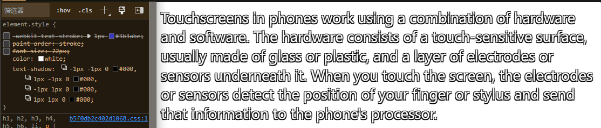
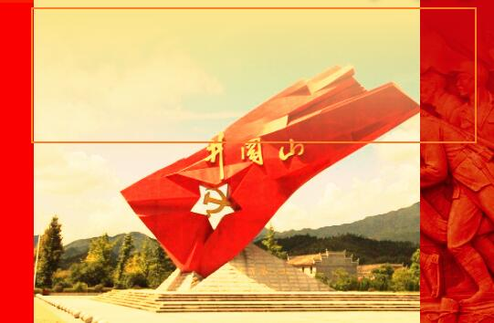
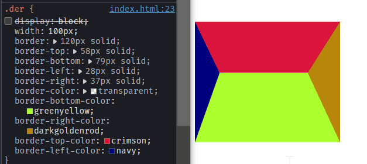

# CSS杂糅知识


## 文字阴影

某些时候我们想让字体看起来更立体，更具艺术性，让人眼前一亮，可以给文字使用文本阴影属性。

在 CSS3 中，我们使用 `text-shadow` 属性来给文本内容添加阴影的效果。

文本阴影的语法格式如下：

```css
text-shadow: x-offset y-offset blur color;
```

- `x-offset` 是沿 x 轴方向的偏移距离，允许负值，必须参数。

- `y-offset` 是沿 y 轴方向的偏移距离，允许负值，必须参数。

- `blur` 是阴影的模糊程度，可选参数。

- `color` 是阴影的颜色，可选参数。

## 文字描边

> 文字描边用`-webkit-text-stroke`实现。不过不能设置内或外描边。
>
> 格式：`-webkit-text-stroke:宽度 颜色`  


> 也可以用`text-shadow`进行模拟。可以效果绝佳地模拟出1px外描边

```css
h1 {
  color: white;
  text-shadow:
   -1px -1px 0 #000,  
    1px -1px 0 #000,
    -1px 1px 0 #000,
     1px 1px 0 #000;
}
```



## 渐变

### 线性渐变

> **`linear-gradient()`** 函数用于创建一个表示两种或多种颜色线性渐变的图片。
>
> `background: linear-gradient(direction, color-stop1, color-stop2, ...);`

语法格式为：

```css
background-image: linear-gradient(side-or-corner|angle, linear-color-stop);
```

参数说明如下：

**side-or-corner|angle**：指定渐变的方向

　　方向值：描述渐变线的起始位置，常用的是to top，to bottom，to left，to right，to right top等等

　　角度值：用角度值来指定渐变的方向。单位为`deg`，常用的是`0deg`、`180deg`等等

| *0deg不是按我们数学的角度向右定义的，默认方向是向上的，是从方向北开始的，所以北才是0deg，* |  |
| ------------------------------------------------------------ | ------------------------------------------------------------ |

**color-stop**

　　color：使用关键字red、rgba等颜色值（透明度也可以设置）

　　stop：是这个颜色块终止位置，换句话说就是这块颜色占的区域，可用百分比表示。

　　*ps：颜色值至少两个，可以有多个*




`background-image: linear-gradient(180deg, #ae8c60, rgba(255, 255, 255, 0.00));`

**重复性线性渐变**

重复性线性渐变是用重复的线性渐变组成的 `<image>`，它与线性渐变的区别在于，它会在所有方向上重复渐变来覆盖整个元素。其语法格式为：

```css
background-image: repeating-linear-gradient(side-or-corner|angle, color-stop);
```

参数说明如下：

- `side-or-corner` 是描述渐变线的起始位置，它包含 to 和两个关键词：第一个指出水平位置 left or right，第二个指出垂直位置 top or bottom。
- `angle` 是用角度值来指定渐变的方向。
- `color-stop` 是由一个 `<color>` 组成，并且跟随一个可选的终点位置。

```css
.item1 {
    background-image: repeating-linear-gradient(
        45deg, #8843f8 0%, #ef2f88 5%, #f47340 10%, #f9d371 15%
    );
}

.item2 {
    background-image: repeating-linear-gradient(
        to left top, #8843f8 0%, #ef2f88 5%, #f47340 10%, #f9d371 15%
    );
}
```


### 径向渐变

径向渐变是由元素中间定义的渐变。

其语法格式为：

```css
background-image: radial-gradient(shape, color-stop);
```

参数说明如下：

- `shape` 设置渐变的形状，其取值有 `circle`（圆形） 和 `ellipse`（椭圆）。
- `color-stop` 设置某个确定位置的颜色值。

**重复性径向渐变**

是用重复性的径向渐变组成的图像。它与径向渐变的区别在于，它会从原点开始重复径向渐变来覆盖整个元素。

其语法格式为：

```css
background: repeating-radial-gradient(extent-keyword, color-stop);
```

参数说明如下：


- `extent-keyword` 是描述边缘轮廓的具体位置，关键字常量如下所示：

  

- `color-stop` 是某个确定位置的固定颜色值。

```css
.gradient1 {
    background: repeating-radial-gradient(
        closest-corner, #8843f8 0%, #ef2f88 5%, #f47340 10%, #f9d371 15%
    );
}
.gradient2 {
    background: repeating-radial-gradient(
        farthest-side, #8843f8, #ef2f88, #f47340, #f9d371
    );
}
```


## 处理文字省略

[如何实现单行／多行文本溢出的省略（...）--绕过坑道的正确姿势 - 知乎 (zhihu.com)](https://zhuanlan.zhihu.com/p/156141915)

**单行文字省略**

> 要点：
>
> 1. 隐藏溢出部分：`overflow: hidden;`
>
> 2. 使文本内的换行无效：`white-space: nowrap;`
>
> 3. 文字超出宽度则显示ellipsis省略号：`text-overflow: ellipsis;`
>
>    下面样式规则可以直接运用到一个单行文本段落上。

```css
.single-line-text-ellipse{
    overflow: hidden;
    white-space: nowrap;
    text-overflow: ellipsis;
}
```


**多行文字省略**

> *注意：此方法有兼容性问题！*
>
> 要点：
>
> 1. 将文字元素显示改为`-webkit-box`伸缩盒子模型显示：`display: -webkit-box;`
>
> 2. 从上到下垂直排列子元素（设置伸缩盒子的子元素排列方式）：`-webkit-box-orient: vertical;`
>
> 3. 控制最多显示n行：`-webkit-line-clamp: n;`
>
> 4. 超出的文本隐藏：`overflow: hidden;`
>
>    并使文字超出宽度则显示ellipsis省略号：`text-overflow: ellipsis;`（可以不写，但最好写上）
>
> 5. 如果是遇到较长英文单词还要断词：`word-break: break-all;`或者`word-break: break-word;`（不推荐）

```css
.multiple-line-text-ellipse{
    /****盒子配置****/
    display: -webkit-box;
    -webkit-box-orient: vertical;
    -webkit-line-clamp: 2;
    overflow: hidden;
    /****设置省略方式****/
    text-overflow: ellipsis;
    /****单词截断****/
    word-break: break-all;
}
```

| 不断词 |               |
| ------ | ------------------------------------------------------------ |
| 断词   |  |

> 此方法对于inline-block的子元素来说同样适用！这会导致该子元素作为整体省略。


## 图标字体 

> 推荐网站：
>
> 1. [iconfont-阿里巴巴矢量图标库](https://www.iconfont.cn/)
> 2. [Font Awesome 中文网 – | 字体图标](http://www.fontawesome.com.cn/)
> 3. [Icon Font & SVG Icon Sets ❍ IcoMoon](https://icomoon.io/)


## CSS三角

> 可以通过无大小，即width:0;的块级元素进行边框外观的修改。
>
> 通过控制边框大小border-width控制三角形大小
>
> 然后除了需要有的一侧其他的边框都变成透明色即可
>
> 默认会得到等腰直角三角形

```css
div.target{
    width: 0;
    border: 30px solid;
    border-color: transparent;
    border-bottom-color: transparent;
    border-right-color: transparent;
    border-top-color: crimson;
    border-left-color: transparent;
}
```


> 可以通过编辑各边框的宽度来调整三角形的形状
>
> 如果矩形两邻边的边框宽度相等，则直接可以取得以对角线为斜边的直角三角形


> 如果宽或高不为0，那么你可以提取梯形




## 精灵图

> CSS Sprites，又称CSS精灵，是一种网页图片应用处理方式。
>
> 它允许将一个页面涉及到的所有零星图片都包含到一张大图中， 避免访问页面时图片载入缓慢的现象。
>
> 主要利用CSS的“background-image”，“background- repeat”，“background-position”的组合进行背景定位
>
> 下面就是一个典型的CSS精灵图


> 在使用的时候，上面提到的三个参数要这样用：
>
> “background-image”：当前的精灵图
>
> “background- repeat”：单个元素用no-repeat；背景块的话据需求选择重复方式
>
> “background-position”：定位到该元素在精灵图的位置
>
> 注意在定位的时候的坐标是负数，此外还要限制盒子的宽高。


## 鼠标光标

> 为浏览器某些元素添加上自定义的游标状态，以及自定义的鼠标光标像。
>
> 改成另一种鼠标状态：`cursor: <状态>;`
>
> 改成另一种自定义鼠标光标：`cursor: url('custom.cur') <指定状态>;`

| 另一种状态                                        | 自定义鼠标光标                                               |
| ------------------------------------------------- | ------------------------------------------------------------ |
| .png) |  |

## 视觉上消失

> 用于要消失但常规方法会有副作用的情况上，如文件上传表单

```css
.visually-hidden {
  clip: rect(0 0 0 0);
  clip-path: inset(50%);
  height: 1px;
  overflow: hidden;
  position: absolute;
  white-space: nowrap;
  width: 1px;
}
```

## CSS倒影

> 可以生成元素的倒影效果
>
> 其中第二个参数还可以控制倒影距离元素的距离
>
> CSS倒影更多玩法参看：https://mp.weixin.qq.com/s/VHS8KFQTnJbu6zQyR9fPmg

```css
.reflection{
    -webkit-box-reflect: below 0 linear-gradient(180deg, #fff0, #0004 100%);
}
```

## CSS暗黑模式

```css
html {
    filter: invert(1) hue-rotate(180deg);
}
```

## CSS悼念模式

```css
html {
    filter: grayscale(.95);
    -webkit-filter: grayscale(.95);
}
```

## CSS文字自适应颜色

> 为了让内容文字足够清晰可见，文字和背景之间需要有足够的对比度。换句话说，当背景是深色时，文字为白色，当背景是浅色时，文字为黑色

```css
.clear-text{
    filter: grayscale(1) contrast(9999) invert(1); /*颜色并不需要配置*/
}
```

## CSS粘稠效应


可参考：[Shape Blobbing in CSS | CSS-Tricks](https://css-tricks.com/shape-blobbing-css/)

> 技巧就在于使用filter属性来调高对比度和增强高斯模糊。这种神奇又巧妙的方法使得其在Web特效上锦上添花。
>
> 

```css
.stage {
  /* must be explicit, for contrast to work */
  background: white;
  
  /* weirdness happens when edges hit, also consider hiding overflow */
  padding: 30px;
  
  -webkit-filter: contrast(20);
  filter: contrast(20);
}
.dot {
  border-radius: 50%;
  width: 50px;
  height: 50px;

  /* needs to be very contrasty color. E.g. light gray on white won't work */
  background: black;

  -webkit-filter: blur(15px);
  filter: blur(15px);
}
```

## 选择和拖拽控制

分别使用`user-select`属性和`-webkit-user-drag`属性，前者控制用户能否选中文本，后者控制用户能否拖动元素。

**auto**：据情况变化属性值。

**text**：用户可以选中文本。/**element**：用户可以拖动元素。（默认）

**none**：元素及其子元素的文本不可选中/拖动元素。

**all**：点一次可选择全部文本。（前者特有）

**contain**：允许在元素内选择；但是，选区将被限制在该元素的边界之内。（前者特有）

## 滤镜属性

> `filter`是CSS的滤镜属性，可以给当前的元素添加相应的滤镜效果
>
> `backdrop-filter`最适合制作毛玻璃效果(`backdrop-filter: blur(5px);`)

## 混合模式

可参考网站：[mix-blend-mode - CSS | MDN](https://developer.mozilla.org/en-US/docs/Web/CSS/mix-blend-mode)

css3早已支持类似PS的图层混合模式（mix-blend-mode）的属性了，可以使图片能更好融入对应颜色，或加入十分炫酷的效果。

| 渐变文字                             | 图片效果                                           |
| ------------------------------------ | -------------------------------------------------- |
|  |  |

## 滚动相关属性

**滚动锁定**

滚动到一定地方就会有锁定到某个画面的效果。下面代码可以完美实现全屏内容的滚动锁定

```css
/*  div.father>div.child*5 */
.father {
    height: 100vh;
    overflow-y: scroll;
    scroll-snap-type: y mandatory;
}

.child{
    height: 100vh;
    scroll-snap-align: start;
}
```

## 自定义滚动条样式

**滚动条伪元素**

| 伪类                              |                                              |
| --------------------------------- | -------------------------------------------- |
| `::-webkit-scrollbar`             | 指定整个水平或竖直滚动条的样式               |
| `::-webkit-scrollbar-thumb`       | 指定滚动滑块样式                             |
| `::-webkit-scrollbar-track`       | 指定滚动条的轨道样式                         |
| `::-webkit-scrollbar-track-piece` | 指定除去滚动滑块的轨道的样式                 |
| `::-webkit-scrollbar-button`      | 指定滚动条的上下按钮样式                     |
| `::-webkit-scrollbar-corner`      | 指定互相垂直的滚动条的交汇部分（边角）的样式 |

**伪元素可设定值及案例**

*基本CSS部分*

```css
.display{
    width: 200px;
    height: 200px;
    overflow: scroll;
}
.display p{
    font-size: 20px;
}
```

==基本属性==

> 伪元素`::-webkit-scrollbar` 是必选项，无它就别想自定义滚动条。其宽高属性至少设置一个。
>
> **width** :设置*竖直滚动条*或*水平滚动条按钮*的宽(竖直必选)
>
> **height** :设置*水平滚动条*或*竖直滚动条按钮*的高(水平必选)
>
> 默认宽、高默认值为 17px
>
> `::-webkit-scrollbar-thumb` 指定宽、高属性没有用。

==可视化属性==

> **background**：设置滚动条的背景(可选）
>
> **background-color** :设置滚动条的背景颜色(可选)
>
> **border**:设置滚动条的边框样式(可选)
>
> **border-radius** :设置滚动条的圆角半径(可选)
>
> **box-shadow** : 设置滚动条的阴影样式(可选)

```css
.display::-webkit-scrollbar {width: 12px;height: 12px;}
.display::-webkit-scrollbar-track{
    /*此选择器的属性被  ::-webkit-scrollbar-track-piece  伪元素覆盖了*/    
    background-color:#711e92;
    border-radius: 20px;    
}
.display::-webkit-scrollbar-track-piece {background-color: #071578;}
.display::-webkit-scrollbar-thumb {
    background-color: #8BC6EC;
    background-image: linear-gradient(135deg, #8BC6EC 22.1%, #9599E2 100%);
}
.display::-webkit-scrollbar-button {
    background-color: #0093E9;
    background-image: linear-gradient(334deg, #0093E9 0%, #80D0C7 100%);
    width: 12px;
    height: 12px;
}
.display::-webkit-scrollbar-corner {
    background-color: #4158D0;
    background-image: linear-gradient(138deg, #14378f 60%, #8bc6ec 100%);
    width: 12px;
    height: 10px;
}		
```

效果如下：

