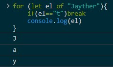
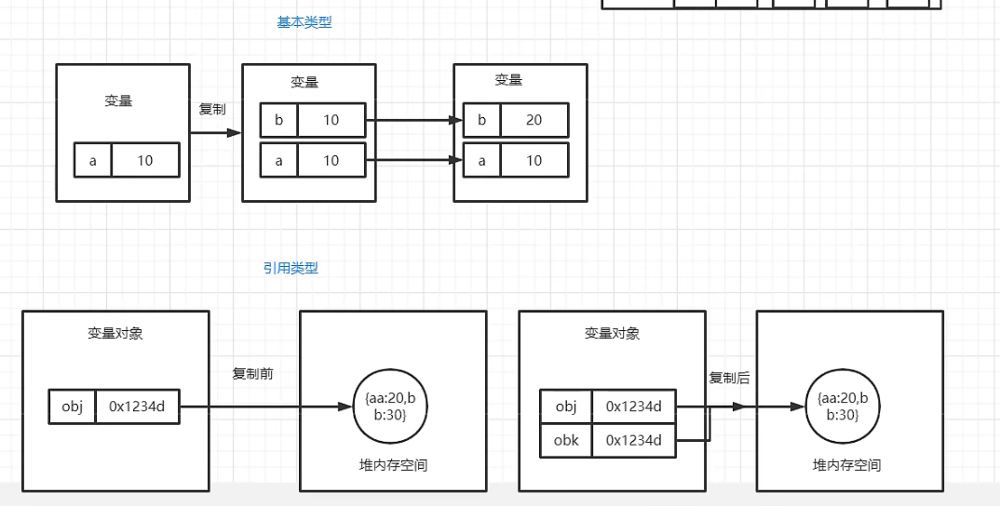
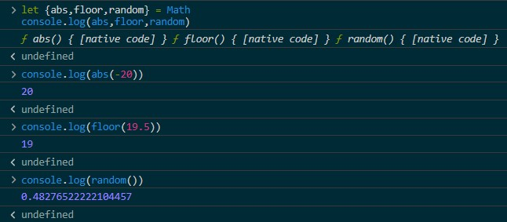
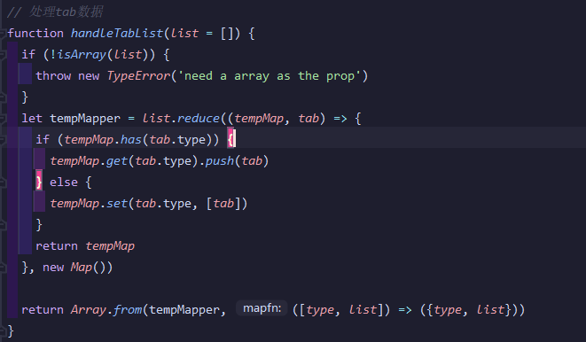
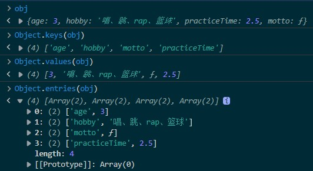
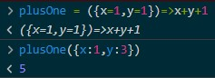
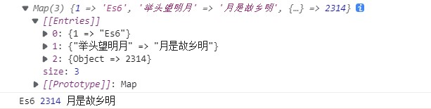
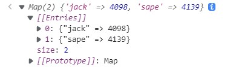

# JS基础


## 运算符

`void()`：执行其中表达式

`+`运算符：①表加法②将右边变量转化为数字类型

```js
+""  //0
```

`,`运算符：执行表达式，并返回最后表达式的值。

```js
let a = 1
a++, a*=3, a-- //6
a //5
```

`typeof`：此运算符返回跟着的变量的数据类型，而它不能辨别某个对象是个对象还是数组。

要辨别不同对象的话还需要`instanceof`运算符或者`Object.prototype.toString.call()`方法

```js
/****1.基本数据类型****/
typeof undefined   //'undefined'
typeof null   //'object'
typeof 1   //'number'
typeof ""   //'string'
typeof true   //'boolean'
typeof 18478230117n   //'bigint'
typeof Symbol()   //'symbol'

/****2.引用数据类型****/
typeof []   //'object'
typeof {}   //'object'
typeof function(){}   //'function'
typeof class {}   //'function'
typeof new Map()   //'object'
typeof new WeakMap()   //'object'
typeof new Set()   //'object'
typeof new WeakSet()   //'object'
typeof new Proxy({},{})  //'object'
typeof /a/   //'object'
```

`isNaN()`：这个函数接受一个参数，该参数可以是任何类型，而函数会帮我们确定这个参数是否“不是数值”。

> 它在接受一个值后之后，会尝试将这个值转换为数值。
>
> 某些不是数值的值*会直接转换为数值*，例如字符串"10"或Boolean值（false, false）。
>
> 而任何==不能被转换为数值的值==都会导致这个函数返回==true==。 

`parseInt()`/`parseFloat()`：可以解析以数字开头的部分数字字符串(⾮数字部分字符串在转换过程中会被去除)。

> `parseFloat()`可以将字符串转换成浮点数；但同时，`parseFloat()`只接受⼀个参数，且该方忽略前导0。
>
>  （1）字符串中的第⼀个⼩数点是有效的，⽽第⼆个⼩数点就是⽆效的了，因此*第⼆个⼩数点后⾯的字符串将被忽略*。
>  （2）如果字符串开头包含的是⼀个可解析为整数的数（没有⼩数点，或者⼩数点后⾯都是零），`parseFloat()`会返回整数。反之返回`NaN`

### 运算符优先级

在JavaScript中，运算符的执行顺序是由运算符的优先级和结合性决定的。

以下是JavaScript运算符的优先级列表（从高到低）：

1. 括号 `()`
2. 成员访问 `.` 或 `[]`；`new`
3. 递增、递减 `++`、`--`
4. 求反、非 `!`, `-`
5. 乘法、除法、取余 `*`, `/`, `%`
6. 加法、减法（双目） `+`, `-`
7. 比较运算符 `<`, `<=`, `>`, `>=`
8. 相等运算符 `==`, `!=`, `===`, `!==`
9. 逻辑与运算符 `&&`
10. 逻辑或运算符 `||`
11. 条件（三元）运算符 `? :`
12. 赋值运算符 `=`, `+=`, `-=`, `*=`, `/=`, 等等。

### 控制流优化

**优化多条件判断**

```js
//bad
if(x==="a"||x==="e"||x==="i"||x==="o"||x==="u"){
    console.log('well done!')
}
//good
if(["a","e","i","o","u"].includes(x)){
    console.log('well done!')
}
```

**优化switch判断**

```js
//bad
switch(x){
    case 1:
        //operations1...;
        break;
    case 2:
        //operations2...;
        break;
    case 3:
        //operations3...;
        break;
}
//good
const dictMap = {
    [1]:operations1,
    [2]:operations2,
    [3]:operations3,
}

const operations1 = () => {console.log(3)}
const operations2 = () => {console.log(2)}
const operations3 = () => {console.log(1)}

//使用dictMap[x]
dictMap[x]()
//let res = dictMap[x]()
```

## for循环

### for...in

`for...in` 语句用来循环一个指定的变量来通过*搜寻对象的原型链*循环指定对象*所有可枚举属性*。其语法格式如下：

对于数组，会遍历字符串的索引并返回。此时数组若有其他额外属性则会连带着遍历几次，看来不太适合遍历数组

```js
for (i in obj) {}
```

### for...of

其实，这种循环是类似于python的`for...in`循环的。它主要返回键值，凡是*可遍历的数据*类型都可以用它。

`break`和`continue`在此循环体系中仍然适用。

```js
for (let el of "Jayther"){
    if(el=="t")break
    console.log(el)
}
```



它也支持数组解构。若是遇到对象，则要用到Object的三个遍历方法。

```js
let mp1 = new Map([[1,"Object"],[2,"Oriented"],[3,"Programming"]])
for (let [k,v] of mp1)
    console.log(`${k}:${v}`)
//1:Object
//2:Oriented
//3:Programming
let Zhou_ShuYu = {glasses:false,height:178,motto:'Just do it!'}
for (let [key,value] of Object.entries(Zhou_ShuYu))
    console.log(`${key}:${value}`)
//glasses:false
//height:178
//motto:Just do it!
```

## 数据类型分类

- 传参方式不同，基本数据类型是**值传递**，而引用数据类型是**地址传递**。
- 储存方式不同，基本数据类型是**栈存储**，而引用数据类型是**堆存储**。

**基本数据类型**

`null`，`undefined`，`boolean`，`number`，`string`，`symbol` 和 `bigint`

 undefined 和 null 与自身严格相等。 `undefined===undefined`,`null===null`

`NaN`与所有的值都不相等`NaN!==NaN`

**引用数据类型（object)**

`object`，`array`，`function`，`class`，`set`，`weakset`，`map`，`weakmap`

保存到堆内存中，每创建一个新的对象，就会在堆内存中开辟出一个新的空间，

而变量保存的是对象的内存地址（对象的引用）

如果两个变量保存的是同一个对象引用,当一个对象通过一个变量修改属性时,另一个也会受到影响.



> 对象是可突变的。具体是指对象的内容可以任意改变，甚至不受`const`关键字的影响。
>
> 在`const`的影响下，只是对象对应的变量对对象的引用不能改动罢了。详情见[变量定义](#变量定义)。

```js
const pet = { 
    name: "小空灵",
    is: "空灵斗士",
    type: ["草","武"],
}

pet = { name: "Luna", is: "Border Collie"} // TypeError: Assignment to constant variable.
pet.name = "我是空灵侠"; pet.name <!-- "我是空灵侠"
```

## 变量解构

**数组形式解构**

```js
let [a,b,c] = [1,3,5]
console.log(a,b,c)  //1 3 5
//应用：交换数值
let a=1,b=2
[a,b]=[b,a]
console.log(a,b)  //2 1
```

**对象解构**

```js
let obj = {a:2,b:3,c:4}
let {a,b,c} = obj
console.log(a,b,c)  // 2 3 4
//如果是下面这样的：
let {a,b,c}={}
console.log(a,b,c)  // undefined undefined undefined
//带上默认参数会怎样？
let {a=1,b=2,c=3}={}
console.log(a,b,c)  // 1 2 3
//对象解构可以对号入座！
let {abs,floor,random} = Math
console.log(abs,floor,random)
//变量与属性不一致时要这么做：写成 "匹配的对象属性:要被赋值的变量" ，可以赋值给后面的变量
let {a:q,b:r,c:s} = obj //简写
console.log(q,r,s)  //2 3 4
```



## 时间

**时间戳**：指1970 年 1 月 1 日至今的毫秒数，可用于调试。

```js
let o = Date()  //当前Date字符串
let a = new Date();  //创建新的当前Date对象
let b = new Date('月/日/年 时/分/秒');  //创造指定时间的Date对象
let c = Date.now()  //获取当前时间戳
//或者：c = +new Date() ，通过将日期转成数字获取时间戳
```

Date对象的常用方法如下：

| 项目               | 释义                                  |
| ------------------ | ------------------------------------- |
| `getFullYear()`    | 完整年份                              |
| `getMonth()`       | 一年的某一月(0为一月，0~11)           |
| `getDate()`        | 一个月中的某一天 (1 ~ 31)             |
| `getDay()`         | 一天是星期几(0为周日，0~6)            |
| `getHours()`       | 小时 (0 ~ 23)                         |
| `getMinutes()`     | 分钟 (0 ~ 59)                         |
| `getSeconds()`     | 秒钟 (0 ~ 59)                         |
| `getTime()`        | 返回对象时间戳                        |
| `toString()`       | 对象转字符串                          |
| `toLocaleString()` | (据本地时间格式) 对象或时间戳转字符串 |

全部可参考[JavaScript Date 参考手册 (w3school.com.cn)](https://www.w3school.com.cn/JSref/JSref_obj_date.asp)

```js
//代码效率测试函数，a为代码字符串。
function duration(a){
  let start = Date.now()
  eval(a)
  let end = Date.now()
  return end - start
}
```

## 数学

一个工具类，可直接使用。属性为一些常数，方法为一些数学运算函数

### 常用常数

| 属性         | 描述           |
| ------------ | -------------- |
| `Math.E`     | 自然对数的底数 |
| `Math.LN2`   | 2 的自然对数   |
| `Math.PI`    | 圆周率         |
| `Math.SQRT2` | 2 的平方根     |

### 常用数学运算函数

| 属性             | 描述                                                   |
| ---------------- | ------------------------------------------------------ |
| `Math.abs(x)`    | 返回一个数的绝对值。                                   |
| `Math.pow(x, y)` | 返回一个数的 y 次幂。现在ES6简写为`x**y`               |
| `Math.random()`  | 返回一个 0 到 1 之间的伪随机数。                       |
| `Math.sqrt(x)`   | 返回一个数的平方根。                                   |
| `Math.ceil()`    | 返回比参数值要大的最小整数。如`3.4`是`4`；`-2.3`是`-2` |
| `Math.floor()`   | 返回比参数值要小的最大整数。如`3.4`是`3`；`-2.3`是`-3` |
| `Math.round()`   | 返回==四舍五入==后的整数。                             |
| `Math.trunc()`   | 数字截取，不发生四舍五入，可写为`~~3.5`                |
| `Math.max()`     | 返回多个数的最大值，                                   |
| `Math.min()`     | 返回多个数的最小值，                                   |

具体可参考[JavaScript Math 参考手册 (w3school.com.cn)](https://www.w3school.com.cn/JSref/JSref_obj_math.asp)

```js
//指定整数区间内的数学随机数生成方法
let a = Math.random()*n  //生成[0,n]的随机数
let b = Math.random()*(n-m)+m  //生成[m,n]的随机数
let c = Math.round(Math.random()*n)  //生成0~n的随机整数
let d = Math.round(Math.random()*(n-m)+m)  //生成m~n的随机整数
```

## 定时器

### setInteval、clearInterval

> `setInteval()`函数会在每隔指定时间间隔调用指定函数，它会返回它的唯一的识别符，用于清除循环定时器。
>
> 在动态加载的页面中，一定要清理循环定时器。使用`clearInterval(计时器变量)`清除定时器
>
> 有时候重复设置定时器，严重的时候会导致内存泄露，最终页面崩溃。

```js
//格式为setInteval(回调函数,时间间隔)
setInterval(function(){console.log('Hi JS!')},1000)
//每1秒控制台会输出字符串'Hi JS!'
//下面为变量命名计时器及clearInterval()用法。
var timer ,count = 0
timer = setInterval(function(){
    console.log('Hi JS!')
    count++
    if(count>=10){clearInterval(timer)}
},1000)
//会返回timer计算器特征值并每1秒输出字符串'Hi JS!'，十秒后停止
```

### setTimeout、clearTimeout

`setTimeout()`函数会在指定时间间隔后调用指定函数

```js
//格式为setTimeOut(回调函数,时间间隔)
setTimeout(function(){console.log('Hi JS!')},1000)
//1秒后控制台会输出字符串'Hi JS!'
//下面为变量命名计时器及clearTimeOut()用法。
let t1
t1 = setTimeout(function(){console.log('Hi JS!')},1000)
if(/*指定条件*/){
	clearTimeout(t1)
}
//在指定条件下可提前中止计时器及其回调函数的执行。   
```

### setTimeout(fn,0)

`setTimeout(fn,0)`并不会立即执行，只有在所有初始代码(普通代码)执行完毕后才会被执行。

```js
//作品代码节选：导航栏上的列表元素要鼠标移动上去后游标元素(chase)生成会有个透明度过渡效果
if(cont.innerHTML==""){
    let chase = document.createElement("div")
    chase.classList.add("chase")
    chase.style.width=e.target.offsetWidth+"px"
    chase.style.left=e.target.offsetLeft+"px"
    cont.appendChild(chase)
    // chase.style.opacity="1"    //此代码会先被执行，起不到过渡效果
    setTimeout(function(){
        chase.style.opacity="1"   //此代码会在上面代码全部执行完后才执行
    },0)
}
```

## JSON相关

JSON：一种有格式有消息的**字符串**，属性名会被双引号括起来，不能写注释。

`JSON.stringify()`：对象 → JSON字符串

`JSON.parse()`：JSON字符串 → 对象

> 注意！当对象属性值含有下列数据类型时会被转换、连带属性名一起忽略 或者出错！
>
> 1. 正则表达式对象
> 2. `Set`、`Map`、`WeakSet`、`WeakMap`对象
> 3. `Date`对象
> 4. `Symbol`
> 5. `BigInt`（报错）
>
> ```js
> JSON.stringify({a:/a/, b:new Set(), c:new Map(), d:Symbol('rhodes island'), e:new Date()})
> // '{"a":{},"b":{},"c":{},"e":"<日期转成的字符串>"}'
> ```

## 正则表达式

> MDN上的文档：[正则表达式 - JavaScript | MDN (mozilla.org)](https://developer.mozilla.org/zh-CN/docs/Web/JavaScript/Guide/Regular_Expressions)
>
> 直接测试正则表达式：[regex101: build, test, and debug regex](https://regex101.com/)
>
> 无痛学习正则表达式：[Regex Learn - 逐步从零基础到高阶。](https://regexlearn.com/zh-cn)
>
> 正则表达式速查表：[Regex Learn - 正则表达式备忘单](https://regexlearn.com/zh-cn/cheatsheet)
>
> 常用正则表达式：[正则表达式大全](https://www.jb51.net/tools/regex.htm)

字面量：`/正则表达式/匹配模式`

对象法：`new RegExp("正则表达式","匹配模式")`

**正则表达式`test`方法返回是否匹配成功：**`正则表达式.test("string")`

**正则表达式`exec`方法返回匹配详细信息：**`正则表达式.exec("string")`

```js
regex1.exec(str1)
['找到的子字符串', index: '找到的所在索引', input: '原字符串', groups: undefined]
```

> 对正则表达式对象执行`test()`方法后,`RegExp.$n`的访问有限制,不能无限制执行,主要原因有两个:
>
> 1. `test()`方法仅在最后一次执行的正则表达式上保存了结果和分组匹配。所以只能在`test()`之后立即访问,过了作用域后就失效了。
> 2. `RegExp.$n`里的n最大只能匹配对应的分组数量,如果超出了分组数量,会返回undefined。
>
> 举例:
>
> ```js
> const regex = /(\d+) (\d+)/; 
> regex.test('123 456'); 
> 
> RegExp.$1; // '123' 可以访问
> RegExp.$2; // '456' 可以访问 
> 
> // 超出分组范围就会错
> RegExp.$3; // undefined
> 
> // 离开作用域就失效
> function test() {
>   regex.test('123 456');
>   return RegExp.$1; 
> }
> test(); // 返回undefined
> ```

> 特殊字符转义：*\\*；要转义的字符有：
>
> ⑴ *$* ⑵ *(* ⑶ *)* ⑷ *+* ⑸ *\** ⑹ *?* ⑺ *.* ⑻ *[* ⑼ *]* ⑽ *\\* ⑾ */* ⑿ *^* ⒀ *{* ⒁ *}* ⒂ *|* 

### 匹配模式

| 模式 | 释义                                  |
| ---- | ------------------------------------- |
| i    | 不区分大小写(case *i*nsensitive)      |
| g    | 全局匹配，也就是全部找遍(*g*lobal)    |
| m    | 使匹配支持处理多行的内容(*m*ultiline) |

### 开头结尾限定符

| 字符 | 释义                      |
| ---- | ------------------------- |
| ^    | 匹配后面的开头字符，如^a  |
| \$   | 匹配前面的结尾字符，如a\$ |

### "或"限定符

| 字符 | 释义                 |
| ---- | -------------------- |
| a\|b | 匹配a或b             |
| […]  | 匹配列出的任意字符   |
| [^…] | 匹配没列出的任意字符 |

### 数字限定符

| 字符    | 释义                               | 备注          |
| ------- | ---------------------------------- | ------------- |
| `{n}`   | m{n}：m连续出现n次                 |               |
| `{n,m}` | 前面的字符至少出现n次，至多出现m次 |               |
| `{n,}`  | 前面的字符至少出现n次              |               |
| `*`     | 前面的字符不出现或出现数次         | 相当于`{0,}`  |
| `+`     | 前面的字符至少出现1次              | 相当于`{1,}`  |
| `?`     | 前面的字符不出现或出现1次          | 相当于`{0,1}` |

### 特殊字符

| 字符 | 释义（匹配对象）                  |
| ---- | --------------------------------- |
| .    | 除换行外的任意字符                |
| \b   | 单词边界                          |
| \B   | 非单词边界                        |
| \d   | 数字，等价[0-9]                   |
| \D   | 非数字                            |
| \s   | 空白字符                          |
| \S   | 非空白字符                        |
| \w   | 字母、数字、下划线，等价[A-z0-9_] |
| \W   | 非字母、数字、下划线              |

### 捕获分组及其使用

> 在正则表达式中，用括号括起来的表示捕获分组，其内容是可以重用的
>
> 1. 在正则表达式中可以用`\1`,`\2`,`\3`等符号分别表示第1个,第2个和第3个分组
> 2. 用`(?:)`表示该组不可被捕获。
> 3. 用`(?<命名>)`来表示命名分组，可以通过命名来使用分组内容。如`(?<year>2002)`

### 查找前/后面有/没有字符的模式

又称零宽断言

| 断言    | 用法                                                 | 释义         |
| ------- | ---------------------------------------------------- | ------------ |
| `(?=)`  | 在*后面有指定模式*的情况下匹配：`play(?=fair)`       | 正向先行断言 |
| `(?!)`  | 在*后面没有指定模式*的情况下匹配：`play(?!fair)`     | 负向先行断言 |
| `(?<=)` | 在*前面有指定模式*的情况下匹配：`(?<=jungle)movie`   | 正向后行断言 |
| `(?<!)` | 在*前面没有指定模式*的情况下匹配：`(?<!pascal)movie` | 负向后行断言 |

## 字符串

我们通常定义一个字符串，方法如下：

```js
var str = "HELLO"; //字符串
var str = new String("HELLO"); //字符串对象
```

转换为字符串：

```js
13456+'' //'13456'
```

### 字符串常用方法

#### 字符串连接

```js
const a = "Hello", b = "World"
a + b //"HelloWorld"
a.concat(b) //"HelloWorld"
"".concat(a,b) //"HelloWorld"
```

#### 大小写转换

```js
let str = "HelloJavaScript"

str.toLowerCase()  //hellojavascript
str.toUpperCase()  //HELLOJAVASCRIPT

str //HelloJavaScript
```

#### 分割字符串

**slice()**

> 格式：`substr(start,?end)`
>
> start，end都不可为负数！

**substr()**

> 格式：`substr(start,?length)`
>
> start，end都不可为负数！

```js
let str = "Ten Things I Love about You"

str.substr(11) //I Love about You
str.substr(4,19) //Things I Love about

str //Ten Things I Love about You
```

**substring()**

> 格式：`substring(start,?end)`
>
> start，end都不可为负数！

```js
let str = "Ten Things I Love about Dogs"

str.substring(11) //I Love about Dogs
str.substring(4,23) //Things I Love about

str //Ten Things I Love about Dogs
```

#### 取某位字符

**charAt()，at()**

> `charAt()`和`at()`都可以实现取下标的功能，唯一区别是`at()`还可以去取负数，负数是从字符串末尾开始向左计数，如`"abcde".at(-1)==="e"`

```js
let str = "HelloJavaScript"
"第 7 个字符为 " + str.charAt(6) // "a"
"第 11 个字符为 " + str.at(10) // "c"
"第 8 个字符为 " + str.at(-8) // "v"
```

#### indexOf()

> 寻找某个字符或字符串首字母在字符串中首次出现的位置。

```js
let str = "yankee doddle"
"k 首次出现的位置：" + str.indexOf("k") //k 首次出现的位置：3
"do 首次出现的位置：" + str.indexOf("do") //do 首次出现的位置：7
```

#### trim()系列

> `trim()`清除字符串首尾空格，换行符
>
> `trimStart()`清除字符串首部空格，换行符
>
> `trimEnd()`清除字符串尾部空格，换行符

```js
let str = "  Welcome to the Naranja Academy!    "

str.trim()      //'Welcome to the Naranja Academy!'
str.trimStart() //'Welcome to the Naranja Academy!    '
str.trimEnd()   //'  Welcome to the Naranja Academy!'

str //"  Welcome to the Naranja Academy!    "

let str = `  Welcome
to the Naranja Academy!  `
str.trim() //'Welcome\nto the Naranja Academy!'
```

#### padStart(), padEnd()

> 格式：`padStart(字符串长度,"给定字符串")`，`padEnd(字符串长度,"给定字符串")`
>
> 如果基础字符串长度小于给定长度，可用`padStart()`在该字符串首部填充某字符（字符串），可用`padEnd()`在该字符串末尾填充某字符（串）。

```js
//padStart使用案例
let curTime = {hour:"9",minute:"13",second:"2"}
function formatTime(timeObj){
    let  {hour:Hour,minute:Minute,second:Second} = timeObj
    return Hour.padStart(2,"0")+":"+Minute.padStart(2,"0")+":"+Second.padStart(2,"0")
}
formatTime(curTime) //09:13:02

//padEnd使用案例
let quote = "I'll give you all of my money"
quote.padEnd(40,"$%!") //"I'll give you all of my money$%!$%!$%!$%"
```

### 字符串正则方法

#### search()

> 1. 搜寻某字符串的第一次出现位置：`search(字符串)`
>
>    在这方面和`indexOf()`功能一样
>
> 2. 搜寻正则模式的第一次出现位置：`search(regexp)`

```js
let str = "It is our choices, Harry, that show what we truly are, far more than our abilities."

str.search("choice") //10
str.search(/\b\w{4}\b/) //26
```

#### split()

> 使用指定的分隔符将一个字符串分割成子字符串数组
>
> `字符串.split(分隔符字符串|正则表达式)`

```js
let str = "Hello,Java,Script"

str.split(",") //["Hello","Java","Script"]
str //Hello,Java,Script
```

#### replace(), replaceAll()

> 1. 普通字符串调换：`字符串.replace(待替换的字符串, 新的字符串)`
>
> 2. 正则模式调换：`字符串.replace(正则表达式, 新的字符串)`
>
>    不用全局正则表达式的话就不会全部替换

```js
let str1 = 'HelloJavaScript'
let str2 = 'HELLOWHELLOWHELLOWHELLOWHELLO'

str1.replace("JavaScript","World") //HelloWorld
str1 //HelloJavaScript

str2.replace("W","_") //HELLO_HELLOWHELLOWHELLOWHELLO
str2.replace(/W/,"_") //同上

str2.replace(/W/g,"_") //HELLO_HELLO_HELLO_HELLO_HELLO

str2 //HELLOWHELLOWHELLOWHELLOWHELLO
```

> 可以变通使用来删除里面匹配到的模式`字符串.replace(待替换的字符串|正则表达式, '')`
>
> 在正则表达式外的JS语句当中使用`$1`,`$2`,`$3`等符号分别表示第1个,第2个和第3个分组。
>
> 此外还可以用函数作为第二参数，其参数第一个是截后的原字符串，而剩余的是匹配分组得到的子字符串。
>
> 详细信息请看：[String.prototype.replace() - JavaScript | MDN (mozilla.org)](https://developer.mozilla.org/zh-CN/docs/Web/JavaScript/Reference/Global_Objects/String/replace)

```js
// 手机脱敏
function hidePhone(phoneNum){
    return phoneNum.replace(/(\d{3})\d{5}(\d{3})/g,'$1*****$2')
}

/* ======= 蓝桥杯省赛真题：Markdown文档解析, 题解片段 ======= */
// 2. 对引用区块进行解析
function parseBlockQuote(){
    const tempStr = this.lineText.replace(this.blockQuote, "");
    return"<p>"+ tempStr +"</p>";
}

// 4.对图片进行解析
function parseImage(str){
    return str.replace(this.image, (result, alt, url)=>{
        return ``;
    })
}
```

`replaceAll()`是ES6新增，旨在语义

```js
let str2 = 'HELLOWHELLOWHELLOWHELLOWHELLO'

str2.replaceAll('W',"_") //HELLO_HELLO_HELLO_HELLO_HELLO
str2 //HELLOWHELLOWHELLOWHELLOWHELLO
```

#### match(), matchAll()

> `match()`返回第一个匹配结果及其详细匹配信息。

```js
let quote = "The opposite of love is not hate, it's indifference. The opposite of art is not ugliness, it's indifference. The opposite of faith is not heresy, it's indifference. And the opposite of life is not death, it's indifference."

/*** 匹配单个会返回详细匹配信息 ***/
quote.match("indifference") 
quote.match(/\b\w{4}\b/)
```

详细信息是伪数组，内容包括如下：`[匹配值, index: 索引值, input: 原始内容, groups: 捕获组]`

> **正则表达式带上全局会匹配所有结果的值而无详细信息**

```js
quote.match(/\b\w{4}\b/g) //['love', 'hate', 'life']
```

> `matchAll()`返回所有匹配结果及其匹配信息的遍历器，需要遍历手段或者转换。

```js
let quote = "The opposite of love is not hate, it's indifference. The opposite of art is not ugliness, it's indifference. The opposite of faith is not heresy, it's indifference. And the opposite of life is not death, it's indifference."

Array.from(quote.matchAll("indifference"))
Array.from(quote.matchAll(/\b\w{4}\b/))
```

### ES6字符串拓展

#### startsWith()，endsWith()

```js
let str1 = 'Elsa is preparing for the feast'
let str2 = 'Michael lost his way in New York'

str1.startsWith('Elsa')  //true 
str1.startsWith('elsa')  //false
str2.startsWith('Elsa')  //false

str2.endsWith('New York')  //true 
str2.endsWith('New Zealand')  //false
str1.endsWith('New York')  //false
```

#### repeat(n)

> 返回一个重复 `n` 次原字符串的新字符串

```js
'你干嘛~~哈哈~~哎呦 '.repeat(3)
// '你干嘛~~哈哈~~哎呦 你干嘛~~哈哈~~哎呦 你干嘛~~哈哈~~哎呦 '
```

### 模板字符串

增强字符串以反引号``括起内容。可以当普通引号用，也有特殊效用。

```js
let message = `Remember that no matter how cool you think you may be, 
you are not cool enough to look down on anyone
... ever --Paul Walker`   //增强字符串内容可换行，输出时会保留‘\n’换行符。
```

在增强字符串内部可用“\${}”来显示变量或表达式。

```js
let x = 20, hobby = 'Kinetic Art'
console.log(`我是杰者，2021年的我${x}岁，是${hobby}之主，也有志成为前端开发的一员。`)
//我是杰者，2021年的我20岁，是Kinetic Art之主，也有志成为前端开发的一员。
```

### 标签模板

模板字符串还可以紧跟在一个函数名后面，该函数将被调用来处理这个模板字符串，该函数的参数说明如下：

- 第一个参数是一个**数组**，数组中存放普通的字符串，例如 `str` 中的 `Welcome`、`to`、`course`、`.`。
- 在第一个参数之后的参数，都是每一个占位符的解释值，例如 `str` 中的 `${name}`。

```js
function foo(strings, ...values) {
  return 54;
}

foo`What do you get if you multiply ${6} by ${9}?`; // 54

// In the foo function:
//   strings = ['What do you  get if you multiply ', ' by ', '?']
//   values[0] = 6
//   values[1] = 9
```

> 标签模板用途：
>
> 1. 协助转义特殊字符，过滤有害输入，防止XSS
>
> 2. 在国际化处理下对内容的特殊处理
>
>    ```js
>    i18n `Hello ${name}, you have ${amount}:c in your bank account.`
>    // 你好Bob，你有￥1,234.56在您的銀行帳戶。
>    ```
>
> 3. 组件的样式处理，如React的styled-components库

## 数组

是一种特殊的对象，有“下标->值”的对应。

> 数组构建：
>
> 1. `new Array()`方法；2. 字面量方法`[]`

```js
let arr=[]  //空数组取任意下标会返回undefined(与python不同，python会报错)
for(var i=0;i<10;i++){
    arr[i]=i+1   //赋值
}
console.log(arr)  //[1,2,3,4,5,6,7,8,9,10]
console.log(arr[3])  //元素访问。输出4
console.log(arr[3]=2)  //元素改动，返回改动后的值。输出2
```

### 数组常用属性

| 属性   | 释义                         |
| ------ | ---------------------------- |
| length | 数组长度，改动会影响数组长度 |

### 数组处理元素方法

#### push()，pop()

> push()  向数组`arr`末尾添加一个或多个指定元素，操作返回新数组长度，数组*变成新数组*
>
> pop()  删除数组末尾的一个元素，操作返回被删除的元素，数组*变成新数组*
>
> 可以用这两个方法直接实现栈数据结构

```js
const arr = [5,4,3,2,1]

arr.push(0) // 6
arr //[5,4,3,2,1,0]

arr.push(-1,-2,-3) // 9
arr //[5,4,3,2,1,0,-1,-2,-3]

arr.pop() // -3
arr //[5,4,3,2,1,0,-1,-2]
```

#### unshift()，shift()

> unshift()  向数组首添加一个或多个指定元素，操作返回新数组长度，数组*变成新数组*
>
> shift()  删除数组首的一个元素，返回被删除的元素，数组*变成新数组*
>
> 可以用这两个方法直接实现栈数据结构，也可以配合上面`push()`，`pop()`方法实现队列数据结构

```js
const arr = [5,4,3,2,1]

arr.unshift(16,8,7,6) // 9
arr //[16,8,7,6,5,4,3,2,1]

arr.shift() // 16
arr //[8,7,6,5,4,3,2,1]
```

#### sort()

> 对数组元素进行排序。会改变原数组。默认按照字符的Unicode的位置进行排序。可以用函数限制排序方法
>
> sort方法接受一个比较函数作为参数,这个比较函数会在sort内部被重复调用,来比较数组中的元素。
>
> 比较函数有以下特点:
>
> 1. 接收两个参数,表示要比较的两个元素
> 2. 如果第一个元素应该排在第二个之前,返回一个小于0的数
> 3. 如果两个元素相等,返回0
> 4. 如果第一个元素应该排在第二个之后,返回一个大于0的数
> 5. 根据比较函数的返回值,sort可以确定元素的相对顺序

```js
const arr = [10,4,2,35,13,7,6]

arr.sort() // [10, 13, 2, 35, 4, 6, 7]

arr.sort((a,b)=>a-b) // [2, 4, 6, 7, 10, 13, 35]
arr // [2, 4, 6, 7, 10, 13, 35]

arr.sort((a,b)=>b-a) // [35, 13, 10, 7, 6, 4, 2]
arr // [35, 13, 10, 7, 6, 4, 2]
```

> sort方法内部的处理流程是:
>
> 1. 初始化两个指针i、j指向数组起始位置
> 2. 比较a[i]和a[j]两个元素,使用比较函数
> 3. 根据比较结果交换两个元素使其有序
> 4. i++,继续和后续元素比较,直到数组末尾
> 5. j++,继续和后续元素比较,直到数组末尾
> 6. 重复步骤2-5,直到数组有序

```js
function transformSentence(sentence) {
  let words = sentence.split(' ');
  words.sort((a, b) => {
    if (a.length !== b.length) return a.length - b.length;
    if (a < b) return -1; 
    if (a > b) return 1;
    return 0;
  });
  let newSentence = [];
  newSentence.push(words[0][0].toUpperCase() + words[0].slice(1).toLowerCase());
  for (let i = 1; i < words.length; i++) {
    newSentence.push(words[i].toLowerCase());
  }
  return newSentence.join(' ');
}
```

#### reverse()

> 反转数组，会改变原数组。

```js
const arr = [1,3,2]

arr.reverse() // [2, 3, 1]
arr // [2, 3, 1]
```

#### 数组转字符串

```js
const arr = [1,2,3,4,5,6,7]

arr.toString() //'1,2,3,4,5,6,7'

//1.+""
arr+"" //'1,2,3,4,5,6,7'
//2.模板字符串
`${arr}` //'1,2,3,4,5,6,7'
//3.join(',')
arr.join(',') //'1,2,3,4,5,6,7'
//4.JSON.stringify()
JSON.stringify(arr) //'[1,2,3,4,5,6,7]'
arr //[1,2,3,4,5,6,7]
```

#### slice()

> 在原数组中提取某范围元素(包含开头不含结尾,类似python)，并返回此数组，原始值不变
>
> 语法格式：`数组.slice(起始位置，终点位置)`
>
> 起始位置，终点位置可正可负，和python规则类似

```js
let arr = [1, 2, 3, 4, 5, 6, 7]

arr.slice(3) //[5,6,7]
arr.slice(-5) //[3,4,5,6,7]

arr.slice(2,5) //[3, 4, 5]
arr.slice(3,-2) //[4, 5]
arr.slice(-6,-1) //[2, 3, 4, 5, 6]

arr //[1, 2, 3, 4, 5, 6, 7]
```

#### splice()

> 语法格式：`数组.splice(start,?deleteCount,...items)`
>
> 1. 将原数组从索引值切开，操作返回被删的数组，原数组被截短至索引之前：`arr.splice(起始值)`
>
> 2. 将原数组从起始值切开，操作返回从起始值取`删除个数`个元素的被删数组，原数组被拿去了被删除数组：`arr.splice(起始值,删除个数)`
>
> 3. 将原数组从索引值添加一个或几个元素，不删除元素：`arr.splice(起始值,0,...插入值)`
>
> 4. 将原数组从索引值删除`删除个数`个元素，同时添加一个或几个元素：`arr.splice(起始值,删除个数,...插入值)`

```js
let arr = [1, 2, 3, 4, 5, 6, 7]

arr.splice(2) //[3, 4, 5, 6, 7]
arr //[1, 2]

arr = [1, 2, 3, 4, 5, 6, 7]
arr.splice(3,2) //[4, 5]
arr //[1, 2, 3, 6, 7]

arr = [1, 2, 3, 4, 5, 6, 7]
arr.splice(2,0,30,40,50) //[]
arr //[1, 2, 30, 40, 50, 3, 4, 5, 6, 7]

arr = [1, 2, 3, 4, 5, 6, 7]
arr.splice(2,4,30,40,50) //[3,4,5,6]
arr //[1, 2, 30, 40, 50, 3, 4, 5, 6, 7]

arr = [1, 2, 30, 40, 50, 7]
```

实例：splice方法实现数组去重(`Es6`方法<a href="#Set">点这里</a>)

```js
arr = [1,2,2,3,3,3,4,4,4,4]
for(let i=0;i<arr.length;i++){
    for(let j=i+1;j<arr.length;j++){
        if(arr[i]==arr[j]){
            arr.splice(j,1)
            j--  //由于剩余元素补位，我们还要再次比较，就要索引j自减。
        }
    }
}
console.log(arr)
```

#### concat()

> 将两个数组连接，返回连接后的总数组

```

```

#### join()

> 将数组所有元素，以指定字符串为连接符，连接成一个字符串

```js

```

#### flat()

> 数组扁平化处理，无参数处理一次，有参数处理参数次

```js
let arr = [1,2,3,[4,5],[[6,7]]]
arr.flat() //[1,2,3,4,5,[6,7]]
arr.flat(2) //[1,2,3,4,5,6,7]
arr.flat(Infinity) //一定能压缩为一维数组
```

### 数组查找处理方法

| 方法      | 释义                                     |
| --------- | ---------------------------------------- |
| at        | 取数组下标，支持负数                     |
| includes  | 判断指定元素存不存在于数组中，返回布尔值 |
| indexOf   | 返回指定元素的索引，找不到返回-1         |
| find      | 寻找第一个符合条件的元素                 |
| findIndex | 寻找第一个符合条件的元素，并返回其索引   |

#### includes()

> 判断指定元素存不存在于数组中，返回布尔值

```js
let arr = ["🐱", "🐶", "🐰", "🐍", "🐦", "🐟"];

arr.includes("🐍") //true
arr.includes("🐔") //false
```

#### indexOf()

> 返回指定元素的索引，找不到返回-1

```js
let arr = ["🐱", "🐶", "🐰", "🐍", "🐦", "🐟"];

arr.indexOf("🐍") //3
arr.indexOf("🐔") //-1
```

#### find()

> 寻找第一个符合条件的元素并返回，参数是一个判断的回调函数
>
> 参数是被遍历元素，返回判断符不符合条件的布尔值。符合为true，反之为false。
>
> 若想从右向左寻找，请使用`findLast()`

```js
let arr =  [{name:"cat",icon:"🐱"},{name:"dog",icon:"🐶"},{name:"rabbit",icon:"🐰"},{name:"snake",icon:"🐍"},{name:"pig",icon:"🐷"},{name:"bird",icon:"🐦"},{name:"zebra",icon:"🦓"},{name:"fish",icon:"🐟"},{name:"dragon",icon:"🐲"}];

arr.find(el=>el.icon === "🐶") // {name:"dog",icon:"🐶"}
arr // 原数组
```

#### findIndex()

> 寻找第一个符合条件的元素，并返回其索引
>
> 参数是被遍历元素，返回判断符不符合条件的布尔值。符合为true，反之为false。

```js
let arr =  [{name:"cat",icon:"🐱"},{name:"dog",icon:"🐶"},{name:"rabbit",icon:"🐰"},{name:"snake",icon:"🐍"},{name:"pig",icon:"🐷"},{name:"bird",icon:"🐦"},{name:"zebra",icon:"🦓"},{name:"fish",icon:"🐟"},{name:"dragon",icon:"🐲"}];

arr.find(el=>el.name === "pig") // 4
arr // 原数组
```

### 数组遍历处理方法



1. 自写函数

```js
for(i=0;i<arr.length;i++){
    //关于arr[i]的操作
}
///确保数组不变时可以写为
for(i=0,l=arr.length;i<l;i++){
    //关于arr[i]的操作
}
```

> 若数组长度固定，则用`for(i=0,l=arr.length;i<l;i++)`以减少计算量。

2. 数组自带遍历方法

#### forEach()

> 对数组每个元素执行回调函数：`arr.forEach(callback)`
>
> `forEach`回调函数有三个参数：被遍历元素，被遍历元素索引(可选，`Number`类型)，被遍历数组本身(可选)
>
> 被遍历元素索引是静态的，而被遍历数组就是执行`forEach()`方法的数组。

```js
let arr = ["🐱", "🐶", "🐰", "🐍", "🐷", "🐦", "🐶", "🐟"];

arr.forEach((val,idx,arr)=>{
    console.log(`动物：${val}; 索引：${idx}; 数组：[${arr}]`);
})

// 动物：🐱; 索引：0; 数组：[🐱,🐶,🐰,🐍,🐷,🐦,🐶,🐟]
// 动物：🐶; 索引：1; 数组：[🐱,🐶,🐰,🐍,🐷,🐦,🐶,🐟]
// 动物：🐰; 索引：2; 数组：[🐱,🐶,🐰,🐍,🐷,🐦,🐶,🐟]
// 动物：🐍; 索引：3; 数组：[🐱,🐶,🐰,🐍,🐷,🐦,🐶,🐟]
// 动物：🐷; 索引：4; 数组：[🐱,🐶,🐰,🐍,🐷,🐦,🐶,🐟]
// 动物：🐦; 索引：5; 数组：[🐱,🐶,🐰,🐍,🐷,🐦,🐶,🐟]
// 动物：🐶; 索引：6; 数组：[🐱,🐶,🐰,🐍,🐷,🐦,🐶,🐟]
// 动物：🐟; 索引：7; 数组：[🐱,🐶,🐰,🐍,🐷,🐦,🐶,🐟]
```

#### map()

> 与`forEach`作用相同，不同的是可返回经处理后的新数组：`arr.map(callback)`
>
> 在回调函数中值参数经处理后一般要返回。区别去看：[数组里forEach和Map的区别](https://www.jianshu.com/p/c62dee189e95)

```js
let arr = ["🐱", "🐶", "🐰", "🐍", "🐷", "🐦", "🦓", "🐟"];

let arr2 = arr.map((val,idx)=>{
    return {index:`${idx}`,icon:val}
})

arr2//[{index:"0",icon:"🐱"},{index:"1",icon:"🐶"},{index:"2",icon:"🐰"},{index:"3",icon:"🐍"},{index:"4",icon:"🐷"},{index:"5",icon:"🐦"},{index:"6",icon:"🦓"},{index:"7",icon:"🐟"}];

/* ======= 蓝桥杯模拟题：平地起高楼, 我的题解（不足五行）======= */
function convertToTree(regions, rootId = "0") {
    // TODO: 在这里写入具体的实现逻辑
    // 将平铺的结构转化为树状结构，并将 rootId 下的所有子节点数组返回
    // 如果不存在 rootId 下的子节点，则返回一个空数组
    function traverseNode(regionArr, parentId) {
        return regionArr.filter(el => el.pid === parentId) //只取符合指定父元素值的元素
            //给剩下的元素加个孩子数组，值通过递归调用获取
            .map(el => (el.children = traverseNode(regionArr, el.id), el)) 
    } return traverseNode(regions, rootId) || null
}
```

#### flatMap()

> `flatMap` 方法是先执行 `map`，然后再执行 `flat`。
>
> 这个方法首先对数组中的每个元素都执行一个函数，然后将函数的返回值组成一个新数组。接下来，它会将这个新数组压缩成一个维度，相当于执行一次 `flat` 操作。因此，`flatMap` 的操作相当于先执行 `map`，再执行一次 `flat`。
>
> 可以将 `flatMap` 看作是 `map` 和 `flat` 两个方法的组合，它可以在不增加数组维度的情况下对数组元素进行变换和扁平化操作。

#### reduce()

> 对数组累计量和数组当前元素进行处理，返回单个值
>
> 函数形参有两个参数，第一个是回调函数，第二个是初值。
>
> 回调函数是有四个参数：总值元素，被遍历元素，被遍历元素索引(可选)，被遍历数组本身(可选)
>
> 初值有两种情况：
>
> 1. 为空，此时第一次遍历时，总值元素形参是第一个被遍历元素，被遍历元素形参是第二个被遍历元素，总共遍历`n-1`次
> 2. 不为空，此时第一次遍历时，总值元素形参是初值，被遍历元素形参是第一个被遍历元素，总共遍历`n`次
>
> 若想从右向左遍历，请使用`reduceRight()`
>
> reduce方法有很多高级使用方法，详情看：[25个你不得不知道的数组reduce高级用法 - 知乎 (zhihu.com)](https://zhuanlan.zhihu.com/p/106656582)

##### 求总和总积

```js
let arr = [1,2,3,4,5,6,7,8,9,10]

arr.reduce((a,b)=>{return a+b}) //总和：55
arr.reduce((a,b)=>{return a*b}) //总积：3628800

/***封装函数***/
const TotalSum(...numArr) => numArr.reduce((a,b)=>{return a+b})
const TotalMultiply(...numArr) => numArr.reduce((a,b)=>{return a*b})
```

##### 给指定类别计数

```js
let arr = [1,4,4,2,2,2,8,5,5,7,7,7] //为六种数计数

arr.reduce((whole,part)=>{ //简洁写法，原写法可参照下面比赛个人解片段
    return ( whole[part] = (whole[part]||0) + 1 ),whole
},{})
// {1: 1, 2: 3, 4: 2, 5: 2, 7: 3, 8: 1}

/*=======蓝桥杯模拟题：水果消消乐, 我的解的片段=======*/
//进行消除判断
let curId = (function (arr) { //curId是当前已经集齐3个的水果元素的类别号
    let id = arr.reduce((prev, cur) => { //对类别分类
        (`${cur.getAttribute('data-id')}` in prev)
            ? prev[`${cur.getAttribute('data-id')}`]++ //满足条件分支
        : prev[`${cur.getAttribute('data-id')}`] = 1  //不满足条件分支
        return prev
    }, {})
    return Object.entries(id).filter((el) => { //过滤掉没有集齐3个的水果元素类别
        return el[1] >= 3
    }).map(el => el[0])?.[0] //只取属性名
})(cardArr) //cardArr是容纳已克隆节点（水果元素）的数组，每个水果元素都有data-id属性表明其消除类别
```

**带查找索引**

```js
let arr = [1,4,4,2,2,2,8,5,5,7,7,7] //为六种数计数

arr.reduce((whole,part,idx)=>{ //简洁写法，原写法可参照下面内容
    return !whole[part]&& (whole[part]={times:0,pos:[]}),
        whole[part].times++,
        whole[part].pos.push(idx), 
        whole
},{})// {  
//    1: {times:1,pos:[0]},
//    2: {times:3,pos:[3,4,5]},
//    4: {times:2,pos:[1,2]},
//    5: {times:2,pos:[7,8]},
//    7: {times:3,pos:[9,10,11]},
//    8: {times:1,pos:[6]}
// }  
```

##### 对已有数据分类

```js
let res = [
    {rdID:'rd20221101',rdType:"Teacher",rdDept:"CS"},
    {rdID:'rd20210901',rdType:"Teacher",rdDept:"NE"},
    {rdID:'rd20220315',rdType:"Student",rdDept:"NE"},
    {rdID:'rd20200123',rdType:"Student",rdDept:"BD"},
    {rdID:'rd20190510',rdType:"Professor",rdDept:"BD"},
],
groupType = "rdDept" //为读者名单按照“读者院系”进行分类

res.reduce((whole,part)=>{ //简洁写法，原写法可参照下面内容
    return !whole[part[groupType]] && (whole[part[groupType]]=[]),
        whole[part[groupType]].push(part),
        whole
},{})
```

##### 对应位置数组归类

```js
function Unzip(arr = []) {
    return arr.reduce(
        (t, v) => (v.forEach((w, i) => t[i].push(w)), t),
        Array.from({ length: Math.max(...arr.map(v => v.length)) }).map(v => [])
    );
}
const arr = [["a", 1, true], ["b", 2, false]];
Unzip(arr); // [["a", "b"], [1, 2], [true, false]]
```

##### 返回对象指定键值

```js
function GetKeys(obj = {}, keys = []) {
    return Object.keys(obj).reduce((t, v) => (keys.includes(v) && (t[v] = obj[v]), t), {});
}
const target = { a: 1, b: 2, c: 3, d: 4 };
const keyword = ["a", "d"];
GetKeys(target, keyword); // { a: 1, d: 4 }
```

##### 数组处理

```js
//1.扁平化
const Flat = (arr) => arr.reduce((t, v) => t.concat(Array.isArray(v) ? Flat(v) : v), [])

```

**下列方法的回调函数要返回布尔值！**

#### filter()

> 对每个元素判断是不是满足函数条件，返回过滤后的数组
>
> 参数是被遍历元素，回调函数返回判断符不符合条件的布尔值。符合为true，反之为false。

```js
let arr = [...new Array(10).keys()]

arr.filter(el => el>5) //[6,7,8,9]
arr //[0,1,2,3,4,5,6,7,8,9]
```

#### every()

> 对==每个元素==判断是不是==都满足==函数条件
>
> 参数是被遍历元素，回调函数返回判断符不符合条件的布尔值。符合为true，反之为false。
>
> 若每个元素的对应返回值为true，则返回true，反之为false

```js
let arr = [...new Array(30).keys()]

function isPrime(num){
    if(m<=1){return false}
    for(let i=2;i<=parseInt(Math.sqrt(num));i++){
        if((m%i)===0){return false}
    }return true
}

arr.every(el=>isPrime(el)) //false
```

#### some()

> 对每个元素判断是不是==至少一个满足==函数条件
>
> 参数是被遍历元素，回调函数返回判断符不符合条件的布尔值。符合为true，反之为false。
>
> 若存在至少一个元素的对应返回值为true，则返回true，反之为false

```js
let arr = [....new Array(30).keys()]

arr.some(el=>isPrime(el)) //true
```

### 注意点

> ES5的遍历方法都会==不遍历空值==，而ES6会把==数组空位也遍历==，几个连续空值的值是一个undefined

```js
let arr = [1,2,,,3,,,4,5,,,6,,,7] //长度为15
arr //[1, 2, 空 *2, 3, 空 *2, 4, 5, 空 *2, 6, 空 *2, 7]

arr.filter((el)=>{return true}) //等价于 arr.filter((el)=>{return el})

for(let el of arr){
    console.log(el)
}
```

### ES6数组拓展

#### Array.isArray()

> 判断一个变量是不是数组

#### Array.of()

> 与`Array()`构造函数不同，`Array.of()` 里面的内容都会被当作数组的元素
>
> 语法格式：`Array.of(element 0, element 1, ..., element N)`

```js
Array.of(1) //[1]
```

#### Array.from()

> 可以将以下两类对象转为数组。
>
> 1. 类似数组的对象（array-like-object）
>
> 2. 可遍历的对象（iterable-object）
>
>    `Array、Map、Set、String、TypedArray、函数的 arguments 对象、NodeList 对象、iterator`
>
>  语法格式：`Array.from(待转换的对象);`

```js
let arrLike = {
  0: "🍎",
  1: "🍐",
  2: "🍊",
  3: "🍇",
  length: 4,
};
var arr = Array.from(arrLike);
console.log("arr：" + arr); // arr：🍎,🍐,🍊,🍇
```

> 然而，除了做转换数组的工作外，`Array.from()`还支持比较复杂的初始化的操作。
>
> 完整参数为：`Array.from(arrayLike[, mapFn[, thisArg]])`
>
> 1

```js
const centroids = data.slice(0, k);
const distances = Array.from({ length: data.length }, () =>
	Array.from({ length: k }, () => 0)
);
```

## 扩展运算符

扩展运算符的作用是将数组/字符串/对象拆开来，每个元素/属性间用逗号隔开。

可以通过它来拷贝原数组，以防改动原数据。

也可以用它来合并数组/对象。还可以来<a href="#Iterator接口">调用遍历器接口</a>。

```js
let a = [3,4]
let b = a
a === b //true
let c = [...a]
a === c //false

let a = {x:1,y:2}
let b = {...a,z:3} // {x:1,y:2,z:3}

//字符串拆解为数组元素
let arr = [..."qwertyuiop"] //['q', 'w', 'e', 'r', 't', 'y', 'u', 'i', 'o', 'p']
```

> 只有函数调用时，扩展运算符才可以放在圆括号中，否则会报错。

实例：合并数组

```js
let arr1=[1,4], arr2=[2,8,5], arr3=[7]
let arr4 = [...arr1,...arr2,...arr3]

arr4  //[1,4,2,8,5,7]

console.log(...arr4)  //1 4 2 8 5 7
//这样传入console.log()会在输出时省略逗号为空格
```

## 对象基础

创建方法一(new方法)：`var obj = new Object();`

创建方法二(对象字面量方法)：`var obj = {key1 :value1, key2:value2,...}`

> 定义对象字面量时，如果你定义的有两个名称相同的键，则先前的属性的键值会被替换掉。

回收对象：`obj = null`

> 对象字面量可以在创建对象时直接指定对象中的属性
>
> 对象字面量的属性名可以加引号也可以不加，建议不加。如果要使用一些特殊的名字，则必须加引号。

**添加属性**：`obj.key = value` 

**读取属性**：`obj.key`(如果读取对象中没有的属性，不会报错而是会返回undefined)

**修改属性**：`obj.key = newValue`

**删除属性**：使用delete关键字，如`delete obj.key`

```js
var LiZiMing = new Object();
LiZiMing.occupicion=student;     //添加属性
LiZiMing.age:9;
LiZiMing.gender:male;
//LiZiMing ={occupicion:student,age:9,gender:male}

console.log(LiZiMing.age)        //读取属性
//9

LiZiMing.occupicion=teacher;     //修改属性
LiZiMing.age:25;
//LiZiMing ={occupicion:teacher,age:25,gender:male}

delete LiZiMing.age              //删除属性
//LiZiMing ={occupicion:teacher,age:25}
```

**属性名**一般要按照标识符的规范命名。不可带空格或其他特殊字符。

如果要使用特殊的属性名，不能采用.的方式来操作需要使用另一种方式:

语法:`对象["属性名"]=属性值`。读取时也需要采用这种方式

```js
let shs = {
    surname:"沙",
    "last name":"和尚"
}
console.log(shs["last name"])   //和尚
```

> 使用[]这种形式去操作属性,更加的灵活，
>
> 在[]中可以直接传递一个变量，这样变量值是多少就会读取那个属性

**属性值**可为包括对象的任意一个数据类型。

属性名和属性值是一组一组的名值对结构, 名和值之间使用:连接，多个名值对之间使用“,”隔开如果一个属性之后没有其他的属性了，就不要写“,”

**检验对象某属性值是否存在**：in运算符：`"属性名" in 对象`

此运算符可以检查一个对象中是否含有指定的属性。如果有则返回true，没有则返回false

**对象的方法**是某一对象的

**遍历对象中的所有属性和方法**：`for ... in` 循环：

```js
var cxk = {
    age:3,
    hobby:"唱、跳、rap、篮球",
    motto(){console.log("鸡你太美！")},
    practiceTime:2.5,    
}
for (let item in cxk)
    console.log(`${item}=${cxk.item}`)
```

### 对象简写

Es6专属特性，十分简单。

```js
//属性简写
var glasses = false, height = 178 ,motto ='Just do it!';
var Zhou_ShuYu = {glasses,height,motto}
//方法简写
var JiangHao = {
    name:'JiangHao',
    age:18,
    intro(){
        return '我是'+this.name+'，'+'今年'+this.age+'了。'
    }
}
```

### 字面量变量属性

```js
const _ = 'default'

let http_manage = {
    [200]:'success',
    [400]:'bad request',
    [403]:'forbidden',
    [404]:'not found',
    [500]:'server error',
    [_]:"unexpected error"
}

http_manage[404] //not found
http_manage["default"] //unexpected error
```

### 对象数据的遍历方法

> Object也有遍历数据的响应方法，不过它直接返回数组。有以下四种：
>
> 1. `Object.keys(obj)`：返回关于所有该对象的==键名==的数组
> 2. `Object.values(obj)`：返回关于所有该对象的==键值==的数组
> 3. `Object.entries(obj)`：返回关于所有该对象的==键值对==的二维数组
> 4. `Object.fromEntries(obj)`：由该对象的==键值对==的二维数组*生成对应对象*



### 对象的getter、setter属性

get属性会在访问属性时拦截默认动作，其设置的函数会在此时执行。

set属性会在设置属性时拦截默认动作，其设置的函数会在此时执行。

```js
var car = {
    _speed:30,//z私有属性
    get speed(){//取值函数
        console.log("现在时速是：")
        return `${this._speed}`
    },
    set speed(speed0){//设置函数
        if(speed0>0){
            this._speed = speed0
            console.log("speed has changed!")
        }else{
            alert('speed must be positive!')
            return false
        }
    }
}

console.log(car.speed) //30
car.speed=-10  //报错
car.speed=44 //speed has changed!
console.log(car.speed) //44
```

### ES6对象方法拓展

#### `Object.is()`

> `==`和`===`不能判断两对象是否相等，需要用`Object.is()`方法判断

```js
//用法：Object.is(objA,objB)
const objA = {a:1,b:2,c:3}, objC = objA
const objB = {a:1,b:2,c:3}

Object.is(objA,objB) //false
Object.is(objA,objC) //true
```

#### `Object.assign()`

> 用来合并多个对象
>
> 如果第一个对象内有的属性与第二对象内的属性==有重复==，第二对象的属性会==覆盖掉==第一对象的属性（*重复者后覆前*）

```js
const objA = {a:1,b:2,c:3}
const objB = {x:4,y:5,z:6}
const objC = {m:7,n:8,z:9}

Object.assign(objA,objA) //{a:1,b:2,c:3}
Object.assign(objA,objB) //{a:1,b:2,c:3,x:4,y:5,z:6}
Object.assign(objA,objB,objC) //{a:1,b:2,c:3,m:7,n:8,x:4,y:5,z:9}
```

## 函数基础

### 种类

```js
//1.函数声明
function fn(a){
    return a // 注意return后面不许换行，否则会被编译成return undefined返回undefined。
} // fn.name 是'fn'

//2.函数表达式
const fn1 = function(b){
    return b
}

//3.立即执行函数
//为不污染全局命名空间，我们可以使用IIFE法来隐藏实现指定代码。
(function(num1,num2,num3){
	return num1+num2+num3
})(3,5,7)    //匿名函数自调用
```

### 箭头函数

箭头函数逻辑清晰明了，不过它与普通函数的区别如下：

1. *没有它的`this`*，而是会捕获上下文的`this`作为自己的`this`，使用`call`, `apply`, `bind`并不会改变箭头函数中的`this`指向。
2. *不可以作为构造函数*，也不可以使用new命令，否则后抛出错误。
3. *没有`arguments`*，取而代之用rest参数。*也没有`super`和`new.target`*。这些值由外围最近一层非箭头函数决定。
4. *没有`prototype`属性*。由于不可以通过new关键字调用，所以没有构建原型的需求，所以箭头函数没有prototype属性。
5. *关键字yield不可用，不可用做生成器*。不过可用关键字`await`, 可作为异步函数使用。

```js
let myFunc = 参数 => {  //表达式  }  //箭头函数形式
myFunc()   //调用

const myFunc1 = () => { return 'hello world'}  //实例  
```

> 以下为箭头函数参数的几种情况
>
> 1. `()=>表达式`  
> 1. `参数=> 表达式`【一元函数可省略括号】  
> 1. `(参数1,参数2,参数3,...)=> 表达式`
>
> 以下为箭头函数函数体的几种情况
>
> 1. `()=>单个表达式` 
> 1. `()=>{多个表达式}`

```js
// 要箭头函数返回对象的写法简单点，记得用圆括号把对象字面量包起来
()=>[] // 正确
()=>{} // 空函数，无法返回对象
()=>{ return {}} // 可返回一个空对象
()=>({}) // 更简单地返回一个空对象
```

### 默认参数

虽说这是Es6新增内容，但其他语言也有。

它主要解决没有定义的参数(undefined)的问题，不管赋了值而布尔值为false的实参。

默认值可以为值，也可以为表达式。

```js
function fn(x,y=5){  //有默认值的在右。
    return x+y
}

fn(10,10) //20
fn(10,0)  //10
fn(10)    //15
```

可以搭配<a href="#变量解构">Es6的解构变量</a>一起使用

```js
function addOn([x,y=0]){return x+y}
function minusOn({x,y=0}){return x-y}

addOn([1,2]) //3
addOn([1])  //1
minusOn({x:2,y:2})  //0
minusOn({x:2})   //2

//这样写也一样
let arr = [1,2], obj = {x:2,y:2}
addOn(arr) //3
minusOn(obj)   //0

//解构变量也可以用默认参数。
function addOn([x,y=0]=[0]){return x+y}
function minusOn({x=0,y=0}={}){return x-y}
```



### arguments

> 是伪数组，专门用于传递函数实参。其属性如下。
>
> **伪数组**类似数组，可以访问length属性和用索引访问值，没有数组的大多数方法，如`{length:10}`

| 属性     | 释义            |
| -------- | --------------- |
| `callee` | 返回当前函数    |
| `length` | arguments的长度 |

为了要它用到了数组方法，得先把它转化为数组才行（`Array.from(arguments)`）。Es6把它的功能交给了<a href="#剩余参数">剩余参数(是真数组)</a>。

### 剩余参数

函数当中，可以用`...参数数组`来表示多余的，不定的参数组成的数组。

```js
function learnMultipleMoves(pokemon,...moves){  //剩余参数
    console.log(`${pokemon}学会了下面的招式：`);
    const res = moves.map((move,idx)=>[`第${idx}招：`,move])
    return res
}
learnMultipleMoves('flareon',"大字爆炎","火花","电光一闪","叫声")
```

### 工厂函数

专门生产批量对象的函数，不能细分类别（无具体类型）。

```js
const student = (name,age,grade,mark) =>{
    return{
        name:name,
        age:age,
        grade:grade,
        mark:mark,
        overview:()=>{
            alert(`${name}同学是${grade}年级${age}岁的学生`) //h
        }
    }
}
var MaQianJun = student(MaQianJun,19,'大一',96)
```

### 构造函数

专门生产批量某一类型对象的函数，可以细分类别。this指向实例对象。

在构造函数用new声明时(`new Foo(...)`)，构造函数内的this会引用一个空对象(`{}`)；

而没有用new声明时，构造函数会引用全局对象。

```js
const Dog = function(name,age,breed){
    this.name:name;
    this.age:age;
    this.breed:breed;
    this.bark:function(){
        console.log("Woof!");
    }
}
var Samoyed = new Dog(Jake,3,'萨摩耶')   //注意要用new来构造。
```

## Set

Set，顾名思义是集合的意思。是类似于数组的数据结构。里面的数据保证不重复

```js
let abc = new Set()    //新Set构造方法
abc.add([1,2,3,4,5])
//或者
let abc = new Set([1,2,2,2,3,4,4,5])
abc.forEach(e=>console.log(e))  //1、2、3、4、5每行一个
abc.size      //5
```

Set构造可接受有iterator结构的数据结构，它会排除重复值。具体规则是会抛弃除第一次出现的元素外的所有重复元素，保留顺序。

### 字符串去重

```js
let str =new Set("The quick brown fox jumps over the lazy dog")

[...str].join("")  // 'The quickbrownfxjmpsvtlazydg'
str.size // 28
```

### 数组去重

```js
let arr1 = [3,3,3,5,6,5,1,2,3,1,5]       //萱草花

[...new Set(arr1)] //[3, 5, 6, 1, 2]
Array.from(new Set(arr1)) //[3, 5, 6, 1, 2]

arr2 = [...new Set(arr1)] //[3, 5, 6, 1, 2]
```

### Set属性方法

| 属性或方法   | 释义                                                    |
| ------------ | ------------------------------------------------------- |
| `size`       | 返回该集合有多少元素                                    |
| `add(值)`    | 添加指定值，返回处理后的Set，添加重复值则不会提示或报错 |
| `delete(值)` | 删除指定值，返回处理后的Set                             |
| `has(值)`    | 判断指定值是否存在，返回真假                            |
| `clear()`    | 清除集合所有元素                                        |

`Array.from()`可以将指定集合转化为数组。

### Set遍历方法

| 方法        | 释义                                                   |
| ----------- | ------------------------------------------------------ |
| `keys()`    | 返回键名的遍历器                                       |
| `values()`  | 返回键值的遍历器                                       |
| `entries()` | 返回键值对的遍历器                                     |
| `forEach()` | 见[数组部分](#forEach())，为其中每个键值对进行遍历操作 |

## Map

所有对象的键（不包括 Symbol）在底层都是字符串，

即使是用对象作为键名，也会调用`Object.prototype.toString()`转为字符串`[object Object]`。

Map与对象类似，也是储存键值对，不过*键的内容不再局限于字符串*。

此外Map实现了“平均访问时间与集合中的元素数量呈次线性关系“ 的特性，可以充当哈希表使用。

```js
const mp = new Map()            //新Map构造方法
let obj = {name:"Liu Zeen"}

mp.set(1,"Es6")
mp.set("举头望明月","月是故乡明")
mp.set(obj,2314)
console.log(mp)                                             //结果见下图
console.log(mp.get(1),mp.get(obj),mp.get("举头望明月"))      //结果见下图

let i = 1
console.log(mp.get(i),mp.get(i)==mp.get(1))         //Es6 true
```



与Set一样，Map构造也可接受有iterator结构的数据结构。

### 数组转Map

```js
const mp1 = new Map([['jack',4098],['sape', 4139]])  //二维数组
//相当于：
const mp1 = new Map()
mp1.set('jack',4098).set('sape', 4139)
```



### 对象转Map

对象没有该接口，可是可以用`Object.entries()`来转化。

```js
let obj = {name:"Sun Xiaocuan", motto:"NM$L"}        //对象
const mp2 = new Map(Object.entries(obj)) 
//相当于：
function objCovMap(obj){
    let mp = new Map()
    for(let i of Object.keys(obj)){
        mp.set(i,obj[i])
    }
    return mp
}
const mp2 = objCovMap(obj)
```

### Set转Map

```js
let abc = new Set([1,2,2,2,3,4,4,5])                //Set数据类型
const mp3 = new Map(abc)

const mp4 = new Map(mp1)                            //Map套娃
console.log(mp3.has('jack'),mp3.get('jack'))        //true 4098
```

**Map与其他数据类型的转化手段如下：**

### Map转数组

```js
//1.Map -> 数组
let arr1 =[...mp1]
```

### Map转对象

```js
//2.Map -> 对象
function mapCovObj(map){
    let obj = {}
    for(let [a,b] of map){
        obj[a] = b
    }
    return obj
}
let obj1 = mapCovObj(mp2)
```

### Map的属性和方法

| 属性或方法   | 释义                             |
| ------------ | -------------------------------- |
| `size`       | 返回该Map对象有多少元素          |
| `set(键,值)` | 添加指定键值对，返回处理后的Map  |
| `get(键)`    | 读取某一键，返回对应值           |
| `delete(键)` | 删除指定键值对，返回处理后的Map  |
| `has(键)`    | 判断指定键值对是否存在，返回真假 |
| `clear()`    | 清除Map对象所有键值对            |

### Map的遍历方法

| 方法        | 释义                                                   |
| ----------- | ------------------------------------------------------ |
| `keys()`    | 返回键名的遍历器                                       |
| `values()`  | 返回键值的遍历器                                       |
| `entries()` | 返回键值对的遍历器                                     |
| `forEach()` | 见[数组部分](#forEach())，为其中每个键值对进行遍历操作 |

### Map注意点

> 针对**对象数据类型**而言，看似一模一样的对象实际上**有着不同的内存地址**。对于作为Map键值的对象**只关心对象地址**。
>
> 所以即使Map对象set和get方法获得的是相同的对象，它还是不会读取到该值，就会返回undefined。
>
> 对象作为对象的键值会转为字符串`'object Object'`，所以两个给定地址的对象在对象读取会取到相同值，而在Map读取会是不同值。

```js
const mp = new Map()
let obj = {name:"Liu Zeen"}

mp.set(obj,2314).set({name:"Guan Renchao"},1324)
mp.get({name:"Liu Zeen"}) // undefined 
mp.get({name:"Guan Renchao"}) // undefined 

const a = {a:1}, b = {a:1}, c = a, d = new Map([ [a,1], [b,2] ])
d.get(a) // 1
d.get(b) // 2
d.get(c) // 1

/* 现在删除b的a属性 */
delete b.a
d.get(b) // 2
b // {}
```

> Map的类似API `WeakMap`只能以对象为key，只能实行对某个还存在的key的增删改查的操作，无法调用清空方法（`.clear()`）。
>
> `WeakMap` 对 key 是弱引用，不影响垃圾回收器的工作。
>
> 换句话说，只有我们有了`WeakMap`实例和成员对象本身才能获取其值。一旦 key 被垃圾回收器回收，那么对应的键和值就访问不到了。
>
> 所以 `WeakMap` 经常用于存储那些只有当 key 所引 用的对象存在时（没有被回收）才有价值的信息

```js
/** 主要运用1： 类对象的伪私有属性 */
const _counter = new WeakMap();
const _action = new WeakMap();

class Countdown {
  constructor(counter, action) {
    _counter.set(this, counter);
    _action.set(this, action);
  }
  dec() {
    let counter = _counter.get(this);
    counter--;
    _counter.set(this, counter);
    if (counter === 0) {
      _action.get(this)();
    }
  }
}

// The two pseudo-properties are truly private:
assert.deepEqual(Object.keys(new Countdown()),[]);

let invoked = false;
const cd = new Countdown(3, () => invoked = true);

cd.dec(); assert.equal(invoked, false);
cd.dec(); assert.equal(invoked, false);
cd.dec(); assert.equal(invoked, true);

/** 主要运用2： 缓存处理结果 */
const cache = new WeakMap();
function countOwnKeys(obj) {
  if (cache.has(obj)) {
    return [cache.get(obj), 'cached'];
  } else {
    const count = Object.keys(obj).length;
    cache.set(obj, count);
    return [count, 'computed'];
  }
}
// If we use this function with an object obj, you can see that the result is only computed for the first invocation, while a cached value is used for the second invocation:

const obj = { foo: 1, bar: 2};
countOwnKeys(obj) // [2, 'computed']
countOwnKeys(obj) // [2, 'cached']
```

> 虽然 JavaScript 对象在许多情况下可以提供与 `Map` 类似的快捷键值对访问，但在性能和特性上，`Map` 对象通常是更好的选择：
>
> 1. `Map` 可以保证键的插入顺序，而普通对象的键则按照特定的顺序排列（整数键按数值排序，其他键按插入顺序排序）。
> 2. `Map` 的键可以是任何类型，包括对象，而普通对象的键仅限于字符串和 `Symbol`。
> 3. `Map` 提供了 `size` 属性来获取元素数量，而普通对象则没有。
> 4. `Map` 对象的迭代性能通常优于普通对象，尤其是在包含大量键值对的情况下。
>
> 因此，在需要进行大量查找操作时，使用 `Map` 对象通常会得到更好的性能和更有用的特性。尽管如此，如果不需要 `Map` 的这些额外特性，普通对象依然可以作为查找表来使用。
