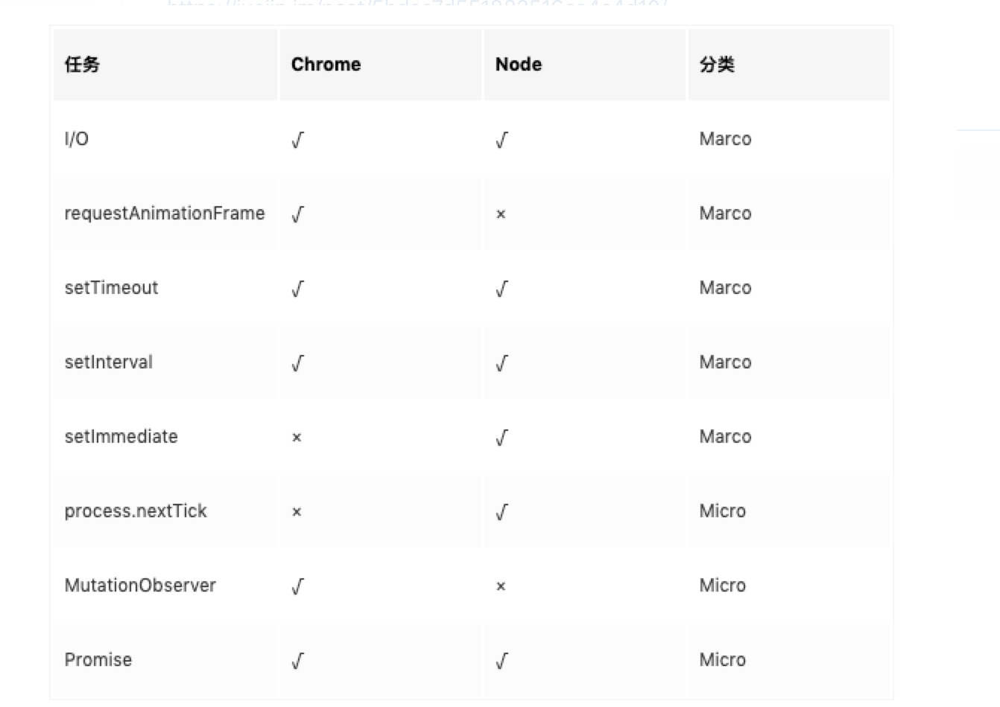
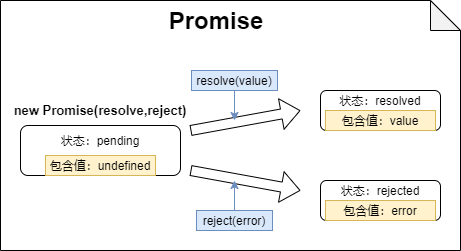

# 异步JavaScript


## JS事务循环

JS引擎是一个基于事件驱动的单线程执行模型。所有的任务可以分为同步和异步两种。

*同步任务*会在*调用栈*中直接执行，*异步任务*会放入*任务队列*中排队等待执行。

事件循环遵循这样的流程:

1. 执行全局`<Script>`的*同步代码*
2. 执行所有的*微任务*
3. 执行一个*宏任务*
4. 完成了一次事件循环，再次从步骤2开始循环，直到所有任务都已执行。

### 宏任务，微任务

> 任务队列中的异步任务分为微任务队列和宏任务队列。
>
> 常见的微任务有`Promise` 回调、`MutationObserver` 回调等,
>
> 常见的宏任务有`setTimeout`、`setInterval`、DOM事件回调等。



微任务总是会先于宏任务执行。

### 案例

```js
console.log(1);
var timer = setTimeout(function(){
    console.log(2);
},0)
new Promise(function executor(resolve){
    console.log(3)
    for(var i = 0; i<10000; i+=1){
        i ==9999 && resolve()
    }
    console.log(4)
}).then(function(){
    console.log(5)
    clearTimeout(timer)
})
console.log(6)

// 结果输出： 1 3 4 6 5
```

- 该案例展示了一个典型的JS事务循环题
- 包含同步代码和异步代码，异步代码又包含微任务代码（`Promise`）和宏任务代码（`setTimeout`）。
- 同步代码当中包括直接代码和`promise`构造函数的代码，都会按顺序依次执行，先输出`1 3 4 6`。
- 然后执行所有的微任务，在此就是`Promise`的`then`回调函数的内容，输出`5`。
- 之后本来会有宏任务的（`setTimeout`），但由于`clearTimeout`的执行取消了该任务，所以`2`没有被输出。
- 总结后是会依次输出：`1 3 4 6 5`

> 注意：
>
> 1. 在思考宏任务的执行顺序的时候`setTimeout`要考虑到多少时间后执行！
>
>    比如`setTimeout(***,100)`会比`setTimeout(***,0)`晚执行。
>
> 2. UI渲染在同步代码之后（可能同步），微任务代码和宏任务代码之前执行，即*在异步代码之前执行*


## Promise

Promise对象，又称期约，终止了回调地狱，是解决异步编程的一重大利器。对于其工作流程图解如下：

对于Promise的参数函数的两个形参函数`resolve,reject`来说Promise只会调用先出现的`resolve`/`reject`函数，

所以在规划Promise函数的内部逻辑分支中`resolve`/`reject`只能用其中一个。

调用了`resolve`/`reject`函数的其中之一后，如果promise函数还有同步代码还会继续执行，不会被`resolve`/`reject`函数中断。

如果没调用会永远处于`pending`状态，无法继续回调函数的操作。



**创建**

```js
//把Promise作为函数返回值，使得该Promise可重复生成
function KeyRequest(){
    //Promise的参数是个函数，其参数分别是解决函数形参和处理错误形参
    return new Promise((resolve,reject)=>{
        //在Promise参数函数体内的同步代码会被立即执行
        console.log("我为你查询一下，10分钟后等结果")
        setTimeOut(()=>{
            (Math.floor(Math.random()*2)/*分支条件*/)
                ?resolve("有钥匙了，给你")
                :reject("不好意思啊，没钥匙了")
        },600000)
    })
}
```

**使用**  

Promise对象建立后可以通过`then`方法填入回调函数来链式调用进行处理。

错误处理也可以在后面接着`catch`函数调用。

```js
KeyRequest().then(result=>{
    console.log(result)
}).catch(error=>{
    console.error(error)
})
//等同于
KeyRequest().then(result=>{
    console.log(result)
},error=>{
    console.error(error)
})
```

> 一个特性是经过链式调用后的Promise对象还是Promise对象(只是不同了而已,前提是)，且Promise状态变化后还可以继续链式调用加入处理函数，避免了回调陷阱。
>

**实例**：

1. 封装请求json的繁琐步骤（与Fetch API比较相似）

```js
const getJson = (url) => {
    return new Promise((res, rej) => {
      let xhr = new XMLHttpRequest()
      xhr.open("GET", url)
      xhr.responseType = "json" //可以将传送回来的json字符串自动转换为对象
      xhr.send()
      xhr.onload = () => {
        if (xhr.status == 200) res(xhr.response)
        else rej(xhr.status)
      }
    })
  }
getJson("https://api.uomg.com/api/rand.music?sort=热歌榜&format=json").then(processInfo).catch(manageError)
//processInfo、manageError是另外编的两个处理函数
```

2. 避免嵌套计时器

```js
const cusTimer=function(callback,time){
    return new Promise(res=>{
        setTimeOut(()=>{callback(); res()},time)
    })
}
cusTimer(fn1,1000)
    .then(()=>{
        return cusTimer(f2,2000)
    }).then(()=>{
        return cusTimer(f3,2000)
    }).then(()=>{
        return cusTimer(f4,2000)
    })
/** 
等价于：
cusTimer(fn1,1000)
    .then(() => cusTimer(f2,2000))
    .then(() => cusTimer(f3,2000))
    .then(() => cusTimer(f4,2000))
*/
```

3. promisify

> 在实际应用中，一个函数满足这几个条件，就可以被 `promisify` 化:
>
> - 该方法必须包含回调函数
> - 回调函数必须执行
> - 回到函数第一个参数代表 err 信息，第二个参数代表成功返回的结果

## `Promise.resolve()`

## `Promise.reject()`

> 用`Promise.resolve()`直接生成一个已解决的Promise
>
> 用`Promise.reject()`直接生成一个已失败的Promise
>

## `Promise.all()`

> 同时处理多个Promise对象，==全部成功==时返回成功状态的*结果数组*，==至少一个失败==时返回失败时的*单独结果*
>
> *结果数组*的格式是由多个Promise结果构成的数组，顺序就是原Promise数组的对应顺序。

```js
const cusTimer = (value,time) => new Promise(res => {
    setTimeout(()=>{res(value)},time)
})

Promise.all([cusTimer(1,3000),cusTimer(2,4000),cusTimer(3,2000)]).then(res=>{
    console.log(res) // 所有请求成功后的操作步骤
}).catch(error=>{
    console.error(error) // 某一个请求失败后的操作步骤
}); //返回[1,2,3]
```

## `Promise.allSettled()`

> 即使全部异常，也会正常返回对应异常状态

```js
Promise.allSettled([A(), B(), C()])
    .then(res => console.log(res))

/*
[
  { status: 'fulfilled', value: 'A' },
  { status: 'fulfilled', value: 'B' },
  { status: 'rejected', reason: 'C' }
]
*/
```

## `Promise.any()`

> 只要有一个请求成功 就会返回第一个请求成功的
>
> 全部请求失败，才会接收错误
>
> 处于试验性，兼容性不好，可能会出现 `Promise.any is not a function`

```js
Promise.any([A(), B(), C()])
    .then(res => console.log(res))
    .catch(err => console.log('错误：',err));
```

## `Promise.race()`

> 可以检测页面中某个请求是否超时，并输出相关的提示信息。
>
> 哪个promise产出结果了就返回哪个，不管成功还是失败。

```js
Promise.race([p1,p2,p3,...]).then(
  function(v){
      //获取最快任务成功时的返回值
  },
  function(){
      //获取最快任务失败时的返回值
  }
)
```

## 异步函数

### `async, await`

**async**：声明异步函数，保证函数返回值是Promise对象(async函数调用后还是可以在后面接then等后续操作的)

**await**：等待Promise对象状态的转变，产出Promise对象结果以作为结果。要求后面跟上Promise对象。

await跟着的代码是被看成同步任务，而await后面的部分都被看做是微任务，await会让程序让出线程做跟着的任务。

```js
await new Promise((rs,rj)=>{ // async函数内部
       console.log(3)
   }).then(()=>{
       console.log(4)
   })
console.log(5)

// 相当于：
Promise.resolve(
   new Promise((rs,rj)=>{
       console.log(3)
   }).then(()=>{
       console.log(4)
   })
).then(()=>{ 
    console.log(5)
})
```

这意味着如果后跟着的Promise对象状态一直没有转变，异步函数就会在这卡壳。

```js
const getJson = async (url)=>{
    let result = await new Promise (function(res, rej){ //跟上新创建的Promise对象
      let xhr = new XMLHttpRequest()
      xhr.open("GET", url)
      xhr.responseType = "json" //可以将传送回来的json字符串自动转换为对象
      xhr.send()
      xhr.onload = () => {
        if (xhr.status == 200) res(xhr.response)
        else rej(xhr.status)
      }
    })
    return await processInfo(result)
  }
getJson("https://api.uomg.com/api/rand.music?sort=热歌榜&format=json").catch(manageError)
```

实例1：网页代码的执行【输入控制台，可以将控制台化身为演练操场】

```js
(function(){
    fetch("https://cdn.jsdelivr.net/npm/axios/dist/axios.min.js") //网页脚本cdn地址
        .then(async (res) => eval(await res.text()))
})()
```

实例2：输出问题（恒生）

```js
(async ()=>{
    console.log(1)
    setTimeout(()=>{
        console.log(2)
    })
    await new Promise((rs,rj)=>{
        console.log(3)
    }).then(()=>{
        console.log(4)
    })
    console.log(5)
})()
```

- 该案例展示了另一个JS事务循环题，不过有处陷阱。
- 同步代码当中包括直接代码和`promise`构造函数的代码，都会按顺序依次执行，先输出`1 3`。
- 由于*该Promise的状态没有转变*，`await`处*后面的代码无法执行*，微任务部分也无法执行，执行微任务过程被跳过。
- 之后有宏任务的（`setTimeout`），所以输出`2`。
- 总结后是会依次输出：`1 3 2`

### 返回值处理

> * 函数中有返回值，则相当于执行了 `Promise.resolve(返回值)` 函数
> * 没有返回值，则相当于执行了 `Promise.resolve()` 函数。

### 错误处理机制

为了处理其中产生的错误，使用`try...catch...`错误处理机制。

```js
async function test(){
    try {
        
    }
    catch(){
        
    }
}
```

## 循环异步请求

```js
function print() {
  return new Promise((resolve) => {
    setTimeout(() => {
      resolve(1);
    }, 1000);
  });
}

async function fn() {
  for (let i = 0; i < 5; i++) {
    console.log(await print());
  }
}
fn();
```

## `for await ... of ...`

我们可以用ES9新出的`for await ... of ...`遍历语法进行对于*Promise数组的异步遍历*

```js
function TimeOut(time) {
  return new Promise((resolve) => {
    setTimeout(function () {
      resolve(time);
    }, time);
  });
}
async function test() {
  let arr = [TimeOut(1000), TimeOut(2000), TimeOut(3000)];
  for await (let item of arr) {
    console.log(item);
  }
}
test();
```

与一般的`for ... of ... `的区别是：`of`前的变量表示promise返回的结果（也可在基础上解包），必须写在async函数当中。

```js
async onMounted(){
    // ...
    let counter = 0
    for await (let {data} of Array.from(this.allData).map(obj => asyncRequest(obj.id)))
    	WeakMapCache.set(this.allData[counter++].name, data)
    // ...
}
```
