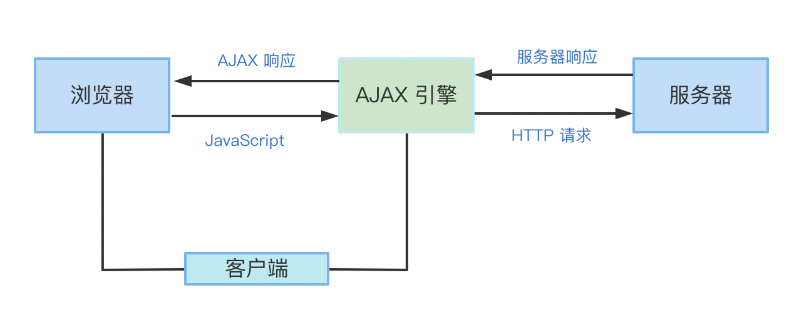
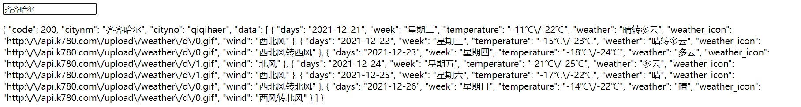
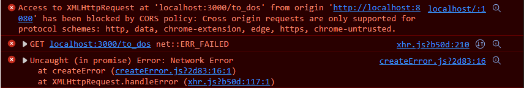

# 网络请求


## 请求详解

### 请求方式method

**与CRUD的关系**

1. Create - POST
2. Read - GET
3. Update - PUT / PATCH
4. Delete - DELETE

**幂等性（Idempotent）**：多次请求同个URL而返回值不变（identical outcome if called multiple times. ）

**安全性（Safe）**：请求不会修改后台（will not have any effect on the state of the server.）

|方法名	|安全性	|幂等性	|可缓存性	|请求方法的作用|
| ---------- | ---- | ---- | ---- | ---- |
|get	|√	|√|√| 请求指定的页面信息，并返回实体主体 |
|post       |×|×|| 请求服务器接受所指定的文档作为对所标识的URI的新的从属实体 |
|put	|×|	√|	| 从客户端向服务器传送的数据取代指定的文档的内容 |
|patch	|×| √ |  | 从客户端向服务器传送的数据取代指定的文档的内容 |
|delete   |×|	√	   |		   |请求服务器删除指定的数据|
|head     |√	|√	|√	|只请求页面的首部|
|option |√|	√	|		|允许客户端查看服务器的性能|
|trace |√|	√	|	|当客户端发送该请求时，服务器将原始请求报文作为响应返回给客户端，用于检查或调试请求的传输过程。|

**option预检请求**

> 当一个HTTP请求头中包含某些特定的情况时，浏览器会在发送实际请求之前先发送一个"预检"请求，即OPTIONS请求。
>
> 以下是可能导致浏览器发送OPTIONS请求的一些常见情况：
>
> 1. *使用CORS（跨源资源共享）*时：当浏览器从一个源（域名、协议和端口）向另一个源发出请求时，如果两个源的CORS策略不匹配，浏览器将发送OPTIONS请求以确定*是否允许实际请求*。
> 2. *使用自定义请求头*时：如果请求包含自定义请求头（例如，`X-Custom-Header`），浏览器可能会发送OPTIONS请求，以便服务器*确认是否接受这些自定义头*。
> 3. *使用PUT、DELETE等非常规方法*时：在某些情况下，浏览器可能会在使用非常规的HTTP方法（如PUT、DELETE）之前发送OPTIONS请求，以便服务器*确认是否支持这些方法*。
> 4. *请求带有敏感信息*时：如果请求中包含了敏感信息（例如，Authentication头），浏览器可能会发送OPTIONS请求，以便服务器确认*是否接受这些敏感信息*。
>
> OPTIONS请求本身并不会传输任何实际数据，它只是一种询问性质的请求，用于确定实际请求是否可以被服务器接受。
>
> 服务器在收到OPTIONS请求后，通常会返回一个响应，其中包含允许的方法、请求头和响应头等信息。
>
> 浏览器会根据这个响应来决定是否发送实际的请求。

### 请求头header

HTTP 请求常用的 header 条目包括:

| Header 条目     | 说明                                                      |
| :-------------- | :-------------------------------------------------------- |
| Host            | 指定请求资源的主机名和端口号                              |
| User-Agent      | 指定发起请求的客户端应用程序的名称和版本                  |
| Accept          | 指定客户端可以接受的响应数据类型                          |
| Accept-Encoding | 指定客户端支持的内容编码格式                              |
| Accept-Language | 指定客户端可以接受的响应内容语言                          |
| Content-Type    | 发送请求体时需要指定内容的 MIME 类型                      |
| Connection      | 控制在完成当前响应后是否关闭网络连接                      |
| Cookie          | 包含之前由服务器通过 `Set-Cookie` 发送的 HTTP Cookie 信息 |
| Authorization   | 用于携带认证信息                                          |
| Content-Length  | 发送请求体时需要指定请求体的长度                          |
| Referer         | 指定当前请求是从哪个页面发出的                            |
| Origin          | 指定请求的源站点,用于跨域资源共享 (CORS) 的访问控制       |

除了上述常见的 header 条目外,还可以根据需求自定义其他 header 字段。

### 请求体body

请求体的方式如下：

> 1. form-data: 这种方式通常用于上传文件，可以将文件和其他数据一起发送到服务器。
> 2. x-www-form-urlencoded: 这种方式是将数据编码成键值对的形式，然后将其发送到服务器。这种方式通常用于提交表单数据。
> 3. json: 这种方式是将数据编码成JSON格式，然后将其发送到服务器。这种方式通常用于API接口的数据交互。
> 4. xml: 这种方式是将数据编码成XML格式，然后将其发送到服务器。这种方式通常用于Web服务的数据交互。
> 5. raw: 这种方式是将数据原样发送到服务器，不进行任何编码。这种方式通常用于发送纯文本数据或二进制数据。

在使用这些请求体时需要注意以下几点：

>   1. formData不能夹杂在普通请求数据当中，因为它是用于上传文件的，需要单独处理。
>  2. x-www-form-urlencoded和json都是常用的请求体格式，但需要注意它们的编码方式不同，前者是将数据编码成键值对的形式，后者是将数据编码成JSON格式。
>   3. 如果要使用xml格式的请求体，需要在请求头中设置Content-Type为"application/xml"。
>   4. 使用raw格式时需要注意数据的编码方式，可以选择纯文本、JSON或者其他格式。
>   5. binary格式通常用于上传二进制文件或图片等数据，需要在请求头中设置Content-Type为"application/octet-stream"。
>      总之，在使用不同的请求体时，需要根据具体情况选择合适的格式，并注意数据的编码方式和请求头的设置。

### HTTP请求缓存

**请求头**:

- `If-Modified-Since`: 让服务器返回在指定日期之后修改的资源
- `If-None-Match`: 与 `ETag` 一起工作,让服务器返回指定资源的新版本
- `Cache-Control`: 指定请求和响应遵循的缓存机制,如 `no-cache`、`max-age`

**响应头**:

- `Expires`: 指定资源的到期时间,客户端直到这个时间后才能缓存该资源
- `Cache-Control`: 指定资源的缓存机制,如 `no-cache`、`public`、`private`、`max-age`
- `ETag`: 资源的唯一标识,用于重新验证缓存资源的新鲜度
- `Last-Modified`: 资源上次修改的时间

## 常见请求响应码

更多内容参考：[HTTP Status Codes explained](https://http.dev/status)

### 2xx: 成功响应类

* 200(OK)：HTTP请求响应成功
* 204 (No Content): 服务器已成功处理了请求,但没有返回任何内容。

### 3xx: 重定向类

* 301(Moved Permanently)：请求的资源已被永久移动到新的URL。
* 302(Found)：请求的资源临时被移动到新的URL。
* 304 (Not Modified): 资源自从上次请求后没有任何修改，是可以安全地使用缓存的版本。

### 4xx: 客户端错误类

* 400(Bad Request)：服务器无法理解请求的语法。
* 401(Unauthorized)：请求需要进行身份验证。
* 403(Forbidden)：服务器拒绝访问该资源。
* 404(Not Found)：所请求资源未找到。
* 405 (Method Not Allowed): 请求中指定的方法在所请求的资源上是不被允许的。
* 408 (Request Timeout): 服务器等候请求时发生了超时。

### 5xx: 服务端错误类

* 500(Internal Server Error)：服务器内部错误。
* 502(Bad Gateway)：作为网关或代理的服务器,从上游服务器收到无效响应。
* 503(Service Unavailable)：服务器暂时处于超负载或维护状态。
* 505 (HTTP Version Not Supported): 服务器不支持请求中所使用的HTTP协议版本。

## Ajax



Ajax主要是用`XmlHttpRequest`(XHR)来进行请求数据的。

### 数据请求

> 1. 新建XHR对象：`xhr = new XMLHttpRequest();`
> 2. 创建请求：`xhr.open(method, url, async)`
> 3. 发送请求： `xhr.send()`
> 4. 对请求响应：`xhr.onload=()=>{/*...*/}`

open方法中，method有两个可选项：“GET”和“POST”,url为服务器文件所在页面地址，async表示要不要异步加载。async为true时才要写`onreadystatechange`回调函数。

> url中"?"后边是向服务器请求的数据（本质上是键值对，格式为`键=值`。多个键值对间用"&"隔开）

send方法中，填字符串表示是POST请求。

**返回数据**

| 返回数据       | 释义                |
| -------------- | ------------------- |
| `responseText` | 服务器返回的字符串  |
| `responseXml`  | 服务器返回的XML文件 |

### 响应处理

我们要对返回情况会作出相应响应，可以借助`onreadystatechange`和`onload`。

### `onreadystatechange`

`onreadystatechange`会在每次`readyState`状态改变时会触发。其属性如下：

| 属性         | 释义                             |
| ------------ | -------------------------------- |
| `readyState` | 是XHR对象的请求状态，共有5种状态 |
| `status`     | 返回信息状态                     |

下面细说这俩属性具体值内容。

| `readyState`状态值 | 值释义                                                  |
| ------------------ | ------------------------------------------------------- |
| 0                  | 未初始化请求：XHR对象已经创建，但还没有调用open()方法。 |
| 1                  | 载入/发送请求                                           |
| 2                  | 载入完成/响应接收                                       |
| 3                  | 交互/解析数据                                           |
| 4                  | 数据解析完成：响应内容解析完成，可以在客户端调用了。    |

HTTP状态码详情见：[HTTP状态码详解](https://tool.oschina.net/commons?type=5)

响应就绪：`xhr.readyState == 4 && xhr.status == 200`

### `onload`

忽略请求过程状态处理的话可以完全取代前者。

因为`onload`只在`readyState==4`时才反应，但不会对`status`具体状态产生反应。

**实例：请求天气预报数据**

```js
/*
<input type="text" id="search">
  <p id="show"></p>
*/
let search = document.getElementById("search")
let show = document.getElementById("show")

search.addEventListener("change", () => {
  let location = search.value
  if(!location)return
  let xhr = new XMLHttpRequest();   //1.新建对象
  xhr.open("GET", `https://api.66mz8.com/api/weather.php?location=${location}`, true)  //2.创建请求
  xhr.send()  //3.发送请求
  xhr.onload=()=>{  //4.对请求响应
    if(xhr.status == 200)
      show.innerHTML=xhr.responseText //进一步处理就要用JSON对象及后续操作了
    else alert("数据请求失败！")
}})
```

或者这样：

```js
  xhr.onreadystatechange = () => {
    if (xhr.readyState == 4) {
      if(xhr.status == 200)
        show.innerHTML=xhr.responseText
      else alert("数据请求失败！")
    }
  }
```



## Jquery Ajax

### ajax()

是向服务器请求数据的，在方法内部我们可以指定是使用 POST 请求还是使用 GET 请求。在日常开发中 `ajax` 方法是最常用的。

`ajax` 方法的语法格式为：

```js
$.ajax({ 配置项 });
```

| 参数        | 类型             | 描述                                                         |
| ----------- | ---------------- | ------------------------------------------------------------ |
| url         | String           | 发送请求地址，默认为当前页面地址。                           |
| type        | String           | 请求数据的方式（POST 或 GET），默认为 GET。                  |
| timeout     | Number           | 设置请求超时的时间，其单位为毫秒。                           |
| data        | Object 或 String | 发送到服务器的数据。                                         |
| dataType    | String           | 服务器返回的数据类型。                                       |
| beforeSend  | Function         | 发送请求前可以修改的 XMLHttpRequest 对象的函数。             |
| complete    | Function         | 请求完成后的回调函数，这里的回调函数无论请求成功或者失败都会被调用。 |
| success     | Function         | 请求成功后的回调函数。                                       |
| error       | Function         | 请求失败后被调用的函数。                                     |
| contentType | String           | 发送信息至服务器时内容的编码形式。                           |
| async       | Boolean          | 设置请求方式，当值为 true 时，所有请求为异步请求；当值为 false 时，所有请求为同步请求，默认值为 true。 |
| cache       | Boolean          | 设置浏览器是否缓存当前页面，当值为 true 时浏览器会缓存该页面，反之不会，默认值为 false。 |

### load() 

让 AJAX 去请求服务器，并从中获得数据，最后将获得的数据放入到指定的元素中。

```js
$().load(url, data, callback);
```

- `url` 是被加载页面的地址，它是必选参数。
- `data` 是发送到服务器的数据，它是可选参数。
- `callback` 是请求完成后的回调函数，它是可选参数。

这里请注意，load 方法中的回调函数有三个额外的参数，以下所示：

- `response`：服务器响应的结果数据。
- `status`：服务器响应的状态。
- `xhr`：XMLHttpRequest 对象。

### get()

通过 HTTP GET 请求从服务器请求数据。HTTP 是超文本传输协议，它是客户与服务器之间通信的一种协议，HTTP 有一些请求方法，在这些方法中 `GET` 和 `POST` 是最常见的。同学们想了解更多关于 HTTP 的内容，可以阅读 [HTTP 请求方法](https://www.w3school.com.cn/tags/html_ref_httpmethods.asp)。

```js
$.get(url, data, callback(data, status, xhr), dataType);
```

- `url`：是请求的 url，它是必须参数。
- `data`：是发送到服务器的数据，它是可选参数。
- `callback`：是当请求成功时的回调函数，该方法包含三个参数，`data` 是请求的结果数据，`status` 是包含请求的状态，`xhr` 是 `XMLHttpRequest` 对象。
- `dataType`：是服务器返回的数据格式，如 xml、html、json 等，默认的 jQuery 会智能判断它的类型。

### post()

```js
$.post(url, data, callback(data, textStatus, jqXHR), dataType);
```

- `url`：是请求的 url，它是必须参数。
- `data`：是发送到服务器的数据，它是可选参数。
- `callback`：是当请求成功时的回调函数，该方法包含三个参数，`data` 是请求的结果数据，`textStatus` 是包含请求的状态，`jqXHR` 是 `XMLHttpRequest` 对象。
- `dataType`：是服务器返回的数据格式，如 xml、html、json 等。

### getJSON()

在前面我们学了 `ajax` 方法，当我们要向服务器发送一个 GET 请求并获取 JSON 类型的数据时，写法如下：

```js
$.ajax({
  type: "GET",
  dataType: "json",
  url: url,
  data: data,
  success: success,
});
```

`getJSON` 相当于是以上内容的缩写。就是使用 `GET` 请求从服务器加载 `JSON` 格式的数据。

该方法的使用格式如下所示：

```js
$.getJSON(url [,data] [,success(data, textStatus, jqXHR)])
```

### `getScript()` 

当我们使用 GET 请求从服务器中加载并执行一个 JavaScript 文件，写法如下：

```js
$.ajax({
  url: url,
  dataType: "script",
  success: success,
});
```

`getScript` 是使用一个 `GET` 请求从服务器加载并执行一个 `JavaScript` 文件。

```js
$.getScript( url [, success(script, textStatus, jqXHR) ] )
```

| 参数                                 | 类型     | 说明                         |
| ------------------------------------ | -------- | ---------------------------- |
| `url`                                | String   | 包含发送请求的 URL 字符串。  |
| `success(script, textStatus, jqXHR)` | Function | 当请求成功后执行的回调函数。 |

## Axios

### 安装和使用

> 1. cdn：`<script src="https://unpkg.com/axios/dist/axios.min.js"></script>`
>
> 2. npm：`npm install axios`
>
>    导入：`import axios from 'axios'`

```js
axios({url:"https://pokeapi.co/api/v2/pokemon/vaporeon"}).then(console.log)//最基本使用
```

### 请求方法

**单个请求**：可以在参数中声明，默认是`get`方法，post方法同理

```js
axios({
    url:"https://pokeapi.co/api/v2/pokemon/vaporeon",
    method:"get",
    timeout:5000
}).then(console.log)
```

也可以用axios.get方法，省去参数

```js
axios.get("https://pokeapi.co/api/v2/pokemon/vaporeon").then(console.log)
```

> 请求别名【*[]内的可选*】：
>
> | 请求别名                             | 释义                                     |
> | ------------------------------------ | ---------------------------------------- |
> | `axios.request(config)`              | 跟`axios(config)`差不多，请求方式为*get* |
> | `axios.get(url[, config])`           | 请求数据                                 |
> | `axios.post(url[, data[, config]])`  | 向服务器添加数据                         |
> | `axios.put(url[, data[, config]])`   | 向服务器更新数据，会修改全部数据         |
> | `axios.patch(url[, data[, config]])` | 向服务器局部更新数据，只会修改局部数据   |
> | `axios.delete(url[, config])`        | 向服务器删除数据                         |

**多个请求**

可以用`axios.all()`方法装入多个请求，返回请求结果数组，然后用`axios.spread()`分解请求结果

```js
let rec1=0,rec2=0
axios.all([axios({url:"a"}),axios({url:"b"})]).then(
    axios.spread((msg1,msg2)=>{
    rec1=msg1; rec2=msg2
    /*或者这样：([a,b]=>{
        rec1=a; rec2=bmsg
    })*/
    )
})
```

也可以用[`Promise.all()方法`](#Promise.all())解决。相关知识请参照上文

```js
Promise.all([axios({url:"a"}),axios({url:"b"})]).then(([a,b])=>{
    console.log(a); console.log(b)
})
```

> 注意：若是遇到下面错误，在localhost前面加上http://即可



**POST,PUT,PATCH**

> 前提：请求分支存在，最好为空对象

```js
axios.post('http://localhost:3000/check',this.obj).then((res)=>{
        console.log('success in pushing data!')
        console.log(res);
      })

axios.put('http://localhost:3000/check',this.obj).then((res)=>{
        console.log('success in pushing data!')
        console.log(res);
      })

axios.patch('http://localhost:3000/check',{_2ndfavorite_pm:this.obj._2ndfavorite_pm}).then((res)=>{
        console.log('success in updating data!')
        console.log(res);
```

**DELETE**

> 有两种json数据的处理方式
>
> 1.数组类
>
> 2.对象类

```

```


请求配置

```js
axios({
    url:"https://api.66mz8.com/api/weather.php",
    params:{
        location:encodeURI("利川")
    }
}).then(console.log)
```

常见配置

| 配置名       | 可填参数                                                   | 默认值      | 释义                  |
| ------------ | ---------------------------------------------------------- | ----------- | --------------------- |
| baseURL      | 任意url                                                    | “”          | 请求的根url           |
| url          | 任意url                                                    | “”          | 请求的相对url         |
| method       | 'get','post'                                               | get         | 请求方式              |
| params       | 键值对                                                     | ""          | 网址`?`后面的请求参数 |
| timeout      | Number                                                     | 0(永不超时) | 请求时限多少毫秒      |
| responseType | 'arraybuffer', 'document', 'json', 'text', 'stream','blob' | 'json'      | 将响应的数据类型      |

要想设置全局的axios配置，直接修改`axios.default`的配置属性即可

```js
axios.default.baseURL="https://pokeapi.co/api/v2/pokemon"
axios.default.timeout=5000
axios.method="get"
```

### 响应结构

| 成分       | 释义                        |
| ---------- | --------------------------- |
| config     | 请求配置                    |
| data       | 响应的数据本体              |
| headers    | 服务器响应头                |
| request    | 请求工具，浏览器端就是XHR了 |
| status     | 响应的 HTTP 状态码          |
| statusText | 响应的 HTTP 状态信息        |

### Axios实例

> 为了能够更简洁地进行多个类型、参数不同的请求，可以对每一个请求对象创造对应实例

```js
const weather = axios.create({url:"https://api.66mz8.com/api/weather.php"})
const pokemon = axios.create({baseURL:"https://pokeapi.co/api/v2/pokemon"})
pokemon({url:"/vaporeon"}).then(console.log)
```

> 实例对上面的请求别名也适用！

```js
const pokemonArr = ["Meowscarada","Skeledirge","Quaquaval"].map(pm=>pokemon.get(`/${pm}`))

Promise.all(pokemonArr).then(([a,b])=>{
    console.log(a)
    console.log(b)
})
```

### 拦截器

> 可以通过它们让你在请求发送或收到响应之前提供处理程序

**请求拦截**

```js
axios.interceptors.request.use(
    (config)=>{
    /*在发送请求之前做些什么...*/ 
    return config
},(err)=>{
    /*对请求错误做些什么...*/ 
    return Promise.reject(err)
})
```

**响应拦截**

```js
axios.interceptors.response.use(
    (res)=>{
    /*对响应数据做点什么...*/ 
    return res
},(err)=>{
    /*对响应错误做点什么...*/ 
    return Promise.reject(err)
})
```

### 取消请求

在请求内部由`axios.CancelToken`生成句柄，并通过该句柄进行请求取消。

```js
let cancel;

axios.get('/user/12345', {
  cancelToken: new axios.CancelToken( function(mainToken){
    // g函数接收一个 cancel 函数作为参数
    cancel = mainToken;
      //在vue项目里
 //   Vue.prototype.$cancelRequest = mainToken
  })
});

// 取消请求
cancel();
this.$cancelRequest()
```

另一种方法是使用`axios.CancelToken.source()`来进行请求取消

```js
const source = axios.CancelToken.source();

axios.get('/api/data', {
  cancelToken: source.token
}).catch(function(thrown) {
  if (axios.isCancel(thrown)) {
    console.log('Request canceled', thrown.message);
  }
});

// 取消请求 (参数的消息是可选的)
source.cancel('Operation canceled by the user.');
```

新方法则是用`AbortController`对象来取消请求。用`signal`接受取消信号。

```js
const controller = new AbortController();

axios.get('/foo/bar', {
   signal: controller.signal
}).then(function(response) {/**/});
// 取消请求
controller.abort()
```

## 数据服务

**json-server**

> 安装：`npm i json-server -g`
>
> 查看版本：`json-server -v`
>
> 服务搭建 ：`json-server -w xxx.json`（*注意目标json文件要看是否在该路径下*）
>
> 延时触发：`json-server -w xxx.json -d 1000`会延时1s
