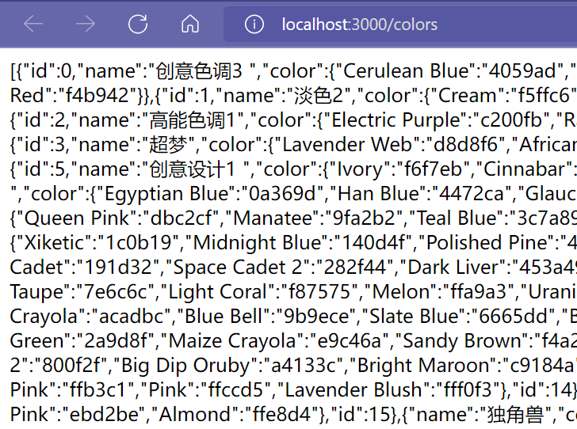

# Node笔记

---

完整教程：http://nqdeng.github.io/7-days-nodejs

## Nodejs引入

> 1. 官网安装
>
> 2. cmd检查node和npm版本：
>
>    `node -v`【`node --version`】
>
>    `npm --version`

## Node实时编程

> 1. cmd敲`node`进入
> 2. `ctrl+d`退出
> 3. `ctrl+c`直接退出cmd

## Node模块机制

> 主要利用commonJS机制，其对模块定义十分简单：引用、定义、标识
>
> 模块化中，文件即模块，且有其作用域。
>
> 有三个关键字：require、exports、module

### require

用`require()`导入模块

```js
//使用方法：require(路径)
require('md.js')
require('./img/test.img')
```

> 在vscode里，可以直接输入`req`来简单引入一个Node模块


### exports

```js
exports.x = 1
exports.fn = () => {console.log('Hi NodeJs!')}
```

### module

**exports属性**

```js
module.exports = {
    x:0,
    fn(){console.log('Hi NodeJs!')}
}
```

### 包

> 由包结构和包描述文件组成
>
> 包结构包含：package.json（必选）、readme.md、main.js等

```json
//package.json常用信息
{
    "name":"itheima-tools",  //包名
    "version":"1.0.0",  //包版本
    "main":"index.js",  //主入口文件
    "description'":"提供了格式化时间、HTMLEscape相关的功能"，//包描述
    "keywords":[ //包的搜索关键字
    "itheima",
    "dateFormat",
    "escape"
    ],
    "license":"ISC" //许可证
}
```

## npm使用

> 安装淘宝镜像：`npm install -g cnpm --registry=https://registry.npm.taobao.org`

| 命令      | 缩写   | 用法              | 释义                                      | 更多用法                                                     |
| --------- | ------ | ----------------- | ----------------------------------------- | ------------------------------------------------------------ |
| --version | -v     | npm --version     | 查看npm版本                               |                                                              |
| -l        |        | npm -l            | 显示全部命令的详细用法                    |                                                              |
| init      |        | npm init          | 创建`package.json`                        |                                                              |
| install   | i      | npm install       | 安装项目依赖                              | npm install foo 安装项目指定依赖                             <br/>npm install foo @version  安装项目某依赖的指定版本 <br/>npm install foo @latest   安装项目某依赖的最新版本 |
| uninstall | rm、un | npm un \<foo>     | 卸载某个依赖                              |                                                              |
| run       |        | npm run \<foo>    | 运行package.json的指定脚本【scripts部分】 |                                                              |
| list      | ls     | npm list          | 列出当前项目安装的所有依赖                | npm list -g 列出当前项目安装的所有依                         |
| update    |        | npm update \<foo> | 升级项目指定依赖                          |                                                              |

> -g 表全局依赖；主要用在安装和卸载指令上
>
> -S 为--save的缩写，表本地依赖
>
> -D 为--save-dev的缩写，表开发时依赖

### npm镜像

|      |      |      |
| ---- | ---- | ---- |
|      |      |      |
|      |      |      |
|      |      |      |


## 文件操作

> 即file-system，在Nodejs中使用fs模块来实现相应功能

```js
const fs = require('fs') //导入
```

### 读取文件

> 具体方法：`fs.readFile(path[,options],callback)`
>
> 如果读取成功，回调函数中`error===null`
>
> 如果读取失败，回调函数中`data===undefined`，error则是对象

| 参数     | 是否必选 | 格式                      | 释义                       |
| -------- | -------- | ------------------------- | -------------------------- |
| path     | 是       | String                    | 文件路径                   |
| options  | 否       | 'utf8'                    | 以什么编码读取文件         |
| callback | 是       | `(error,data)=>{/*...*/}` | 回调函数，以此获取文件信息 |

```js
const fs = require('fs')
//读取文本时不填第二参数'utf-8'是读不出来文本的
fs.readFile('./info.txt','utf-8',(err,data)=>{
  console.log(data);
  if(err){
    console.log(err);
  }
})
```


### 写入文件

> 具体方法：`fs.writeFile(file,data[,options],callback)`
>
> 如果写入成功，回调函数中`error===null`
>
> 如果写入失败，回调函数中error则是对象
>
> 该方法不可创建目录，需要
>
> 如果目标文件原本有文字，则会被新内容完全覆盖

| 参数     | 是否必选 | 格式                 | 释义                       |
| -------- | -------- | -------------------- | -------------------------- |
| file     | 是       | String               | 文件路径                   |
| data     | 是       | String               | 需要写入文件的数据         |
| options  | 否       | 'utf8'               | 以什么编码读取文件         |
| callback | 是       | `(error)=>{/*...*/}` | 回调函数，以此获取文件信息 |

```js
const fs = require('fs')
const data = ['a','b','c','d']
fs.writeFile('./output.txt',data.join('.'),(err)=>{
  //处理格式1：if-else语句块
  if(err) 
      console.log(err);
  else{
      console.log('文件写入成功！'); //不出错时提示成功信息
  }
})
```

### 路径动态拼接

> 主要针对形如`./`、`../`等相对路径拼接的问题，直接拼接Node会报错
>
> 解决方案之一是==直接搞绝对路径==，可移植性差。
>
> 解决方案之二是==使用`__dirname`表示文件当前路径==

```js
const fs = require('fs')
const path = __dirname + '/info.txt'
fs.readFile(path,'utf-8',(err,data)=>{
    //处理格式2：try-catch错误处理
    try{
        console.log(data)
    }catch(err){
        console.log('读取文件错误')
    }
})
```

### __filename

> `__filename`是运行文件的绝对路径

### 创建文件夹

> `fs.mkdir(path, mode, callback)`
>
> path：
>
> callback：回调函数

```js
const fs = require('fs'); 
const path = require('path'); 
   
fs.mkdir(path.join(__dirname, 'test'), (err) => { 
    if (err) { 
        return console.error(err); 
    } 
    console.log('Directory created successfully!'); 
});
```

## 路径操作

> 在Nodejs中用path模块处理路径问题

```js
const path = require('path')
```

### path.join()

> 用于路径拼接，可根据相对路径符控制路径的拼接结果

```js
console.log(path.join('Your/current/position','../','./code')) // 路径为Your/current/code
```


### path.basename()

> `path.basename(path[,ext])`
>
> 可以利用该方法从文件路径中取得当前文件的文件名，并省略特定扩展名
>
> path：必选，路径字符串
>
> ext：扩展名，只有和所填扩展名一样的才会省略扩展名

```js
let path1 = '项目大集结/大创项目-网易云音乐/node_modules/@ampproject/remapping/dist/remapping.mjs'
console.log(path.basename(path1,'.mjs'));
console.log(path.basename(path1,'.jpg'));
```


### path.extname()

> `path.extname(path)`
>
> 可以利用该方法从文件路径中取得当前文件的文件扩展名

```js
let path1 = '项目大集结/大创项目-网易云音乐/node_modules/@ampproject/remapping/dist/remapping.mjs'
console.log(path.extname(path1)); //.mjs
```

## 网络操作

> 在Nodejs中用http模块处理网络相关问题
>
> 可以通过`http.createServer()`方法将电脑转变为服务器

```js
const http = require('http');
```

### 制作http服务器

> 1. 引入http模块`const http = require('http');`
> 2. 创建http服务器实例：`const server = http.createServer()`
> 3. 用on方法为服务器绑定请求事件（request）
> 4. 用listen方法启动服务器

```js
const http = require('http');
const server = http.createServer()

server.on('request',(req,res)=>{
  console.log('requesting');
})

server.listen(6339,()=>{
  console.log('server running!');
  console.log('site is localhost:6339');
})
```

### 请求和响应处理

> 对于请求函数，格式如下：
>
> `(req:请求对象,res:响应对象)=>{}`
>
> 请求对象的相关参数有：url,methods等
>
> 请求对象的相关函数res.end()接响应参数（除了字符串其他的不行）

### 中文乱码问题

`request.js`

```js
const http = require('http')
const server = http.createServer()

//直接引入json文件(会转变为对象Object)
const wholeData = require('./db.json')

server.on('request',(req,res)=>{
  //通过判断url提供不同内容
  if(req.url==='/colors'){
    console.log('palette color data visiting');
    res.end(JSON.stringify(wholeData.colors))
    // res.end(encodeURI(JSON.stringify(wholeData.colors)))
  }
  else if(req.url==='/ui-theme'){
    console.log('theme color data visiting');
    res.end(JSON.stringify(wholeData['ui-theme']))
  }
  else {
      res.end("Sorry, source not found!")
  }
})

server.listen(3000,()=>{
  console.log("server running at http://localhost:3000")
})

```

> 理论上可以以此直接做个可以正常工作的服务器的，而如果有中文则会变成乱码。此时有两种方法：
>
> 1. 使用`encodeURI`直接转义
> 2. 设置响应头部：`res.setHeader('Content-type', 'text/html;charset=utf-8')`

| 中文乱码                                        | encodeURI                                                    | 头部处理                                        |
| ----------------------------------------------- | ------------------------------------------------------------ | ----------------------------------------------- |
|  |  |  |

## Express

### 服务器初步

#### 创建

> 相较上面的http库，有一种更适合制作服务器的库，即Express。
>
> 建立一个服务器，跟之前学的http库差不多，都经过以下操作：
>
> 1. 引入
> 2. 新建实例
> 3. 监听响应

```js
const express = require('express');
const app = express()

app.listen(3000,()=>{
  console.log('server successfully running at http://localhost:3000');
})
```

#### 监听GET和POST请求

> 用实例的get、post方法监听并响应
>
> get函数：`app.get(route,(req,res)=>{})`
>
> post函数：`app.post(route,(req,res)=>{})`

```js
const server = express()
///////////监听GET请求////////////
server.get('/abc',(req,res)=>{
  res.send({a:1,b:2,c:3})
})
///////////监听POST请求///////////
server.post('/abc',(req,res)=>{
  res.send('congratulations!')
})
```

#### 指定静态资源

> 1

```js

```

### 路由

#### 路由文件模块

> 路由可以像上面监听指定url的方法做路由，可更多还是把它们划分为模块，分散到文件去。
>
> 主文件只需要引入并使用对应模块即可

`router.js`

```js
const express = require('express');
const router = express.Router()

const url = 'pokedex'

router.get(`/${url}`, (req, res) => {
  res.send('get user name')
})

router.post(`/${url}`, (req, res) => {
  res.send('add new user')
})

module.exports = router
```

`index.js`

```js
const someRouter = require('./router.js')

app.use(someRouter)
```

> 内容类型：如果是post请求必须指定这个属性:
>
> `res.header('Content-Type', 'application/json;charset=utf-8')`

### 中间件

> Express 中间件是一个函数，它接收请求对象、响应对象和 next 函数，并在请求-响应周期的某个点上对它们进行修改、验证或其他操作。通过将中间件挂载到 Express 应用中，你可以轻松实现全局的验证、记录、修改请求数据、添加 HTTP 头以及执行其他操作。

```js
const myMiddleware = (req, res, next) => {
  // Validate request data
  if (!req.body.username) {
    return res.status(400).json({ error: "Missing username" });
  }

  // Log request data
  console.log("Received request data:", req.body);

  // Modify request data
  req.body.username = req.body.username.toLowerCase();

  // Add HTTP header
  res.set("X-Powered-By", "MyMiddleware");

  // Call next middleware or route handler
  next();
};

app.use(express.json());
app.use(myMiddleware);

app.post("/api/users", (req, res) => {
  // Use modified request data
  res.json({ message: `Hello, ${req.body.username}!` });
});
```

> 在 Express 应用中使用中间件的方式是通过使用 app.use() 方法挂载它们。
>
> 在 app.use() 中，你可以传递一个路径字符串，以限制该中间件仅在该路径请求中生效。
>
> 比如挂载到 '/' 路径上。所有请求 / 路径的请求将经过 myMiddleware 中间件。

```js
const express = require('express')
const app = express()

const myMiddleware = (req, res, next) => {
  // your middleware logic
  next()
}

app.use('/', myMiddleware)

app.listen(3000, () => {
  console.log('Server is running on http://localhost:3000')
})
```

## Koa

### 中间件

> Koa的洋葱原理：主要是基于其独特的中间件处理机制。
>
> 这种机制借鉴了函数式编程中的compose思想，使得每个中间件函数都能按照特定的顺序执行，从而实现对请求和响应的处理。

```js
router.use(async function (ctx, next) { // 路由统一后续中间件
  await next()
  console.log(3)
})

router.use(async function (ctx, next) {
  await next()
  console.log(2)
})

router.use(async function (ctx, next) {
  console.log(1)
})
```

## 跨域请求

> 有两种方式解决：
>
> 1. CORS：可处理GET,POST请求
> 2. JSONP：只可处理GET请求

### CORS

> 总共分为两步：
>
> 1. 引入cors包：`const cors = require('cors')`
> 2. 实例使用cors：`app.use(cors())`

**CORS可以携带的三个字段**

> 1. `res.header('Access-Control-Allow-Origin', '*')`
>
>    Access-Control-Allow-Origin有两种选项：一是具体地址，二是代表全体地址的`*`
>
> 2. `res.header("Access-Control-Allow-Headers", " Origin, X-Requested-With, Content-Type, Accept");`对额外请求头进行声明
>
> 3. `res.header('Access-Control-Allow-Methods', '*')`
>
>    由此设置允许更多的请求方式（默认只支持GET、POST、HEAD）。

```js
server.on('request', (req, res) => {
  //允许所有来源访问
  res.header('Access-Control-Allow-Origin', '*')
  //用于判断request来自ajax还是传统请求
  res.header("Access-Control-Allow-Headers", " Origin, X-Requested-With, Content-Type, Accept");
  //允许访问的方式
  res.header('Access-Control-Allow-Methods', 'PUT,POST,GET,DELETE,OPTIONS')
  //修改程序信息与版本
  res.header('X-Powered-By', ' 3.2.1')
  //内容类型：如果是post请求必须指定这个属性
  res.header('Content-Type', 'application/json;charset=utf-8')
  //...
})
```

### JSONP

> JSONP(JSON with Padding) 是一种借助于 `<script>` 标签实现跨域获取数据的方式,用于解决浏览器的同源策略的限制。
>
> 浏览器端通过`<script>`标签的src属性，请求服务器上的数据，同时，服务器返回一个函数的调用。这种请求数据的方式叫做JSONP。
>
> 特点：
> ①JSONP不属于真正的Ajax请求，因为它没有使用XMLHttpRequest这个对象。
> ②JSONP仅支持GET请求，不支持POST、PUT、DELETE等请求。
>
> 

`后端部分`

```js
const express = require('express');
const app = express();

app.get('/jsonp', (req, res) => {
  const { callback } = req.query;
  const data = { name: 'John', age: 30 };

  // 将数据作为参数传递给回调函数
  const jsonpStr = `${callback}(${JSON.stringify(data)})`;

  // 设置响应类型为 JS
  res.type('application/javascript');
  res.send(jsonpStr);
});

app.listen(3000, () => {
  console.log('Server is running on port 3000');
});
```

`前端部分`

```html
<!DOCTYPE html>
<html>
<head>
  <title>JSONP Demo</title>
</head>
<body>
  <script>
    function handleResponse(data) {
      console.log('Received data:', data);
    }

    const script = document.createElement('script');
    script.src = 'http://localhost:3000/jsonp?callback=handleResponse';
    document.body.appendChild(script);
  </script>
</body>
</html>
```

### JWT

> JWT是一种开放标准(RFC 7519),它定义了一种紧凑且独立的方式,用于在各方之间安全地传输JSON对象。
>
> JWT通常用于在客户端和服务器之间传递被加密的用户身份验证信息或其他声明。
>
> JWT的优点包括:
>
> - 无状态性,服务器无需存储会话信息,减轻服务器压力
> - 跨域支持,可跨域携带Token访问资源
> - 支持分布式应用,不同服务器可共享同一个Token校验
>
> 缺点包括:
>
> - Token的签名被破解后,所有Token都会失效,无单点失效
> - 一旦签发难以作废,所以一般会设置较短的有效期
> - 较长的Token会增加传输成本

```js
const jwt = require('jsonwebtoken');
const token = jwt.sign({ userId: user.id, role: user.role }, secretKey, { expiresIn: '1h' });

app.use(koaJwt({secret: secretKey})

// 错误处理程序
app.use(function (ctx, next) { // 用于覆盖原先的401错误程序
  return next().catch((err) => {
    if (401 === err.status) {
      ctx.status = 401;
      ctx.body = {code: 401, message: '你尚未登录或登录失效，无权限访问当前资源。'}
    }
  });
});
```

## 数据库链接

这次以nodejs链接MySql为例进行展开。

### 总览

> MySQL由瑞典MySQL AB公司开发，2008年被SUN公司收购，2009年SUN被Oracle收购了。
>
> 客户端工具：MySQL Workbech（MySQL官方自带）、Navicat Premium、PhpMyAdmin、SQLyog等。
>
> MySQL的安装有解压版.ZIP和安装版.MSI。

相关操作如下：

**安装MySQL服务**：C:\WINDOWS\system32>`mysqld -install`

成功提示：Service successfully installed.

**启动MySQL服务**：C:\WINDOWS\system32>`net start mysql`

**删除MySQL服务**：C:\WINDOWS\system32>`sc delete mysql`

成功提示：[SC] DeleteService 成功

**修改端口**

> 默认端口：`3306`
> 我们可通过修改my.ini文件中`port`值可以改成我们要改的端口号
> 连接MySQL：`mysql -uroot -pwtq888 -P 3306`

#### 数据库管理界面


对于数据库管理界面Navicat，其界面如下：


#### 系统数据库

> 1、**information_schema**：存储数据库的元数据（关于数据的数据，数据字典）。
> 如：Tables表用于存放服务器中所有数据表的信息。
> 2、**mysql**
> 存放用户权限、时区；
> 3、**performance_schema** 和sys
> 存放服务器的运行状态。

### 数据库处理

#### 技巧

> 在每次应用变动时会在窗口显示SQL语句，可以就此学习SQL语言

> 浏览器窗口悬浮到数据表项，右边三个按钮中
>
> 第二个是数据表编辑，第三个是数据表数据表数据编辑。

#### 新建数据库


从Navicat新建数据库：在数据库实例右键>新建数据库


填好数据库相关信息，可查看SQL预览。

其中一个字符集有对应多个校验规则，默认不填即可。


#### 创建数据表


> 下表数据管理机制：
>
> 双击首格添加数据；设置类型；配置；默认值
>
> **常见类型**：
>
> 1. INT：整数
>
> 2. VARCHAR(n)：最多n位字符串
>
> 3. TINYINT(1)：作为*布尔值*
>
>    MySQL 并不真正支持 BOOL 类型，BOOL 是 TINYINT(1) 的别名。


> 也可以直接选中（显示为蓝色）要调的数据，在下面的菜单栏调
>
> comments专门写数据项说明。


### 链接数据库

#### 配置MySql

```js
const mysql = require('mysql');

const db = mysql.createPool({
  host: '127.0.0.1', //localhost
  port: 1000,
  user: 'root',
  password: 'xxxxxx',
  database: 'first_database'//数据库名
})
```

> 然后使用`db.query()`执行SQL语句，在执行SQL语句同时会把占位符`?`替换为后面对应数据。
>
> 以下四种操作都要用此函数。

#### 提取数据

> 对应GET请求
>
> 关键SQL语句：`SELECT * FROM users;`

```js
db.query('SELECT * FROM users;', (err, res) => {
  try{
      console.log(res);
  }catch(err){
      console.error(err.message); //是显示err.message，不是err
  }
})
```

#### 添加数据

> 对应POST请求
>
> 关键SQL语句：`INSERT INTO users(data1, data2) VALUES (?, ?);`
>
> 即`INSERT INTO users(x1, x2,...,xn) VALUES (?, ?,...,? );`
>
> 一次性加入对应数据（要求对象字段要和数据库数据表的每个数据项一一对应）：
>
> `INSERT INTO users SET ?`
>
> 添加操作时，query参数如下：
>
> `db.query(sql_code,data,callback)`
>
> 在用一次性加入对应数据操作时data数据类型要是数组，且会按照模板从左到右依次按顺序添加。
>
> 比如`update ${DATA_TABLE} set Sname = ?, Ssex = ?, Sage = ?, Sdep = ? where Sno = ?`要以下面的数组顺序传参：`[Sname, Ssex, Sage, Sdep, Sno]`

```js
let user01 = {
    name:'LiWeikang',
    password:'kang114514'
}

db.query('INSERT INTO users(username, password) VALUES (?, ?);', [user01.name,user.password], (err, res) => {
  try{
      if(res.affectedRows===1)
          console.log('插入成功！');
      else{
          console.log('插入失败|||');
      }
  }catch(err){
      console.error(err.message); //是显示err.message，不是err
  }
})
```

| 操作前                                                       | 操作后                                                       |
| ------------------------------------------------------------ | ------------------------------------------------------------ |
|  |  |

#### 更新数据

> 对应PUT、PATCH请求
>
> 关键SQL语句：`UPDATE users SET data1= ?, data2= ? WHERE (id = ?);`

```js
let user01 = {
  id:3,
  name:'LiWeikang',
  password:'kang114514'
}

db.query('UPDATE users SET data1=?, data2=? WHERE (id = ?);', [user01.name,user01.password,user01.id], (err, res) => {
  try{
      if(res.affectedRows===1)
          console.log('更新成功！');
      else{
          console.log('更新失败|||');
      }
  }catch(err){
      console.error(err.message); 
  }
})
```

| 操作前                                                       | 操作后                                                       |
| ------------------------------------------------------------ | ------------------------------------------------------------ |
|  |  |

#### 删除数据

> 对应DELETE请求
>
> 关键SQL语句：`DELETE FROM users WHERE ( id = ? );`

```js
db.query('DELETE FROM users WHERE ( id = ? );', 4, (err, res) => {
  try{
      if(res.affectedRows===1)
          console.log('删除成功！');
      else{
          console.log('删除失败|||');
      }
  }catch(err){
      console.error(err.message);
  }
})
```

> 也可以通过UPDATE来标识删除，从而保留数据库的数据。这在防误删的情况下是十分有用的。
>


### 封装MySql库

或者直接用mysql2

```js
const mysql = require('mysql');
const db = mysql.createPool({...})

//封装db.query以支持promise
function betterQuery(sql,values){
  return new Promise(function(resolve,reject){
    db.getConnection((error,connect)=>{
      if(error){
        reject(error)
      }else{
        connect.query(sql,values,(error,result)=>{
          if(error){
            reject(error)
          }else{
            resolve(result)
          }
          connect.release()
        })
      }
    })
  })
}

module.exports={
  query:betterQuery
}
```

## 三层体系架构

> 三层架构是一种将应用程序分解为表示层(Presentation Layer)、业务逻辑层(Business Logic Layer)和数据访问层(Data Access Layer)的传统软件架构模式。这种分层方式使得每一层相对独立,有利于代码的可维护性和可扩展性。
>
> 1. 表示层(Presentation Layer)：表示层负责处理 HTTP 请求、响应,以及视图渲染等与表现形式相关的内容。
> 2. 业务逻辑层(Business Logic Layer)：业务逻辑层是整个应用的核心,负责处理系统的主要功能和业务规则。
> 3. 数据访问层(Data Access Layer)：数据访问层负责与数据源(如数据库、文件系统等)进行交互,执行数据的增删改查操作。

`router.js`

```js
const router = require('koa-router')()
const userCtrl = require("../controller/c-user")
router.prefix('/user')

/******** 三层架构体系之表示层 ********/

router.use(async function (ctx, next) { // 路由统一后续中间件
  await next() // ctx.body赋值了之后在继续为status赋值
  ctx.status = ctx.body.status
  ctx.body.flag = ctx.status === 200
  delete ctx.body.status
})

router.post('/', async function (ctx, next) {
  ctx.body = await userCtrl.userLogin(ctx.request.body)
})
```

`controller.js`

```js
const userConn = require("../models/m-users")
/***** 加密算法使用 *****/
const bcrypt = require('bcryptjs')
/***** JWT使用 *****/
const jwt = require('jsonwebtoken')
/***** 环境变量使用 *****/
const dotenv = require('dotenv')
dotenv.config()

/******** 用户登录 ********/
async function userLogin({username, password}) {
  let queryRes = await userConn.isUserExist(username)
  if (!(queryRes).length) return {status: 400, msg: "该用户不存在……"} // 账号是否存在，存在则继续
  const querySelected = queryRes[0]
  if (!bcrypt.compareSync(password, querySelected.password))
    return {status: 400, msg: "密码错误，请重试。"}
  delete querySelected.password; // 删除密码属性
  const tokenStr = jwt.sign(
    querySelected,
    process.env.JWT_SECRET_KEY,
    {expiresIn:'1 d'}
  )
  return {status: 200, msg: "登录成功！", token: `Bearer ${tokenStr}`}
}


module.exports = {userSignup, userLogin}
```

`model.js`

```js
const mysql = require('../db/mysqlDB');

function isUserExist(username) {
  return mysql.query("select * from `user_basic` where username=?;", [username])
    .then(([rows]) => rows)
}

function insertUser(id, username, password, joined_in = new Date()) {
  return mysql.query("insert into `user_basic` set ?", {id, username, password, joined_in})
    .then(([rows]) => rows.affectedRows === 1)
}

module.exports = {
  isUserExist,
  insertUser,
};
```
