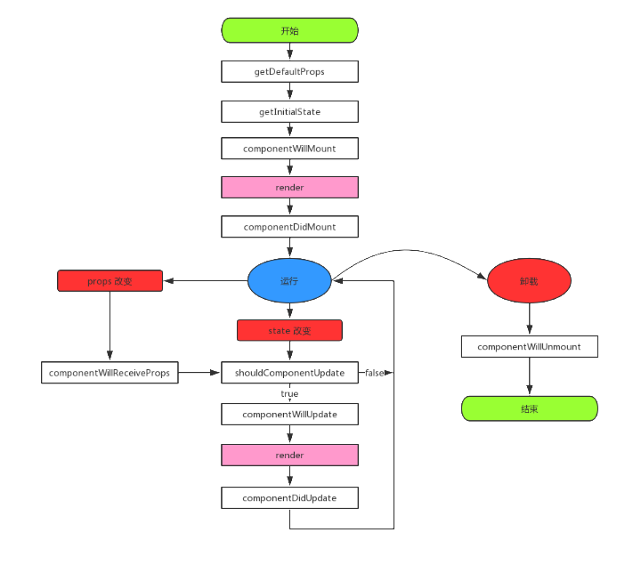

# JSX基础

---

> JSX 的基本语法规则：
>
> 遇到 HTML 标签（以 `< `开头），就用 HTML 规则解析；
>
> 遇到代码块（以 `{` 开头），就用 JavaScript 规则解析

## 普通元素

```jsx
const el = <h1>Read Me!</h1>
```

## 渲染多个元素

必须有一个包围，可以用`<></>`来包围（`<></>`不用于直接渲染）

```jsx
<>
  <p>I'm a robot.</p>
  <p>I'm not a robot.</p>
  <p>I'm a cookie robot.</p>
</>
```

## 表达式

```jsx
let content = "Hello React!"
const el1 = <h1>{content}</h1>
const el2 = <p>{3+4}</p>
const el3 = <h1>{content} This is my first journey!</h1>
```

其中`el3`等价于：

```jsx
<h1>{`${content} This is my first journey!`}</h1>
```

## 属性

> 分为固定属性和可变属性
>
> 固定属性中类名`className`已取代`class`

```jsx
const user = { url: 'url', name: 'name'};
const element = <div className="container">{user.name}</div>;
const element1 = ;
```

## 事件处理

> 事件名采取驼峰写法。
>
> 采用 JSX 语法书写，那么我们需要传入一个函数作为事件处理的函数

```jsx
<button onClick={()=>{console.log('React!')}}></button>
<button onClick={this.click}>event handling</button>
```

> JSX 回调函数中的 this 也比较特殊，实例的方法默认是不会绑定 this，直接使用该方法指向 undefined：
>
> 如果我们使用该方法操作 props 和 state，还会报出错误
>
> 绑定this有下面的三种方法：

```jsx
class EventHandling extends React.Component {
  constructor() {
    super();
    this.method1 = this.method1.bind(this); //方式一，在构造函数内绑定
  }
  method1() {
    console.log('method1 ' + this);
  }
  //方式二，使用箭头函数绑定，该写法是 ES7 的写法，ES6 并不支持，
  method2 = () => {
    console.log('method2 ' + this);
  };
  method3() {
    console.log('method3 ' + this);
  }
  //方式三，在 render 内绑定
  render() {
    return (
      <div>
        <button onClick={this.method1}>method1</button>
        <button onClick={this.method2}>method2</button>
        <button onClick={this.method3.bind(this)}>method3</button>
      </div>
    );
  }
}
```

> 1. 方法三处在 render 内部，这意味着每次我们更新页面，方法三都要重新绑定一遍，性能消耗极大
> 2. 从空间上来说，方式一更具优势，因为实例共享一个方法体定义，而方式二则会对每一个实例化的组件都定义一个方法体；
> 3. 从调用速度来说，在调用过程中，方式二的调用速度大于方式一，因为在原型链上的查找会比较慢。

## 样式处理

> 样式是个对象

```jsx
<div style={{ color: '#AAAAAA', width: '100px', fontSize: '15px' }}>Hello</div>;
```

或者

```jsx
const style = {
  color: '#AAAAAA',
  width: '100px',
  fontSize: '15px',
};
const element = <div style={style}>Hello</div>;
```

## 条件渲染

### if判断

```jsx
function LogIn() {
    return <h1>Welcome!</h1>;
}
function LogOut() {
    return <h1>Please log in.</h1>;
}
class Welcome extends React.Component {
    constructor() {
        super();
        this.state = {
            isLogging: false,
        };
        this.changeState = this.changeState.bind(this);
    }
    changeState(prevState) {
        this.setState((prevState) => ({ isLogging: !prevState.isLogging }));
    }
    render() {
        const isLogging = this.state.isLogging;
        let greeting = null;
        if (isLogging) {
            greeting = <LogIn />;
        } else {
            greeting = <LogOut />;
        }
        return (
            <div>
                {greeting}
                <button onClick={this.changeState}>change state</button>
            </div>
        );
    }
}
ReactDOM.render(<Welcome />, document.getElementById('root'));
```

### &&运算符

> `true && expression` 会返回 `expression`，`false && expression` 会返回 `false`

```jsx
<div>
    <textarea
        content={this.content}
        onChange={this.readContent}
        />
    {boolean1 && (<h2>you have input :{this.state.content}</h2>)}
</div>
```

### 三目条件判断

```jsx
<div>
    <textarea
        content={this.content}
        onChange={this.readContent}
        />
    {this.props.result ? <h1>result = true</h1> : <h1>result = false</h1>;}
</div>
```

### 组件隐藏

> 将组件隐藏起来，即使该组件已经被渲染了。我们只需要返回 null 就可以让组件隐藏起来。

```jsx
function HideComponent(props) {
    if (props.hide) {
        return null;
    }
    return <div>this.props.hide = {props.hide.toString()}</div>;
}
class Welcome extends React.Component {
    constructor() {
        super();
        this.state = {
            hide: true,
        };
        this.changeState = this.changeState.bind(this);
    }
    changeState() {
        this.setState((prevState) => ({ hide: !prevState.hide }));
    }
    render() {
        return (
            <div>
                <HideComponent hide={this.state.hide} />
                <button onClick={this.changeState}>
                    {this.state.hide ? 'show' : 'hide'}
                </button>
            </div>
        );
    }
}
ReactDOM.render(
    <Welcome result={false} />,
    document.getElementById('root')
);
```

## 列表渲染

> 一般对于列表，使用循环列表的map方法
>
> 形成虚拟节点列表后，可直接放进元素内渲染

```jsx
const list = ['a', 'b', 'c', 'd', 'e']; //待遍历列表

function DataList(props) {
    const list = props.list;
    const listItems = list.map((item) => <li>{item}</li>);
    return <ul>{listItems}</ul>;
}
```

> 对于key值，你可以像下面那样加
>
> key 值要和具体的元素一一对应，并且尽量不要使用 index 作为 key 值。

```jsx
function DataList(props) {
    const list = props.list;
    const listItems = list.map((item, index) => <li key={index}>{item}</li> );
    return <ul>{listItems}</ul>;
}
```

## 表单双向绑定

### input

> 我们通过原生 js 获取到输入框的值，并使用 setState 更新 state。这里其实出现了双向数据绑定，首先，表单的数据来源于组件的 state，通过 props 传入，这是单向数据绑定，接着，我们通过 onChange 事件处理器把新的数据写回到 state，完成了双向数据绑定。

```jsx
class InputForm extends React.Component {
    constructor() {
        super();
        this.state = {
            value: '',
        };
        this.handleChange = this.handleChange.bind(this);
        this.handleSubmit = this.handleSubmit.bind(this);
    }
    handleChange(e) { //监听输入框的改变，并实时改变 state 的值，
        this.setState({
            value: e.target.value,
        });
    }
    handleSubmit(e) {  //负责表单的提交功能
        e.preventDefault(); //阻止表单默认提交
        alert('submit: ' + this.state.value);
    }
    render() {
        return (
            <form onSubmit={this.handleSubmit}>
                <label>
                    value:
                    <input
                        type="text"
                        onChange={this.handleChange}
                        value={this.state.value}
                        />
                </label>
                <input type="submit" value="Submit" />
            </form>
        );
    }
}
ReactDOM.render(<InputForm />, document.getElementById('root'));
```

### textarea

> 与input表单同理

```jsx
class InputForm extends React.Component {
    constructor() {
        super();
        this.state = {
            value: '',
        };
        this.handleChange = this.handleChange.bind(this);
        this.handleSubmit = this.handleSubmit.bind(this);
    }
    handleChange(e) {
        this.setState({
            value: e.target.value,
        });
    }
    handleSubmit(e) {
        alert('submit: ' + this.state.value);
        e.preventDefault(); //阻止表单默认提交
    }
    render() {
        return (
            <form onSubmit={this.handleSubmit}>
                <label>
                    value:
                    <textarea
                        onChange={this.handleChange}
                        value={this.state.value}
                        />
                </label>
                <input type="submit" value="Submit" />
            </form>
        );
    }
}
ReactDOM.render(<InputForm />, document.getElementById('root'));
```

### select

> 在 React 中，我们不使用 selected 属性，我们在根 select 标签上使用 value 属性来操作

```jsx
class InputForm extends React.Component {
    constructor() {
        super();
        this.state = {
            value: 'pear',
        };
        this.handleChange = this.handleChange.bind(this);
        this.handleSubmit = this.handleSubmit.bind(this);
    }
    handleChange(e) {
        this.setState({
            value: e.target.value,
        });
    }
    handleSubmit(e) {
        alert('submit: ' + this.state.value);
        e.preventDefault(); //阻止表单默认提交
    }
    render() {
        return (
            <form onSubmit={this.handleSubmit}>
                <label>
                    Pick your favorite fruit:
                    <select value={this.state.value} onChange={this.handleChange}>
                        <option value="apple">Apple</option>
                        <option value="banana">Banana</option>
                        <option value="pear">Pear</option>
                    </select>
                </label>
                <input type="submit" value="Submit" />
            </form>
        );
    }
}
ReactDOM.render(<InputForm />, document.getElementById('root'));
```

### radio


# React

文档：

> [React – A JavaScript library for building user interfaces (reactjs.org)](https://reactjs.org/)原版文档
>
> https://react.docschina.org/中文版文档 

# 书写方法

> 使用ReactDOM.render()方法渲染，支持两个参数
>
> 第一个参数是要渲染的DOM标签或React组件，第二个参数是React容器元素

```html
<!--React容器-->
<div id="app"></div>

<!--引入react相关依赖-->
<!--1.引入react核心库-->
<script src="https://unpkg.com/react@16/umd/react.development.js"></script> 
<!--2.引入react-dom,用于支持react操作DoM-->
<script src="https://unpkg.com/react-dom@16/umd/react-dom.development.js"></script> 
<!--3.引入babe1,用于将jsx转为js-->
<script src="https://unpkg.com/babel-standalone@6.15.0/babel.min.js"></script>

<!--引入react相关依赖-->
<script type="text/babel">
  const el = <button>Click Me!</button>
  ReactDOM.render(el,document.getElementById("app"))
</script>
```

## 原生方法

使用`React.createElement()`方法渲染虚拟DOM：`React.createElement(component,props,...children)`

第一个参数是要渲染的元素的名称，第二个参数是元素相关属性，第三个参数是该元素的内容或子元素。

```js
//1,创建虚拟DOM
const VDOM = React.createElement('h1',{id:'the-id-num'},'Hello,React')
//2,渲染虚拟DOM到页而
ReactDOM.render(VDOM,document.getElementById('test'))
```

## 用JSX

JSX中，标签可以与JS代码混合写

```jsx
const el = <button>Click Me!</button>
ReactDOM.render(el,document.getElementById("app"))
```

### 

# 组件

## 使用

> 用大写驼峰形式

```jsx
<Welcome></Welcome>
```

## 函数式组件

> 又称无状态函数式组件，不涉及 state 和生命周期的操作，只负责接收我们上面提到的 props，利用 props 来展示。
>
> 没有对生命周期或 `this` 的需求，请尽量使用此种声明的组件

```jsx
function Welcome(props) {
  return (
    <div>
      <h1>Hello,{props.name}</h1>
      <h2>Have a nice time!</h2>
    </div>
  );
}
```

等价于

```jsx
const Welcome = (props) => {
  return (
    <div>
      <h1>Hello,{props.name}</h1>
      <h2>Have a nice time!</h2>
    </div>
  );
};
```

> 特点：
>
> 1. 组件不会被实例化，渲染性能提升
> 2. 组件不能访问生命周期的方法
> 3. 组件不能访问 `this`

### State钩子

> 在函数式组件中声明并使用state的特殊方法。
>
> 需要用到`useState()`函数
>
> 格式是`const [变量, 变量修改函数] = useState(值);`

```jsx
function Example() {
  // 声明一个叫 "count" 的 state 变量
  const [count, setCount] = useState(0);

  return (
    <div>
      <p>You clicked {count} times</p>
      <button onClick={() => setCount(count + 1)}>
        Click me
      </button>
    </div>
  );
}
```

### Effect钩子

> 1

```jsx

```

> `useEffect`会在每次渲染后都执行，也就是说在第一次渲染之后和每次更新之后都会执行。
>
> `useEffect`执行的effect是异步的，不会阻塞浏览器更新屏幕，但是在某些场景下这种异步的方式可能并不合适，比如初始布局场景，这个时候可能需要用到`useLayoutEffect`(与`useEffect` 相同，但它会在所有的 DOM 变更之后同步调用 effect)。

## 类组件声明

```jsx
import React from 'react';
import PropTypes from 'prop-types';

class Welcome extends React.Component {
  constructor(props) {
    super(props);
    this.state = { user: '' };
    this.handleClick = this.handleClick.bind(this);
  }

  // static defaultProps = {
  //     name: 'shiyanlou'
  // }

  // static propTypes = {
  //     name: React.PropTypes.string
  // }

  handleClick() {
    console.log(this);
  }
  render() {
    return (
      <div>
        <h1>Hello,{this.props.name}</h1>
        <h2>Have a nice time!</h2>
        <button onClick={this.handleClick}>click me!</button>
      </div>
    );
  }
}

//propTypes 一般用来作类型检查
Welcome.propTypes = {
  name: PropTypes.string,
};
//defaultProps 用来设置 props 的默认值
Welcome.defaultProps = {
  name: 'shiyanlou',
};
export default Welcome;
```

### state

> 1

```jsx
class Welcome extends React.Component {
    constructor(props) {
        super(props);
        this.state = { time: new Date() };
    }
    render() {
        return (
            <div>
                <h1>Hello, {this.props.name}</h1>
                <h2>{this.state.time.toLocaleTimeString()}</h2>
            </div>
        );
    }
}
ReactDOM.render(
    <Welcome name="World" />,
    document.getElementById('root')
);
```

 state 的修改：

- setState
- 异步更新
- setState 合并

#### setState

state 是状态，在组件的生命周期中需要被修改，现在我们就来修改 state。

```jsx
class Welcome extends React.Component {
    constructor() {
        super();
        this.state = {
            name: 'World',
        };
        this.changeState = this.changeState.bind(this);
    }
    changeState() {
        this.setState({
            name: 'new state',
        });
    }
    render() {
        return (
            <div>
                <h1>Hello {this.state.name}</h1>
                <button onClick={this.changeState}>Change state!</button>
            </div>
        );
    }
}
ReactDOM.render(<Welcome />, document.getElementById('root'));
```

页面首次加载，这很容易理解，页面第一次加载，当然要执行渲染函数了

通过 setState 改变组件的 state，注意，是通过 setState 改变，而不是通过 this.state 直接操作，这也解释了为什么我们操作组件的 state 要通过 setState 而不是 this.state，使用后者可能会导致 state 的值被覆盖掉，渲染不到我们想要的结果。

组件接收到新的 props

```jsx
class Parent extends React.Component {
    constructor() {
        super();
        this.state = {
            count: 0,
        };
        this.changeState = this.changeState.bind(this);
    }
    //改变 state 的方法，将这个方法分别传递给三个子组件，使子组件可以在自身内部调用该方法，以达到改变父组件内部的 state，继而改变父组件传给子组件的 props，继而达到更新子组件的目的
    changeState() {
        this.setState((prevState) => ({ count: prevState.count + 1 }));
    }
    //将 changeState 方法和 state.count 作为 props 传给子组件
    render() {
        return (
            <div>
                <RedChild fn={this.changeState} count={this.state.count} />
                <GreenChild fn={this.changeState} count={this.state.count} />
                <BlueChild fn={this.changeState} count={this.state.count} />
            </div>
        );
    }
}
//以下是三个子组件，为了说明问题，我们不考虑代码复用的问题，子组件都是无状态组件，只接收父组件的 props 来更新自身。
class RedChild extends React.Component {
    constructor(props) {
        super(props);
    }
    //调用父组件的 changeState 方法，改变父组件的状态，获得新的 props，更新自身，其他两个子组件类似。
    render() {
        return (
            <button onClick={this.props.fn} style={{ backgroundColor: 'red' }}>
                {this.props.count} times
            </button>
        );
    }
}
class GreenChild extends React.Component {
    constructor(props) {
        super(props);
    }
    render() {
        return (
            <button
                onClick={this.props.fn}
                style={{ backgroundColor: 'green' }}
                >
                {this.props.count} times
            </button>
        );
    }
}
class BlueChild extends React.Component {
    constructor(props) {
        super(props);
    }
    render() {
        return (
            <button onClick={this.props.fn} style={{ backgroundColor: 'blue' }}>
                {this.props.count} times
            </button>
        );
    }
}
ReactDOM.render(<Parent />, document.getElementById('root'));
```

### props 

> 同一般的属性，自定义属性也有固定和可变两种模式

```jsx
<Welcome name="shiyanlou" value={2} />
```

```jsx
function Child(props) {
    //在子组件中，我们接收父组件传递的 props，将其中的 value 提取出来，使用 JSX 语法调用
    return (
        <h1>Child Component. In Child Component value = '{props.value}'</h1>
    );
}

function Parent(props) {
    //在这里我们定义了常量 value 的值，并在父组件的定义中，将它作为子组件的属性传递给子组件，之所以我们用{}包围 value，因为这是 JSX 的语法，value 不是个字符串，是个变量
    const value = `I come from Parent Component.`;
    return (
        <div>
            <h1>Parent Component</h1>
            <Child value={value} />
        </div>
    );
}

ReactDOM.render(<Parent />, document.getElementById('root'));
```

类组件

```jsx
class Child extends React.Component {
    constructor(props) {
        super(props);
    }
    render() {
        return <h1>Welcome {this.props.name}</h1>;
    }
}

Child.propTypes = {
    name: PropTypes.string,
};
Child.defaultProps = {
    name: 'shiyanlou',
};

class Parent extends React.Component {
    constructor(props) {
        super(props);
    }
    render() {
        const name = 'World';
        return (
            <div>
                <Child name={name} />
            </div>
        );
    }
}
ReactDOM.render(<Parent />, document.getElementById('root'));
```

#### 修改props

```jsx
class ChangeProps extends React.Component {
    constructor(props) {
        super(props);
        this.handleClick = this.handleClick.bind(this);
    }
    handleClick() {
        this.props.value += 1;
    }
    render() {
        return (
            <div>
                <h1>value = {this.props.value}</h1>
                <button onClick={this.handleClick}>
                    Click me! Change props!
                </button>
            </div>
        );
    }
}

ReactDOM.render(
    <ChangeProps value={2} />,
    document.getElementById('root')
);
```

#### 类型检查

> propTypes 类型检查需要引入prop-types 静态库
>
> CDN：`<script src="https://unpkg.com/prop-types@15.6/prop-types.js"></script>`

```js
MyComponent.propTypes = {
  //以下是 JS 提供的原生类型
  valArray: PropTypes.array,
  valBool: PropTypes.bool,
  valFunc: PropTypes.func,
  valNumber: PropTypes.number,
  valObject: PropTypes.object,
  valString: PropTypes.string,
  valSymbol: PropTypes.symbol,
};
```

类型检测例子

```jsx
class Welcome extends React.Component {
    constructor(props) {
        super(props);
    }
    render() {
        return <div>{this.props.val}</div>;
    }
}
Welcome.propTypes = {
    val: PropTypes.string,
};
ReactDOM.render(<Welcome val={1} />, document.getElementById('root'));
```

复杂检测例子

```jsx
class MyComponent1 extends React.Component {
    render() {
        //接收一个数组的实例化对象，任意的数组都可以
        return <div>{this.props.val}</div>;
    }
}
class MyComponent2 extends React.Component {
    render() {
        //接收 ['oneof','hello'] 其中之一的值
        return <div>{this.props.val}</div>;
    }
}
class MyComponent3 extends React.Component {
    render() {
        //接收 string 或 number 类型
        return <div>{this.props.val}</div>;
    }
}
class MyComponent4 extends React.Component {
    render() {
        //接收数据类型是 string 的数组
        return <div>{this.props.val}</div>;
    }
}
class MyComponent5 extends React.Component {
    render() {
        //接收数据类型是 string 的对象
        return <div>{`name = ` + this.props.val.name}</div>;
    }
}
class MyComponent6 extends React.Component {
    render() {
        //接收一个对象，属性有 name 和 age，且类型分别为 string 和 number
        return (
            <div>
                {`name = ` + this.props.val.name + `age = ` + this.props.val.age}
            </div>
        );
    }
}
class MyComponent7 extends React.Component {
    render() {
        //接收任意值，但是必须提供
        return <div>{this.props.val}</div>;
    }
}
MyComponent1.propTypes = {
    val: PropTypes.instanceOf(Array),
};
MyComponent2.propTypes = {
    val: PropTypes.oneOf(['oneof', 'hello']),
};
MyComponent3.propTypes = {
    val: PropTypes.oneOfType([PropTypes.string, PropTypes.number]),
};
MyComponent4.propTypes = {
    val: PropTypes.arrayOf(PropTypes.string),
};
MyComponent5.propTypes = {
    val: PropTypes.objectOf(PropTypes.string),
};
MyComponent6.propTypes = {
    val: PropTypes.shape({
        name: PropTypes.string,
        age: PropTypes.number,
    }),
};
MyComponent7.propTypes = {
    val: PropTypes.any.isRequired,
};
ReactDOM.render(
    <div>
        <MyComponent1
            val={['string', 1, <h2 key={1}>children element1</h2>]}
            />
        <MyComponent2 val={`hello`} />
        <MyComponent3 val={1} />
        <MyComponent4 val={['a', 'b', 'c']} />
        <MyComponent5 val={{ name: 'ObjectOf' }} />
        <MyComponent6 val={{ name: 'shape', age: 2 }} />
        <MyComponent7 val={<h2>everything is ok</h2>} />
    </div>,
    document.getElementById('root')
);
```

## React.createClass()

> React最初的类创建方式，現已被抛弃，了解即可

```jsx
const Welcome = React.createClass({
  propType: {
    name: PropTypes.string,
  },
  getDefaultProps() {
    return {
      name: 'shiyanlou',
    };
  },
  getInitialState() {
    return {
      user: '',
    };
  },
  handleClick() {
    console.log(this);
  },
  render() {
    return (
      <div>
        <h1>Hello,{this.props.name}</h1>
        <h2>Have a nice time!</h2>
        <button onClick={this.handleClick}>click me!</button>
      </div>
    );
  },
});
```

## 高阶组件·HOC

> 可以通过新建一个高阶组件生成一个个同类的组件。
>
> 只需将唯一不同的信息输入即可

没用HOC

```jsx
class ComponentA extends React.Component {
    componentWillMount() {
        console.log('Component will mount');
    }
    componentDidMount() {
        console.log('Component did mount');
    }
    render() {
        return <div>A</div>;
    }
}
class ComponentB extends React.Component {
    componentWillMount() {
        console.log('Component will mount');
    }
    componentDidMount() {
        console.log('Component did mount');
    }
    render() {
        return <div>B</div>;
    }
}
class ComponentC extends React.Component {
    render() {
        return (
            <div>
                <ComponentA />
                <ComponentB />
            </div>
        );
    }
}
ReactDOM.render(<ComponentC />, document.getElementById('root'));
```

用了HOC

```jsx
function wrapWithComponent(WrappedComponent) {
    class NewComponent extends React.Component {
        componentWillMount() {
            console.log('Component will mount');
        }
        componentDidMount() {
            console.log('Component did mount');
        }
        render() {
            return <WrappedComponent />;
        }
    }
    return NewComponent;
}

class ComponentA extends React.Component {
    render() {
        return <div>A</div>;
    }
}

class ComponentB extends React.Component {
    render() {
        return <div>B</div>;
    }
}

ComponentA = wrapWithComponent(ComponentA);
ComponentB = wrapWithComponent(ComponentB);

class ComponentC extends React.Component {
    render() {
        return (
            <div>
                <ComponentA />
                <ComponentB />
            </div>
        );
    }
}
ReactDOM.render(<ComponentC />, document.getElementById('root'));
```

# 生命周期



> - 实例化（创建）
>   - getDefaultProps
>   - getInitialState
>   - componentWillMount 
>   - render
>   - componentDidMount
> - 存在期 （挂载）
>   * componentWillReceiveProps
>   * shouldComponentUpdate
>   * componentWillUpdate
>   * componentDidUpdate
> - 销毁 
>   * componentWillUnmount

# 混入mixins

> mixin不适用ES6，已经被淘汰了

没用mixin

```jsx
let publicMethod = {
    componentWillMount: function () {
        console.log('Component will mount');
    },
    componentDidMount: function () {
        console.log('Component did mount');
    },
};
class ComponentA extends React.Component {
    componentWillMount() {
        publicMethod.componentWillMount();
    }
    componentDidMount() {
        publicMethod.componentDidMount();
    }
    render() {
        return <div>A</div>;
    }
}
class ComponentB extends React.Component {
    componentWillMount() {
        publicMethod.componentWillMount();
    }
    componentDidMount() {
        publicMethod.componentDidMount();
    }
    render() {
        return <div>B</div>;
    }
}
class ComponentC extends React.Component {
    render() {
        return (
            <div>
                <ComponentA />
                <ComponentB />
            </div>
        );
    }
}
ReactDOM.render(<ComponentC />, document.getElementById('root'));
```

用了mixin

```jsx
var publicMethodMixin = {
    componentWillMount: function () {
        console.log('Component will mount');
    },
    componentDidMount: function () {
        console.log('Component did mount');
    },
};

var ComponentA = React.createClass({
    mixins: [publicMethodMixin],
    render: function () {
        return <div>A</div>;
    },
});

var ComponentB = React.createClass({
    mixins: [publicMethodMixin],
    render: function () {
        return <div>B</div>;
    },
});
```

