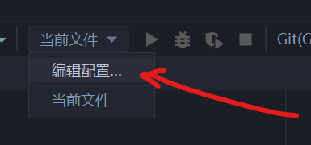
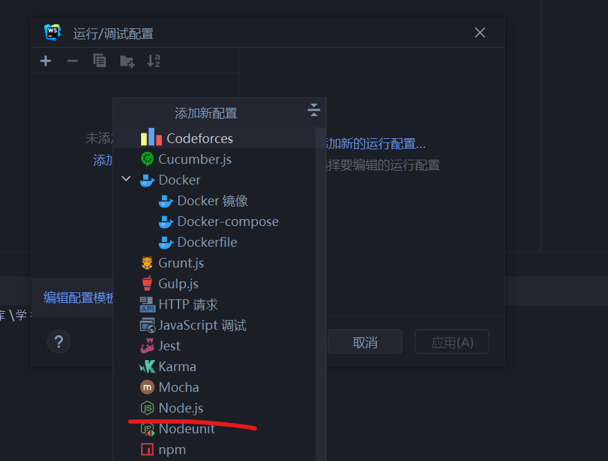
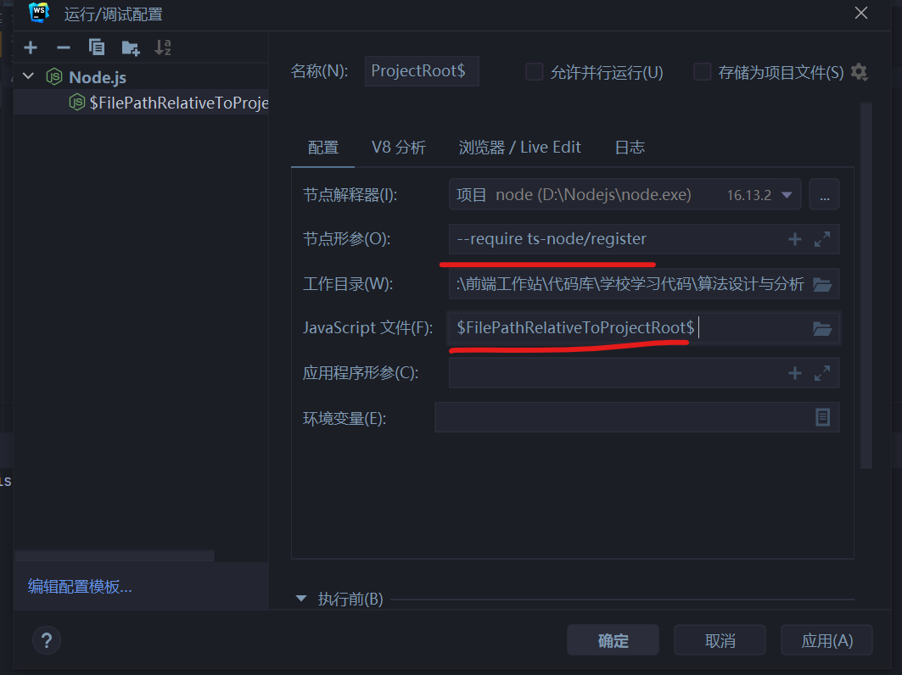
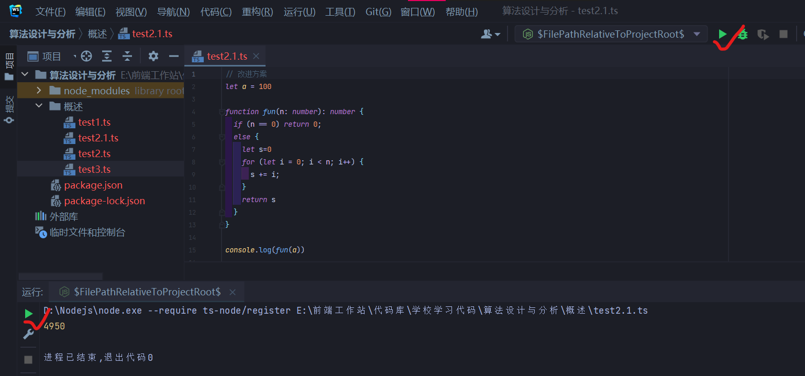

# TypeScript基础

---

## 特性

> 静态类型：与JS不同，编译时就要进行类型检查。
>
> 弱类型：不同数据结构进行处理会先进行转换（即隐式转换）。

## 运行

### VScode配置

### Webstorm配置

> 1. 在项目目录下建立npm仓库
>
> 2. 下载Typescript：
>
>    ```bash
>    # 一定是要为本地下载。
>    npm i typescript -D
>    npm i ts-node -D
>    ```
>
> 3. 在Webstorm打开运行配置，新建Node运行项
>
>    | 步骤1                                                        | 步骤2                                                        |
>    | ------------------------------------------------------------ | ------------------------------------------------------------ |
>    |  |  |
>
> 4. 在Node运行配置如下：
>
>    节点形参：`--require ts-node/register`
>
>    Javascript文件：`$FilePathRelativeToProjectRoot$`
>
>    
>
>    好了，可以直接通过点播放键运行ts了
>
>    

### NodeJs配置

> 若想让Typescript在Nodejs环境下运行，需要安装`@types/node`依赖

## 类型

### 介绍

> JS的原始类型共有七种：
>
> 1. `number`数字类型
>
> 2. `string`字符串类型
>
> 3. `boolean`布尔值类型
>
> 4. `null`空类型
>
> 5. `undefined`未定义类型
>
> 6. `bigint`大数类型
>
> 7. `symbol`symbol类型
>
> JS的引用数据类型是`object`
>
> 除此之外，TS规定了一种`any`类型，用于指代数据类型是任意的

用TS编写代码时，可以不加为变量加类型，这时就据编译器判断

```typescript
//后面赋值具体值会判断出类型
let x1 = 1  //number
let x2 = "hi" //string
let x3 = true //boolean

//后面没赋值会默认为any类型
let fish //any
```

加了类型定义后，编译器会立即锁定类型

```typescript
let a:number = 5
a = 3 //正常运行
```

变量的类型一旦锁定就不可改为其他类型

除了`any`类型，可以想赋什么值就赋什么值

```typescript
let a:number = 0
a = "Mike" //报错

let fish
fish = 'Mikey'
fish = 10  //正常运行
```

### 与类型构造函数、类型函数的区别

程序中也有可以用来类型转换的特殊函数

用法不同会导致判定不同

```typescript
let a = Boolean('') //a:boolean = false
let b = new Boolean('') //b:Boolean = {false},即b是Boolean对象
```

## 接口

> 用作规范对象的结构，用来规定一个对象应有的结构
>
> 用时结构和c语言的结构体`struct`结构写法相似
>
> 构建一个以这个接口为类型的对象时，凡是不符合该结构的都会报错

```typescript
interface student {
    name:string;
    age:number;
    graduated:boolean;
}

let ms1:student={
    name:'Michael',
    age:24
}
//报错：少了一个属性
```

> 可选参数可以通过在可选属性后面跟`?`定义

```typescript
interface BiTNode {
    data:any;
    lchild:BiTNode|null;
    rchild:BiTNode|null;
    parent?:BiTNode|null;
}
```

> 此外还可以定义只读属性`readonly`

```typescript
interface BiTNode {
    data:any;
    lchild:BiTNode|null;
    rchild:BiTNode|null;
    parent?:BiTNode|null;
}
```


## 函数

> 函数要考虑到函数形参和返回值都要加类型说明

```typescript
function add(num1:number,num2:number):number{
    return num1 + num2
}
```

### 用接口定义函数形状

```typescript
interface fibonacciFn {
  (value: number): number;
}

const fibonacci1: fibonacciFn = function (n) {
  if (n < 1) return -1;
  else if ([1, 2].includes(n)) return 1;
  else return fibonacci1(n - 1) + fibonacci1(n - 2)
}

const fibonacci2: fibonacciFn = function (n) {
  if (n < 1) return -1;
  const fibonacciArray = [1, 1]
  for (let i = 2; i <= n; i++) {
    fibonacciArray.push(fibonacciArray[i - 1] + fibonacciArray[i - 2])
  }
  return fibonacciArray[n - 1]
}

const fibonacci3: fibonacciFn = function (n) {
  if (n < 1) return -1;
  else if ([1, 2].includes(n)) return 1;
  let num1: number = 1, num2: number = 1;
  for (let i = 3; i <= n; i++) {
    num2 = num2 + num1;
    num1 = num2 - num1;
  }
  return num2
}
```


## 断言

### 类型断言

> 1. 使用`<类型>变量`记法
> 2. 使用`as`关键词

```ts

```

> 常用的被用来作为断言类型的类型有以下这些:
>
> 1. 基本类型
> 2. 接口
> 3. DOM常用类,如HTMLElement
> 4. Vue3的基本类型,如Ref等

### is断言

## 类

## 类型进阶

### 联合类型

> 若某个变量有可能为几种类型，那么可以把这几个类型用`|`写在一块作为联合类型
>
> 意思是该变量可以是该联合类型中的其中一个

```typescript
let data = number|string|boolean
```

### 类型

```typescript
let data = number&boolean
```

### 类型的键值

> keyof

### 映射类型

```typescript
type OnlyBoolsAndHorses = {
  [key: string]: boolean | Horse;
};
 
const conforms: OnlyBoolsAndHorses = {
  del: true,
  rodney: false,
};
```

## 常见问题

1. 对象可能为“未定义”。ts(2532)

   > 使用非空断言`!`

2. 某元素理应存在原生的`style`属性，却提示不存在。

   ```typescript
   const els: NodeListOf<HTMLElement> = document.querySelectorAll('.particle');
   ```

3. 不能将类型“default”分配给类型...

4. 1

5. 
