# Vue2笔记

---

# 使用方法

> 1. 直接下载，使用\<script\>引入
>
> 2. 使用CDN
>
>    ```html
>    <script src="https://cdn.jsdelivr.net/npm/vue@2.6.14/dist/vue.js"></script>
>    ```
>
> 3. NPM（见<a href="#Vue CLI和Vue项目">vue-cli</a>）
>
>    注意：一定要先引入vue再做相关操作！

## html使用

```html
<div id="app"></div>
<script>
  const app = new Vue({
    el:"#app",
    data:{},
    computed:{},
    methods:{}
  })
</script>
```

## vue单文件

vue的文件规范

```vue
<template>
  <div>vue文件规范</div>
</template>

<script>
//这里可以导入其他文件（比如：组件，工具js，第三方插件js，json文件，图片文件等等）
//例如：import 《组件名称》 from '《组件路径》';
  import {cpn1} from "./components/cpn1"//组件引入
  export default {
    name:"app",//组件名称
    components:{},//子组件
    mixins:[],
    props:{},
    data () {
        this.xxx = 'aaa' //非响应式数据
        return{
            yyy : "bbb" //响应式数据
        }
    },
    computed:{},
    watch:{},
    beforeCreate(){},//生命周期钩子函数
    created(){},
    beforeMount(){},
    mounted(){},
    beforeUpdate(){},
    updated(){},
    beforeDestroy(){},
    destroyed(){},
    methods:{},
    //下面两个用于动态组件
    activated(){},
    deactivated(){}
  }
</script>

<style >
.example {
  color: red;
}
</style>


<style scoped>
.example {
  color: red;
}
</style>
```

# 生命周期

| 生命周期      | 释义                                                         | 该做的事 |
| ------------- | ------------------------------------------------------------ | -------- |
| beforeCreate  | 组件创建前，组件内部内容尚未渲染<br />在实例初始化之后，数据观测 (data observer) 和 event/watcher 事件配置之前被调用 |          |
| created       | 组件创建后，组件内部内容尚未渲染<br />在实例创建完成后被立即调用,挂载阶段还没开始，$el 属性目前不可见 | 数据请求 |
| beforeMount   | 将组件挂载在template上前，组件内部内容尚未渲染<br />在挂载开始之前被调用：相关的 render 函数首次被调用前 |          |
| mounted       | 将组件挂载在template上后，组件内部内容已渲染<br />el 被新创建的 vm.$el 替换，并挂载到实例上去之后调用该钩子 | 渲染数据 |
| beforeUpdate  | 页面数据更新前，是在 DOM 树生成之前、虚拟 DOM 树生成之后调用，调用条件是这个 `vm` 实例已经`mounted()`过。该钩子函数在服务器渲染期间不被调用。 |          |
| updated       | 页面数据更新后，由于数据更改导致的虚拟 DOM 重新渲染和打补丁，在这之后会调用该钩子。 |          |
| beforeDestroy | 实例销毁之前调用。在这一步，实例仍然完全可用。<br />不能使用`keep-alive` |          |
| destroyed     | 实例销毁后调用。该钩子被调用后，对应 Vue 实例的所有指令都被解绑，所有的事件监听器被移除，所有的子实例也都被销毁，<br />不能使用`keep-alive` |          |

**请求数据和组件渲染问题**

> 一般父子组件生命周期流程：
>
> ```html
> 父BC、父C、父BM、
> 
>     子BC、子C、子BM、子M、子异步、
> 
> 父M、父异步
> ```
>
> 若想先*父组件请求数据*再*渲染数据或子组件*，则需要v-if惰性渲染

| 一般组件渲染流程                                             |
| ------------------------------------------------------------ |
| 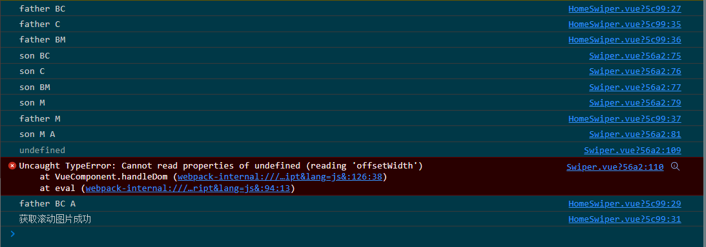 |
| v-if惰性渲染组件后                                           |
| 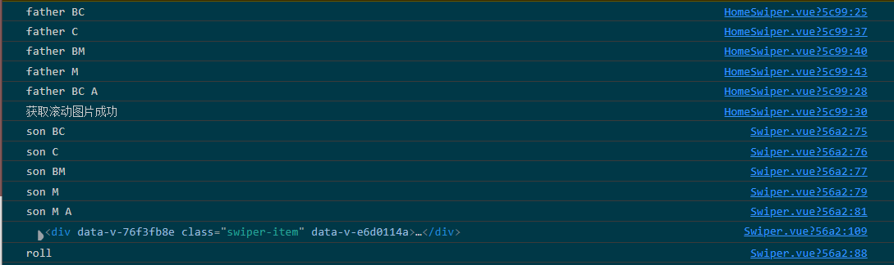 |

# Vue方法

## \$set()和\$delete()

> 对象的直接新增、修改属性没有响应式，就需要`Vue.set(target,key,val)`方法设值了
>
> 需要三参数，第一个是*目标对象名称*`target`，第二个是*目标对象属性*`key`，第三个是*新对象值*val
>
> 在vue实例或Vue单文件组件内部可以使用`this.$set()`方法

```js
Vue.set(a.arr,5,10)
Vue.set(a.obj,'sxc','nm$l')

var a=new Vue({
    data:{
        arr:[1,2,3,4],
        obj:{cxk:'及你太美！'}
    },
    methods:{
        a(){
            this.$set(a.obj,'sxc','nm$l')
        }
    }
})
```

## $nextTick()

> 当在函数内添加一个`Dom`元素，此时元素还未渲染，如果紧接着又要对这个`Dom`元素进行操作，需要把操作的代码写进`this.$nextTick(()=>{})`内，
>
> 因为Vue当中的数据处理是同步操作，渲染`Dom`是异步操作，`$nextTick`相当于转换为同步处理
>
> 在vue实例内部可以使用`this.$nextTick()`方法

```vue

```


# 插值

用mustache法(双大括号),内容（变量/表达式）对应实例数据的相关变量：

```html
<main>
  <p>{{message}}</p><!--文本插值-->  
</main>
<script>
const vm = new Vue({
    el:'main',
    data:{
        message:'Hi Vue!',
    },//...
})
</script>
```

# Vue指令

## 基本指令

指令格式为“ `指令名="相关内容"` ”，如`v-bind:title="message"`,放标签内作为属性

## v-html

用于渲染HTML内容

```html
 <div v-html="objHtml"><!--html插值--></div>
```

## v-bind

> 绑定属性，写作"v-bind:属性名"，简写":属性名"

### :class, :style

> 为了更方便改动这两属性，其值通常有两种写法。
>
> **对象写法**(判断条件):`{class1:bool1,class2:bool2, ...}`或 *对象名*
>
> **数组写法**(批量添加):`[class1,class2,class3,...]`或 *数组名*
>
> style对象一定要用对象写法！

```html
<div id="app">
    <p v-bind:style="{fontSize:size,backgroundColor:bgColor}">你好，实验楼</p>
</div>
<script>
    const app = new Vue({
        el: "#app",
        data: {
            size: "26px",
            bgColor: "pink",
        },
    });
</script>
```

## is

> 可以将一个普通的`html`标签变成一个组件

```vue
<div is="transition-group" style="display: grid; width: 100%; height: 100%; grid-gap: 5px"></div>
<!-- 等价于 -->
<transition-group style="display: grid; width: 100%; height: 100%; grid-gap: 5px"></transition-group>
```

## v-on

监听DOM事件，写作`v-on:事件名`，简写`@事件名`

`v-on`用来响应DOM事件和自定义事件，可以传js代码操作、方法调用和方法名。后两者会调用vue实例的方法。

### 事件修饰符

| 修饰符   | 释义                                                         |
| -------- | ------------------------------------------------------------ |
| .stop    | 调用e.stopPropogation()                                      |
| .prevent | 调用e.preventDefault()                                       |
| .once    | 对事件只响应一次                                             |
| .native  | 监听组件根元素的响应事件<br />组件不能直接监听点击，要监听组件点击就用它！ |
| .self    | 当触发事件的元素为本元素时才触发                             |
| .passive | 用在移动端的scroll事件，以提高浏览器响应速度                 |

### 键盘事件修饰符

可以用于对键盘事件修饰，对@keyup、@keypress使用方法如下

```HTML
<input @keypress.ctrl="...">
```

| 修饰符         | 释义/备注            |
| -------------- | -------------------- |
| keyCode/键别名 | 监听特定按键按下事件 |
| enter          |                      |
| space          |                      |
| esc            |                      |
| tab            |                      |
| delete         | delete&bksp          |
| ctrl           |                      |
| alt            |                      |
| shift          |                      |
| up             |                      |
| down           |                      |
| left           |                      |
| right          |                      |
| meta           | window徽标键         |

### 鼠标事件修饰符

```html
<div @click.right="fn()">
```

| 修饰符 | 释义       |
| ------ | ---------- |
| left   | 鼠标左键   |
| right  | 鼠标右键   |
| middle | 鼠标滚轮键 |

实例

```html
<!---------------------------在这传事件对象要用$event变量（这是固定写法）---------->
<div id="myVue" @contextmenu.prevent="alter($event)"></div>
<script src="vue.js"></script>
<script>
    new Vue({
        el:"#myVue",
        methods:{
            alter(e){
                if(document.getElementById("altered-cm")){
                    document.getElementById("altered-cm").remove()
                }
                let block = document.createElement("div")
                block.id="altered-cm"
                block.innerHTML="奶奶的，给我玩阴的是吧？"
                block.style.cssText=`
                width:100px;
                height:60px;
                background-color:#aaa;
                position:absolute;
                user-select:none;`
                block.style.left=e.clientX+"px"
                block.style.top=e.clientY+"px"
                this.$el.appendChild(block)
            }
        }
    })
</script>
```

## v-if、v-else

> 据表达式控制元素是否显示

**v-if**：当给定值为true时，被控制的元素才会显示。不显示时不占空间。

**v-else**：当前面相邻的元素的v-if给定的v-if为false时才会显示。

```html
<main>
    <div v-if="myBool">{{message1}}</div>
    <div v-else>{{message2}}</div>
</main>
<script>
new Vue({
    el:"main",
    data:{
        message1:"我出现了！", message2:"我复活了！",
        message3:"我又复活了！", message4:"我成神了！",
        myBool: true, //为false时才会显示message2所在的元素。
        myNum : 1,
    }
})
</script>
```

### v-else-if

可以配合上述两个指令来作条件显示。也是要相邻在一起才奏效。

```html
<main>
    <div v-if="myNum==1">{{message1}}</div>
    <div v-else-if="myNum==2">{{message2}}</div>  <!--myNum==2时才显示-->
    <div v-else-if="myNum==3">{{message3}}</div>  <!--myNum==3时才显示-->
    <div v-else>{{message4}}</div>  <!--myNum!=1&&myNum!=2&&myNum!=3时才显示-->
</main>
```

## v-show

它就控制控制元素的可见度，被控制的元素还是会占空间。

> 相较于v-if，v-if有更高的切换开销，而v-show有更高的初始渲染开销。
>
> 所以  *频繁切换用v-show，普通切换用v-if*

## v-for

用于遍历渲染，写作`v-for="part in whole"`

其中part为部分，whole为可遍历整体。

> 对于数组，全部形态为: `(item,id) in arr`
>
> 对于对象，全部形态为：`(value,key,id) in obj`
>
> 你可以只用部分，选得少的的默认是靠左的。
>
> 如果num是数字，则`v-for="n in num"`是相当于将目标模板重复num遍

```html
<div id="app">
    <div v-for="val in userInfo">
        <p>{{val}}</p>
    </div>
</div>
<script>
    var app = new Vue({
        el: "#app",
        data: {
            userInfo: {
                name: "whh",
                age: 1,
                sex: "woman",
            },
        },
    });
</script>
```

**关于循环动态设置图片路径**

[见图片路径问题部分](#图片路径问题)

```html
<div v-for="item in imgs" :key="item.id">
  
</div>
<script>
  data() {
  return {
    imgs: [
      { 
        url: require('./img/0.png'),
      },
      {
        url: require('./img/1.png'),
      },
      {
        url: require('./img/2.png'),
      },
    ],
  };
</script>
```

## v-model

对表单数据双向绑定(只用于表单元素)，其初始值是取绑定元素的初始值

下表一目了然地列出来表单元素和下面两要素的对应关系。

| 表单元素 | 绑定属性 | 对应事件 |
| -------- | -------- | -------- |
| input    | value    | input    |
| checkbox | checked  | change   |
| select   | selected | change   |

### 概览

- input 和 textarea：value`-(v-model)->`对应变量

- radio: value`-(v-model：谁的布尔值为真)->`对应变量

  ```html
  <p>——你是ikun不？（选择你的回答）</p><!-- value=>var -->
  <input type="radio" name="cxkOrNot" value="Yes" v-model="var">
  <input type="radio" name="cxkOrNot" value="No" v-model="var">
  <input type="radio" name="cxkOrNot" value="IDK" v-model="var">
  <!-------反映区--------->
  <p>——{{var}}</p>
  ```

- checkbox：

  - 单个：value`-(v-model：布尔值是否为真)->`对应变量

  - 多个：value`-(v-model：哪些布尔值为真)->`加到对应数组

  ```html
  <p>想点什么歌？</p>
  <input type="checkbox" name="sing" value="贝加尔湖畔" v-model="songsToSing">贝加尔湖畔
  <input type="checkbox" name="sing" value="昨日重现" v-model="songsToSing">昨日重现
  <input type="checkbox" name="sing" value="千千阙歌" v-model="songsToSing">千千阙歌
  <input type="checkbox" name="sing" value="易燃易爆炸" v-model="songsToSing">易燃易爆炸
  <!-------反映区--------->
  <p>你点了：<span v-for="song in songsToSing">{{song}},</span></p>
  ```

- select: 

  - 默认：selected`-(v-model)->`对应变量
  - 有多选(multiple)：selected`-(v-model：哪些有选)->`对应数组

  ```html
  <select v-model="selected">
      <option value="" disabled>请选择：</option> <!--此项在用户体验上不可或缺！-->
      <option value="武汉">武汉</option>
      <option value="恩施">恩施</option>
      <option value="荆州">荆州</option>
      <option value="神农架">神农架</option> <!--...-->
  </select>
  <!-------反映区--------->
  <p>你是湖北哪儿的？——{{selected}}</p>
  <script><!--此时要将对应值设为""-->
      new Vue({
          data:{selected:"",/*...*/},
          //...
      })
  </script>
  ```

### 修饰符

| 修饰符 | 释义                                                 |
| ------ | ---------------------------------------------------- |
| lazy   | 只在change事件响应后才反应                           |
| number | 自动将输入==转为数字类型==，在某些数值表单中十分有用 |
| trim   | 除去首尾空白字符                                     |

## 其他指令

**v-once：**只要绑定一次，之后内容就不会再改变了.

**v-text：**同样用来渲染文本，值填什么就显示什么，没有插值语法方便。

**v-pre：**用来展示没被vue渲染的原本页面部分的样子。

**v-cloak：**此指令会在vue解析后删除，你给某元素加此属性在搭配css规则

`[v-cloak]{display:none;}`是可以实现斗篷效果的——遮蔽没有被vue渲染完的部分。

下图为未渲染完的html页面(也是v-pre会显示的页面)和用斗篷后的效果。

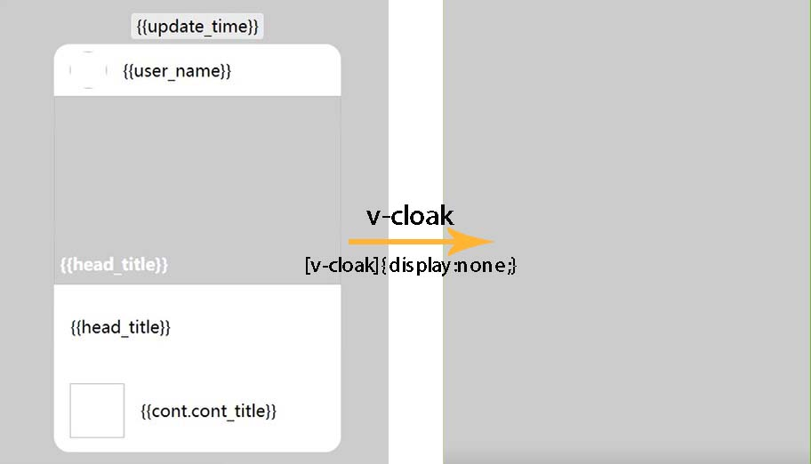

## 自定义指令

> 可以将常用==作用于元素的逻辑==封装成自定义指令，以通过 `v-指令名`调用
>
> 注册自定义指令用`Vue.directive('自定义指令名', {选项})`格式
>
> 里面要包含`inserted (el,binding) { }`格式函数，其中el是指令目标元素，binding是指令提供的值。
>
> 注册后，要在入口文件`main.js`处用`Vue.directive(yourDirective)`的方式注册。

```js
// 注册一个全局自定义指令
Vue.directive('focus', {
  // 当被绑定的元素插入到 DOM 中时……
  inserted (el,binding) {
    // 聚焦元素
    el.focus()
    console.log(binding.value); //传值
  }
})

//注册一个组件内自定义指令
export default {
  directives: {
    focus: {
      inserted (el) {
        el.style.transform = 'translateX(100%)';
        el.style.transition = 'all 1s';
        setTimeout(() => {
          el.style.transform = 'translateX(0%)';
        });
      }
    }
  },
}
```

`main.js`

```js
import directives from "@/utils/directives.js";
Vue.use(directives);
```

# 计算属性

computed 是可以用来专门稍微处理data内的数据再作为一个变量与网页交互的。

```html
<main>
    <div>{{msg}}</div>
</main>
<script src="./vue.js"></script>
<script>
new Vue({
    el:"main",
    computed:{
        msg(){
            return this.a+this.b
        }
    },
    data:{
        a:1,
        b:2
    },
})
</script>
```

## 与methods的区别

> 每次调用methods的方法，都会重新计算。
>
> 而计算属性会保留缓存，在计算前如果结果与之前计算的结果一样，就不做计算。
>
> 可见computed在某些情况效率比methods还高

## 计算属性的 setter 和 getter

> getter 属性进行其他数据计算，是computed的默认选项，一般是不能修改computed的值的。
>
> 其实我们也可以通过触发计算属性 setter对计算属性直接赋值，通过计算属性来改变原本关联数据的值。
>
> 这时computed属性的对应属性要写成对象格式，要包含get和set函数

```html
<div id="app">
    <p>firstName:{{firstName}}</p>
    <p>lastName:{{lastName}}</p>
    <p>全名是:{{fullName}}</p>
    <button v-on:click="changeName">改姓</button>
</div>
```

`vue实例对象内`

```js
computed: {
    fullName: {
        get() { // getter
            return this.firstName + this.lastName;
        },
        // setter  直接改变计算属性 fullName 的值就可以触发 setter this.fullName='XX'
        set(newName) {
            var name = newName;
            this.firstName = name.slice(0, 1); // 取新值的第一个字符
            this.lastName = name.slice(1); // 从新值的第二个字符开始取值
        },
    },
}
data: {
    firstName: "王",
    lastName: "花花",
}
methods: {
    // changeName 定义一个方法改变 计算属性 fullName 的值
    changeName: function () {
        // 修改计算属性 fullName 等于李花花
        this.fullName = "李花花";
        // 上面一句等于触发了 fullName 属性的 setter
    },
},
```

# 侦听属性

> 侦听属性一种更通用的方式来观察和响应 Vue 实例上的数据变动
>
> 用watch声明，对应属性的侦听函数可以给定两个参数。第一个是用来传递新值的，第二个是用来传递旧值的

```js
watch: {
    // 监听新旧值  监听属性有两个参数，第一个新值，第二个旧值
    msg: function (newVal, oldVal) {
        alert("新值" + newVal + "----" + "旧值" + oldVal);
    },
},
```

> 在行内可以用`this.$watch()`来使用该功能，参数为`被监听变量, (newVal, oldVal) => {/*响应函数*/}`

```js
mounted() {
    const svg = d3.select('#vis')
      .append('svg')
      .attr('width', 500)
      .attr('height', 500);

    svg.append('circle')
      .attr('cx', 250)
      .attr('cy', 250)
      .attr('r', this.radius)
      .attr('fill', 'red');

    // 监听数据变化
    this.$watch('radius', (newVal, oldVal) => {
      svg.select('circle')
        .attr('r', newVal);
    });
}
```

# 过滤器

> 过滤器是专门处理数据过滤的。过滤器可以用在两个地方：插值部分和 v-bind 表达式 (后者从 2.1.0+ 开始支持)
>
> 可以在使用这个变量之前修改它的内容，应用比较多的商品价格过滤、表单数据过滤等。

```html
<p>{{msg2|getString}}</p>
<p :class="msg2|getString"></p>
```

`vue实例对象内`

```js
filters: {
    // toUpperCase 定义一个字符串转大写的过滤器
    toUpperCase(val) {
        return val.toUpperCase();
    },
    // getString 定义一个获取去除数字的过滤器
    getString(val) {
        let newVal = "";
        val.split("").map(function (item) {
            if (9 >= item && item >= 0) {
                return;
            } else {
                return (newVal += item);
            }
        });
        return newVal;
    },
}, //...
```

# 组件化

## 总体步骤和概览

**组件注册**

```js
Vue.component("nav-bar",{  //直接把构造器内部的对象抽取出来放在此处
    template: `
    <nav>
      <ul>
        <li><a href="#1">bla</a></li>
        <li><a href="#2">bla</a></li>
        <li><a href="#3">bla</a></li>
     </ul>
   </nav>`
})//第一个参数是组件名，第二个是上面定义的注册器。
```

**使用组件**

经过注册，就可以直接像这样使用它了。

```html
<div id="myVue">  <!--要位于被Vue管控的元素内才奏效哦-->
    <nav-bar></nav-bar>
</div>
```

**成分**

| 成分              | 释义                                   |
| ----------------- | -------------------------------------- |
| template          | 组建的模板(内部结构，只能含一个根元素) |
| props             | 自定义属性                             |
| data              | 数据                                   |
| methods、computed | 方法、计算属性                         |
| components        | 其包含的子组件                         |

## 相关基础概念

**全局组件与局部组件**

任何一个组件有以下两个注册方式：

1. **全局注册**

   全局组件一般是交给`Vue.component()`去注册的。

```js
//cpn.vue
export default{
    //组件选项
}

import Cpn from "./route/to/cpn"
Vue.component(Cpn)
```

2. **局部注册**

   局部组件是放在*某个Vue实例*或*某个组件*的components属性中的。这些组件会被限制在这个Vue实例或组件中。

```js
//cpn.vue
export default{
    //组件选项
}
/**********Vue实例***********/
import Cpn from "./route/to/cpn"
new Vue({
    //...
    components:{
        Cpn,  //...
    }
})
/**********Vue组件***********/
import Cpn from "./route/to/cpn"
export default{
    components:{
        Cpn,
    }
}
```

**父组件与子组件**

一个组件可以作为另一个组件的子组件，以便在后者内部实现功能。

```js
Vue.component('cpn1',{
    /******内容*****/
}) 
Vue.component({
    template:`
      <section><div class="article-top"></div>
      <my-child-cpn1 :ready=""><my-child-cpn1>
      <p class="post-script" :after-read=""></section>
    `,
    prop:["ready","after-read"],
    components:{
        "my-child-cpn1":cpn1,
        //...
    }
}) 
```

其实连`new Vue()`构建的实例(根实例)也可以看成组件，是最大的组件。

## 父子通信——自定义属性

可以用props来为整个组件定义自定义属性，所定义属性属于模板的最外层。

传递不可越级！对于更复杂的组件，我们必须对数据是怎么绑定的和已有的自定义属性给搞清楚！

```html
<div id="my_vue">
    <ol><cart v-for="item in list" :items="item"></cart></ol>
</div>
<script src="../素材库/vue.js"></script>
<script>
    Vue.component("cart", {
        props: ["items"],  //
        template: `<li>{{items}}</li>`
    })
    new Vue({
        el: "#my_vue",
        data: {
            list:["apple", "banana", "cherry", "lemon", "watermelon"]
        }})
</script>
```

**prop验证**：对传递数据有要求的，要对props传入对象。键为传递变量，值为验证方法。

```js
props:{
    sx1:Number, //验证一种类型
    sx2:[Number,String], //验证多种类型
    sx3:{type:Number,required:true} //必须验证为某种类型
    sx4:{type:Number,default:15} //有默认值的验证（针对基本数据类型）
    sx5:{type:Array,default(){return []}} //有默认值的对象验证（针对对象，数组）
    sx6:{validator:()=>{}} //有验证器的验证
}
```

## 子父通信——自定义事件

>子组件可以通过自定义事件来向父组件通信。方法如下：
>
>
>| 组件(传递点) | 内容                 | 响应函数                           | 函数属于   |
>| ------------ | -------------------- | ---------------------------------- | ---------- |
>| 子组件       | `@事件名="fn"`       | `fn(){this.$emit("自定义事件名")}` | 父组件     |
>| 父组件       | `@自定义事件名="f1"` | `f1(a){/*...*/}`                   | 上一级组件 |
>
>传递亦不可越级！

```js
Vue.component("father", {
    template:"#cpn",
    methods:{
      fn(){
        this.$emit("xkl",2345)
      }
    }
  })
new Vue({
  el:"#my_vue",
  methods:{
    fn1(i){
      console.log(i);
    }
  }})
```

```html
<div id="my_vue">
  <father @xkl="fn1"></father>
</div>

<template id="cpn">
  <section>
    <button @click="fn">点我点我！</button>
  </section>
</template>  
```

### 组件化中的v-model

v-model其实是v-bind和v-oninput的简写，对子组件的input只需对value属性和@input事件正确响应即可。

```html
<div id="my-vue">
  <cpn v-model="abc"></cpn>
    <p>{{abc}}</p>
</div>
<template id="cpn">
  <div>
      <p>案例</p>
      <input :value="e-value" @input="$emit('input',$event.target.value)">
    </div>
</template>
```

| 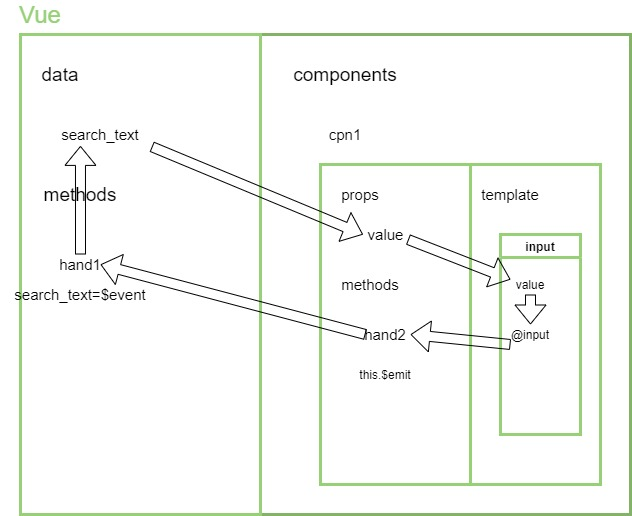 | 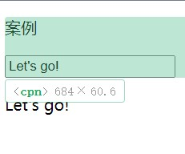 |
| ------------------------------------------------------------ | --------------------------------------- |

### 双向绑定与v-bind.sync

> 由于子组件不允许修改props的内容，所以当子组件真==需要改变props==内的值的时候，需要将修改信息的==通知转告给父组件，并交由父组件修改==。而且只有父组件才有修改传进props的值权限。
>
> 这便是vue2实现双向绑定的变相方法。

```html
<div id="my-vue">
  <cpn :info.sync="abc"></cpn>
</div>
<template id="cpn">
  <div>
      <p>{{info}}</p>
      <!------------固定写法：update:属性值----------------->
      <button @click="$emit('update:info',info-5)">
          info-5
      </button>
    </div>
</template>
```

是下面写法的简写形式

```html
<div id="my-vue">
  <cpn :info="abc" @update:info="abc=$event"></cpn>
</div>
<template id="cpn">
  <div>
      <p>{{info}}</p>
      <!------------固定写法：update:属性值------------------->
      <button @click="$emit('update:info',info-5)">
          info-5
      </button>
    </div>
</template>
```

## 直接访问

### 父访问子

> *$children只能访问子组件，不可访问其他dom元素*
>
> `$children`:返回组件数组，取下标，再直接用子组件相应属性、方法
>
> `$refs属性`：默认空对象，为某些子组件加ref属性就可以用对应ref值来引用了
>
> `ref`如果是绑定在组件中的，那么通过`this.$refs.refname`获取到的是一个组件对象，
> `ref`如果是绑定在普通的元素中，那么通过`this.$refs.refname`获取到的是一个元素对象
>
> 与ID不同的是，ref在组件之间的命名可以不唯一，这对于选择组件当前元素可以做到不冲突

```html
<div id="my-cpn">
    <cpn></cpn>
    <cpn ref="useme"></cpn>
    <cpn></cpn>
</div>
<script>
  //...
    hand1(){
        console.log(this.$children[1]./*引用什么都可以*/)
    }
    hand2(){
        console.log(this.$refs.useme./*引用什么都可以*/)
    }//...
</script>
```

### 子访问父

很少使用，会增大耦合度，影响组件复用性

> `$parent`：直接访问父组件
>
> `$root`：直接访问根组件

### 预留通信变量

**$attr**：props接收组件属性的剩余内容都会在这里。

**$listeners**： 父组件中的 (不含`.native`修饰符) 的事件

**$slot**：slot接收插槽内容的全部节点都会在这

### 命名规则

| 命名规则     | kebab-case             | camelCase                    | PascalCase |
| ------------ | ---------------------- | ---------------------------- | ---------- |
| 组件名       | 可以，只能用kebab-case |                              | 可以       |
| 自定义属性名 |                        | 可以，使用时用对应kebab-case |            |
| 自定义事件名 | 只能用它               |                              |            |

## slot插槽

插槽是为了提高组件的扩展能力（*多态化*）而出现的

```html
<cpn><button>Click me!</button></cpn>
```

> 基本使用：
>
> 1. 填进组件标签内的内容（多个会直接全部）会代替`<slot></slot>`
> 2. 插槽默认值在没填时生效：`<slot><p></p></slot>`

```html
<div id="my_vue">
    <p>插槽案例</p>
    <cpn>你干嘛~~哎呦</cpn><!--1-->
    <cpn>
        <h2>蔡徐坤：</h2><!--2-->
        <i>你干嘛~~哎呦</i>	
    </cpn>
    <cpn></cpn><!--3-->
</div>
<!--组件模板-->
<template id="cpn">
    <div class="cpn">
        <p>slot内容：</p>
        <slot>鸡你太美</slot>
    </div>
</template>
```

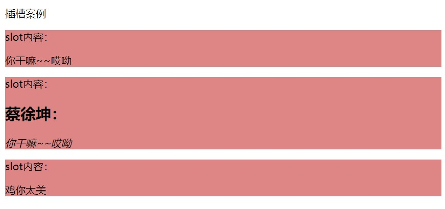

### 具名插槽

> 要多种类型的插槽的话，可以用slot的name属性分类。不填的默认default

```html
<template id="cpn">
    <section>
      <p>第一种插槽内容</p>
      <slot name="first"></slot><!--1-->
      <p>第二种插槽内容</p>
      <slot name="second"></slot><!--2-->
      <p>默认插槽内容</p>
      <slot></slot><!--3-->
    </section>
</template>
```


> 使用时将带有填有名字的slot属性的template放入组件标签即可。
>
> 没填slot属性的或连template都没写的会放在default插槽中。

```html
<cpn>
  <template slot="first">行行好</template><!--1-->
  <template slot="second"> <!--v-slot:second 缩写为#second-->
      <i>给我点个关注吧!</i><!--2-->
  </template>
  <p>秋梨膏!</p><!--3-->
</cpn>
```

### 作用域插槽

> 作用域插槽是内部组件向外部的插入的模块提供内部组件的内容的方式
>
> 插槽方向由外向内的话，作用域插槽传值方向则是由内向外

| 示意图                                       | 代码案例                                                     |
| -------------------------------------------- | ------------------------------------------------------------ |
| 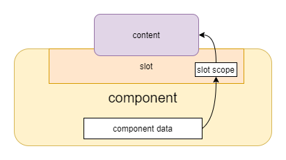 | 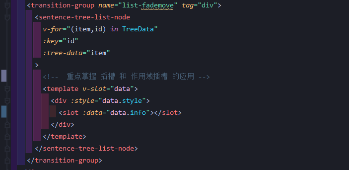 |

`组件内部`

> 数据准备：格式为：`<slot :插槽作用域属性="要传递的数据">`

```vue
<template>
  <div>
      <h6>伊布列表</h6>
      <slot :def="eevees"> <!--将信息绑定在slot的(自定义)属性上-->
          <ul><li v-for="eevee in eevees">{{eevee}}</li></ul>
      </slot>
    </div>
</template>

<script>
    export default{
        //...
        data(){
            return {
                eevees:[
                    'vaporeon','jolteon','flareon', //...
                ]
            }
        }
    }
</script>
```

> 外部使用：`<template slot-scope="作用域变量">`
>
> 支持解包直接用变量：`<template slot-scope="{传递过来的数据变量}">`

`组件外部`

```html
<cpn>
    <template slot-scope="s"> <!--左边可以任意取名-->
        <span v-for="eevee in s.def"> {{eevee}} </span>
    </template>
</cpn>
```

也可以这么写：

```vue
<cpn>
    <template slot-scope="{ def }"> <!-- 只管用变量 -->
        <span v-for="eevee in def"> {{eevee}} </span>
    </template>
</cpn>
```

### v-slot

> 取代了之前的slot属性和slot-scope属性
>
> 格式为：`v-slot:插槽命名="作用域变量"`

**针对具名插槽**

```vue
<cpn>
  <template v-slot:first>行行好</template><!--1-->
  <template vslot:second> <!--v-slot:second 缩写为#second-->
      <i>给我点个关注吧!</i><!--2-->
  </template>
  <p>秋梨膏!</p><!--3-->
</cpn>
```

> 可以缩写为`#name值`

```html
<cpn>
  <template #first>行行好</template><!--1-->
  <template #second>
      <i>给我点个关注吧!</i><!--2-->
  </template>
  <p>秋梨膏!</p><!--3-->
</cpn>
```

**针对作用域插槽**

```html
<cpn>
    <template v-slot:default="s"><!--左边随便取名，方便后面使用-->
        <span v-for="eevee in s.def"> {{eevee}} </span>
    </template>
</cpn>
```

**插槽提示**

> 修饰slot最好不在slot标签加属性，而是用div包起来给div加上属性

### 应用：无渲染组件

## 组件属性

| 属性 | 使用方法                | 释义                         |
| ---- | ----------------------- | ---------------------------- |
| $el  | `this.$refs.sample.$el` | 指代的是vue组件的DOM元素本身 |

## Event bus

> 又称事件总线，子组件与子组件之间互相修改数据可以用它，可以看成一个简陋版Vuex
>
> 实则只要组件引入了事件总线，都可以接收任何组件发送的事件参数
>
> 可以作为模块引入，也可以直接通过vue.prototype作用于全局：

| 常用方法示意图                                               |
| ------------------------------------------------------------ |
| 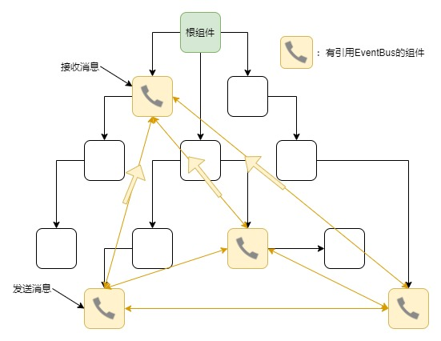 |

`main.js`

```js
//可以在main.js注册Vue事件总线
Vue.prototype.$bus = new Vue(); // event Bus 用于无关系组件间的通信。
```

`component1.vue`

> 向`eventBus`发送一个事件

```js
import eventBus from '@/main.js';
export default {
    methods:{
        fn() {
            eventBus.$emit('change', 'The floor is lava!');
        },
    }
};
```

`component2.vue`

> 接收发送的事件参数

```js
import eventBus from '@/main.js';
export default {
    data() {
        return {
            libra: '天秤',
        };
    },
    created() { //响应函数放到created里面
        eventBus.$on('change', value => {
            this.libra = value;
        });
    },
    beforeDestroy() {
        eventBus.$off('change'); //组件一销毁就需要关闭监听，以防重复监听
    },
};
```

# Vue CLI和Vue项目

> 安装Vue：`npm i vue@2`
>
> 安装CLI：`npm i @vue/cli`
>
> `npm i -g @vue/cli-service-global`
>
> 查看版本：`vue -V`【`vue --version`】
>
> UI控制：`vue ui`

vue项目主打包文件(入口文件)`main.js`内容

```js
import Vue from 'vue' //<-引入vue
import App from './App.vue'//<-根页面文件

Vue.config.productionTip = false

new Vue({
    render: h => h(App)//<-直接渲染
}).$mount('#app')//<-这的$mount和最初的el属性效果差不多
```

## 运行一个项目

> 1. 没安装依赖的先安装：`npm i`
>
> 2. 保证vue-cli-service安装好后
>
>    针对项目目录用：`npm run serve`
>
>    针对vue单文件或main.js文件使用`vue serve`
>
> 3. 终止项目运行：`ctrl+c`
>
> 4. 打包文件用 `npm run serve`/`vue serve`
>
>    ps:配置文件要配置好！

## 注释问题

```vue

```

## 图片路径问题

> 1. 在根组件和子组件中，用*相对路径*导到图片
>
> 2. 写在对象中的图片路径引用要用**require**(在Nodejs当中)
>
>    在Vite里面只能用**import**
>
> 3. 完整的vue项目img src里面相对路径要前面跟`~`

```vue
<template>
  <section>
    <!--  assets下的图片  -->
    
    <!--  public下的图片  -->
    
    <!--  外部变量引入的路径  -->
      <!-- 导入时要require -->
    
  </section>
</template>

<script>
export default {
  //...
  data(){
    return {
      abc:"./assets/xxx.png",
      arr:[{
          img:require("./assets/xxx.png")
      }]
    }
  }
}
</script>
```

## Vue.prototype

> 写在里头，其他有vue实例的地方也可以用了。
>
> 主要可以写在main.js里面，或写在工具库里面

```js
///////解决vite里头不能用require的诟病/////////
import Vue from "vue";

/***** vite中用 new URL(相对路径, import.meta.url).href 的写法指定项目资源路径 *****/
Vue.prototype.require = function (path){
    return new URL(`../${path}`, import.meta.url).href
}
//使用：
export default {
    data() {
        return {
            stockImage: [ // 我们就直接可以以相对于src的位置来寻找文件了！爽歪歪！
                {imgSrc: this.require("./assets/img/stock/sample (1).gif")},
            ],
        }
    },
}
```

---

拓展：**`import.meta`**

ES11（ES2020）中新增，是一个给JavaScript模块暴露特定上下文的元数据属性的对象。

```js
(path) => new URL(path, import.meta.url).href  // import.meta包含了此模块的信息，比如说该模块的URL
```

## 配置问题

> 用vue.config.js解决

```js
module.exports = {
  //相关配置
}
```

### 打包后当地访问

```js
module.exports = {
  publicPath:'./'
}
```

### 路径别名

> 和别名插件搭配使得书写路径更方便

```js
{//基础写法
    configureWebpack:{
        resolve:{
            alias:{
                'src':"@",
                'components':"@/components",
                'pages':"@/pages"
            }
        }
    }
    //Webpack4的链式写法,爽！
    chainWebpack:(config)=>{
        config.resolve.alias
            .set("@$",resolve("src"))
            .set("components",resolve("src/components"))
    }
}
```

## 手机访问项目

| 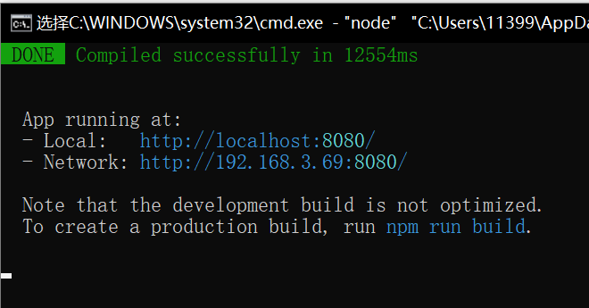 |  |
| ------------------------------------------------------------ | ------------------------------------------------------------ |

> 1. 连接在同一个网络(如wifi)下
>
> 2. 按照上图Network的地址在手机上浏览
>
>    附：查看地址要在cmd打ipconfig/all再找ipv4地址

# Vue Router

## 使用

> `npm i vue-router`
>
> `import router from './router'`

### 相关配置

`router/index.js`

```js
import Vue from 'vue'
import VueRouter from 'vue-router'
import Home from '../views/Home.vue' //立即加载

Vue.use(VueRouter)  //通过调用Vue.use使用插件

const routes = [  //定义路由及其路径
  {
    path: '/',  //路径
    name: 'Home',  //命名组件名
    component: Home  //对应页面组件
  },
  {
    path: '/about',
    name: 'About',
    component: () => import(/* webpackChunkName: "about" */ '../views/About.vue')
      //懒加载；在webpackChunkName:魔法注释后填上组件名，会让打包后组件也有自己的名字
  }
]
//创建 router 实例，然后传相关配置
const router = new VueRouter({
  routes
})

export default router  //导出配置

```

### 路由配置

路由配置对象书写格式如下：

```js
{
    path: '/welcome',  // 路径
    component: Welcome,  // 对应页面组件
    name: 'Welcome',  // 路由命名（可选）
    props: true, // 路由props传值属性（可选）
    meta: {
        title: "欢迎莅临色彩一站通！"
    }, // 接收路由对象的额外信息（可选）
    beforeEnter: (to, from, next) => {
        // ...
    } // 路由独享守卫
},
```

### vue-router配置

| 属性              | 释义                                                       | 备注                                |
| ----------------- | ---------------------------------------------------------- | ----------------------------------- |
| `mode`            | 路径的显示模式                                             | 可选项：`hash`;`history`;`abstract` |
| `linkActiveClass` | 点击链接活跃时的类名(router-link-exact-active)，是精准匹配 | 填想填的类名                        |
| `activeClass`     | 不严格匹配(router-link-active)                             | 填想填的类名                        |

### 重要路由组件

`app.vue`

```vue
<template>
  <div id="app">
    <div id="nav">
      <!--路由链接-->
      <router-link to="/">Home</router-link> |
      <router-link to="/about">About</router-link>
    </div>
      <!--路由视图-->
    <router-view/>
  </div>
</template>
```

> 1. `<router-link></router-link>`
>
>    路由链接；跳转到对应页面组件。可加属性如下：
>
>    | 属性      | 使用格式   | 释义                          |
>    | --------- | ---------- | ----------------------------- |
>    | `to`      | `to="/"`   | 跳转到哪个路径                |
>    | `tag`     | `tag="li"` | 以什么标签形式出现            |
>    | `replace` | `布尔属性` | 是不是替换url模式（不可刷新） |
>
> 2. `<router-view></router-view>`
>
>    路由视图，展示页面组件的窗口。

## 特殊路由

| 特殊路径  | 匹配对象                                                     |
| --------- | ------------------------------------------------------------ |
| `*`       | 匹配所有路径                                                 |
| `/user-*` | 匹配以 `/user-` 开头的任意路径，如`/reader*`可以匹配`/reader3420` |

## 动态路由

路径的动态部分要在前面加''`:`''。通过`this.$route.params`获取参数值。亦可参照[参数传递内容](#params, query)。示例如下：

| 模式                          | 匹配路径            | $route.params                          |
| ----------------------------- | ------------------- | -------------------------------------- |
| /user/:username               | /user/evan          | `{ username: 'evan' }`                 |
| /user/:username/post/:post_id | /user/evan/post/123 | `{ username: 'evan', post_id: '123' }` |

## 嵌套路由

> 用children属性处理子路由。children选项对应[路由配置](#路由配置)数组，里面可以接着放路由配置对象
>
> 路径以`/`开始表示根路径，反之为子路由路径（相对路径）。
>
> 如`'/home'`的*子路由*`'luna'`相当于`'/home/luna'`，子路由`''`相当于`'/home'`

```js
{
    path: '/home',
    name: 'Home',
    component: Home,
    children:[ //路由嵌套
        {
            path:"/home",  //一作""
            redirect:"/home/luna"  //一作"luna"
        },
        {
            path:"/home/luna",
            name:"Luna",
            component: () => import("../views/Luna")
        },
    ]//...
}
```

> 记得要在对应父页面组件里加上对应router-view和router-link哦！

`home.vue`

```vue
<template>
    <section> <!--另一种导航方式：命名路由导航，通过有name属性的对象-->
        <router-link :to="{name:Luna}"></router-link>
        <router-link :to="{name:WangKeAi}"></router-link>
        <router-link :to="{name:Wubai}"></router-link>
        <router-view></router-view>
    </section>
</template>
```

## 重定向和路由别名

> 在路由配置对象里面可以规定跳转的哪个路由。
>
> 路由别名是路由的另一个到达方法。跳转别名内容会直接跳到该路由本身上，但名字会保持

重定向也是通过 `routes` 配置来完成，也可以配置路径对象：

```js
{ 
    path: '/home',
    redirect: '/home/main' 
}
```

重定向也可以是一个方法，动态返回重定向目标：

```js
{ 
    path: '/a', 
    redirect: to => {
      // 方法接收 目标路由 作为参数
      // return 重定向的 字符串路径/路径对象
    }
}
```

## 参数传递

网址格式：`protocol://hostname[:port]/path/[:params][?query]#fragment`

### params, query

> `params`便是动态路由的参数。如格式是`www.pokemon.com/pokedex/:pokemon`的下面网站的`params`值是`absol`
>
> `query`便是路由的传参参数。如下面网站的`query`是`form=mega_absol`
>
> `fullPath`则是网址全文。
>
> 它们都作为$router的属性存在。它们可能会分别在网址中显示。

| 参数       | 访问方式               | `www.pokemon.com/pokedex/absol?form=mega-absol` |
| ---------- | ---------------------- | ----------------------------------------------- |
| `params`   | `this.$route.params`   | `{pokemon:'absol'}`                             |
| `query`    | `this.$route.query`    | `{form:'mega-absol'}`                           |
| `fullPath` | `this.$route.fullPath` | `www.pokemon.com/pokedex/absol?form=mega-absol` |

### props

> 路由props传值属性，会把*动态路由的值*和*其他附加内容*传递给对应页面文件的props属性内。以实现与路径解耦。
>
> 以此可以不依赖路径`$route`传值，可组件需要准备好`props`属性来接收这些数据
>
> 分为三种情况用：

1. `props: true`：

   `this.$route.params`的内容会传递到组件的`props`上来，可在组件上通过`props`直接使用

`router/index.js`

```js
{
     path:"/dog/:called",
     component:()=>import("../views/Dogs.vue"),
     name:"dog",
     props:true
}
```

`app.vue`

```vue
<template>
  <div id="app">
    <div id="nav">
      <router-link tag="button" :to="{name:'home'}">home</router-link>
      <!--params对象后面要根逗号！-->
      <router-link 
        tag="button" 
        :to="{
               name:'dog',
               params:{called:'Luna', dog_name:'露娜', img:require('./assets/露娜2.jpg')},
             }"
      >Luna</router-link>  <!--...-->
      </div>
    <router-view></router-view>
  </div>
</template>
```

`Dogs.vue`

```vue
<template>
  <section>
    <p>这是{{dog_name}}的页面</p>
    
  </section>
</template>

<script>
export default {
  name: "dog",
  props: ["called","img","dog_name"],
};
</script>
```

2. `props为对象`：

   对象里面的东西都会传给组件props里

```js
{
     path:"/dog/:called",
     component:()=>import(/*webpackChunkName:"doggies"*/"../views/Dogs.vue"),
     name:"dog",
     props:{  //里面的东西是【固定】的
         called:"布丁",
         img:require('./assets/露娜2.jpg')
     }
}
```

3. `props为函数`：

   以$route作为参数，返回的对象的键值对都会传到组件的props里

```js
{
     path:"/dog/:called",
     component:()=>import(/*webpackChunkName:"doggies"*/"../views/Dogs.vue"),
     name:"dog",
     props(route){
         return {
             bvid:route.query.bvid
             id:route.params.id
         }
     }
}
```

### meta

> 是路由的元信息。可以存储title等路由对象的额外信息（补充内容）
>
> 访问方式：`this.$route.meta`

## 代码路由

| 代码                     | 等价声明                          | 释义                |
| ------------------------ | --------------------------------- | ------------------- |
| `$router.push('xxx')`    | `<router-link to="/xxx">`         | 跳转到xxx           |
| `$router.replace("xxx")` | `<router-link to="/xxx" replace>` | 跳转到xxx，不可后退 |
| `$router.go(n)`          | `window.history.go(n)`            | /                   |

> 路由工作原理就是栈的进入弹出
>
> 前两个方法除了具体路径还可以填入路径对象，可参照[路径对象相关内容](#路由对象)，对比如下
>
> | 代码                                       | 等价声明                                         |
> | ------------------------------------------ | ------------------------------------------------ |
> | `$router.push({path:'xxx'})`               | `<router-link to="/xxx">`                        |
> | `$router.push({name:'xxx'})`               | `<router-link :to="{name:'xxx'}">`               |
> | `$router.push({path:'xxx',params:{...},})` | `<router-link :to="{path:'xxx',params:{...},}">` |
> | `$router.push({path:'xxx',query:{...},})`  | `<router-link :to="{path:'xxx',query:{...},}">`  |

### 路径对象

书写格式如下：

```js
{
    path: 'xxx',
    name: 'xxx',
    params: {...},
    query: {...},
}
```

### 忽略重复点击路由链接报错

*重复代码跳转路由*，即重复点击路由链接会报这个撇脚的错


为屏蔽这个错误，需要为`src/router/index.js`内，在`Vue.use(VueRouter)`后面加上下列代码，即在引入路由后重写路由方法

```js
import Vue from "vue";
import VueRouter from "vue-router";
Vue.use(VueRouter);

/***************** 增加代码 ******************/
const originalPush = VueRouter.prototype.push
VueRouter.prototype.push = function push(location) {
  return originalPush.call(this, location).catch(err => err)
}
const originalReplace = VueRouter.prototype.replace
VueRouter.prototype.replace = function replace(location) {
  return originalReplace.call(this, location).catch(err => err)
}
```

**面试点**

## 路由守卫

### 主要阶段守卫

> 除组件内守卫外，一般写在`router/index.js`里面，监听路由跳转过程，在跳转的各个阶段做出相应
>
> 路由跳转大致分为三个阶段，分别对应下面三个主要的路由守卫：
>
> 1. 导航被触发
> 2. 导航触发（未跳转）后且路由、组件解析完毕
> 3. 导航跳转后

**to , from参数属性**

| API      | 描述                                                         |
| -------- | ------------------------------------------------------------ |
| fullPath | 全路径，包含参数的路径<br />如fullPath是`/home?name=dragon`，query是`name=dragon`，params是`/home/dragon` |
| hash     | 设置滚动锚点                                                 |
| name     | 路由命名name                                                 |
| params   | params参数，`/home/dragon`                                   |
| path     | *不包含query但包含params*的路径，如/home                     |
| query    | query参数，`name=dragon`                                     |

**全局前置守卫**

> `router.beforeEach((to,from,next)=>{/*...*/})`
>
> to是从哪个==路径==跳转，from是要跳转到哪个==路径==去，两个都是路径
>
> next在其内必须执行至少一次：`next()`，也要控制next函数的调用方式。

```js
router.beforeEach((to,from,next)=>{
    next()
})
```

`next()`: 调用方式如下:

1. `next()`: 进行管道中的下一个钩子。

   如果全部钩子执行完了，则导航的状态就是 confirmed (确认的)。

2. `next(false)`: 取消当前的导航。

   如果浏览器的 URL 改变了(可能是用户手动或者浏览器后退按钮)，那么 URL 地址会重置到 from 路由对应的地址。

3. `next('一个/路由地址')`: 通过一个路由地址*跳转到一个不同的地址*，就像你调用 router.push() 一样

   你可以设置诸如 replace: true 或 name: 'home' 之类的配置。当前的导航被中断，然后进行一个新的导航，就和 from 一样。

4. `next(error)`: 如果传入 `next` 的参数是一个 `Error` 实例，则导航会被终止且该错误会被传递给 [`router.onError()`](https://v3.router.vuejs.org/zh/api/#router-onerror) 注册过的回调。

**全局解析守卫**

> `router.beforeResolve((to,from,next)=>{/*...*/})`

**全局后置钩子**

> `router.afterEach((to,from)=>{/*...*/})`

### 路由独享守卫

> 写在某一个[路由配置对象](#路由配置)内，监视跳转到对应路径的事件
>
> `beforeEnter: (to, from, next) => {/*...*/}`
>
> 与全局守卫触发条件一样，但不会因`url`路由参数改变而触发
>
> 点击被写入独享守卫的路由就会触发，用于点击指定的路由导航触发

```js
{
    path: '/my-puppies',//路径
    component: Home,//对应页面组件
    beforeEnter: (to, from, next) => {
        // ...
    }
},
```

### 组件内守卫

> 写在某一页面组件内，监听与该组件相关的跳转操作
>
> 主要用三个方法，对应访问或离开组件的三个状态，具体内容如下：
>
> | 守卫函数                            | 什么时候调用                        | 能否访问实例的this     |
> | ----------------------------------- | ----------------------------------- | ---------------------- |
> | `beforeRouteEnter(to, from, next)`  | 在渲染该组件的对应路由被 confirm 前 | 否(组件实例还没被创建) |
> | `beforeRouteUpdate(to, from, next)` | 在当前路由改变，但是该组件被复用时  | 是                     |
> | `beforeRouteLeave(to, from, next)`  | 导航离开该组件的对应路由时          | 是                     |

```vue
<!--...-->
<script>
export default{  //...
    beforeRouteEnter(to, from, next) {
    // ...
        next()//必加，否则组件不会渲染
  },
    beforeRouteUpdate(to, from, next) {
    // ...
  },
    beforeRouteLeave(to, from, next) {
    // ...
        next()//必加，否则路由不跳转
  }
}
</script>
```

### 案例

> 通过路由守卫修改网页标题

```js
router.beforeEach(function (to,from,next){
  if(to.meta?.title){
    document.title = to.meta.title
  } else {
    document.title="色彩一站通" //没有就默认
  }
    next()
})
```

## 滚动行为

> 是加在vueRouter对象上的，专管路由跳转的滚动行为。
>
> `scrollBehavior(to,from,savedPosition){}`
>
> savedPosition：若有，则返回提交上次所在位置

实例1：浏览器的原生实现相同效果——

```js
const router = new VueRouter({
  routes,
  scrollBehavior(to,from,savedPosition){
      if (savedPosition) return savedPosition
      else return {x:0,y:0}
  }  
})
```

实例2：锚点问题

`router/index.js`

```js
scrollBehavior(to,from,savedPosition){
      if (to.hash) return {
          selector:to.hash,//绑定锚点
          behavior:"smooth",//平滑移动
          offset:{y:10}//偏移量
      }
      else return {x:0,y:0}
  }  
```

`某页面.vue`

```vue
<template>
    <nav><!--要用router-link而不是a！-->
        <router-link to="#spot1"></router-link>
        <router-link to="#spot2"></router-link>
        <router-link to="#spot3"></router-link>
    </nav>
    <h4 id="spot1">章节1</h4><p>some content</p>
    <h4 id="spot2">章节2</h4><p>some more content</p>
    <h4 id="spot3">章节3</h4><p>more content</p>
</template>
```

## keep-alive

> 是给动态组件包裹的标签，保留组件状态，并激活该组件的两个对应钩子：`activated`和`deactivated`
>
> 只能包裹一个组件。在vue-router是要包起router-view组件

`app.vue`

```vue
<keep-alive>
    <router-view></router-view>
</keep-alive>

<script>
  export default{
      data(){
          return {
              path:"/home/news"//存储先进入时的路径
          }
      },
      activated(){
          if(this.$route.path!=this.path)
              this.$router.push(this.path)
      },
      beforeRouteUpdate(){
          this.path = this.$route.path
      }
  }
</script>
```

除此之外，还可以选择哪些页面或组件不要缓存，方法如下（都填路由命名name或组件名）

1. 用`include`属性，选择*只有哪些页面或组件缓存*
2. 用`exclude`属性，选择*只有哪些页面或组件不要缓存*
3. 用`max`属性指定最多缓存页面或组件数量。

# Vuex

> 使用场景：有些内容需要==多个组件共享==，而这些组件一般有以下特征：
>
> 1. 它们的关系==并不强（相互独立，无嵌套关系）==，有可能是并列的。
>
> 2. 它们有关系，不过关系==嵌套较深==，如*爷子关系*及以上
>
> 而且被共享内容都需要做到==响应式==，多个组件展示统一数据，一个组件改了数据其他组件的数据展示也跟着改变

| 无vuex：组件传递特不方便                 | 有vuex：多组件共享一步到位，即时响应     |
| ---------------------------------------- | ---------------------------------------- |
| 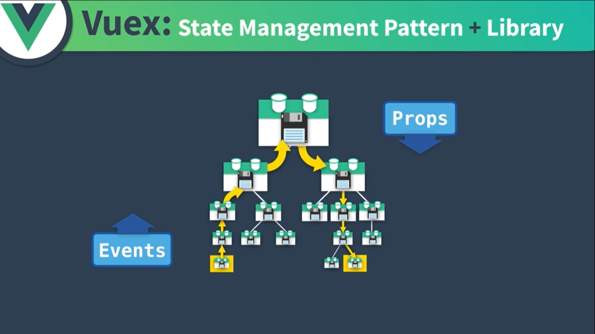 |  |

> 单页面状态管理：action改变state，state影响view，view提供action；较简单
>
> 多页面的的管理：较复杂，需要额外工具

## 初识配置

`store/index.js`

```js
import Vue from 'vue'
import Vuex from 'vuex' //引入Vuex

Vue.use(Vuex) //安装Vuex插件

export default new Vuex.Store({ //以下是vuex的五大要素
  state: {/**将要共享的数据传到这里来**/},
  getters:{/**涉及处理加工state的操作写在这**/},
  mutations: {/**涉及改变state的操作写在这**/},
  actions: {/**涉及改变state的异步操作写在这**/},
  modules: {/**对store的分块写在这**/}
})
```

`main.js`

```js
import store from './store'//引入状态存储

new Vue({
  store, //使用状态存储，组件用$store访问
  render: h => h(App)
}).$mount('#app')
```

`一个简易的vuex管理`

```js
export default new Vuex.Store({
  state: { 
      count:0
  },
  mutations: { 
      increase(state){ //要带上state形参！
          return state.count++
      }
  },
})
```

> `store/index.js`使用store数据：**`store.state.xxx`**
>
> *由于需要追踪状态变化，官方不推荐直接改动store.state内部的值，而是交给下行方法*
>
> `store/index.js`触发状态改变：`store.commit()`方法，参数为函数名字符串
>
> store.state的数据要事先安排好。要之后添加属性的话要么用`Vue.set()`、`Vue.delete()`，要么对state整个替换

```js
methods:{
    fn(){
        this.$store.commit("increase")
        console.log(this.$store.state.count)
    }
}
```

## getters

> getters可以对state的参数进行加工处理，不会改动原先state的本身状态（值），只读。
>
> getter也可以返回函数，实现getter传参（动态getter）。
>
> 定义时要带上state形参！

```js
export default new Vuex.Store({
  state: { 
      pokemon:[
          {lv:55,name:"sylveon",nick:"小蝶",type:"fairy"}, //...
      ]
  },
  getters: { 
      above_lv_53(state){ //静态getter
          return state.pokemon.filter(el=>el.lv>=53)
      },
      find_pm(state){ //动态getter
          return function(nick0){
              return state.pokemon.find(pm=>pm.nick===nick0)
          }}  
      /*find_pm:(state)=>(nick0)=>state.pokemon.find(pm=>pm.nick===nick0)*/
  },
})
```

> getters的方法也可以加入getters作为第二个参数来==调用其他getters函数==

```js
getters: { 
      above_lv_53(state){ //要带上state形参！
          return state.pokemon.filter(el=>el.lv>=53)
      },  
      find_pm_above_53:(state, getters)=>
          (nick0)=>getters.above_lv_53.find(pm=>pm.nick===nick0))
  },
```

**使用方法**

```js
methods: {
    procedure(){
        this.$store.getters.xxx //普通getter使用
        this.$store.getters.find_pm("水布丁") // 函数getter要调用内部函数
    }
}
```

## mutations

> `mutations`是用来处理状态数据改动的，==不适合放页面逻辑==。尽量把它们设置得简单，轻巧。
>
> 主要装载==同步==状态改变操作，不是同步的devtools不会追踪（记录）
>
> 里面一个方法的名叫*事件名称*，函数体就是其*回调函数*
>
> ---
>
> 可以传递额外参数，即载荷`payload`。
>
> `mutations`的函数就只能有两个参数，简单点就直接一个变量作为形参即可。

```js
export default new Vuex.Store({
    state: {
        count: 0
    },
    mutations: {
        increment(state) { // increment是事件名，下面就是回调函数
            state.count += 1
        },
        incrementBy(state, n) { // incrementBy是事件名，下面就是回调函数
            state.count += n
        },// 使用时直接$store.commit("incrementBy",{amount:10})即可
    }
})
```

> 一般来说`payload`应该是个对象。这是在应对有多个传入参数时用。为方便可以像下面第二个案例一样解构

`store/index.js`

```js
mutations: {
    incr(state,payload){
        state.count += payload.amount
    },
    incrBy(state,{amount,type}){ 
        state.count+=amount
        /**
          *  这会把事件名渲染给state.type。
          *  就会覆盖原来的type属性的属性值
          *  要用下面的对象提交方法建议不要在这动用payload.type
          */
        state.type=type 
    }
}
```

> `$store.commit()`也可以提交对象，这对象携带type属性对应事件名称，会==将对象的所有内容提交为payload==。
>
> 在这种情况下，对象的其他属性不得与type重名。actions的dispatch过程提交对象也类似。

`app.vue`

```js
computed:{
    ...mapState([
        "count",
        "type"
    ])
},
methods:{
    incr(){
        if(this.bar!="")
            this.$store.commit({
                type:"incrBy", //用type来表识是什么事件名
                amount:+this.bar
            }) // 执行会发送整个对象作为payload参数
        else this.$store.commit({
            type:"incr",
        })
    },
}
```

## actions

> 它不能直接改变状态，只能提交mutation
>
> 虽说如此，actions可以一次性提交多次或多个mutations，==适合体现页面逻辑==
>
> 要激发它，只需要`$store.dispatch("xxx")`即可

```js
export default new Vuex.Store({
  state: {
    count: 0
  },
  mutations: {
    increment(state) {
      state.count ++
    }
  },
  actions:{
    /*  increment(ctx){ //传参ctx
          ctx.commit("increment")
      }*/
        increment({commit},payload){
            commit("increment")
        }
  }
})
```

> 可以处理异步操作，也就可以包含任何异步操作。操作如下：

```js
actions:{
    /*************** promise写法 ****************/
        increment({commit}){ // 返回一个Promise对象
            return new Promise((res,rej)=>{
                setTimeout(()=>{
                    commit("increment")
                    res()
                },2000)
            })
        },
   /*************** async写法 ****************/
        async decrement({commit}){
            await setTimeout(()=>{commit("increment")},4000)
        }
  }
```

使用时可以*通过then加后续操作*了

```js
methods:{
    procedure(){
        this.$store.dispatch('increment')
            .then(()=>{console.log("succeed!")})
    }
}
```

## 命名映射mappers

### mapState

> 我们也可以通过组件的computed属性来返回state的内容，以便我们方便地引用，可是光函数的写法就要写一会。mapState方法直接解决了这一难题。这会==使得引用更为方便==。
>
> *首先需要从vuex引用*：`import {mapState} from "vuex"`

**用法1：数组法** 

当目标==计算属性名与全局作用域的state的对应内容名相同==时直接用此方法映射

对于*未说明作用域的模块*的state似乎无能为力

```js
computed:mapState([
    'count', 
    'userInfo',
    'userAvatar'
])
```

对于*说明作用域的模块*的state访问如下：

```js
computed:mapState('module1',[
    'count', 
    'userInfo',
    'userAvatar'
])
```

**用法2：对象法**

> 可以灵活分配别名，键名即别名。
>
> 映射有两种情况：
>
> 1. 函数、箭头函数：以`state`为参数，返回原始值或经加工处理的值
> 2. 字符串：上面的返回原值的简写，值为在`state`内的对应属性名

```js
computed:mapState({
    user:state => state.userInfo,
    count:'count', //下面形式的简写,即state => state.count
    avatar:'userAvatar' //起别名
})
```

> 问：如何混合使用计算属性原有值和mapState？
>
> 答：包裹在计算属性对象里并用`...`展开

```js
computed:{
    isEven(){return this.val%2==0}, //...
    ...mapState({
        count:'count', 
        userbirth(state){
            return new Date().getYear - state.age
        }
    })
}
```

### mapMutations

> 跟之前的mapState一样，它也可以简化methods的对应方法的表示。
>
> 首先也要引入：`import {mapMutations} from "vuex"`，大多功能也与mapState相似
>
> ---
>
> mapGetters、mapActions也类似：
>
> 引用mapGetters :`import {mapGetters} from "vuex"`
>
> 引用mapActions :`import {mapActions} from "vuex"`

```js
methods:{
    my_method1(){},
    my_method2(){},
    ...mapMutations([
        "increment",
        "decrement"
    ])
}
```

## modules

> 为了更好细分store结构，引入了modules，其内还可以再写state、mutations、actions、getters或者子模块……

```js
const module1 = {
    state:{
        count:1
    },
    getters:{},
    mutations:{},
    actions: {},
    modules: {}
}
const store = new Vuex.store({
    state:{},
    getters:{},
    mutations:{},
    actions: {},
    modules: {
        module1,
        /***** 可以这样直接手写模块 *****/
        module2:{
            state:{},
            getters:{},
            mutations:{},
            actions: {}
        }
    })
```

### 模块的State

> 模块一般访问的是本身的state和context.state。
>
> 根节点的state、getters要用rootState、rootGetters作为第三、四参数
>
> 使用时要注意是：`$store.state.module1.count`，即模块是分散到state去了

```js
const mdA={
    state:{
        num:0
    },
}

/******* 使用 *******/
store.state.mdA.num  // 0
```

### 模块的操作

> 模块内部的getters, mutations 和 actions是注册在*全局命名空间*的，可以直接通过名称来

```js
const mdA = {
    // ...
    getters:{
        msg(state){
            //...
        }
    },
    mutations:{  //模块本身的state
        generate(state,{min,max}){
            //...
        }
    },
    actions:{
        genRandom({commit},{max,sgn}){
            //...
        }
    }
}
```

`app.vue`

```js
methods:{
    procedure(){
        this.$store.getters.msg
        this.$store.commit("generate",{50,1})
        this.$store.dispatch("genRandom",{10,-1})
    }
}
```

### 作用域模块

**总览**

> 模块作用域的出现是解决Vuex模块的getters, mutations, actions因为方法重名而导致*一呼百应*的问题
>
> 可以通过在模块对象开启属性`namespaced:true`来建立作用域，那么访问时就要标识好：`"模块名/方法名"`。
>
> 如：`"mdA/genRandom"`。

```js
const mdA={
    namespaced:true,
    state:{
        num:0
    }, // ...
    actions:{
        genRandom(){
            // ...
        }
    }
}
```

**模块使用**

> 一级嵌套如下：
>
> 1. getters: `store.getters['模块名/getter名']`
> 2. mutations: `commit('模块名/方法名')`
> 3. actions: `dispatch('模块名/方法名')`
>
> 二级嵌套是要把路径标清楚：`'模块1/模块2/函数名'`

**访问全局作用域内容**

> 希望使用全局 state 和 getter，`rootState` 和 `rootGetters` 会作为第三和第四参数传入 getter，也会通过 `context` 对象的属性传入 action。

```js
const mdA = {
    // ...
    getters:{
         //第一个参数是来自模块本身的state
        msg(state,getters,rootState,rootGetters){
            console.log(rootState) //rootState是来自全局作用域的state
            console.log(rootGetters) //rootGetters是来自全局作用域的getters
            return `num is ${state.num}`
        }
    },
    mutations:{  //模块本身的state
        generate(state,{min,max}){
            state.num=Math.floor(Math.random()*(max-min))+min
        }
    },
    actions:{
        genRandom({commit},{max,sgn}){
            if(sgn>0){
                commit("generate",{min:0,max:max})
            }else{
                commit("generate",{min:-max,max:0})
            }
        }
    }
}
```

### 文件结构

> `index.js`是入口文件，装载`state`，其他的如图示抽离

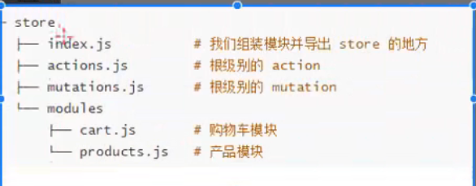

# Vue2其他知识

## 插件

> 可通过函数调用的方式触发组件的方式就叫插件，是个依赖组件的js文件
>
> 常用于`loading`和各种弹框，特征是复用性比组件强
>
> **具体注册步骤**
>
> 1. 新建插件对象，暴露一个 `install` 方法。其第一个参数是 `Vue` 构造器，第二个参数是一个可选的选项对象
> 2. 在里面先用`Vue.extend`命令将Vue组件转为组件构造器，然后找个变量实例化该构造器
> 3. 

```js
import ToastMain from './ToastPad.vue'
let $Toast =()=>{}

const ToastCpn = {
  install(Vue, options = {}) {
    const Tconstruct = Vue.extend(ToastMain)
    const plugin = new Tconstruct();
    document.body.appendChild(plugin.$mount(document.createElement('div')).$el)
    $Toast = Vue.prototype.Toast = plugin.appendToast
  }
}

export {
  ToastCpn, //Vue组件Toast主体部分，用于安装,以方便在其他Vue组件内直接使用【this.Toast()】
  $Toast //暴露Toast构造函数，用于其他未引入vue的js文件直接使用Toast功能【$Toast()】
}
```

## 混入mixin

> 混入 (mixin) 提供了一种非常灵活的方式，来分发 Vue 组件中的可复用功能。一个混入对象可以包含任意组件选项。当组件使用混入对象时，所有混入对象的选项将被“混合”进入该组件本身的选项。
>
> 在 js 文件创建一个 Vue 实例
>
> 将 js 内的组件引入到组件当中，会把 js 文件内的实例混入到当前组件中，实现组件功能复用
>
> **注意**：当组件选项与混入选项冲突时以==组件优先==
>
> 同时定义生命周期选项时，==mixin的会先触发，比组件的同名生命周期快==

**抽离到单独的 js 文件**

```js
import BackTop from '@/components/content/backTop/BackTop.vue';

//混入返回顶部
export const backTopMixin = {
  components: {
    BackTop,
  },
  data() {
    return {
      isShowBackTop: false,
    };
  },
  methods: {
    backClick() {
      this.$refs.scroll.scrollTo(0, -150, 0);
      this.$refs.scroll.scrollTo(0, 0, 500);
    },
    listenShowBackTop(position) {
      this.isShowBackTop = -position.y > 1000;
    },
  },
};
```

**导入**

```js
import Vue from 'vue';
import { backTopMixin } from './mixins/mixins.js';

//在main.js全局混入（不常用）
new Vue({
  mixins: [backTopMixin],
  render: h => h(App),
}).$mount('#app');

//组件内混入
export default {
  mixins: [backTopMixin],
};
```

## Vue过渡

# Vue2原理

## Vue2响应式原理技术

```js
let obj = {}
Object.defineProperty(obj,"a",{
    configurable:true,
    get:function(){
        return obj.a
    },
    set:function(val){
        obj.a = val
    }
})
```

## Vue2局限性

> Vue2无法直接响应下面两种情况
>
> 1. 对象：对对象直接添加，更新，删除属性
>
>    ```js
>    obj.newProp = 1
>    obj.existedProp = "Hello there"
>    delete obj.oldProp
>    ```
>
> 2. 数组：直接通过下标修改数组
>
>    ```js
>    arr[3] = 3
>    ```