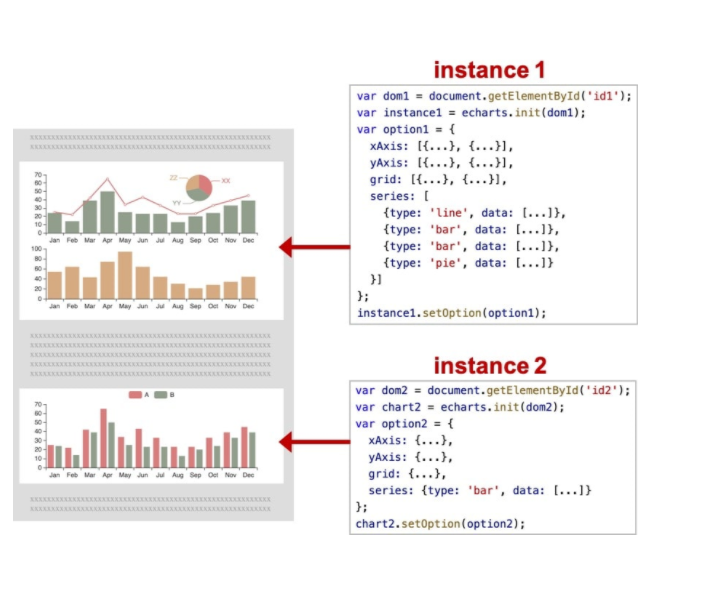
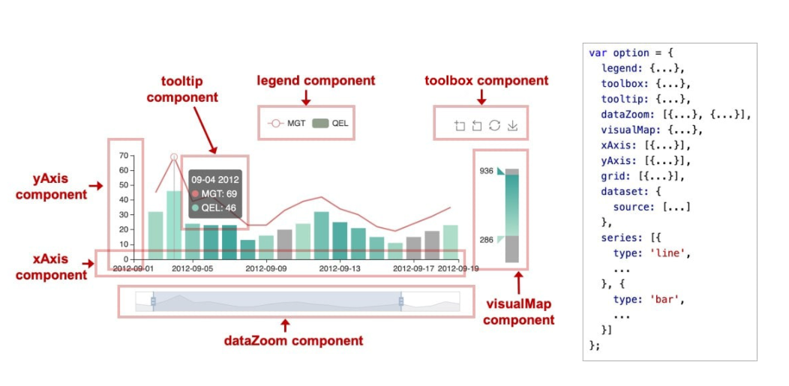

# Echarts


> 笔记链接：[Echarts (yuque.com)](https://www.yuque.com/yaozhuotangtangzhuaitianxia/zcng97/frwkb367qwn5931h#hAFcx)

## 使用

**准备一个具备大小的 DOM 容器**

修改 `index.html` 如下：

```html
<!DOCTYPE html>
<html lang="en">
  <head>
    <meta charset="UTF-8" />
    <meta name="viewport" content="width=device-width, initial-scale=1.0" />
    <title>ECharts 快速上手</title>
  </head>
  <style>
    * {
      margin: 0;
      padding: 0;
    }
    /* 设置成宽高为 400 像素的粉色盒子 */
    #box {
      margin: 20px;
      width: 400px;
      height: 400px;
      background-color: pink;
    }
  </style>
  <body>
    <!-- 创建一个容器 box -->
    <div id="box"></div>
  </body>
  <script src="./js/echarts.min.js"></script>
</html>
```

**初始化 ECharts 实例对象**

> 一个网页中可以创建多个 ECharts 实例。每个 ECharts 实例 中可以创建多个图表和坐标系等等（用 `option` 来描述）。准备一个 DOM 节点（作为 ECharts 的渲染容器），就可以在上面创建一个 ECharts 实例。每个 ECharts 实例独占一个 DOM 节点。
>
> 使用官方文档提供的 `echarts.init()` 函数初始化实例对象，语法为：`echarts.init(dom);`



参数 `dom` 是实例容器，一般是一个具有高宽的 div 元素。 修改 `index.html` 加入以下内容：

```html
<script>
  // 初始化实例对象 echarts.init(dom)容器;
  var myChart = echarts.init(document.querySelector('#box'));
</script>
```

**指定配置项和数据（option）**

找一个 ECharts 所给的基础图表的配置项和数据。修改 `index.html` 加入以下内容：

```js
var option = {
  title: {
    text: 'ECharts 入门示例',
  },
  tooltip: {},
  legend: {
    data: ['销量'],
  },
  xAxis: {
    data: ['衬衫', '羊毛衫', '雪纺衫', '裤子', '高跟鞋', '袜子'],
  },
  yAxis: {},
  series: [
    {
      name: '销量',
      type: 'bar',
      data: [5, 20, 36, 10, 10, 20],
    },
  ],
};
```

**注意**：你暂时不需要知道这些配置项是什么意思，后续会进行详细讲解。

**将配置项设置给 ECharts 实例对象**

修改 `index.html` 加入以下内容：

```js
myChart.setOption(option);
```

最终代码：

```html
<!DOCTYPE html>
<html lang="en">
  <head>
    <meta charset="UTF-8" />
    <meta name="viewport" content="width=device-width, initial-scale=1.0" />
    <title>ECharts 快速上手</title>
  </head>

  <style>
    * {
      margin: 0;
      padding: 0;
    }
    #box {
      margin: 20px;
      width: 400px;
      height: 400px;
      background-color: pink;
    }
  </style>
  <body>
    <div id="box"></div>
  </body>
  <script src="./js/echarts.min.js"></script>
  <script>
    // 初始化实例对象 echarts.init(dom)容器;
    var myChart = echarts.init(document.querySelector('#box'));
    // 指定配置项和数据
    var option = {
      title: {
        text: 'ECharts 入门示例',
      },
      tooltip: {},
      legend: {
        data: ['销量'],
      },
      xAxis: {
        data: ['衬衫', '羊毛衫', '雪纺衫', '裤子', '高跟鞋', '袜子'],
      },
      yAxis: {},
      series: [
        {
          name: '销量',
          type: 'bar',
          data: [5, 20, 36, 10, 10, 20],
        },
      ],
    };
    // 将配置项设置给 echarts 实例对象。
    myChart.setOption(option);
  </script>
</html>
```

## 图表的相关配置

## 坐标系

## series系列

> 系列（`series`）是指：一组数值以及他们映射成的图。“系列”这个词原本可能来源于“一系列的数据”，而在 ECharts 中取其扩展的概念，不仅表示数据，也表示数据映射成为的图。所以，一个 系列 包含的要素至少有：一组数值、图表类型（`series.type`）、以及其他的关于这些数据如何映射成图的参数。
>
> ECharts 里系列类型（`series.type`）就是图表类型。系列类型（`series.type`）至少有：line（折线图）、bar（柱状图）、pie（饼图）、scatter（散点图）、graph（关系图）、tree（树图）


## component组件

> ECharts 中各种内容，被抽象为“组件”。
>
> 



```

```

## title标题


## tooltip提示框

## legend图例组件

## toolbox工具组件

## visualMap视觉映射/色彩条