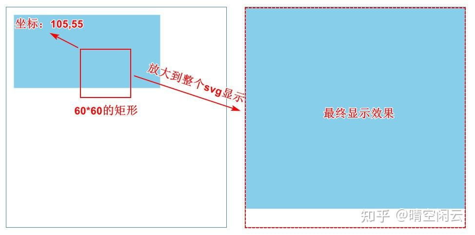
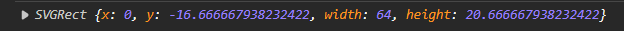

# SVG基础

---

## 渲染顺序

在svg标签顶层的元素会出现在绘制的底层，而在svg标签底层的元素会绘制在顶层

如果元素间的位置有重叠，则靠近底层的元素会盖住靠近顶层的元素（**先渲染在下，后渲染在上**）

```xml
<svg width="100%" height="100%">
  <!-- 图表展示区域 -->
  <g class="main-display-area" fill="none" overflow="hidden">
    <g class="regression-line-group"></g>
    <g class="well-node-display"></g>
  </g>
  <!-- 图表坐标轴必不可少的遮罩层 -->
  <g class="overlay">
    <rect fill="#ffffff" x="0" y="0" width="100%" height="20"></rect>
    <rect fill="#ffffff" x="0" y="0" width="30" height="100%"></rect>
  </g>
  <!-- 图表坐标轴 -->
  <g class="axis-zone">
    <g class="axis_x"></g>
    <g class="axis_y"></g>
  </g>
</svg>
```

## 基本图形

**圆形**

> 圆形包含以下属性：
>
> 1. cx：圆的原点x坐标
> 2. cy:   圆的原点y坐标
> 3. r: 圆的半径
>
> 此外还有以下基本属性：fill（填充颜色），stroke（描边颜色），stroke-width（描边宽度）

```html
<circle cx="25" cy="25" r="25" fill="#f244a1" />
```

<svg width="100" height="50"><circle cx="25" cy="25" r="25" fill="#f244a1" /></svg>

**矩形**

> 矩形包含以下属性：
>
> 1. x：矩形的原点x坐标
> 2. y:   矩形的原点y坐标
> 3. r: 圆的半径
>
> 此外还有以下基本属性：fill（填充颜色），stroke（描边颜色），stroke-width（描边宽度）

```html
<rect x="100" y="0" width="100" height="50" fill="cyan" />
```

<svg width="100" height="50"><rect x="0" y="0" width="100" height="50" fill="cyan" /></svg>

**椭圆**

> 椭圆包含以下属性：
>
> 1. x：矩形的原点x坐标
> 2. y:   矩形的原点y坐标
> 3. r: 圆的半径
>
> 此外还有以下基本属性：fill（填充颜色），stroke（描边颜色），stroke-width（描边宽度）

```html
<ellipse cx="75" cy="25" rx="75" ry="25" fill="#44f2a1" />
```

效果如下：

<svg width="200" height="50"><ellipse cx="75" cy="25" rx="75" ry="25" fill="#44f2a1" /></svg>

**多边形**

> 椭圆包含以下属性：
>
> 1. points：多边形的顶点坐标数组
>
> 此外还有以下基本属性：fill（填充颜色），stroke（描边颜色），stroke-width（描边宽度）

```html
<polygon fill="violet" stroke="purple" stroke-width="3" points="05,50 35,10 55,20 65,50" />
```

效果如下：

<svg width="200" height="50"><polygon fill="violet" stroke="purple" stroke-width="3" points="05,50 35,10 55,20 65,50" /></svg>

**文字**

> 文字包含以下属性：
>
> 1. x：文字左上角的顶点x坐标
> 2. y：文字左上角的顶点y坐标
> 3. font-family：文字的字体，默认是"san-serif"
> 4. font-size：文字的字体大小
> 5. text-anchor：文字对齐方式，可选值有：middle, 
>
> 此外还有以下基本属性：fill（填充颜色），stroke（描边颜色），stroke-width（描边宽度）

```xml
<text x="20" y="35" font-family="monospace" font-size="20px" fill="#cacaff">
    昭昭若日月之明，离离如星辰之行。 --文心雕龙·宗经
</text>
```

效果如下：

<svg width="800" height="50"><text x="20" y="35" font-family="monospace" font-size="20px" fill="#cacaff">昭昭若日月之明，离离如星辰之行。 --文心雕龙·宗经</text></svg>

```xml
<text x="20" y="35" font-family="san-serif" font-size="20px" stroke="#666666" stroke-width="0.5" fill="#ffcaca">
    影响大众想象力的，并不是事实本身，而是它扩散和传播的方式。 --乌合之众
</text>
```

效果如下：

<svg width="800" height="50"><text x="20" y="35" font-family="san-serif" font-size="20px" stroke="#666666" stroke-width="0.5" fill="#ffcaca">影响大众想象力的，并不是事实本身，而是它扩散和传播的方式。 --乌合之众</text></svg>

## 基本图线

**线段**

> 线段包含以下属性：
>
> 1. `x1, y1`：线段起始点x坐标，y坐标
> 2. `x2, y2`:   线段起始点x坐标，y坐标
> 3. `stroke`：  线段的（描边）颜色
> 4. `stroke-width`： 线段的描边宽度

```html
<line x1="5" y1="5" x2="80" y2="40" stroke="gray" stroke-width="5"  />
```

<svg width="80" height="50">
  <line x1="5" y1="5" x2="80" y2="40" stroke="gray" stroke-width="5"  />
</svg>

**多点线段**

> 多点线段包含以下属性：
>
> 1. points：多点线段的顶点坐标数组
>
> 此外还有以下基本属性：fill（填充颜色），stroke（描边颜色），stroke-width（描边宽度）

```html
<polyline fill="none" stroke="yellow" stroke-width="2" points="05,50 35,50 70,25 25,25 70,0 35,0"/>
```

<svg width="200" height="50">
  <polyline fill="none" stroke="yellow" stroke-width="2" points="05,50 35,50 70,25 25,25 70,0 35,0"/>
</svg>


## 路径

> path元素是SVG基本形状中最强大的一个，它不仅能创建其他基本形状，还能创建更多其他形状。你可以用path元素绘制矩形（直角矩形或者圆角矩形)、圆形上椭圆、，折线形、多边形，以及一些其他的形状，例如贝塞尔曲线、2次曲线等曲线。
>
> path元素的形状是通过属性d来定义的，属性d的值是一个“命令+参数的序列（见下页)
>
> Path作为SVG提供的标签之一，是实现众多可视化方案的基础

属性：

* fill: 填充颜色
* stroke: 描边颜色
* stroke-width: 描边宽度
* `transform="translate(x,y)"`: 加了描边后需要平移`(x=stroke-width/2,y=stroke-width/2)`

### 在Ai中绘制

> 使用钢笔工具绘制路径，它是一种用于创建路径和形状的工具，可以创建直线、曲线、角线和贝塞尔曲线等复杂图形。
>
> [怎么使用ai的钢笔工具 - 知乎 (zhihu.com)](https://zhuanlan.zhihu.com/p/377213204)
>
> 绘制完之后可以直接导出SVG以便后续使用。

### 相关路径属性

**钢笔基本命令**

| 笔命令    | 相关参数 | 是否可重复 | 释义                                                         |
| --------- | -------- | ---------- | ------------------------------------------------------------ |
| `M ( m )` | `x, y`   | Yes        | **moveto** 将笔移至新位置. 不画线. 所有路径数据须以 'moveto' 笔命令开头 |

**绘制线段基本命令**

| 笔命令    | 相关参数 | 是否可重复 | 释义                                                         |
| --------- | -------- | ---------- | ------------------------------------------------------------ |
| `L ( l )` | `x, y`   | Yes        | **lineto** 从当前点画到坐标为(x,y)的点                       |
| `H ( h )` | `x`      | Yes        | **horizontal lineto** 从当前点画到水平坐标为x的点，画出一条水平线 |
| `V ( v )` | `y`      | Yes        | **vertical lineto** 从当前点画到垂直坐标为y的点，画出一条垂直线 |

**贝塞尔曲线命令**

| 笔命令  | 相关参数        | 是否可重复 | 释义                                                         |
| ------- | --------------- | ---------- | ------------------------------------------------------------ |
| C ( c ) | x1 y1 x2 y2 x y | Yes        | **curveto** 从当前点绘制三次贝塞尔曲线到(x,y)点,控制点分别为(x1,y1)和(x2,y2) |
| S ( s ) | x2 y2 x y       | Yes        | **shorthand/smooth curveto** 从当前点绘制平滑三次贝塞尔曲线到(x,y)点,第一个控制点为当前点对之前命令控制点的反射 |
| Q ( q ) | x1 y1 x y       | Yes        | **quadratic Bézier curveto** 从当前点绘制二次贝塞尔曲线到(x,y)点,控制点为(x1,y1) |
| T ( t ) | x y             | Yes        | **Shorthand/smooth quadratic Bézier curveto** 从当前点绘制平滑二次贝塞尔曲线到(x,y)点,控制点为当前点对之前命令控制点的反射 |

**弧线行笔命令**

| 笔命令  | 相关参数                                            | 是否可重复 | 释义                                                         |
| ------- | --------------------------------------------------- | ---------- | ------------------------------------------------------------ |
| A ( a ) | rx ry x-axis-rotation large-arc-flag sweep-flag x y | Yes        | **elliptical arc** 从当前点绘制椭圆弧线到(x,y)点,rx,ry为椭圆半径,xro为旋转角度,laf和sf决定弧线大小和方向 |

**结束行笔命令**

| 笔命令  | 相关参数 | 是否可重复 | 释义                                              |
| ------- | -------- | ---------- | ------------------------------------------------- |
| Z ( z ) | none     | No         | **closepath** 将当前点与路径起点相连,从而闭合路径 |

## 组合标签

> 用`<g></g>`表示，用来组合多个svg形状。
>
> 可以用transform属性来移动位置。
>
> 一般情况下是不会自动上色的

## 模式

> 现成模式：[Textures.js (riccardoscalco.it)](https://riccardoscalco.it/textures/)

## 视口

> `svg`个无限的画布平面，除了用width和height来规定平面之外，还可以用viewBox属性来调整视图显示范围。
>
> `viewBox`的参数分别是：*视口左上角的x坐标*，*视口左上角的y坐标*，*视口宽度*，*视口高度*

对于没设置宽高的`svg`元素，视口会放大到等宽（？

对于设置了宽高的`svg`元素，视口会根据`svg`的实际宽高来进行缩放（可能非等比）



```xml
<svg width="300" height="300" style="border: 1px solid steelblue" 
    viewbox="105 55 60 60">
    <rect x="10" y="10" width="200" height="100" fill="skyblue"></rect>
</svg>
```

除了修改`svg`宽高，还可以通过修改视口来让矢量图整个显示到中央。

通过修改`svg`的`overflow="visible"`属性进行调整。

此外还可以通过该属性来实现`svg`的响应式。

## 获取元素的位置大小属性

只能对渲染的元素使用：`getBBox()`方法

```js
const text = svg.select('text.exist')
const boxAttr = text.getBBox()
console.log(boxAttr)
```



> 获取到的`SVGRect`对象的相关解释如下：
>
> 1. `x`,`y`分别是相对于`svg`的坐标轴的元素位置坐标
> 1. `width`,`height`分别是能框住这些元素的矩形的宽高。
