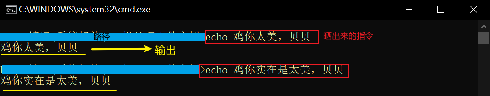
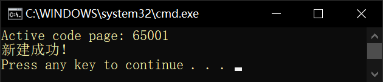
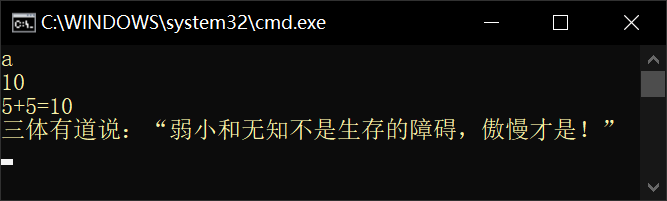

# bat批处理文件

> batch的脚本专为cmd运行。当多个cmd指令要运行就用批处理文件，该文件以`.bat`作为扩展名。

## 基本指令

- **echo**： 用于返回后面的消息内容

  `echo.` 不会输出任何内容，只会换行。

  由于性能原因，可用`echo/`代替

- **cls**：清空cmd窗口界面，即 *cl*ear *s*creen

- **color**：用于切换控制台文字颜色

- **pause**：暂停执行，等待用户按任意键执行。

  这时会显示：*请按任意键继续. . .*

- **goto**：转到cmd窗口文字的指定位置。只会转到==有冒号标记==的位置。

- **start**：启动应用、打开文件，文件夹

- **explorer**：浏览器打开默认网页

> 如果要访问带有空格的文件，需要给路径用双引号括起

## bat文件

我们的cmd指令会存储到bat文件当中，运行bat脚本会在cmd运行。

我们新建文件，更名为`<名称>.bat`，双击执行。

### 基本内容

`@echo off` ：除掉当前路径和指令的输出，和此条指令一同隐藏。

不加该指令的下场如下：



`chcp 65001`：将输出编码转为utf-8

这会消除中文乱码，不过上面会显示字符编码改变声明，默认语言也会改为英语。效果如下：



对于纯中文用户来说要另辟蹊径。见下面pause内容

`pause`：置于最后，使窗口等用户操作再关闭。         

```shell
@echo off
chcp 65001

echo 我是杰者

pause
```

要不显示*请按任意键继续. . .*字样就在该命令后接上`>nul`参数.

凡是要求不显示*提示*字样都可以在该命令后接上`>nul`参数. 下面代码会达到目的不过渲染稍慢。

```sh
@echo off
chcp 65001 >nul

echo 我是小空灵
echo/

::暂停改写代码
echo 请按任意键继续. . .
pause > nul
```


另一个防止中文乱码的方法是将源文件的编码改为ANSI格式，不会改变原有语言。

可以在记事本的保存选项改变默认的保存方式。（ansi<=>utf-8）


### 更多指令

- **md**：创建新文件夹

- **shutdoun**：关机

### 注释

**用rem命令注释**

记得rem和注释间用空格隔开！

```bash
rem 我是一段小小的注释
```

> 注意！每行注释要用换行符隔开！下同。

```shell
rem 我是第一段注释

rem 我是第二段注释
```

**用::注释**

```bash
::我是一段小小的注释
```

**行内注释**

用*&rem*和*&::*命令便可以书写行内注释。同样，*&rem*和注释间用空格隔开！

```shell
@echo off
echo 山有木兮木有枝，心悦君兮君不知。 &::佚名《越人歌》
echo 人生若只如初见，何事秋风悲画扇。 &::纳兰性德《木兰词·拟古决绝词柬友》
echo 十年生死两茫茫，不思量，自难忘。 &rem 苏轼《江城子·乙卯正月二十日夜记梦》
echo 曾经沧海难为水，除却巫山不是云。 &rem 元稹《离思五首·其四》
pause
```

### 变量

定义变量用set方法，使用变量则要把变量名用*%*括起来！

```shell
::格式：set 变量=值；变量和赋值号，赋值号和值间不要空格！
set a=10
set b=弱小和无知不是生存的障碍，傲慢才是！

echo a  &:: 原样输出a
echo %a%
echo 5+5=%a%
echo 三体有道说：“%b%”
```



### 循环

```shell
::此代码会在脚本当前位置新建100个文件夹！
for /l %%c in (1, 1, 100) do rd %%c
```


### 延迟

用**timeout**命令，语法为：`timeout /t 秒数`，单位秒

一般情况下**timeout**命令仍然可被键盘打任意键中断。要防止中断，用`/nobreak`参数

要**timeout**命令不输出等待状态文字，就在其后接上`> nul`

```shell
echo 请等待5秒后再操作……
timeout /t 5 /nobreak >nul

echo 已就绪，请操作
```

### 新建文件

```shell
:: 新建空白文件
::格式：echo. >文件名.文件扩展名
echo. >test.txt

:: 新建有内容的文件
echo <!doctype html> >index.html
echo %var% >index.html

:: 新建有多行内容的文件
rem 用">>"来为一个已创建的文件追加内容,新加内容会在新的一行上。
echo @echo off >test.bat
echo chcp 65001 >>test.bat
echo/ >>test.bat
echo pause >>test.bat

::对于bat文件还可以这样存储多行cmd指令
(
echo @echo off
echo/
echo echo 水伊布太可爱了吧
echo/
echo pause
)>test1.bat
```

不想把消息内容当成命令执行就用^转义

```shell
(
echo @echo off
rem 若不想把消息内容当成命令执行就用"倒v符号"转义
echo chcp 65001 ^>nul
echo/
echo/
echo/
echo echo "请按任意键继续. . ."
echo pause ^> nul
)>test1.bat
```

