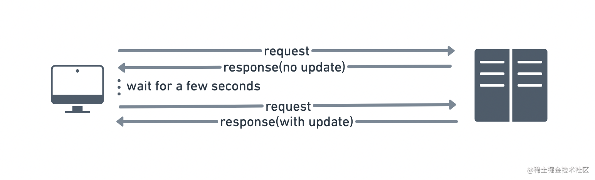
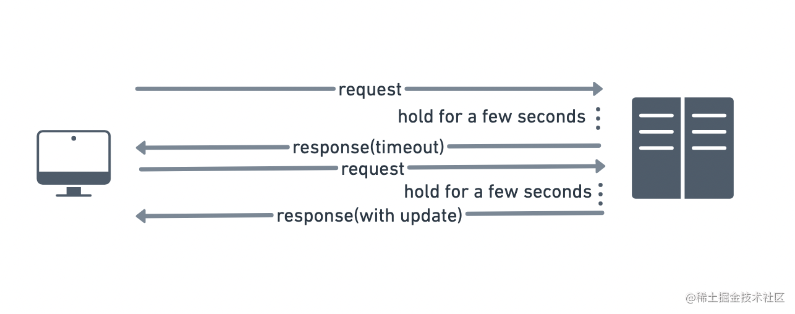

## JS动画

> JS动画无非是到什么时间点做什么事。即要掌控好transition时间段并在确定时间点改变什么样式。
>
> 时间点即关键帧，关键帧里头就把相关状态给设置好，剩下的交给CSS。
>
> 以下是直接用回调函数来进行的，也可以用现在的*异步JS*规范赖优化它。

```css
.el{
    transition: all .3s
}
```

`xxx.JS`

```js
el.style.opacity = 0 
setTimeout(() => { //过渡完成后再执行
    el.style.fontSize = '.8rem'
    el.innerHTML = "复制成功！"
    el.style.opacity = 1
    setTimeout(() => {  
        el.style.opacity = 0
        setTimeout(() => { //过渡完成后再执行
            el.style.fontSize = '1rem'
            el.innerHTML = this.rawHex(this.color)
            el.style.opacity = 1
        }, 300)
    }, 1000)
}, 300)
//时间线：
// 过渡：     a|  =300ms=>  | b |   =300ms=>   | c |   =700ms=>    | d | =300ms> | e 
// 定时器：            300ms_↑           1000ms_↑              300ms_↑
```

## HTML5跨域通信


> Cross Document Messaging，简称CDM，目前只有一个由另外一个页面打开的页面才有效

Cross Document Messaging在HTML5中的基本工作流程：

1. 建立跨域关系：这是通过在源（发送消息的窗口或文档）中设置`document.domain`属性，在目标（接收消息的窗口或文档）中通过`window.postMessage()`方法接收消息来实现的。注意，这两个窗口或文档必须来自不同的域。
2. 发送消息：在源文档中，可以使用`window.postMessage()`方法向目标文档发送消息。这个方法接受两个参数，第一个是实际消息（可以是任何类型的数据，如字符串、数字、对象等），第二个是对话类型（可以用来指示消息的来源和目的地）。
3. 接收消息：在目标文档中，需要设置一个事件监听器来监听来自源文档的消息。这可以通过`window.addEventListener()`方法实现，这个方法接受两个参数，第一个是事件类型（在这里应该是"message"），第二个是处理函数，这个函数会在接收到消息时被调用。
4. 处理消息：在处理函数中，可以获取到源文档发送的消息，并根据需要对这个消息进行处理。

`useCDMSender.js`

```js
export const flag = "5C10A7A8A646C42B70ABBCAD984D4097F2359CEF31C1FC407D782A58F305322B"
export const content = "5D7A81E79896E12D34D0FB9367BBF064ED3F0316F0184BEF0B6E7862384788B1"

export default function (origin, msg) {
  if (window) {
    window.addEventListener('message', function (e) {
      if (e.origin === origin && e.data) {
        e.source.postMessage({[flag]: true, [content]: msg}, origin)
      }
    })
  }
}

```

`useCDMReceiver.js`

```js
import {flag, content} from "./useCDMSender"

export default function (origin) {
  return new Promise((resolve, reject) => {
    if (window) {
      window.addEventListener('load', function (e) {
        e.currentTarget?.opener 
          && e.currentTarget.opener.postMessage(true, origin) // 仅限于打开该窗口的窗口
      })
      window.addEventListener('message', function (e) {
        if (e.origin === origin && e.data[flag]) // 会多次响应得到没有用的元素，需要筛选。
          resolve(e.data[content])
      })
    } else {
      reject(new Error("未找到window对象"))
    }
  })
}
```

## 用`IntersectionObserver`监听滚动

> `IntersectionObserver`是一个Web API，用于监测元素在viewport中的交集情况。它可以用来监听元素何时进入或离开viewport，以及它们与其他元素之间的交集情况。这个API的主要目的是提高性能和减少浏览器内存占用，因为它可以避免在每次滚动时计算元素的位置和大小。 
>
> 在滚动入场特效中，`IntersectionObserver`可以用来触发动画或添加类等操作，以反应元素何时进入或离开viewport。例如，可以创建一个class，包含动画的CSS，然后使用`IntersectionObserver`监听元素何时进入viewport，并在进入时为该元素添加该class，以触发动画。 

```js
function ListScrollEffect(elems,parent,className){
    const observer = new IntersectionObserver(
      (entries) => {
        entries.forEach((entry) => {
          if (entry.isIntersecting && entry.intersectionRatio >= 0.25) {
            entry.target.classList.remove(className);
          } else if (!entry.isIntersecting) {
            entry.target.classList.add(className);
          }
        });
      },
      {threshold: [0, 0.25, 1], root: parent}
    );
    elems.forEach(elem => {observer.observe(elem)})
}
const elems = document.querySelectorAll("div.list-display > div.list-element")
```

> `IntersectionObserver`还可以用于
>
> 1. 懒加载，即当某个元素进入viewport时，才加载图像或其他资源。这可以帮助减轻页面加载时间，并提高性能。
> 2. 实现无限滚动、浮动导航栏、虚拟列表等其他场景。

## 短轮询和长轮询

> 短轮询是一种简单的实时通信方法，客户端通过定时向[服务器](https://cloud.tencent.com/act/pro/promotion-cvm?from_column=20065&from=20065)发送请求，服务器在每个请求中回复是否有新消息。
>
> 这种方式的缺点是频繁的HTTP请求可能会导致服务器和带宽资源的浪费。



```js
const axios = require('axios');

/**
 * 使用axios进行短轮询的函数
 * @param {string} url - 请求的URL
 * @param {number} interval - 轮询间隔时间，单位为毫秒
 * @param {number} timeout - 总的轮询超时时间，单位为毫秒
 * @return {Promise} 返回一个Promise对象
 */
function shortPolling(url, interval = 2000, timeout = 600000) {
    // 记录开始轮询的时间
    const startTime = new Date().getTime();

    // 定义轮询逻辑的函数
    const executePoll = async (resolve, reject) => {
        try {
            // 发送HTTP GET请求
            const response = await axios.get(url);

            // 这里应根据实际情况判断响应状态是否意味着停止轮询
            // 例如，根据response.data中的某个属性判断
            if (response.data && response.data.complete) {
                // 请求成功，解析Promise
                resolve(response.data);
            } else {
                // 如果当前时间与开始轮询的时间之差小于超时时间，则继续轮询
                if (new Date().getTime() - startTime < timeout) {
                    setTimeout(executePoll, interval, resolve, reject);
                } else {
                    // 超时，拒绝Promise
                    reject(new Error('Polling request timed out'));
                }
            }
        } catch (error) {
            // 捕获请求过程中的错误
            reject(error);
        }
    };

    // 返回一个新的Promise
    return new Promise(executePoll);
}

// 使用该函数
shortPolling('/testapi/')
    .then(data => {
        console.log('Polling success:', data);
    })
    .catch(error => {
        console.error('Polling error:', error);
    });
```

> 长轮询是为了解决短轮询的浪费宽带的缺点（无用请求过多，数据实时性差）而生的
>
> 工作原理是客户端发起一个请求到服务器，服务器持有这个请求，直到有新数据可发送。
> 当服务器有新数据时，它会响应这个请求，客户端处理响应后，会再次立即发起新的请求，
> 这个过程会不断重复，从而实现类似服务器推送的效果。



```js
import axios from 'axios';

function longPolling(url, callback) {
  const poll = () => {
    axios.get(url)
      .then(response => {
        callback(null, response.data); // 调用回调函数处理数据
        setTimeout(poll, 500); // 请求成功后，稍作延迟再次发起请求
      })
      .catch(error => {
        callback(error); // 在这里处理错误
        setTimeout(poll, 5000); // 如果请求失败，可能需要更长的延迟再重试
      });
  };

  poll(); // 初始调用以启动轮询
}

// 使用示例
longPolling('/server-endpoint', (err, data) => {
  if (err) {
    console.error('Long Polling Error:', err);
    return;
  }

  console.log('Received data:', data);
  // 这里可以根据接收到的数据进行处理
});
```

